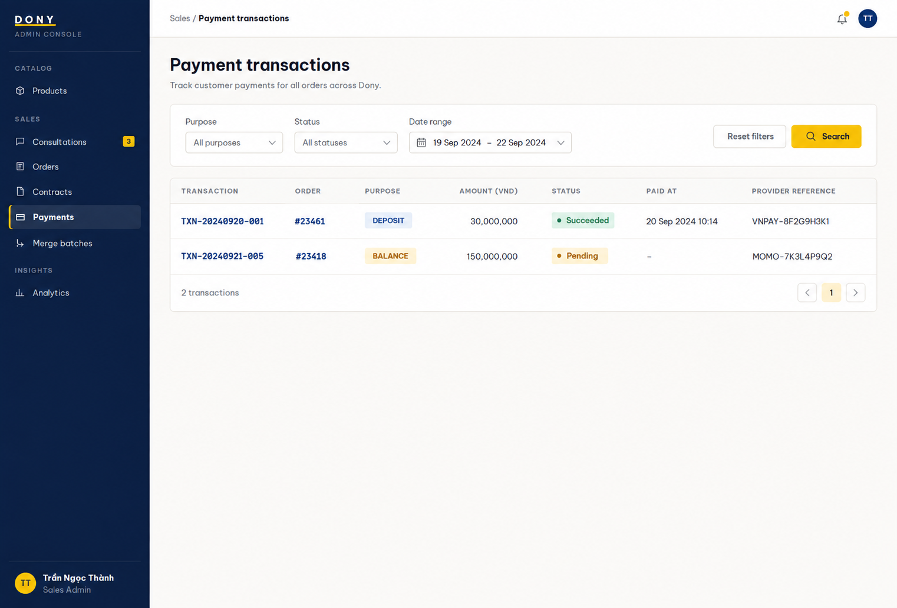

# Screen Spec: S36 Payment Transaction List

| Field | Value |
|---|---|
| Screen ID | `S36` |
| Screen name | Payment Transaction List |
| Actor | Sales Admin |
| Priority | P2 |
| Belongs to module | [MFG-06](../specs/spec-MFG-06.md) |
| Route | `/admin/payments` |
| Mockup image | img/S36-payment_transaction_list_screen.png |
| Status | Resolved implementation specification |

## 1. Purpose

**Shown when:** The Sales Admin lists Dony payment transactions and refunds using provider status, purpose, amount, timestamps and order/request reference filters. All identifiers and permissions come from the server session; list filters are allowlisted and recoverable failures preserve entered values.

**The user leaves this screen when:** An authorized action in section 5 succeeds, the user follows a role-allowed global route, or they return to the validated originating route.

## 2. Mockup

Written behavior below takes precedence over obsolete sample content.

## 3. Element inventory

| # | Element | Type | Content / data source | Required | Validation |
|---|---|---|---|---|---|
| 1 | Screen heading | Heading | Payment Transaction List | Yes | Static route title. |
| 2 | Route | Navigation target | /admin/payments | Yes | Access checked on server. |
| 3 | purpose | Field / control | enum: DEPOSIT, BALANCE | As specified | Purpose is immutable and belongs to one order; no SERVICE or generic ORDER purpose. |
| 4 | status / refund_status | Field / control | allowlisted transaction/refund enums | As specified | Filter Pending, Succeeded, Failed or Expired where applicable. |
| 5 | date_from / date_to | Field / control | optional local dates | As specified | Inclusive start, exclusive end; display Asia/Ho_Chi_Minh. |
| 6 | rows | Field / control | payment_id, resource_id, integer amount_vnd, currency, status, created_at | As specified | Mask provider references; omit card secrets and other-Dony business data. |
| 7 | page / page_size / sort | Field / control | integer / integer / enum | As specified | documented pagination bounds; sort by created_at, amount_vnd or status. |
| 8 | API errors | Field / control | standard API error envelope | As specified | 400 malformed; 403 prohibited; 404 inaccessible payment; 422 invalid filters; 503 dependency failure. |
| 9 | Open transaction | Action | Load redacted payment/refund detail. | Available when authorized | Destination: S37 |
| 10 | Filter list | Action | Preserve allowlisted filters and pagination on refresh/back. | Available when authorized | Destination: S36 |

## 4. States

| State | What the user sees | Trigger |
|---|---|---|
| Loading | Labelled progress/skeleton; disable duplicate submit. | Request starts |
| Empty | Show no Dony payment transactions matching filters; preserve filters where present and explain eligibility/filter conditions. | Successful query returns no rows |
| Forbidden/not found | Safe message without revealing inaccessible identifiers. | 401/403/404 |
| Error | Show code, message, field_errors, request_id; preserve entered values. | Request failure |
| Retry | Retry reads on transient failure; reuse the same idempotency key only for mutations that require one for the documented mutation. | Recoverable failure |
| Success | Show committed state and next valid action; announce via aria-live. | Mutation commits |
| Conflict | Explain stale state; reload; never silently overwrite. | 409 |

## 5. Interactions and navigation

| # | Element | User action | System response | Goes to screen |
|---|---|---|---|---|
| 1 | Open transaction | Activate | Load redacted payment/refund detail. | S37 |
| 2 | Filter list | Activate | Preserve allowlisted filters and pagination on refresh/back. | S36 |

Home and public catalog are available to Guest and authenticated users. Customer designs and customer orders are Customer-only; profile and notifications require authentication. Sales Admin routes: S10, S18, S28, S30, S36, S42 and S43. Sales routes: S20 and assigned-only S21. System Admin routes: S39, S40 and S41. The server rechecks internal role, customer ownership and staff assignment for every route and notification target. Back returns to the validated originating route and preserves list filters; without one, use S26 for Customer, S28 for Sales Admin, S20 for Sales, S41 for System Admin, and S01 for Guest.

## 6. Screen-level rules

| Rule ID | Rule | Source |
|---|---|---|
| SR-001 | Access and ownership are checked server-side; do not trust submitted customer, company, role, price, or provider status. Apply 401/403/404 behavior and the field rules above. | Authorization and data ownership requirements |
| SR-002 | IDs are UUIDs; timestamps are UTC and displayed in Asia/Ho_Chi_Minh; money and quantities are integers. Mutations use expected_version; significant create/sign/pay/batch operations use idempotency keys. | Data representation and concurrency requirements |
| SR-003 | Apply the module lifecycle and validation rules linked below; preserve immutable submitted snapshots. | Module specification |
| SR-004 | Selected product and technical defaults are project implementation decisions; do not invent factual company, author, client-approval, or course identifiers. | Project implementation assumptions |

### Acceptance scenarios

1. List contains Dony DEPOSIT/BALANCE attempts with order link, masked provider references and page bounds.
2. Payment records belong to Dony's single operating system; customer ownership is still checked on customer-facing views, and pending attempts are not represented as revenue.

## 7. Linked requirements

| FR ID (from the module spec) | What this screen does for it |
|---|---|
| MFG-06/F-PAY-005 | Implements this screen's validated user flow and the linked source function. |
The rules in this screen and its linked module specifications are complete for implementation.

## 8. Responsive and accessibility notes

Support 360px through desktop; stack columns and use labelled horizontal-scroll tables on narrow screens. Controls are keyboard-operable with visible focus, logical headings, associated form labels, and aria-live status/error announcements. Text contrast is at least 4.5:1 (large text 3:1); pointer targets are at least 24px. Preserve user-entered data after recoverable failures. Confirm destructive actions, disable duplicate submit while pending, and enforce idempotency on the server.

## 9. Open questions

| # | Question | Blocking? | Status |
|---|---|---|---|
| 1 | No unresolved screen behavior questions remain; routes, fields, permissions, and defaults are resolved in this specification and its linked module requirements. | No | Resolved |

## Completion checklist

- [x] Route, actor, module, priority, and mockup status are identified.
- [x] Element fields, actions, validation, and data ownership are documented.
- [x] Loading, empty, forbidden, error, retry, success, and conflict states are documented.
- [x] Navigation and acceptance scenarios are explicit.
- [x] Responsive and accessibility requirements follow the shared baseline.
- [x] No unresolved screen-level decisions remain.
