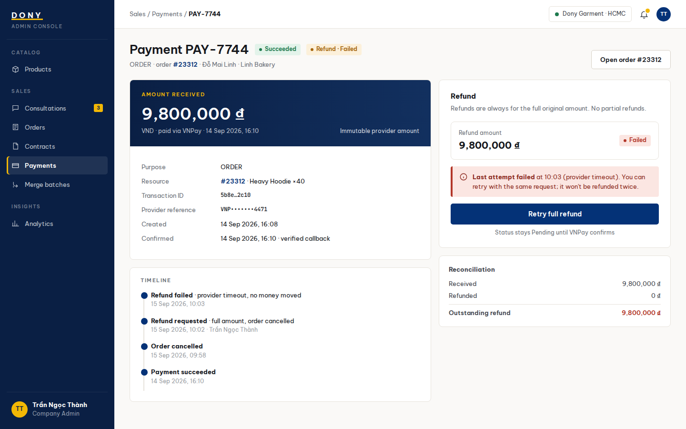

# Screen Spec: S37 Payment Transaction Detail

| Field | Value |
|---|---|
| Screen ID | `S37` |
| Screen name | Payment Transaction Detail |
| Actor | Sales Admin |
| Priority | P1 |
| Belongs to module | [MFG-06](../specs/spec-MFG-06.md) |
| Route | `/admin/payments/{payment_id}` |
| Mockup image | img/S37-payment_transaction_detail_screen.png |
| Status | Resolved implementation specification |

## 1. Purpose

**Shown when:** The Sales Admin inspects a Dony DEPOSIT or BALANCE transaction’s immutable provider and reconciliation details and may retry only an authorized refund amount that does not exceed captured refundable funds. All identifiers and permissions come from the server session.

**The user leaves this screen when:** An authorized action in section 5 succeeds, the user follows a role-allowed global route, or they return to the validated originating route.

## 2. Mockup

Written behavior below takes precedence over obsolete sample content.

## 3. Element inventory

| # | Element | Type | Content / data source | Required | Validation |
|---|---|---|---|---|---|
| 1 | Screen heading | Heading | Payment Transaction Detail | Yes | Static route title. |
| 2 | Route | Navigation target | /admin/payments/{payment_id} | Yes | Access checked on server. |
| 3 | payment_id / buyer_organization_id | Field / control | UUID / optional server-derived UUID | As specified | Payment belongs to its Customer/order; buyer organization is contextual billing data and inaccessible IDs return 404. |
| 4 | purpose / resource_id | Field / control | DEPOSIT or BALANCE / order UUID | As specified | Immutable purpose and read-only link to originating order. |
| 5 | amount_vnd / currency | Field / control | integer / VND | As specified | Immutable provider amount; show full value to authorized Dony admin. |
| 6 | provider_reference / transaction_id | Field / control | redacted text / UUID | As specified | Mask secrets and sensitive provider references. |
| 7 | refund_status / refund_amount_vnd | Field / control | None, Pending, Succeeded, Failed / integer VND | As specified | Server derives the refundable amount from payment purpose and stored policy; it cannot exceed accepted captured funds. |
| 8 | expected_version / Idempotency-Key | Field / control | integer / UUID | As specified | Refund initiation is idempotent; retry same key/payload only after eligible provider failure. |
| 9 | Initiate/retry refund | Action | Use server-calculated refundable amount; idempotently request provider; status remains Pending until verified. | Available when authorized | Destination: S37 |
| 10 | Open related order | Action | Navigate only if company and resource authorization passes. | Available when authorized | Destination: S29 |

## 4. States

| State | What the user sees | Trigger |
|---|---|---|
| Loading | Labelled progress/skeleton; disable duplicate submit. | Request starts |
| Empty | Render the screen-specific form/detail state; if a required route object is absent, show safe not-found and return to the authorized parent route. | Empty initial form or missing detail payload |
| Forbidden/not found | Safe message without revealing inaccessible identifiers. | 401/403/404 |
| Error | Show code, message, field_errors, request_id; preserve entered values. | Request failure |
| Retry | Retry reads on transient failure; reuse the same idempotency key only for mutations that require one for the documented mutation. | Recoverable failure |
| Success | Show committed state and next valid action; announce via aria-live. | Mutation commits |
| Conflict | Explain stale state; reload; never silently overwrite. | 409 |

## 5. Interactions and navigation

| # | Element | User action | System response | Goes to screen |
|---|---|---|---|---|
| 1 | Initiate/retry refund | Activate | Submit the server-calculated eligible amount; status remains Pending until verified. | S37 |
| 2 | Open related order | Activate | Navigate only if company and resource authorization passes. | S29 |

Home and public catalog are available to Guest and authenticated users. Customer designs and customer orders are Customer-only; profile and notifications require authentication. Sales Admin routes: S10, S18, S28, S30, S36, S42 and S43. Sales routes: S20 and assigned-only S21. System Admin routes: S39, S40 and S41. The server rechecks internal role, customer ownership and staff assignment for every route and notification target. Back returns to the validated originating route and preserves list filters; without one, use S26 for Customer, S28 for Sales Admin, S20 for Sales, S41 for System Admin, and S01 for Guest.

## 6. Screen-level rules

| Rule ID | Rule | Source |
|---|---|---|
| SR-001 | Access and ownership are checked server-side; do not trust submitted customer, company, role, price, or provider status. Apply 401/403/404 behavior and the field rules above. | Authorization and data ownership requirements |
| SR-002 | IDs are UUIDs; timestamps are UTC and displayed in Asia/Ho_Chi_Minh; money and quantities are integers. Mutations use expected_version; significant create/sign/pay/batch operations use idempotency keys. | Data representation and concurrency requirements |
| SR-003 | Apply the module lifecycle and validation rules linked below; preserve immutable submitted snapshots. | Module specification |
| SR-004 | Selected product and technical defaults are project implementation decisions; do not invent factual company, author, client-approval, or course identifiers. | Project implementation assumptions |

### Acceptance scenarios

1. Eligible policy-based refund moves to Pending and succeeds only on a verified provider result.
2. Client cannot choose the refund amount; an amount above captured refundable funds is impossible, and duplicate same-key request returns the same operation.

## 7. Linked requirements

| FR ID (from the module spec) | What this screen does for it |
|---|---|
| MFG-06/F-PAY-005 | Implements this screen's validated user flow and the linked source function. |
| MFG-07/F-ORD-003 | Implements this screen's validated user flow and the linked source function. |
Additional linked modules: [MFG-07](../specs/spec-MFG-07.md).

The rules in this screen and its linked module specifications are complete for implementation.

## 8. Responsive and accessibility notes

Support 360px through desktop; stack columns and use labelled horizontal-scroll tables on narrow screens. Controls are keyboard-operable with visible focus, logical headings, associated form labels, and aria-live status/error announcements. Text contrast is at least 4.5:1 (large text 3:1); pointer targets are at least 24px. Preserve user-entered data after recoverable failures. Confirm destructive actions, disable duplicate submit while pending, and enforce idempotency on the server.

## 9. Open questions

| # | Question | Blocking? | Status |
|---|---|---|---|
| 1 | No unresolved screen behavior questions remain; routes, fields, permissions, and defaults are resolved in this specification and its linked module requirements. | No | Resolved |

## Completion checklist

- [x] Route, actor, module, priority, and mockup status are identified.
- [x] Element fields, actions, validation, and data ownership are documented.
- [x] Loading, empty, forbidden, error, retry, success, and conflict states are documented.
- [x] Navigation and acceptance scenarios are explicit.
- [x] Responsive and accessibility requirements follow the shared baseline.
- [x] No unresolved screen-level decisions remain.
