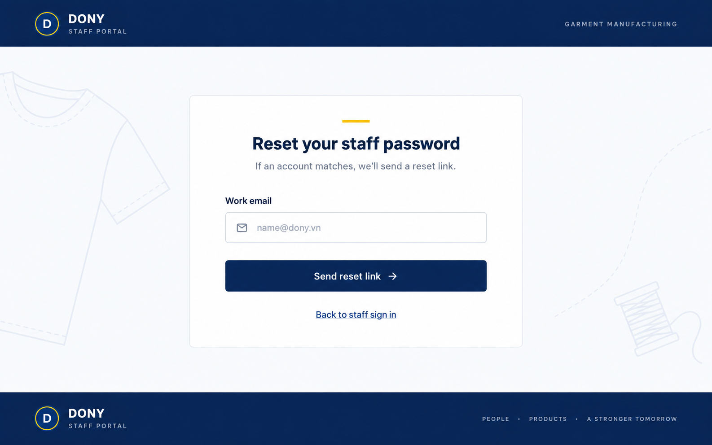

# Screen Spec: S45 Dony Staff CRM Forgot Password

| Field | Value |
| --- | --- |
| Screen ID | `S45` |
| Screen name | Dony Staff CRM Forgot Password |
| Actor | Guest / Dony employee |
| Priority | Must |
| Belongs to module | [MFG-01](../specs/spec-MFG-01.md) |
| Route | `/staff/forgot-password` |
| Mockup image | img/S45-staff_forgot_password_screen.png |
| Status | Resolved implementation specification |

## 1. Purpose

**Shown when:** A Dony employee requests recovery from the internal CRM login. Keep staff portal branding and omit all customer storefront navigation. Responses must not disclose whether a work email has a staff account; the reset token remains bound to the employee portal.

**The user leaves this screen when:** The neutral request acknowledgement appears, or they return to staff sign-in.

## 2. Mockup

## 3. Element inventory

| # | Element | Type | Content / data source | Required | Validation |
|---|---|---|---|---|---|
| 1 | Staff heading | Heading | Reset your staff password | Yes | Internal CRM brand. |
| 2 | Work email | Field | Email address | Yes | Normalize; do not reveal account existence. |
| 3 | Send reset link | Action | Queue eligible employee-bound reset email | Yes | Max 3 requests per account/IP/hour. |
| 4 | Acknowledgement | Status | Neutral message for known and unknown emails | After submit | Same content and response behavior. |
| 5 | Back to staff sign-in | Link | Internal CRM login | Yes | Destination: S44. |

## 4. States

| State | What the user sees | Trigger |
|---|---|---|
| Loading | Progress; submit disabled | Request starts |
| Empty | Work-email form | Initial route |
| Forbidden/not found | Safe route message | Invalid route or token context |
| Error | Generic safe error with request ID | Dependency failure |
| Retry | Retry allowed within rate limits | Recoverable error |
| Success | Neutral acknowledgement | Request accepted |
| Conflict | Current request status and retry guidance | Stale or replaced request |

## 5. Interactions and navigation

| # | Element | User action | System response | Goes to screen |
|---|---|---|---|---|
| 1 | Send reset link | Submit work email | Return neutral response; queue employee-bound token if eligible | S45 acknowledgement |
| 2 | Back to staff sign-in | Activate link | Return to internal CRM login | S44 |

## 6. Screen-level rules

| Rule ID | Rule | Source |
|---|---|---|
| SR-001 | This route accepts only employee recovery context; customer tokens and flows are not interchangeable. | MFG-01 portal boundary |
| SR-002 | Reset tokens are hashed, single-use, 30-minute tokens and prior token is invalidated on resend. | MFG-01 recovery rules |
| SR-003 | Use staff CRM identity; do not display the customer store navigation header. | Separate customer and employee experiences |

### Acceptance scenarios

1. Staff recovery is visually and behaviorally distinct from Customer S04.
2. Known and unknown emails receive identical acknowledgement.
3. Eligible requests send only employee-bound links to S46.

## 7. Linked requirements

| FR ID (from the module spec) | What this screen does for it |
|---|---|
| MFG-01/F-USER-007 | Requests staff portal-bound password recovery. |
| MFG-01/F-USER-008 | Reissues a staff recovery link under the request limit. |

## 8. Responsive and accessibility notes

Support 360px through desktop; use labelled controls, visible focus, readable contrast and accessible status/error announcements.

## 9. Open questions

| # | Question | Blocking? | Status |
|---|---|---|---|
| 1 | No remaining open questions; staff recovery route and neutral response are resolved. | No | Resolved |

## Completion checklist

- [x] Route, actor, module, priority, and mockup are identified.
- [x] Fields, validation, actions and portal boundary are explicit.
- [x] States, navigation and acceptance scenarios are explicit.
- [x] Responsive and accessibility requirements are documented.
- [x] No unresolved screen-level questions remain.
