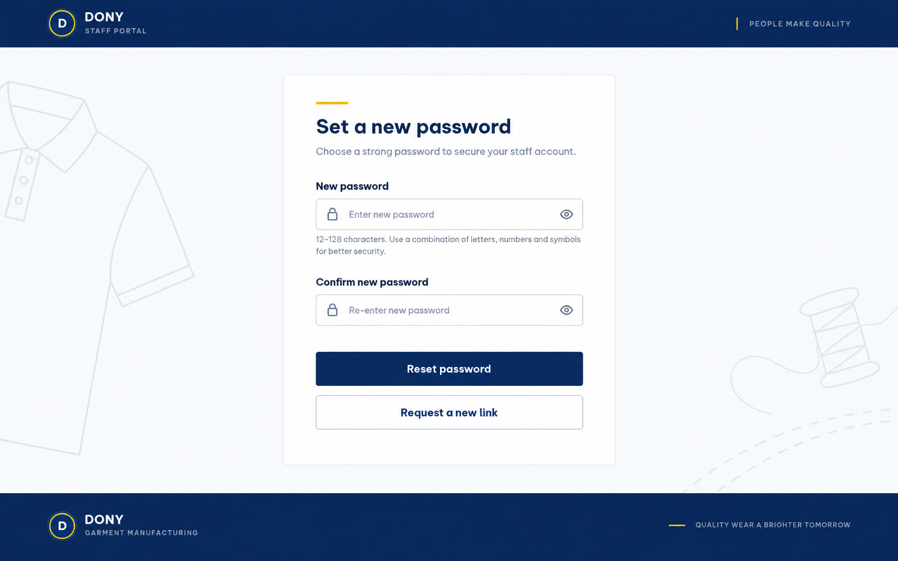

# Screen Spec: S46 Dony Staff CRM Reset Password

| Field | Value |
| --- | --- |
| Screen ID | `S46` |
| Screen name | Dony Staff CRM Reset Password |
| Actor | Dony employee with single-use staff token |
| Priority | Must |
| Belongs to module | [MFG-01](../specs/spec-MFG-01.md) |
| Route | `/staff/reset-password?token={token}` |
| Mockup image | img/S46-staff_reset_password_screen.png |
| Status | Resolved implementation specification |

## 1. Purpose

**Shown when:** A Dony employee opens a valid employee-portal reset link. The page keeps internal CRM staff identity, not public store header/navigation. On success the token is consumed, all sessions are revoked and the employee returns to S44.

**The user leaves this screen when:** Reset succeeds, the link expires, or the employee requests a replacement through S45.

## 2. Mockup

## 3. Element inventory

| # | Element | Type | Content / data source | Required | Validation |
|---|---|---|---|---|---|
| 1 | New password | Secret field | Password | Yes | 12–128 characters. |
| 2 | Confirm password | Secret field | Matching password | Yes | Must match new password. |
| 3 | Reset password | Action | Consume token, replace hash, revoke sessions atomically | Yes | Staff-bound valid token, single use, 30 minutes. |
| 4 | Request a new link | Link | Employee recovery | If expired/used | Destination: S45. |
| 5 | Staff identity | Shell | Dony CRM staff portal branding | Yes | No store or customer navigation. |

## 4. States

| State | What the user sees | Trigger |
|---|---|---|
| Loading | Progress and disabled submit | Reset begins |
| Empty | New/confirm password fields | Valid token route opens |
| Forbidden/not found | Safe invalid or expired-link notice | Wrong portal, expired or unknown token |
| Error | Field-safe message with request ID | Validation/dependency failure |
| Retry | Form remains available if token is valid | Recoverable failure |
| Success | Password updated; continue to staff login | Commit succeeds |
| Conflict | Token was already consumed; request a new link | Concurrent or repeated use |

## 5. Interactions and navigation

| # | Element | User action | System response | Goes to screen |
|---|---|---|---|---|
| 1 | Reset password | Submit matching compliant passwords | Atomically consume employee token, store new hash and revoke all sessions | S44 |
| 2 | Request a new link | Activate link | Open employee-only recovery | S45 |

## 6. Screen-level rules

| Rule ID | Rule | Source |
|---|---|---|
| SR-001 | Staff token purpose/portal binding is mandatory; Customer reset tokens cannot be used here. | MFG-01 portal boundary |
| SR-002 | Password is hashed, token is single-use, and all sessions are revoked on success. | MFG-01 reset rules |
| SR-003 | Use CRM staff branding; do not display storefront header or public customer navigation. | Separate customer and employee experiences |

### Acceptance scenarios

1. A valid staff token can reset one staff password exactly once.
2. Invalid, expired, reused, or Customer-bound tokens are safely rejected.
3. Successful reset revokes sessions and returns to S44.

## 7. Linked requirements

| FR ID (from the module spec) | What this screen does for it |
|---|---|
| MFG-01/F-USER-010 | Resets an employee password using an eligible portal-bound token. |
| MFG-01/F-USER-011 | Rejects expired, reused or wrong-portal tokens. |

## 8. Responsive and accessibility notes

Support 360px through desktop; label password controls, expose strength/error announcements accessibly, retain focus order and provide visible focus indicators.

## 9. Open questions

| # | Question | Blocking? | Status |
|---|---|---|---|
| 1 | No remaining open questions; employee-bound token behavior and CRM presentation are resolved. | No | Resolved |

## Completion checklist

- [x] Route, actor, module, priority, and mockup are identified.
- [x] Fields, validation, actions and portal boundary are explicit.
- [x] States, navigation and acceptance scenarios are explicit.
- [x] Responsive and accessibility requirements are documented.
- [x] No unresolved screen-level questions remain.
