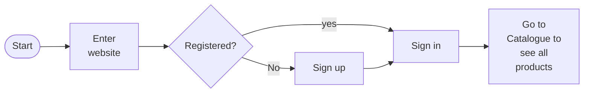
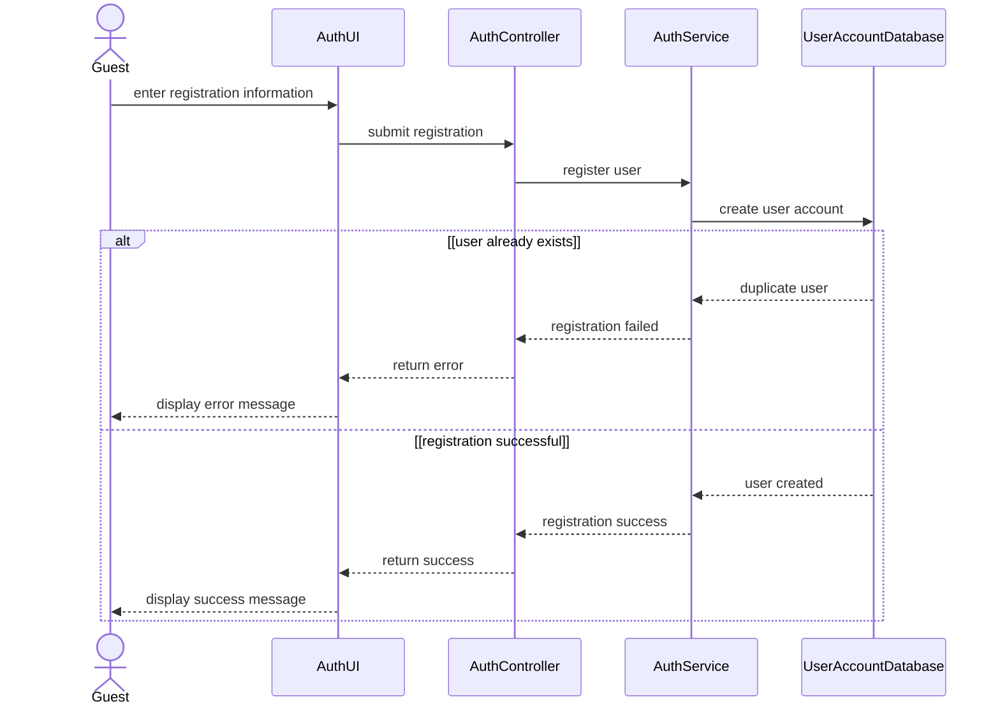
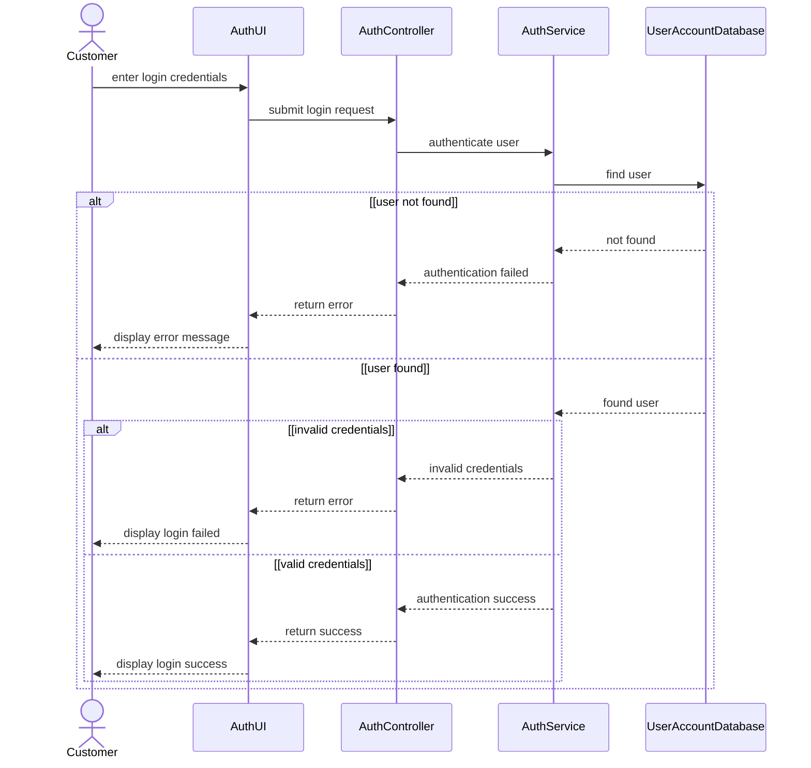

# Spec Document: Identity & Access

| Field | Value |
| --- | --- |
| Module ID | `MFG-01` |
| Module name | Identity & Access |
| Spec version | v0.1 |
| Author (team member) | [NEEDS CLARIFICATION: Specify the responsible team member; Group B is named only as the team on the Session 1 scope sheet.] |
| Date | 2026-09-16 |
| Status | Draft |
| Approved by (Client role) | [NEEDS CLARIFICATION: Client approver role and approval are not supplied.] |
| DBIZ2 source | Function List `MFG-01`, No. 1-11, `F-USER-001` .. `F-USER-011`; Use Cases: Register account; Log in; Forgot password; Reset password; Log out; Use Case IDs: UC-G03, UC-M01, UC-M02, UC-M03, UC-M04; Screens: `S01`, `S02`, `S03`, `S04`, `S05`, `S06`, `S08` |

---

## 1. Purpose and scope (mandatory)

Customers and staff can register, sign in, sign out, and recover access to their accounts. This module supplies the role-aware access identified as a foundation for the MVP.

Source: [docs/function-list.md](../docs/function-list.md), `MFG-01` (No. 1-11); Session 1 MVP PDF, page 1 section 3. [NEEDS CLARIFICATION: Original DBIZ2 Schematic 1.1/1.2 cells are unavailable; the PDF reproduces the project objective but is not Session 3 MVP Scope v3.]

**In scope**

- Register Account
- Log In
- Log Out
- Forgot Password
- Reset Password

Session 1 identifies role-based authentication and access as Must; the exact priority of registration, logout and recovery subfunctions is not separately agreed. All DBIZ2 subfunctions below are retained as documentation; this does not authorize release of deferred functions. [NEEDS CLARIFICATION: Supply MVP Scope v3 and Session 3 decisions to confirm current module scope.]

**Out of scope**

- Profile editing and changing a known password belong to MFG-02.
- Company-account administration belongs to MFG-03.

**Depends on**

- Email/SMS delivery for verification and password recovery (F-USER-003 and F-USER-009).

## 2. Actors (mandatory)

| Actor | Role in this module | Where it comes from |
| --- | --- | --- |
| Guest | Primary — Register Account, Log In | Function List `Actor` column, `MFG-01`: F-USER-001, F-USER-002, F-USER-003, F-USER-004, F-USER-005 |
| Member | Primary — Log Out, Forgot Password, Reset Password | Function List `Actor` column, `MFG-01`: F-USER-006, F-USER-007, F-USER-008, F-USER-010, F-USER-011 |
| System | System — Forgot Password | Function List `Actor` column, `MFG-01`: F-USER-009 |

Primary identifies the actor performing the listed subfunctions; it does not replace conflicting Use Case or sequence labels. External participants appear in section 4 only when supplied by the source.

## 3. User scenarios and acceptance criteria (mandatory)

[NEEDS CLARIFICATION: P1/P2 scenario ordering is not agreed in the supplied materials; no scenario priority is inferred from Function List High/Medium/Low.]

### US-1 ([NEEDS CLARIFICATION: Scenario priority not agreed.]): Register account

**Journey.** As a `Guest`, I want to `register account`, so that [NEEDS CLARIFICATION: The Use Case names the goal but does not state a separate scenario benefit.].

Source: `docs/architecture/use-case.md`, line 5, “Register account”; related FRs `FR-001` / `F-USER-001`, `FR-002` / `F-USER-002`, `FR-003` / `F-USER-003`.

**Acceptance scenarios**

1. **Given** the visitor is not registered, **When** the guest signs up, **Then** the visitor can continue to Sign in in the supplied usage flow.
2. **Given** the user already exists, **When** registration is submitted, **Then** an error message is displayed (SD-02).
3. **Given** registration succeeds, **When** the account is created, **Then** a success message is displayed (SD-02).

### US-2 ([NEEDS CLARIFICATION: Scenario priority not agreed.]): Log in

**Journey.** As a `Guest`, I want to `log in`, so that [NEEDS CLARIFICATION: The Use Case names the goal but does not state a separate scenario benefit.].

Source: `docs/architecture/use-case.md`, line 6, “Log in”; related FRs `FR-004` / `F-USER-004`, `FR-005` / `F-USER-005`.

**Acceptance scenarios**

1. **Given** the customer has a registered account, **When** the actor signs in successfully, **Then** the supplied usage flow continues to the catalog.
2. **Given** the user is not found, **When** login is submitted, **Then** an error message is displayed (SD-03).
3. **Given** the user exists but credentials are invalid, **When** login is submitted, **Then** login failure is displayed (SD-03).

### US-3 ([NEEDS CLARIFICATION: Scenario priority not agreed.]): Forgot password

**Journey.** As a `Member/System`, I want to `forgot password`, so that [NEEDS CLARIFICATION: The Use Case names the goal but does not state a separate scenario benefit.].

Source: `docs/architecture/use-case.md`, line 7, “Forgot password”; related FRs `FR-007` / `F-USER-007`, `FR-008` / `F-USER-008`, `FR-009` / `F-USER-009`. Actor association in the Use Case: [NEEDS CLARIFICATION: no direct actor association shown].

[NEEDS CLARIFICATION: No detailed Usage Flow or sequence for this use case is supplied; the criterion records the named goal and any explicitly cited Function List outcome. Confirm preconditions, action sequence and failure behavior before treating it as an agreed acceptance test.]

**Acceptance scenarios**

1. **Given** the actor is following Log in, **When** the actor selects Forgot password, **Then** the password recovery form requests a registered email or phone and identity validation returns validation_status (F-USER-007/F-USER-008); [NEEDS CLARIFICATION: The success/failure values and subsequent user-visible recovery states are not supplied.].

### US-4 ([NEEDS CLARIFICATION: Scenario priority not agreed.]): Reset password

**Journey.** As a `Member`, I want to `reset password`, so that [NEEDS CLARIFICATION: The Use Case names the goal but does not state a separate scenario benefit.].

Source: `docs/architecture/use-case.md`, line 8, “Reset password”; related FRs `FR-010` / `F-USER-010`, `FR-011` / `F-USER-011`. Actor association in the Use Case: [NEEDS CLARIFICATION: no direct actor association shown].

[NEEDS CLARIFICATION: No detailed Usage Flow or sequence for this use case is supplied; the criterion records the named goal and any explicitly cited Function List outcome. Confirm preconditions, action sequence and failure behavior before treating it as an agreed acceptance test.]

**Acceptance scenarios**

1. **Given** the actor is following Forgot password, **When** the actor follows Reset password, **Then** the recovery token is validated and the new password is updated with password_update_confirmation (F-USER-010/F-USER-011); [NEEDS CLARIFICATION: Token failure behavior and reset completion navigation are not supplied.].

### US-5 ([NEEDS CLARIFICATION: Scenario priority not agreed.]): Log out

**Journey.** As a `Member`, I want to `log out`, so that [NEEDS CLARIFICATION: The Use Case names the goal but does not state a separate scenario benefit.].

Source: `docs/architecture/use-case.md`, line 9, “Log out”; related FRs `FR-006` / `F-USER-006`.

[NEEDS CLARIFICATION: No detailed Usage Flow or sequence for this use case is supplied; the criterion records the named goal and any explicitly cited Function List outcome. Confirm preconditions, action sequence and failure behavior before treating it as an agreed acceptance test.]

**Acceptance scenarios**

1. **Given** the member is signed in, **When** the member logs out, **Then** the current session is invalidated and the member is redirected to the login screen (F-USER-006).

### Edge cases

- [NEEDS CLARIFICATION: Document missing/invalid inputs and empty-data outcomes not already covered by the supplied screens or sequences.]
- [NEEDS CLARIFICATION: Document behavior when a required external service or data operation is unavailable; do not infer retries or fallback paths.]
- [NEEDS CLARIFICATION: Document repeated actions and simultaneous-user outcomes; no concurrency or duplicate-submission rule is supplied.]

## 4. Flows (mandatory)

### 4.1 Usage flow

Exact module-relevant excerpt from `docs/architecture/usage-flow.md`. Boundary nodes retain cross-module context; all included decisions keep both branches. Original node names, labels and connector types are unchanged. This is a subset of the supplied overall journey, not a replacement flow.

[NEEDS CLARIFICATION: The original DBIZ2 Usage Flow image is not supplied; verify this transcription against the original figure before approving the diagram checklist.]

### 4.2 Sequence for the main flow

**SD-02: Sign Up**

**SD-03: Log In**

Copied unchanged from `docs/architecture/sequence.md`; participants and messages are source text. Cross-module participants remain to preserve the supplied interaction. [NEEDS CLARIFICATION: Confirm which supplied sequence is the agreed main flow; sequences for other listed use cases are not available.]

## 5. Functional requirements (mandatory)

One FR per original Function List subfunction, in source order. FR IDs are local to this module; cite `MFG-01/FR-nnn` with the unchanged Subfunction ID. Original function names and High/Medium/Low values are preserved in each requirement note. MoSCoW values are used only for capabilities explicitly prioritized on page 2 of the Session 1 PDF; [NEEDS CLARIFICATION: Confirm per-subfunction priority mapping and the current Session 3 release scope.]

| FR ID | DBIZ2 Subfunction ID | Requirement (system MUST ...) | Actor | Priority |
| --- | --- | --- | --- | --- |
| FR-001 | F-USER-001 | The system MUST display the registration form for new users to enter their personal account details. DBIZ2 function: Register Account; subfunction: Registration Screen; category: Screen; original priority: High. | Guest | [NEEDS CLARIFICATION: No agreed Must/Should/Could priority for this subfunction; preserve the original DBIZ2 priority in the source note.] |
| FR-002 | F-USER-002 | The system MUST validate input data and create a new user account record in the database. DBIZ2 function: Register Account; subfunction: Registration Logic; category: Process; original priority: High. | Guest | [NEEDS CLARIFICATION: No agreed Must/Should/Could priority for this subfunction; preserve the original DBIZ2 priority in the source note.] |
| FR-003 | F-USER-003 | The system MUST send an OTP code or verification link via Email/SMS to activate the account. DBIZ2 function: Register Account; subfunction: Send Verification; category: Process; original priority: High. | Guest | [NEEDS CLARIFICATION: No agreed Must/Should/Could priority for this subfunction; preserve the original DBIZ2 priority in the source note.] |
| FR-004 | F-USER-004 | The system MUST display the login interface requiring users to enter their username and password. DBIZ2 function: Log In; subfunction: Login Screen; category: Screen; original priority: High. | Guest | Must |
| FR-005 | F-USER-005 | The system MUST verify login credentials and generate a secure session token for the user. DBIZ2 function: Log In; subfunction: Authentication Logic; category: Process; original priority: High. | Guest | Must |
| FR-006 | F-USER-006 | The system MUST invalidate the current session token, revoke user access permissions, redirect to the login screen DBIZ2 function: Log Out; subfunction: Logout Logic; category: Process; original priority: Low. | Member | [NEEDS CLARIFICATION: No agreed Must/Should/Could priority for this subfunction; preserve the original DBIZ2 priority in the source note.] |
| FR-007 | F-USER-007 | The system MUST display a form requesting the registered email or phone number for password recovery. DBIZ2 function: Forgot Password; subfunction: Forgot Password Screen; category: Screen; original priority: High. | Member | [NEEDS CLARIFICATION: No agreed Must/Should/Could priority for this subfunction; preserve the original DBIZ2 priority in the source note.] |
| FR-008 | F-USER-008 | The system MUST verify if the provided email or phone number exists in the system. DBIZ2 function: Forgot Password; subfunction: Identity Validation; category: Process; original priority: High. | Member | [NEEDS CLARIFICATION: No agreed Must/Should/Could priority for this subfunction; preserve the original DBIZ2 priority in the source note.] |
| FR-009 | F-USER-009 | The system MUST send a password reset link or code to the registered email. DBIZ2 function: Forgot Password; subfunction: Send Reset Link; category: Process; original priority: High. | System | [NEEDS CLARIFICATION: No agreed Must/Should/Could priority for this subfunction; preserve the original DBIZ2 priority in the source note.] |
| FR-010 | F-USER-010 | The system MUST validate the password recovery token when the user clicks the reset link. DBIZ2 function: Reset Password; subfunction: Verify Token Logic; category: Process; original priority: High. | Member | [NEEDS CLARIFICATION: No agreed Must/Should/Could priority for this subfunction; preserve the original DBIZ2 priority in the source note.] |
| FR-011 | F-USER-011 | The system MUST check the new password strength and update it in the database. DBIZ2 function: Reset Password; subfunction: Update Password Logic; category: Process; original priority: High. | Member | [NEEDS CLARIFICATION: No agreed Must/Should/Could priority for this subfunction; preserve the original DBIZ2 priority in the source note.] |

### 5.1 Input / Output contract

Literal Function List field names, types and required flags are preserved. Input and output rows are separate to avoid inventing field-to-field pairings. The template Required column applies to inputs; output required flags appear in Notes / validation. `—` means that side of this row is not applicable, not that a source field was omitted. Object contents, validation ranges and identifier formats are not inferred. [NEEDS CLARIFICATION: Supply nested Object/JSON/Array schemas and field validation where absent; apparent source type errors remain unchanged until clarified.]

| FR ID | Input field | Type | Required | Output field | Type | Notes / validation |
| --- | --- | --- | --- | --- | --- | --- |
| FR-001 | [NEEDS CLARIFICATION: F-USER-001 input: no field specified.] | — | [NEEDS CLARIFICATION: F-USER-001: input required flag unavailable.] | — | — | Function List No. 1, F-USER-001, Input column |
| FR-001 | — | — | — | `registration_form_ui` | [NEEDS CLARIFICATION: F-USER-001 output registration_form_ui: UI representation type.] | Output required: Yes. Function List No. 1, F-USER-001, Output column. |
| FR-002 | `full_name` | String | Yes | — | — | Function List No. 2, F-USER-002, Input column. |
| FR-002 | `email` | String | Yes | — | — | Function List No. 2, F-USER-002, Input column. |
| FR-002 | `password` | String | Yes | — | — | Function List No. 2, F-USER-002, Input column. S02 section 3: minimum 8 characters. |
| FR-002 | — | — | — | `success_message` | String | Output required: Yes. Function List No. 2, F-USER-002, Output column. |
| FR-002 | — | — | — | `new_user_record` | Object | Output required: Yes. Function List No. 2, F-USER-002, Output column. |
| FR-003 | `user_email_address_or_phone_number` | String | Yes | — | — | Function List No. 3, F-USER-003, Input column. |
| FR-003 | `generated_otp_code` | String | Yes | — | — | Function List No. 3, F-USER-003, Input column. |
| FR-003 | — | — | — | `email_sms_dispatched_via_smtp_gateway` | String | Output required: Yes. Function List No. 3, F-USER-003, Output column. |
| FR-004 | [NEEDS CLARIFICATION: F-USER-004 input: no field specified.] | — | [NEEDS CLARIFICATION: F-USER-004: input required flag unavailable.] | — | — | Function List No. 4, F-USER-004, Input column |
| FR-004 | — | — | — | `login_ui` | [NEEDS CLARIFICATION: F-USER-004 output login_ui: UI representation type.] | Output required: Yes. Function List No. 4, F-USER-004, Output column. |
| FR-005 | `username_email` | String | Yes | — | — | Function List No. 5, F-USER-005, Input column. |
| FR-005 | `password` | String | Yes | — | — | Function List No. 5, F-USER-005, Input column. |
| FR-005 | — | — | — | `jwt_session_token` | String | Output required: Yes. Function List No. 5, F-USER-005, Output column. |
| FR-005 | — | — | — | `user_role_permissions` | String | Output required: Yes. Function List No. 5, F-USER-005, Output column. |
| FR-005 | — | — | — | `redirect_url` | URL | Output required: Yes. Function List No. 5, F-USER-005, Output column. |
| FR-006 | `active_session_token` | String | Yes | — | — | Function List No. 6, F-USER-006, Input column. |
| FR-006 | — | — | — | `session_invalidated` | [NEEDS CLARIFICATION: F-USER-006 output session_invalidated: data type.] | Output required: Yes. Function List No. 6, F-USER-006, Output column. |
| FR-006 | — | — | — | `clearance_of_local_storage` | [NEEDS CLARIFICATION: F-USER-006 output clearance_of_local_storage: data type.] | Output required: Yes. Function List No. 6, F-USER-006, Output column. |
| FR-007 | [NEEDS CLARIFICATION: F-USER-007 input: no field specified.] | — | [NEEDS CLARIFICATION: F-USER-007: input required flag unavailable.] | — | — | Function List No. 7, F-USER-007, Input column |
| FR-007 | — | — | — | `password_recovery_form_ui` | [NEEDS CLARIFICATION: F-USER-007 output password_recovery_form_ui: UI representation type.] | Output required: Yes. Function List No. 7, F-USER-007, Output column. |
| FR-008 | `email_address_or_phone_number` | String | Yes | — | — | Function List No. 8, F-USER-008, Input column. |
| FR-008 | — | — | — | `validation_status` | String | Output required: Yes. Function List No. 8, F-USER-008, Output column. |
| FR-009 | `user_id` | String | Yes | — | — | Function List No. 9, F-USER-009, Input column. |
| FR-009 | `contact_method` | String | Yes | — | — | Function List No. 9, F-USER-009, Input column. |
| FR-009 | — | — | — | `reset_token_url_sent_via_email_sms` | URL | Output required: Yes. Function List No. 9, F-USER-009, Output column. |
| FR-010 | `reset_token` | String | Yes | — | — | Function List No. 10, F-USER-010, Input column. |
| FR-010 | — | — | — | `token_validity_status` | String | Output required: Yes. Function List No. 10, F-USER-010, Output column. |
| FR-011 | `new_password` | String | Yes | — | — | Function List No. 11, F-USER-011, Input column. |
| FR-011 | `confirm_password` | String | Yes | — | — | Function List No. 11, F-USER-011, Input column. |
| FR-011 | — | — | — | `password_update_confirmation` | String | Output required: Yes. Function List No. 11, F-USER-011, Output column. |
| FR-011 | — | — | — | `db_record_updated` | Object | Output required: Yes. Function List No. 11, F-USER-011, Output column. |

### 5.2 Business rules

| Rule ID | Rule | Why it exists |
| --- | --- | --- |
| BR-001 | Registration passwords have a minimum of eight characters. | S02 section 3 Password input and section 6 SR-001; the supplied password helper states this minimum. Business rationale beyond the stated source is not separately documented. |
| BR-002 | Password recovery checks whether the supplied email or phone exists before sending the recovery link/code. | F-USER-008 and F-USER-009 define identity validation and delivery to the registered contact; exact failure behavior is unresolved. Business rationale beyond the stated source is not separately documented. |

## 6. Key entities (mandatory)

| Entity | Attributes (from Input/Output fields) | Relationships |
| --- | --- | --- |
| Account | `full_name`, `email`, `password`, `new_user_record`, `user_id`, `new_password`, `confirm_password`, `db_record_updated` | [NEEDS CLARIFICATION: Account: relationship cardinalities and nested field ownership are not specified in the Input/Output contract.] |
| Session | `username_email`, `jwt_session_token`, `user_role_permissions`, `redirect_url`, `active_session_token`, `session_invalidated` | [NEEDS CLARIFICATION: Session: relationship cardinalities and nested field ownership are not specified in the Input/Output contract.] |
| Verification / recovery | `user_email_address_or_phone_number`, `generated_otp_code`, `email_address_or_phone_number`, `contact_method`, `reset_token`, `token_validity_status` | [NEEDS CLARIFICATION: Verification / recovery: relationship cardinalities and nested field ownership are not specified in the Input/Output contract.] |

Names above group the literal section 5.1 fields for discussion. They do not introduce tables, extra attributes, foreign keys or relationship cardinalities.

## 7. Screens involved

| Screen ID | Screen name | Priority | Screen Spec file |
| --- | --- | --- | --- |
| S01 | Home Page — Shared screen / navigation boundary | [NEEDS CLARIFICATION: S01: Screen List provides no agreed Must/Should priority.] | `screens/S01-home_page.md` ([open](../screens/S01-home_page.md)) |
| S02 | Sign Up Screen — Direct module screen | [NEEDS CLARIFICATION: S02: Screen List provides no agreed Must/Should priority.] | `screens/S02-sign_up_screen.md` ([open](../screens/S02-sign_up_screen.md)) |
| S03 | Login Screen — Direct module screen | [NEEDS CLARIFICATION: S03: Screen List provides no agreed Must/Should priority.] | `screens/S03-login_screen.md` ([open](../screens/S03-login_screen.md)) |
| S04 | Forgot Password Screen — Direct module screen | [NEEDS CLARIFICATION: S04: Screen List provides no agreed Must/Should priority.] | [NEEDS CLARIFICATION: S04: no Screen Spec file supplied; do not invent a screen-spec filename.] |
| S05 | Reset Password Screen — Direct module screen | [NEEDS CLARIFICATION: S05: Screen List provides no agreed Must/Should priority.] | [NEEDS CLARIFICATION: S05: no Screen Spec file supplied; do not invent a screen-spec filename.] |
| S06 | User Profile Screen — Shared screen / navigation boundary | [NEEDS CLARIFICATION: S06: Screen List provides no agreed Must/Should priority.] | `screens/S06-user_profile_screen.md` ([open](../screens/S06-user_profile_screen.md)) |
| S08 | Product Catalog Screen — Shared screen / navigation boundary | [NEEDS CLARIFICATION: S08: Screen List provides no agreed Must/Should priority.] | `screens/S08-product_catalog_screen.md` ([open](../screens/S08-product_catalog_screen.md)) |

Existing descriptive filenames are retained. Business navigation and notification-panel touchpoints are listed as shared boundaries; this module does not acquire their owning requirements. Screen Specs contain pre-existing “module spec unavailable” notes: these are resolved as file-existence issues by this delivery, not as behavioral approvals.

## 8. Success criteria (mandatory)

| SC ID | Criterion | How it is measured |
| --- | --- | --- |
| SC-001 | [NEEDS CLARIFICATION: No agreed measurable user-outcome success criterion is present in the supplied Session 1 scope sheet or DBIZ2 extracts; provide the Session 3 criterion for this module.] | [NEEDS CLARIFICATION: Confirm the user task, observable completion outcome, agreed target and evaluation method; none is supplied.] |

The source states feature priorities and project goals, not agreed outcome thresholds. No timing, conversion, cost-saving or technical-performance target is introduced.

## 9. Assumptions

- No separate module assumption is explicitly documented in the supplied sources. No assumption has been added to fill missing requirements.

## 10. Open questions

| # | Question | Blocking? | Owner | Status |
| --- | --- | --- | --- | --- |
| 1 | [NEEDS CLARIFICATION: Specify the responsible team member; Group B is named only as the team on the Session 1 scope sheet.] | Unassessed; see final question | Unassigned; see final question | Open |
| 2 | [NEEDS CLARIFICATION: Client approver role and approval are not supplied.] | Unassessed; see final question | Unassigned; see final question | Open |
| 3 | Use Case IDs: UC-G03, UC-M01, UC-M02, UC-M03, UC-M04 | Unassessed; see final question | Unassigned; see final question | Open |
| 4 | [NEEDS CLARIFICATION: Original DBIZ2 Schematic 1.1/1.2 cells are unavailable; the PDF reproduces the project objective but is not Session 3 MVP Scope v3.] | Unassessed; see final question | Unassigned; see final question | Open |
| 5 | [NEEDS CLARIFICATION: Supply MVP Scope v3 and Session 3 decisions to confirm current module scope.] | Unassessed; see final question | Unassigned; see final question | Open |
| 6 | [NEEDS CLARIFICATION: P1/P2 scenario ordering is not agreed in the supplied materials; no scenario priority is inferred from Function List High/Medium/Low.] | Unassessed; see final question | Unassigned; see final question | Open |
| 7 | [NEEDS CLARIFICATION: Scenario priority not agreed.] | Unassessed; see final question | Unassigned; see final question | Open |
| 8 | [NEEDS CLARIFICATION: The Use Case names the goal but does not state a separate scenario benefit.] | Unassessed; see final question | Unassigned; see final question | Open |
| 9 | [NEEDS CLARIFICATION: no direct actor association shown] | Unassessed; see final question | Unassigned; see final question | Open |
| 10 | [NEEDS CLARIFICATION: No detailed Usage Flow or sequence for this use case is supplied; the criterion records the named goal and any explicitly cited Function List outcome. Confirm preconditions, action sequence and failure behavior before treating it as an agreed acceptance test.] | Unassessed; see final question | Unassigned; see final question | Open |
| 11 | [NEEDS CLARIFICATION: The success/failure values and subsequent user-visible recovery states are not supplied.] | Unassessed; see final question | Unassigned; see final question | Open |
| 12 | [NEEDS CLARIFICATION: Token failure behavior and reset completion navigation are not supplied.] | Unassessed; see final question | Unassigned; see final question | Open |
| 13 | [NEEDS CLARIFICATION: Document missing/invalid inputs and empty-data outcomes not already covered by the supplied screens or sequences.] | Unassessed; see final question | Unassigned; see final question | Open |
| 14 | [NEEDS CLARIFICATION: Document behavior when a required external service or data operation is unavailable; do not infer retries or fallback paths.] | Unassessed; see final question | Unassigned; see final question | Open |
| 15 | [NEEDS CLARIFICATION: Document repeated actions and simultaneous-user outcomes; no concurrency or duplicate-submission rule is supplied.] | Unassessed; see final question | Unassigned; see final question | Open |
| 16 | [NEEDS CLARIFICATION: The original DBIZ2 Usage Flow image is not supplied; verify this transcription against the original figure before approving the diagram checklist.] | Unassessed; see final question | Unassigned; see final question | Open |
| 17 | [NEEDS CLARIFICATION: Confirm which supplied sequence is the agreed main flow; sequences for other listed use cases are not available.] | Unassessed; see final question | Unassigned; see final question | Open |
| 18 | [NEEDS CLARIFICATION: Confirm per-subfunction priority mapping and the current Session 3 release scope.] | Unassessed; see final question | Unassigned; see final question | Open |
| 19 | [NEEDS CLARIFICATION: No agreed Must/Should/Could priority for this subfunction; preserve the original DBIZ2 priority in the source note.] | Unassessed; see final question | Unassigned; see final question | Open |
| 20 | [NEEDS CLARIFICATION: Supply nested Object/JSON/Array schemas and field validation where absent; apparent source type errors remain unchanged until clarified.] | Unassessed; see final question | Unassigned; see final question | Open |
| 21 | [NEEDS CLARIFICATION: F-USER-001 input: no field specified.] | Unassessed; see final question | Unassigned; see final question | Open |
| 22 | [NEEDS CLARIFICATION: F-USER-001: input required flag unavailable.] | Unassessed; see final question | Unassigned; see final question | Open |
| 23 | [NEEDS CLARIFICATION: F-USER-001 output registration_form_ui: UI representation type.] | Unassessed; see final question | Unassigned; see final question | Open |
| 24 | [NEEDS CLARIFICATION: F-USER-004 input: no field specified.] | Unassessed; see final question | Unassigned; see final question | Open |
| 25 | [NEEDS CLARIFICATION: F-USER-004: input required flag unavailable.] | Unassessed; see final question | Unassigned; see final question | Open |
| 26 | [NEEDS CLARIFICATION: F-USER-004 output login_ui: UI representation type.] | Unassessed; see final question | Unassigned; see final question | Open |
| 27 | [NEEDS CLARIFICATION: F-USER-006 output session_invalidated: data type.] | Unassessed; see final question | Unassigned; see final question | Open |
| 28 | [NEEDS CLARIFICATION: F-USER-006 output clearance_of_local_storage: data type.] | Unassessed; see final question | Unassigned; see final question | Open |
| 29 | [NEEDS CLARIFICATION: F-USER-007 input: no field specified.] | Unassessed; see final question | Unassigned; see final question | Open |
| 30 | [NEEDS CLARIFICATION: F-USER-007: input required flag unavailable.] | Unassessed; see final question | Unassigned; see final question | Open |
| 31 | [NEEDS CLARIFICATION: F-USER-007 output password_recovery_form_ui: UI representation type.] | Unassessed; see final question | Unassigned; see final question | Open |
| 32 | [NEEDS CLARIFICATION: Account: relationship cardinalities and nested field ownership are not specified in the Input/Output contract.] | Unassessed; see final question | Unassigned; see final question | Open |
| 33 | [NEEDS CLARIFICATION: Session: relationship cardinalities and nested field ownership are not specified in the Input/Output contract.] | Unassessed; see final question | Unassigned; see final question | Open |
| 34 | [NEEDS CLARIFICATION: Verification / recovery: relationship cardinalities and nested field ownership are not specified in the Input/Output contract.] | Unassessed; see final question | Unassigned; see final question | Open |
| 35 | [NEEDS CLARIFICATION: S01: Screen List provides no agreed Must/Should priority.] | Unassessed; see final question | Unassigned; see final question | Open |
| 36 | [NEEDS CLARIFICATION: S02: Screen List provides no agreed Must/Should priority.] | Unassessed; see final question | Unassigned; see final question | Open |
| 37 | [NEEDS CLARIFICATION: S03: Screen List provides no agreed Must/Should priority.] | Unassessed; see final question | Unassigned; see final question | Open |
| 38 | [NEEDS CLARIFICATION: S04: Screen List provides no agreed Must/Should priority.] | Unassessed; see final question | Unassigned; see final question | Open |
| 39 | [NEEDS CLARIFICATION: S04: no Screen Spec file supplied; do not invent a screen-spec filename.] | Unassessed; see final question | Unassigned; see final question | Open |
| 40 | [NEEDS CLARIFICATION: S05: Screen List provides no agreed Must/Should priority.] | Unassessed; see final question | Unassigned; see final question | Open |
| 41 | [NEEDS CLARIFICATION: S05: no Screen Spec file supplied; do not invent a screen-spec filename.] | Unassessed; see final question | Unassigned; see final question | Open |
| 42 | [NEEDS CLARIFICATION: S06: Screen List provides no agreed Must/Should priority.] | Unassessed; see final question | Unassigned; see final question | Open |
| 43 | [NEEDS CLARIFICATION: S08: Screen List provides no agreed Must/Should priority.] | Unassessed; see final question | Unassigned; see final question | Open |
| 44 | [NEEDS CLARIFICATION: No agreed measurable user-outcome success criterion is present in the supplied Session 1 scope sheet or DBIZ2 extracts; provide the Session 3 criterion for this module.] | Unassessed; see final question | Unassigned; see final question | Open |
| 45 | [NEEDS CLARIFICATION: Confirm the user task, observable completion outcome, agreed target and evaluation method; none is supplied.] | Unassessed; see final question | Unassigned; see final question | Open |
| 46 | [NEEDS CLARIFICATION: Login actor differs: Function List says Guest, Use Case says Member and SD-03 says Customer. Confirm the role interpretation without changing the source labels.] | Unassessed; see final question | Unassigned; see final question | Open |
| 47 | [NEEDS CLARIFICATION: F-USER-003 allows OTP or verification link over Email/SMS but requires generated_otp_code; confirm the chosen mechanism, activation timing, expiry and retry rules.] | Unassessed; see final question | Unassigned; see final question | Open |
| 48 | [NEEDS CLARIFICATION: What password strength rules apply to reset, beyond the registration screen minimum of eight characters?] | Unassessed; see final question | Unassigned; see final question | Open |
| 49 | [NEEDS CLARIFICATION: The use case models Forgot password as extending Log in and Reset password as extending Forgot password; confirm recovery preconditions and completion behavior.] | Unassessed; see final question | Unassigned; see final question | Open |
| 50 | [NEEDS CLARIFICATION: S01, [NEEDS CLARIFICATION: Must / Should / Could not given in Screen List]: Must / Should / Could not given in Screen List] Source: `screens/S01-home_page.md`, line 16. | Unassessed; see final question | Unassigned; see final question | Open |
| 51 | [NEEDS CLARIFICATION: S01, **The user leaves this screen when:** [NEEDS CLARIFICATION: all exit paths are not specifi: all exit paths are not specified; documented interactions appear in section 5.] Source: `screens/S01-home_page.md`, line 25. | Unassessed; see final question | Unassigned; see final question | Open |
| 52 | [NEEDS CLARIFICATION: S01, Hero call to action: text and action] Source: `screens/S01-home_page.md`, line 49. | Unassessed; see final question | Unassigned; see final question | Open |
| 53 | [NEEDS CLARIFICATION: S01, [NEEDS CLARIFICATION: loading treatment for product or promotion content]: loading treatment for product or promotion content] Source: `screens/S01-home_page.md`, line 109. | Unassessed; see final question | Unassigned; see final question | Open |
| 54 | [NEEDS CLARIFICATION: S01, [NEEDS CLARIFICATION: error treatment for unavailable product or promotion content]: error treatment for unavailable product or promotion content] Source: `screens/S01-home_page.md`, line 110. | Unassessed; see final question | Unassigned; see final question | Open |
| 55 | [NEEDS CLARIFICATION: S01, Home About Dony link: destination] Source: `screens/S01-home_page.md`, line 119. | Unassessed; see final question | Unassigned; see final question | Open |
| 56 | [NEEDS CLARIFICATION: S01, Home Contact Us link: destination] Source: `screens/S01-home_page.md`, line 122. | Unassessed; see final question | Unassigned; see final question | Open |
| 57 | [NEEDS CLARIFICATION: S01, Hero call to action: button purpose] Source: `screens/S01-home_page.md`, line 125. | Unassessed; see final question | Unassigned; see final question | Open |
| 58 | [NEEDS CLARIFICATION: S01, Add design card TRY NOW: base product selection before design] Source: `screens/S01-home_page.md`, line 130. | Unassessed; see final question | Unassigned; see final question | Open |
| 59 | [NEEDS CLARIFICATION: S01, Request consultation card TRY NOW: base product selection before service request] Source: `screens/S01-home_page.md`, line 131. | Unassessed; see final question | Unassigned; see final question | Open |
| 60 | [NEEDS CLARIFICATION: S01, Get started button: destination] Source: `screens/S01-home_page.md`, line 132. | Unassessed; see final question | Unassigned; see final question | Open |
| 61 | [NEEDS CLARIFICATION: S01, Zalo contact button: contact destination] Source: `screens/S01-home_page.md`, line 134. | Unassessed; see final question | Unassigned; see final question | Open |
| 62 | [NEEDS CLARIFICATION: S01, Telephone contact button: dial behavior] Source: `screens/S01-home_page.md`, line 135. | Unassessed; see final question | Unassigned; see final question | Open |
| 63 | [NEEDS CLARIFICATION: S01, Footer Facebook icon: external or in-system destination] Source: `screens/S01-home_page.md`, line 136. | Unassessed; see final question | Unassigned; see final question | Open |
| 64 | [NEEDS CLARIFICATION: S01, Footer X icon: external or in-system destination] Source: `screens/S01-home_page.md`, line 137. | Unassessed; see final question | Unassigned; see final question | Open |
| 65 | [NEEDS CLARIFICATION: S01, Footer LinkedIn icon: external or in-system destination] Source: `screens/S01-home_page.md`, line 138. | Unassessed; see final question | Unassigned; see final question | Open |
| 66 | [NEEDS CLARIFICATION: S01, Footer YouTube icon: external or in-system destination] Source: `screens/S01-home_page.md`, line 139. | Unassessed; see final question | Unassigned; see final question | Open |
| 67 | [NEEDS CLARIFICATION: S01, Footer TikTok icon: external or in-system destination] Source: `screens/S01-home_page.md`, line 140. | Unassessed; see final question | Unassigned; see final question | Open |
| 68 | [NEEDS CLARIFICATION: S01, Company profile link: external or in-system destination] Source: `screens/S01-home_page.md`, line 141. | Unassessed; see final question | Unassigned; see final question | Open |
| 69 | [NEEDS CLARIFICATION: S01, Quality policy link: external or in-system destination] Source: `screens/S01-home_page.md`, line 142. | Unassessed; see final question | Unassigned; see final question | Open |
| 70 | [NEEDS CLARIFICATION: S01, Warranty policy link: external or in-system destination] Source: `screens/S01-home_page.md`, line 143. | Unassessed; see final question | Unassigned; see final question | Open |
| 71 | [NEEDS CLARIFICATION: S01, Delivery and return policy link: external or in-system destination] Source: `screens/S01-home_page.md`, line 144. | Unassessed; see final question | Unassigned; see final question | Open |
| 72 | [NEEDS CLARIFICATION: S01, Second warranty policy link: external or in-system destination] Source: `screens/S01-home_page.md`, line 145. | Unassessed; see final question | Unassigned; see final question | Open |
| 73 | [NEEDS CLARIFICATION: S01, Shipping policy link: external or in-system destination] Source: `screens/S01-home_page.md`, line 146. | Unassessed; see final question | Unassigned; see final question | Open |
| 74 | [NEEDS CLARIFICATION: S01, Payment methods link: external or in-system destination] Source: `screens/S01-home_page.md`, line 147. | Unassessed; see final question | Unassigned; see final question | Open |
| 75 | [NEEDS CLARIFICATION: S01, Business areas link: external or in-system destination] Source: `screens/S01-home_page.md`, line 148. | Unassessed; see final question | Unassigned; see final question | Open |
| 76 | [NEEDS CLARIFICATION: S01, FAQ link: external or in-system destination] Source: `screens/S01-home_page.md`, line 149. | Unassessed; see final question | Unassigned; see final question | Open |
| 77 | [NEEDS CLARIFICATION: S01, - Smallest supported width: [NEEDS CLARIFICATION: not specified in sources.]: not specified in sources.] Source: `screens/S01-home_page.md`, line 166. | Unassessed; see final question | Unassigned; see final question | Open |
| 78 | [NEEDS CLARIFICATION: S01, - What collapses or stacks on a narrow screen: [NEEDS CLARIFICATION: no narrow-screen mock: no narrow-screen mockup or rule provided.] Source: `screens/S01-home_page.md`, line 168. | Unassessed; see final question | Unassigned; see final question | Open |
| 79 | [NEEDS CLARIFICATION: S01, - Text that must remain readable (contrast, minimum size): [NEEDS CLARIFICATION: no numeri: no numeric accessibility criteria provided.] Source: `screens/S01-home_page.md`, line 170. | Unassessed; see final question | Unassigned; see final question | Open |
| 80 | [NEEDS CLARIFICATION: S01, [NEEDS CLARIFICATION: Screen List does not provide Must / Should / Could priority.]: Screen List does not provide Must / Should / Could priority.] Source: `screens/S01-home_page.md`, line 176. | Unassessed; see final question | Unassigned; see final question | Open |
| 81 | [NEEDS CLARIFICATION: S01, [NEEDS CLARIFICATION: smallest supported width, narrow layout, and accessibility minimums are not specified.]: smallest supported width, narrow layout, and accessibility minimums are not specified.] Source: `screens/S01-home_page.md`, line 178. | Unassessed; see final question | Unassigned; see final question | Open |
| 82 | [NEEDS CLARIFICATION: S01, [NEEDS CLARIFICATION: Are bestseller and discount cards dynamic or fixed?]: Are bestseller and discount cards dynamic or fixed?] Source: `screens/S01-home_page.md`, line 179. | Unassessed; see final question | Unassigned; see final question | Open |
| 83 | [NEEDS CLARIFICATION: S01, [NEEDS CLARIFICATION: mockup file uses a descriptive suffix; template assumes img/<SCREEN-ID>.png.]: mockup file uses a descriptive suffix; template assumes img/<SCREEN-ID>.png.] Source: `screens/S01-home_page.md`, line 180. | Unassessed; see final question | Unassigned; see final question | Open |
| 84 | [NEEDS CLARIFICATION: S01, - [ ] The mockup is a separate cropped image file, named with the Screen ID. [NEEDS CLARIF: actual image filenames include descriptive suffixes.] Source: `screens/S01-home_page.md`, line 186. | Unassessed; see final question | Unassigned; see final question | Open |
| 85 | [NEEDS CLARIFICATION: S02, [NEEDS CLARIFICATION: Must / Should / Could not given in Screen List]: Must / Should / Could not given in Screen List] Source: `screens/S02-sign_up_screen.md`, line 16. | Unassessed; see final question | Unassigned; see final question | Open |
| 86 | [NEEDS CLARIFICATION: S02, **The user leaves this screen when:** [NEEDS CLARIFICATION: all exit paths are not specifi: all exit paths are not specified; documented interactions appear in section 5.] Source: `screens/S02-sign_up_screen.md`, line 25. | Unassessed; see final question | Unassigned; see final question | Open |
| 87 | [NEEDS CLARIFICATION: S02, Full name input: validation rule not specified] Source: `screens/S02-sign_up_screen.md`, line 46. | Unassessed; see final question | Unassigned; see final question | Open |
| 88 | [NEEDS CLARIFICATION: S02, Email or phone input: screenshot allows email or phone; F-USER-002 requires email, F-USER-003 uses email or phone] Source: `screens/S02-sign_up_screen.md`, line 48. | Unassessed; see final question | Unassigned; see final question | Open |
| 89 | [NEEDS CLARIFICATION: S02, Email or phone input: required phone alternative] Source: `screens/S02-sign_up_screen.md`, line 48. | Unassessed; see final question | Unassigned; see final question | Open |
| 90 | [NEEDS CLARIFICATION: S02, Email or phone input: validation rule not specified] Source: `screens/S02-sign_up_screen.md`, line 48. | Unassessed; see final question | Unassigned; see final question | Open |
| 91 | [NEEDS CLARIFICATION: S02, Terms checkbox: whether mandatory] Source: `screens/S02-sign_up_screen.md`, line 52. | Unassessed; see final question | Unassigned; see final question | Open |
| 92 | [NEEDS CLARIFICATION: S02, Terms checkbox: validation rule not specified] Source: `screens/S02-sign_up_screen.md`, line 52. | Unassessed; see final question | Unassigned; see final question | Open |
| 93 | [NEEDS CLARIFICATION: S02, Blank fields as shown; submit availability [NEEDS CLARIFICATION].: Unspecified requirement; inspect the cited source row.] Source: `screens/S02-sign_up_screen.md`, line 68. | Unassessed; see final question | Unassigned; see final question | Open |
| 94 | [NEEDS CLARIFICATION: S02, [NEEDS CLARIFICATION: loading treatment while creating account]: loading treatment while creating account] Source: `screens/S02-sign_up_screen.md`, line 69. | Unassessed; see final question | Unassigned; see final question | Open |
| 95 | [NEEDS CLARIFICATION: S02, [NEEDS CLARIFICATION: field and server error display]: field and server error display] Source: `screens/S02-sign_up_screen.md`, line 70. | Unassessed; see final question | Unassigned; see final question | Open |
| 96 | [NEEDS CLARIFICATION: S02, success_message from F-USER-002; placement and next screen [NEEDS CLARIFICATION].: Unspecified requirement; inspect the cited source row.] Source: `screens/S02-sign_up_screen.md`, line 71. | Unassessed; see final question | Unassigned; see final question | Open |
| 97 | [NEEDS CLARIFICATION: S02, Terms and Conditions link: destination] Source: `screens/S02-sign_up_screen.md`, line 81. | Unassessed; see final question | Unassigned; see final question | Open |
| 98 | [NEEDS CLARIFICATION: S02, Privacy Policy link: destination] Source: `screens/S02-sign_up_screen.md`, line 82. | Unassessed; see final question | Unassigned; see final question | Open |
| 99 | [NEEDS CLARIFICATION: S02, Google sign-up: social sign-up behavior] Source: `screens/S02-sign_up_screen.md`, line 84. | Unassessed; see final question | Unassigned; see final question | Open |
| 100 | [NEEDS CLARIFICATION: S02, Apple sign-up: social sign-up behavior] Source: `screens/S02-sign_up_screen.md`, line 85. | Unassessed; see final question | Unassigned; see final question | Open |
| 101 | [NEEDS CLARIFICATION: S02, Facebook sign-up: social sign-up behavior] Source: `screens/S02-sign_up_screen.md`, line 86. | Unassessed; see final question | Unassigned; see final question | Open |
| 102 | [NEEDS CLARIFICATION: S02, - Smallest supported width: [NEEDS CLARIFICATION: not specified in sources.]: not specified in sources.] Source: `screens/S02-sign_up_screen.md`, line 105. | Unassessed; see final question | Unassigned; see final question | Open |
| 103 | [NEEDS CLARIFICATION: S02, - What collapses or stacks on a narrow screen: [NEEDS CLARIFICATION: no narrow-screen mock: no narrow-screen mockup or rule provided.] Source: `screens/S02-sign_up_screen.md`, line 107. | Unassessed; see final question | Unassigned; see final question | Open |
| 104 | [NEEDS CLARIFICATION: S02, - Text that must remain readable (contrast, minimum size): [NEEDS CLARIFICATION: no numeri: no numeric accessibility criteria provided.] Source: `screens/S02-sign_up_screen.md`, line 109. | Unassessed; see final question | Unassigned; see final question | Open |
| 105 | [NEEDS CLARIFICATION: S02, [NEEDS CLARIFICATION: Screen List does not provide Must / Should / Could priority.]: Screen List does not provide Must / Should / Could priority.] Source: `screens/S02-sign_up_screen.md`, line 115. | Unassessed; see final question | Unassigned; see final question | Open |
| 106 | [NEEDS CLARIFICATION: S02, [NEEDS CLARIFICATION: smallest supported width, narrow layout, and accessibility minimums are not specified.]: smallest supported width, narrow layout, and accessibility minimums are not specified.] Source: `screens/S02-sign_up_screen.md`, line 117. | Unassessed; see final question | Unassigned; see final question | Open |
| 107 | [NEEDS CLARIFICATION: S02, [NEEDS CLARIFICATION: Does phone replace email for registration?]: Does phone replace email for registration?] Source: `screens/S02-sign_up_screen.md`, line 118. | Unassessed; see final question | Unassigned; see final question | Open |
| 108 | [NEEDS CLARIFICATION: S02, [NEEDS CLARIFICATION: Is the terms checkbox required?]: Is the terms checkbox required?] Source: `screens/S02-sign_up_screen.md`, line 119. | Unassessed; see final question | Unassigned; see final question | Open |
| 109 | [NEEDS CLARIFICATION: S02, [NEEDS CLARIFICATION: What screen follows successful registration or verification?]: What screen follows successful registration or verification?] Source: `screens/S02-sign_up_screen.md`, line 120. | Unassessed; see final question | Unassigned; see final question | Open |
| 110 | [NEEDS CLARIFICATION: S02, [NEEDS CLARIFICATION: mockup file uses a descriptive suffix; template assumes img/<SCREEN-ID>.png.]: mockup file uses a descriptive suffix; template assumes img/<SCREEN-ID>.png.] Source: `screens/S02-sign_up_screen.md`, line 121. | Unassessed; see final question | Unassigned; see final question | Open |
| 111 | [NEEDS CLARIFICATION: S02, - [ ] The mockup is a separate cropped image file, named with the Screen ID. [NEEDS CLARIF: actual image filenames include descriptive suffixes.] Source: `screens/S02-sign_up_screen.md`, line 127. | Unassessed; see final question | Unassigned; see final question | Open |
| 112 | [NEEDS CLARIFICATION: S03, [NEEDS CLARIFICATION: Must / Should / Could not given in Screen List]: Must / Should / Could not given in Screen List] Source: `screens/S03-login_screen.md`, line 16. | Unassessed; see final question | Unassigned; see final question | Open |
| 113 | [NEEDS CLARIFICATION: S03, **The user leaves this screen when:** [NEEDS CLARIFICATION: all exit paths are not specifi: all exit paths are not specified; documented interactions appear in section 5.] Source: `screens/S03-login_screen.md`, line 25. | Unassessed; see final question | Unassigned; see final question | Open |
| 114 | [NEEDS CLARIFICATION: S03, Email or phone input: screenshot accepts email or phone, F-USER-005 names username_email] Source: `screens/S03-login_screen.md`, line 46. | Unassessed; see final question | Unassigned; see final question | Open |
| 115 | [NEEDS CLARIFICATION: S03, Email or phone input: validation rule not specified] Source: `screens/S03-login_screen.md`, line 46. | Unassessed; see final question | Unassigned; see final question | Open |
| 116 | [NEEDS CLARIFICATION: S03, Password input: validation rule not specified] Source: `screens/S03-login_screen.md`, line 48. | Unassessed; see final question | Unassigned; see final question | Open |
| 117 | [NEEDS CLARIFICATION: S03, Blank credentials as shown; submit availability [NEEDS CLARIFICATION].: Unspecified requirement; inspect the cited source row.] Source: `screens/S03-login_screen.md`, line 63. | Unassessed; see final question | Unassigned; see final question | Open |
| 118 | [NEEDS CLARIFICATION: S03, [NEEDS CLARIFICATION: authentication loading treatment]: authentication loading treatment] Source: `screens/S03-login_screen.md`, line 64. | Unassessed; see final question | Unassigned; see final question | Open |
| 119 | [NEEDS CLARIFICATION: S03, [NEEDS CLARIFICATION: invalid credential display]: invalid credential display] Source: `screens/S03-login_screen.md`, line 65. | Unassessed; see final question | Unassigned; see final question | Open |
| 120 | [NEEDS CLARIFICATION: S03, Authenticated session; destination determined by redirect_url [NEEDS CLARIFICATION].: Unspecified requirement; inspect the cited source row.] Source: `screens/S03-login_screen.md`, line 66. | Unassessed; see final question | Unassigned; see final question | Open |
| 121 | [NEEDS CLARIFICATION: S03, Sign In submit button: Unspecified requirement; inspect the cited source row.] Source: `screens/S03-login_screen.md`, line 75. | Unassessed; see final question | Unassigned; see final question | Open |
| 122 | [NEEDS CLARIFICATION: S03, Google sign-in: social sign-in behavior] Source: `screens/S03-login_screen.md`, line 76. | Unassessed; see final question | Unassigned; see final question | Open |
| 123 | [NEEDS CLARIFICATION: S03, Apple sign-in: social sign-in behavior] Source: `screens/S03-login_screen.md`, line 77. | Unassessed; see final question | Unassigned; see final question | Open |
| 124 | [NEEDS CLARIFICATION: S03, Facebook sign-in: social sign-in behavior] Source: `screens/S03-login_screen.md`, line 78. | Unassessed; see final question | Unassigned; see final question | Open |
| 125 | [NEEDS CLARIFICATION: S03, [NEEDS CLARIFICATION: no additional screen-level rule documented]: no additional screen-level rule documented] Source: `screens/S03-login_screen.md`, line 85. | Unassessed; see final question | Unassigned; see final question | Open |
| 126 | [NEEDS CLARIFICATION: S03, - Smallest supported width: [NEEDS CLARIFICATION: not specified in sources.]: not specified in sources.] Source: `screens/S03-login_screen.md`, line 96. | Unassessed; see final question | Unassigned; see final question | Open |
| 127 | [NEEDS CLARIFICATION: S03, - What collapses or stacks on a narrow screen: [NEEDS CLARIFICATION: no narrow-screen mock: no narrow-screen mockup or rule provided.] Source: `screens/S03-login_screen.md`, line 98. | Unassessed; see final question | Unassigned; see final question | Open |
| 128 | [NEEDS CLARIFICATION: S03, - Text that must remain readable (contrast, minimum size): [NEEDS CLARIFICATION: no numeri: no numeric accessibility criteria provided.] Source: `screens/S03-login_screen.md`, line 100. | Unassessed; see final question | Unassigned; see final question | Open |
| 129 | [NEEDS CLARIFICATION: S03, [NEEDS CLARIFICATION: Screen List does not provide Must / Should / Could priority.]: Screen List does not provide Must / Should / Could priority.] Source: `screens/S03-login_screen.md`, line 106. | Unassessed; see final question | Unassigned; see final question | Open |
| 130 | [NEEDS CLARIFICATION: S03, [NEEDS CLARIFICATION: smallest supported width, narrow layout, and accessibility minimums are not specified.]: smallest supported width, narrow layout, and accessibility minimums are not specified.] Source: `screens/S03-login_screen.md`, line 108. | Unassessed; see final question | Unassigned; see final question | Open |
| 131 | [NEEDS CLARIFICATION: S03, [NEEDS CLARIFICATION: Can users log in by phone, given function list names username_email?]: Can users log in by phone, given function list names username_email?] Source: `screens/S03-login_screen.md`, line 109. | Unassessed; see final question | Unassigned; see final question | Open |
| 132 | [NEEDS CLARIFICATION: S03, [NEEDS CLARIFICATION: Where does a successful login navigate?]: Where does a successful login navigate?] Source: `screens/S03-login_screen.md`, line 110. | Unassessed; see final question | Unassigned; see final question | Open |
| 133 | [NEEDS CLARIFICATION: S03, [NEEDS CLARIFICATION: mockup file uses a descriptive suffix; template assumes img/<SCREEN-ID>.png.]: mockup file uses a descriptive suffix; template assumes img/<SCREEN-ID>.png.] Source: `screens/S03-login_screen.md`, line 111. | Unassessed; see final question | Unassigned; see final question | Open |
| 134 | [NEEDS CLARIFICATION: S03, - [ ] The mockup is a separate cropped image file, named with the Screen ID. [NEEDS CLARIF: actual image filenames include descriptive suffixes.] Source: `screens/S03-login_screen.md`, line 117. | Unassessed; see final question | Unassigned; see final question | Open |
| 135 | [NEEDS CLARIFICATION: S06, [NEEDS CLARIFICATION: Must / Should / Could not given in Screen List]: Must / Should / Could not given in Screen List] Source: `screens/S06-user_profile_screen.md`, line 16. | Unassessed; see final question | Unassigned; see final question | Open |
| 136 | [NEEDS CLARIFICATION: S06, **The user leaves this screen when:** [NEEDS CLARIFICATION: all exit paths are not specifi: all exit paths are not specified; documented interactions appear in section 5.] Source: `screens/S06-user_profile_screen.md`, line 25. | Unassessed; see final question | Unassigned; see final question | Open |
| 137 | [NEEDS CLARIFICATION: S06, Display name input: field name not defined in F-PROF-002] Source: `screens/S06-user_profile_screen.md`, line 61. | Unassessed; see final question | Unassigned; see final question | Open |
| 138 | [NEEDS CLARIFICATION: S06, Display name input: Unspecified requirement; inspect the cited source row.] Source: `screens/S06-user_profile_screen.md`, line 61. | Unassessed; see final question | Unassigned; see final question | Open |
| 139 | [NEEDS CLARIFICATION: S06, Display name input: validation rule not specified] Source: `screens/S06-user_profile_screen.md`, line 61. | Unassessed; see final question | Unassigned; see final question | Open |
| 140 | [NEEDS CLARIFICATION: S06, Real name input: field name not defined] Source: `screens/S06-user_profile_screen.md`, line 63. | Unassessed; see final question | Unassigned; see final question | Open |
| 141 | [NEEDS CLARIFICATION: S06, Real name input: Unspecified requirement; inspect the cited source row.] Source: `screens/S06-user_profile_screen.md`, line 63. | Unassessed; see final question | Unassigned; see final question | Open |
| 142 | [NEEDS CLARIFICATION: S06, Real name input: validation rule not specified] Source: `screens/S06-user_profile_screen.md`, line 63. | Unassessed; see final question | Unassigned; see final question | Open |
| 143 | [NEEDS CLARIFICATION: S06, Phone input: field name not defined] Source: `screens/S06-user_profile_screen.md`, line 65. | Unassessed; see final question | Unassigned; see final question | Open |
| 144 | [NEEDS CLARIFICATION: S06, Phone input: Unspecified requirement; inspect the cited source row.] Source: `screens/S06-user_profile_screen.md`, line 65. | Unassessed; see final question | Unassigned; see final question | Open |
| 145 | [NEEDS CLARIFICATION: S06, Phone input: validation rule not specified] Source: `screens/S06-user_profile_screen.md`, line 65. | Unassessed; see final question | Unassigned; see final question | Open |
| 146 | [NEEDS CLARIFICATION: S06, Email input: field name not defined] Source: `screens/S06-user_profile_screen.md`, line 67. | Unassessed; see final question | Unassigned; see final question | Open |
| 147 | [NEEDS CLARIFICATION: S06, Email input: Unspecified requirement; inspect the cited source row.] Source: `screens/S06-user_profile_screen.md`, line 67. | Unassessed; see final question | Unassigned; see final question | Open |
| 148 | [NEEDS CLARIFICATION: S06, Email input: validation rule not specified] Source: `screens/S06-user_profile_screen.md`, line 67. | Unassessed; see final question | Unassigned; see final question | Open |
| 149 | [NEEDS CLARIFICATION: S06, Company name input: field name not defined] Source: `screens/S06-user_profile_screen.md`, line 69. | Unassessed; see final question | Unassigned; see final question | Open |
| 150 | [NEEDS CLARIFICATION: S06, Company name input: validation rule not specified] Source: `screens/S06-user_profile_screen.md`, line 69. | Unassessed; see final question | Unassigned; see final question | Open |
| 151 | [NEEDS CLARIFICATION: S06, [NEEDS CLARIFICATION: behavior when profile data is missing]: behavior when profile data is missing] Source: `screens/S06-user_profile_screen.md`, line 103. | Unassessed; see final question | Unassigned; see final question | Open |
| 152 | [NEEDS CLARIFICATION: S06, [NEEDS CLARIFICATION: loading treatment for user_profile_object]: loading treatment for user_profile_object] Source: `screens/S06-user_profile_screen.md`, line 104. | Unassessed; see final question | Unassigned; see final question | Open |
| 153 | [NEEDS CLARIFICATION: S06, [NEEDS CLARIFICATION: save or load error treatment]: save or load error treatment] Source: `screens/S06-user_profile_screen.md`, line 105. | Unassessed; see final question | Unassigned; see final question | Open |
| 154 | [NEEDS CLARIFICATION: S06, F-PROF-003 provides success_notification; placement [NEEDS CLARIFICATION].: Unspecified requirement; inspect the cited source row.] Source: `screens/S06-user_profile_screen.md`, line 106. | Unassessed; see final question | Unassigned; see final question | Open |
| 155 | [NEEDS CLARIFICATION: S06, About Dony navigation: destination not in Screen List] Source: `screens/S06-user_profile_screen.md`, line 114. | Unassessed; see final question | Unassigned; see final question | Open |
| 156 | [NEEDS CLARIFICATION: S06, Contact Us navigation: destination not in Screen List] Source: `screens/S06-user_profile_screen.md`, line 117. | Unassessed; see final question | Unassigned; see final question | Open |
| 157 | [NEEDS CLARIFICATION: S06, Login and Security sidebar item: whether opens S07 or a different screen] Source: `screens/S06-user_profile_screen.md`, line 122. | Unassessed; see final question | Unassigned; see final question | Open |
| 158 | [NEEDS CLARIFICATION: S06, Language sidebar item: language screen/behavior] Source: `screens/S06-user_profile_screen.md`, line 123. | Unassessed; see final question | Unassigned; see final question | Open |
| 159 | [NEEDS CLARIFICATION: S06, Update profile button: Unspecified requirement; inspect the cited source row.] Source: `screens/S06-user_profile_screen.md`, line 130. | Unassessed; see final question | Unassigned; see final question | Open |
| 160 | [NEEDS CLARIFICATION: S06, Cancel button: discard or navigation behavior] Source: `screens/S06-user_profile_screen.md`, line 131. | Unassessed; see final question | Unassigned; see final question | Open |
| 161 | [NEEDS CLARIFICATION: S06, Zalo contact button: contact destination] Source: `screens/S06-user_profile_screen.md`, line 132. | Unassessed; see final question | Unassigned; see final question | Open |
| 162 | [NEEDS CLARIFICATION: S06, Telephone contact button: dial behavior] Source: `screens/S06-user_profile_screen.md`, line 133. | Unassessed; see final question | Unassigned; see final question | Open |
| 163 | [NEEDS CLARIFICATION: S06, Footer Facebook icon: external or in-system destination] Source: `screens/S06-user_profile_screen.md`, line 134. | Unassessed; see final question | Unassigned; see final question | Open |
| 164 | [NEEDS CLARIFICATION: S06, Footer X icon: external or in-system destination] Source: `screens/S06-user_profile_screen.md`, line 135. | Unassessed; see final question | Unassigned; see final question | Open |
| 165 | [NEEDS CLARIFICATION: S06, Footer LinkedIn icon: external or in-system destination] Source: `screens/S06-user_profile_screen.md`, line 136. | Unassessed; see final question | Unassigned; see final question | Open |
| 166 | [NEEDS CLARIFICATION: S06, Footer YouTube icon: external or in-system destination] Source: `screens/S06-user_profile_screen.md`, line 137. | Unassessed; see final question | Unassigned; see final question | Open |
| 167 | [NEEDS CLARIFICATION: S06, Footer TikTok icon: external or in-system destination] Source: `screens/S06-user_profile_screen.md`, line 138. | Unassessed; see final question | Unassigned; see final question | Open |
| 168 | [NEEDS CLARIFICATION: S06, Company profile link: external or in-system destination] Source: `screens/S06-user_profile_screen.md`, line 139. | Unassessed; see final question | Unassigned; see final question | Open |
| 169 | [NEEDS CLARIFICATION: S06, Quality policy link: external or in-system destination] Source: `screens/S06-user_profile_screen.md`, line 140. | Unassessed; see final question | Unassigned; see final question | Open |
| 170 | [NEEDS CLARIFICATION: S06, Warranty policy link: external or in-system destination] Source: `screens/S06-user_profile_screen.md`, line 141. | Unassessed; see final question | Unassigned; see final question | Open |
| 171 | [NEEDS CLARIFICATION: S06, Delivery and return policy link: external or in-system destination] Source: `screens/S06-user_profile_screen.md`, line 142. | Unassessed; see final question | Unassigned; see final question | Open |
| 172 | [NEEDS CLARIFICATION: S06, Second warranty policy link: external or in-system destination] Source: `screens/S06-user_profile_screen.md`, line 143. | Unassessed; see final question | Unassigned; see final question | Open |
| 173 | [NEEDS CLARIFICATION: S06, Shipping policy link: external or in-system destination] Source: `screens/S06-user_profile_screen.md`, line 144. | Unassessed; see final question | Unassigned; see final question | Open |
| 174 | [NEEDS CLARIFICATION: S06, Payment methods link: external or in-system destination] Source: `screens/S06-user_profile_screen.md`, line 145. | Unassessed; see final question | Unassigned; see final question | Open |
| 175 | [NEEDS CLARIFICATION: S06, Business areas link: external or in-system destination] Source: `screens/S06-user_profile_screen.md`, line 146. | Unassessed; see final question | Unassigned; see final question | Open |
| 176 | [NEEDS CLARIFICATION: S06, FAQ link: external or in-system destination] Source: `screens/S06-user_profile_screen.md`, line 147. | Unassessed; see final question | Unassigned; see final question | Open |
| 177 | [NEEDS CLARIFICATION: S06, - Smallest supported width: [NEEDS CLARIFICATION: not specified in sources.]: not specified in sources.] Source: `screens/S06-user_profile_screen.md`, line 166. | Unassessed; see final question | Unassigned; see final question | Open |
| 178 | [NEEDS CLARIFICATION: S06, - What collapses or stacks on a narrow screen: [NEEDS CLARIFICATION: no narrow-screen mock: no narrow-screen mockup or rule provided.] Source: `screens/S06-user_profile_screen.md`, line 168. | Unassessed; see final question | Unassigned; see final question | Open |
| 179 | [NEEDS CLARIFICATION: S06, - Text that must remain readable (contrast, minimum size): [NEEDS CLARIFICATION: no numeri: no numeric accessibility criteria provided.] Source: `screens/S06-user_profile_screen.md`, line 170. | Unassessed; see final question | Unassigned; see final question | Open |
| 180 | [NEEDS CLARIFICATION: S06, [NEEDS CLARIFICATION: Screen List does not provide Must / Should / Could priority.]: Screen List does not provide Must / Should / Could priority.] Source: `screens/S06-user_profile_screen.md`, line 176. | Unassessed; see final question | Unassigned; see final question | Open |
| 181 | [NEEDS CLARIFICATION: S06, [NEEDS CLARIFICATION: smallest supported width, narrow layout, and accessibility minimums are not specified.]: smallest supported width, narrow layout, and accessibility minimums are not specified.] Source: `screens/S06-user_profile_screen.md`, line 178. | Unassessed; see final question | Unassigned; see final question | Open |
| 182 | [NEEDS CLARIFICATION: S06, [NEEDS CLARIFICATION: Screen Overview mentions assigned roles, but none are visible in the mockup. Where are roles displayed?]: Screen Overview mentions assigned roles, but none are visible in the mockup. Where are roles displayed?] Source: `screens/S06-user_profile_screen.md`, line 179. | Unassessed; see final question | Unassigned; see final question | Open |
| 183 | [NEEDS CLARIFICATION: S06, [NEEDS CLARIFICATION: mockup file uses a descriptive suffix; template assumes img/<SCREEN-ID>.png.]: mockup file uses a descriptive suffix; template assumes img/<SCREEN-ID>.png.] Source: `screens/S06-user_profile_screen.md`, line 180. | Unassessed; see final question | Unassigned; see final question | Open |
| 184 | [NEEDS CLARIFICATION: S06, - [ ] The mockup is a separate cropped image file, named with the Screen ID. [NEEDS CLARIF: actual image filenames include descriptive suffixes.] Source: `screens/S06-user_profile_screen.md`, line 186. | Unassessed; see final question | Unassigned; see final question | Open |
| 185 | [NEEDS CLARIFICATION: S08, [NEEDS CLARIFICATION: Must / Should / Could not given in Screen List]: Must / Should / Could not given in Screen List] Source: `screens/S08-product_catalog_screen.md`, line 16. | Unassessed; see final question | Unassigned; see final question | Open |
| 186 | [NEEDS CLARIFICATION: S08, **The user leaves this screen when:** [NEEDS CLARIFICATION: all exit paths are not specifi: all exit paths are not specified; documented interactions appear in section 5.] Source: `screens/S08-product_catalog_screen.md`, line 25. | Unassessed; see final question | Unassigned; see final question | Open |
| 187 | [NEEDS CLARIFICATION: S08, Search product input: search rules] Source: `screens/S08-product_catalog_screen.md`, line 54. | Unassessed; see final question | Unassigned; see final question | Open |
| 188 | [NEEDS CLARIFICATION: S08, Product 1 image: field schema] Source: `screens/S08-product_catalog_screen.md`, line 61. | Unassessed; see final question | Unassigned; see final question | Open |
| 189 | [NEEDS CLARIFICATION: S08, Product 1 name: field schema] Source: `screens/S08-product_catalog_screen.md`, line 62. | Unassessed; see final question | Unassigned; see final question | Open |
| 190 | [NEEDS CLARIFICATION: S08, Product 1 price: field schema] Source: `screens/S08-product_catalog_screen.md`, line 63. | Unassessed; see final question | Unassigned; see final question | Open |
| 191 | [NEEDS CLARIFICATION: S08, Product 2 image: field schema] Source: `screens/S08-product_catalog_screen.md`, line 64. | Unassessed; see final question | Unassigned; see final question | Open |
| 192 | [NEEDS CLARIFICATION: S08, Product 2 name: field schema] Source: `screens/S08-product_catalog_screen.md`, line 65. | Unassessed; see final question | Unassigned; see final question | Open |
| 193 | [NEEDS CLARIFICATION: S08, Product 2 price: field schema] Source: `screens/S08-product_catalog_screen.md`, line 66. | Unassessed; see final question | Unassigned; see final question | Open |
| 194 | [NEEDS CLARIFICATION: S08, Product 3 image: field schema] Source: `screens/S08-product_catalog_screen.md`, line 67. | Unassessed; see final question | Unassigned; see final question | Open |
| 195 | [NEEDS CLARIFICATION: S08, Product 3 name: field schema] Source: `screens/S08-product_catalog_screen.md`, line 68. | Unassessed; see final question | Unassigned; see final question | Open |
| 196 | [NEEDS CLARIFICATION: S08, Product 3 price: field schema] Source: `screens/S08-product_catalog_screen.md`, line 69. | Unassessed; see final question | Unassigned; see final question | Open |
| 197 | [NEEDS CLARIFICATION: S08, Product 4 image: field schema] Source: `screens/S08-product_catalog_screen.md`, line 70. | Unassessed; see final question | Unassigned; see final question | Open |
| 198 | [NEEDS CLARIFICATION: S08, Product 4 name: field schema] Source: `screens/S08-product_catalog_screen.md`, line 71. | Unassessed; see final question | Unassigned; see final question | Open |
| 199 | [NEEDS CLARIFICATION: S08, Product 4 price: field schema] Source: `screens/S08-product_catalog_screen.md`, line 72. | Unassessed; see final question | Unassigned; see final question | Open |
| 200 | [NEEDS CLARIFICATION: S08, Product 5 image: field schema] Source: `screens/S08-product_catalog_screen.md`, line 73. | Unassessed; see final question | Unassigned; see final question | Open |
| 201 | [NEEDS CLARIFICATION: S08, Product 5 name: field schema] Source: `screens/S08-product_catalog_screen.md`, line 74. | Unassessed; see final question | Unassigned; see final question | Open |
| 202 | [NEEDS CLARIFICATION: S08, Product 5 price: field schema] Source: `screens/S08-product_catalog_screen.md`, line 75. | Unassessed; see final question | Unassigned; see final question | Open |
| 203 | [NEEDS CLARIFICATION: S08, Product 6 image: field schema] Source: `screens/S08-product_catalog_screen.md`, line 76. | Unassessed; see final question | Unassigned; see final question | Open |
| 204 | [NEEDS CLARIFICATION: S08, Product 6 name: field schema] Source: `screens/S08-product_catalog_screen.md`, line 77. | Unassessed; see final question | Unassigned; see final question | Open |
| 205 | [NEEDS CLARIFICATION: S08, Product 6 price: field schema] Source: `screens/S08-product_catalog_screen.md`, line 78. | Unassessed; see final question | Unassigned; see final question | Open |
| 206 | [NEEDS CLARIFICATION: S08, Product 7 image: field schema] Source: `screens/S08-product_catalog_screen.md`, line 79. | Unassessed; see final question | Unassigned; see final question | Open |
| 207 | [NEEDS CLARIFICATION: S08, Product 7 name: field schema] Source: `screens/S08-product_catalog_screen.md`, line 80. | Unassessed; see final question | Unassigned; see final question | Open |
| 208 | [NEEDS CLARIFICATION: S08, Product 7 price: field schema] Source: `screens/S08-product_catalog_screen.md`, line 81. | Unassessed; see final question | Unassigned; see final question | Open |
| 209 | [NEEDS CLARIFICATION: S08, Product 8 image: field schema] Source: `screens/S08-product_catalog_screen.md`, line 82. | Unassessed; see final question | Unassigned; see final question | Open |
| 210 | [NEEDS CLARIFICATION: S08, Product 8 name: field schema] Source: `screens/S08-product_catalog_screen.md`, line 83. | Unassessed; see final question | Unassigned; see final question | Open |
| 211 | [NEEDS CLARIFICATION: S08, Product 8 price: field schema] Source: `screens/S08-product_catalog_screen.md`, line 84. | Unassessed; see final question | Unassigned; see final question | Open |
| 212 | [NEEDS CLARIFICATION: S08, Product 9 image: field schema] Source: `screens/S08-product_catalog_screen.md`, line 85. | Unassessed; see final question | Unassigned; see final question | Open |
| 213 | [NEEDS CLARIFICATION: S08, Product 9 name: field schema] Source: `screens/S08-product_catalog_screen.md`, line 86. | Unassessed; see final question | Unassigned; see final question | Open |
| 214 | [NEEDS CLARIFICATION: S08, Product 9 price: field schema] Source: `screens/S08-product_catalog_screen.md`, line 87. | Unassessed; see final question | Unassigned; see final question | Open |
| 215 | [NEEDS CLARIFICATION: S08, Product 10 image: field schema] Source: `screens/S08-product_catalog_screen.md`, line 88. | Unassessed; see final question | Unassigned; see final question | Open |
| 216 | [NEEDS CLARIFICATION: S08, Product 10 name: field schema] Source: `screens/S08-product_catalog_screen.md`, line 89. | Unassessed; see final question | Unassigned; see final question | Open |
| 217 | [NEEDS CLARIFICATION: S08, Product 10 price: field schema] Source: `screens/S08-product_catalog_screen.md`, line 90. | Unassessed; see final question | Unassigned; see final question | Open |
| 218 | [NEEDS CLARIFICATION: S08, Product 11 image: field schema] Source: `screens/S08-product_catalog_screen.md`, line 91. | Unassessed; see final question | Unassigned; see final question | Open |
| 219 | [NEEDS CLARIFICATION: S08, Product 11 name: field schema] Source: `screens/S08-product_catalog_screen.md`, line 92. | Unassessed; see final question | Unassigned; see final question | Open |
| 220 | [NEEDS CLARIFICATION: S08, Product 11 price: field schema] Source: `screens/S08-product_catalog_screen.md`, line 93. | Unassessed; see final question | Unassigned; see final question | Open |
| 221 | [NEEDS CLARIFICATION: S08, Product 12 image: field schema] Source: `screens/S08-product_catalog_screen.md`, line 94. | Unassessed; see final question | Unassigned; see final question | Open |
| 222 | [NEEDS CLARIFICATION: S08, Product 12 name: field schema] Source: `screens/S08-product_catalog_screen.md`, line 95. | Unassessed; see final question | Unassigned; see final question | Open |
| 223 | [NEEDS CLARIFICATION: S08, Product 12 price: field schema] Source: `screens/S08-product_catalog_screen.md`, line 96. | Unassessed; see final question | Unassigned; see final question | Open |
| 224 | [NEEDS CLARIFICATION: S08, Product 13 image: field schema] Source: `screens/S08-product_catalog_screen.md`, line 97. | Unassessed; see final question | Unassigned; see final question | Open |
| 225 | [NEEDS CLARIFICATION: S08, Product 13 name: field schema] Source: `screens/S08-product_catalog_screen.md`, line 98. | Unassessed; see final question | Unassigned; see final question | Open |
| 226 | [NEEDS CLARIFICATION: S08, Product 13 price: field schema] Source: `screens/S08-product_catalog_screen.md`, line 99. | Unassessed; see final question | Unassigned; see final question | Open |
| 227 | [NEEDS CLARIFICATION: S08, Product 14 image: field schema] Source: `screens/S08-product_catalog_screen.md`, line 100. | Unassessed; see final question | Unassigned; see final question | Open |
| 228 | [NEEDS CLARIFICATION: S08, Product 14 name: field schema] Source: `screens/S08-product_catalog_screen.md`, line 101. | Unassessed; see final question | Unassigned; see final question | Open |
| 229 | [NEEDS CLARIFICATION: S08, Product 14 price: field schema] Source: `screens/S08-product_catalog_screen.md`, line 102. | Unassessed; see final question | Unassigned; see final question | Open |
| 230 | [NEEDS CLARIFICATION: S08, Product 15 image: field schema] Source: `screens/S08-product_catalog_screen.md`, line 103. | Unassessed; see final question | Unassigned; see final question | Open |
| 231 | [NEEDS CLARIFICATION: S08, Product 15 name: field schema] Source: `screens/S08-product_catalog_screen.md`, line 104. | Unassessed; see final question | Unassigned; see final question | Open |
| 232 | [NEEDS CLARIFICATION: S08, Product 15 price: field schema] Source: `screens/S08-product_catalog_screen.md`, line 105. | Unassessed; see final question | Unassigned; see final question | Open |
| 233 | [NEEDS CLARIFICATION: S08, Product 16 image: field schema] Source: `screens/S08-product_catalog_screen.md`, line 106. | Unassessed; see final question | Unassigned; see final question | Open |
| 234 | [NEEDS CLARIFICATION: S08, Product 16 name: field schema] Source: `screens/S08-product_catalog_screen.md`, line 107. | Unassessed; see final question | Unassigned; see final question | Open |
| 235 | [NEEDS CLARIFICATION: S08, Product 16 price: field schema] Source: `screens/S08-product_catalog_screen.md`, line 108. | Unassessed; see final question | Unassigned; see final question | Open |
| 236 | [NEEDS CLARIFICATION: S08, [NEEDS CLARIFICATION: empty search or catalog message]: empty search or catalog message] Source: `screens/S08-product_catalog_screen.md`, line 145. | Unassessed; see final question | Unassigned; see final question | Open |
| 237 | [NEEDS CLARIFICATION: S08, [NEEDS CLARIFICATION: catalog loading treatment]: catalog loading treatment] Source: `screens/S08-product_catalog_screen.md`, line 146. | Unassessed; see final question | Unassigned; see final question | Open |
| 238 | [NEEDS CLARIFICATION: S08, [NEEDS CLARIFICATION: catalog fetch error treatment]: catalog fetch error treatment] Source: `screens/S08-product_catalog_screen.md`, line 147. | Unassessed; see final question | Unassigned; see final question | Open |
| 239 | [NEEDS CLARIFICATION: S08, About Dony navigation: destination not in Screen List] Source: `screens/S08-product_catalog_screen.md`, line 156. | Unassessed; see final question | Unassigned; see final question | Open |
| 240 | [NEEDS CLARIFICATION: S08, Contact Us navigation: destination not in Screen List] Source: `screens/S08-product_catalog_screen.md`, line 159. | Unassessed; see final question | Unassigned; see final question | Open |
| 241 | [NEEDS CLARIFICATION: S08, Price filter: available filter values and response] Source: `screens/S08-product_catalog_screen.md`, line 167. | Unassessed; see final question | Unassigned; see final question | Open |
| 242 | [NEEDS CLARIFICATION: S08, Size filter: available filter values and response] Source: `screens/S08-product_catalog_screen.md`, line 168. | Unassessed; see final question | Unassigned; see final question | Open |
| 243 | [NEEDS CLARIFICATION: S08, Color filter: available filter values and response] Source: `screens/S08-product_catalog_screen.md`, line 169. | Unassessed; see final question | Unassigned; see final question | Open |
| 244 | [NEEDS CLARIFICATION: S08, Type filter: available filter values and response] Source: `screens/S08-product_catalog_screen.md`, line 170. | Unassessed; see final question | Unassigned; see final question | Open |
| 245 | [NEEDS CLARIFICATION: S08, Zalo contact button: contact destination] Source: `screens/S08-product_catalog_screen.md`, line 208. | Unassessed; see final question | Unassigned; see final question | Open |
| 246 | [NEEDS CLARIFICATION: S08, Telephone contact button: dial behavior] Source: `screens/S08-product_catalog_screen.md`, line 209. | Unassessed; see final question | Unassigned; see final question | Open |
| 247 | [NEEDS CLARIFICATION: S08, Footer Facebook icon: external or in-system destination] Source: `screens/S08-product_catalog_screen.md`, line 210. | Unassessed; see final question | Unassigned; see final question | Open |
| 248 | [NEEDS CLARIFICATION: S08, Footer X icon: external or in-system destination] Source: `screens/S08-product_catalog_screen.md`, line 211. | Unassessed; see final question | Unassigned; see final question | Open |
| 249 | [NEEDS CLARIFICATION: S08, Footer LinkedIn icon: external or in-system destination] Source: `screens/S08-product_catalog_screen.md`, line 212. | Unassessed; see final question | Unassigned; see final question | Open |
| 250 | [NEEDS CLARIFICATION: S08, Footer YouTube icon: external or in-system destination] Source: `screens/S08-product_catalog_screen.md`, line 213. | Unassessed; see final question | Unassigned; see final question | Open |
| 251 | [NEEDS CLARIFICATION: S08, Footer TikTok icon: external or in-system destination] Source: `screens/S08-product_catalog_screen.md`, line 214. | Unassessed; see final question | Unassigned; see final question | Open |
| 252 | [NEEDS CLARIFICATION: S08, Company profile link: external or in-system destination] Source: `screens/S08-product_catalog_screen.md`, line 215. | Unassessed; see final question | Unassigned; see final question | Open |
| 253 | [NEEDS CLARIFICATION: S08, Quality policy link: external or in-system destination] Source: `screens/S08-product_catalog_screen.md`, line 216. | Unassessed; see final question | Unassigned; see final question | Open |
| 254 | [NEEDS CLARIFICATION: S08, Warranty policy link: external or in-system destination] Source: `screens/S08-product_catalog_screen.md`, line 217. | Unassessed; see final question | Unassigned; see final question | Open |
| 255 | [NEEDS CLARIFICATION: S08, Delivery and return policy link: external or in-system destination] Source: `screens/S08-product_catalog_screen.md`, line 218. | Unassessed; see final question | Unassigned; see final question | Open |
| 256 | [NEEDS CLARIFICATION: S08, Second warranty policy link: external or in-system destination] Source: `screens/S08-product_catalog_screen.md`, line 219. | Unassessed; see final question | Unassigned; see final question | Open |
| 257 | [NEEDS CLARIFICATION: S08, Shipping policy link: external or in-system destination] Source: `screens/S08-product_catalog_screen.md`, line 220. | Unassessed; see final question | Unassigned; see final question | Open |
| 258 | [NEEDS CLARIFICATION: S08, Payment methods link: external or in-system destination] Source: `screens/S08-product_catalog_screen.md`, line 221. | Unassessed; see final question | Unassigned; see final question | Open |
| 259 | [NEEDS CLARIFICATION: S08, Business areas link: external or in-system destination] Source: `screens/S08-product_catalog_screen.md`, line 222. | Unassessed; see final question | Unassigned; see final question | Open |
| 260 | [NEEDS CLARIFICATION: S08, FAQ link: external or in-system destination] Source: `screens/S08-product_catalog_screen.md`, line 223. | Unassessed; see final question | Unassigned; see final question | Open |
| 261 | [NEEDS CLARIFICATION: S08, - Smallest supported width: [NEEDS CLARIFICATION: not specified in sources.]: not specified in sources.] Source: `screens/S08-product_catalog_screen.md`, line 240. | Unassessed; see final question | Unassigned; see final question | Open |
| 262 | [NEEDS CLARIFICATION: S08, - What collapses or stacks on a narrow screen: [NEEDS CLARIFICATION: no narrow-screen mock: no narrow-screen mockup or rule provided.] Source: `screens/S08-product_catalog_screen.md`, line 242. | Unassessed; see final question | Unassigned; see final question | Open |
| 263 | [NEEDS CLARIFICATION: S08, - Text that must remain readable (contrast, minimum size): [NEEDS CLARIFICATION: no numeri: no numeric accessibility criteria provided.] Source: `screens/S08-product_catalog_screen.md`, line 244. | Unassessed; see final question | Unassigned; see final question | Open |
| 264 | [NEEDS CLARIFICATION: S08, [NEEDS CLARIFICATION: Screen List does not provide Must / Should / Could priority.]: Screen List does not provide Must / Should / Could priority.] Source: `screens/S08-product_catalog_screen.md`, line 250. | Unassessed; see final question | Unassigned; see final question | Open |
| 265 | [NEEDS CLARIFICATION: S08, [NEEDS CLARIFICATION: smallest supported width, narrow layout, and accessibility minimums are not specified.]: smallest supported width, narrow layout, and accessibility minimums are not specified.] Source: `screens/S08-product_catalog_screen.md`, line 252. | Unassessed; see final question | Unassigned; see final question | Open |
| 266 | [NEEDS CLARIFICATION: S08, [NEEDS CLARIFICATION: Function list requires pagination_controls, but none are visible in this mockup. How is pagination shown?]: Function list requires pagination_controls, but none are visible in this mockup. How is pagination shown?] Source: `screens/S08-product_catalog_screen.md`, line 253. | Unassessed; see final question | Unassigned; see final question | Open |
| 267 | [NEEDS CLARIFICATION: S08, [NEEDS CLARIFICATION: mockup file uses a descriptive suffix; template assumes img/<SCREEN-ID>.png.]: mockup file uses a descriptive suffix; template assumes img/<SCREEN-ID>.png.] Source: `screens/S08-product_catalog_screen.md`, line 254. | Unassessed; see final question | Unassigned; see final question | Open |
| 268 | [NEEDS CLARIFICATION: S08, - [ ] The mockup is a separate cropped image file, named with the Screen ID. [NEEDS CLARIF: actual image filenames include descriptive suffixes.] Source: `screens/S08-product_catalog_screen.md`, line 260. | Unassessed; see final question | Unassigned; see final question | Open |
| 269 | [NEEDS CLARIFICATION: No Session 3 Clarify meeting notes are supplied; carry over all unresolved decisions once provided.] | Unassessed; see final question | Unassigned; see final question | Open |
| 270 | [NEEDS CLARIFICATION: Original spreadsheet cells and figure numbers are unavailable; the traceability below uses exact supplied Markdown lines and the PDF page/section instead.] | Unassessed; see final question | Unassigned; see final question | Open |
| 271 | [NEEDS CLARIFICATION: Mermaid rendering has not been verified with a Mermaid renderer; source copying and node/edge checks alone do not establish rendering correctness.] | Unassessed; see final question | Unassigned; see final question | Open |
| 272 | [NEEDS CLARIFICATION: Open-question owners and blocking impacts have not been assigned.] | Unassessed; see final question | Unassigned; see final question | Open |

## 11. Traceability to DBIZ2

| Spec section | DBIZ2 source | Location |
| --- | --- | --- |
| 1. Purpose / scope | Function List module heading and all module rows; objective reproduced in Session 1 scope | `docs/function-list.md`, lines 3-14; `MVP_Score-WeaveLink.docx.pdf`, page 1 section 3 and page 2 section 4 |
| 2. Actors | Function List Actor column | `docs/function-list.md`, lines 4-14 |
| 4.1 Usage flow | Supplied customer usage flow | `docs/architecture/usage-flow.md`, original node IDs: Start, EnterWebsite, Registered, SignUp, SignIn, Catalogue |
| 8. Success criteria / 9. Assumptions | Available scope document | `MVP_Score-WeaveLink.docx.pdf`, page 1 sections 1-3 and page 2 section 4; no measurable acceptance target or Session 3 document supplied |
| 3. US-1 | Use Case “Register account” (UC-G03) | `docs/architecture/use-case.md`, line 5 |
| 3. US-2 | Use Case “Log in” (UC-M01) | `docs/architecture/use-case.md`, line 6 |
| 3. US-3 | Use Case “Forgot password” (UC-M02) | `docs/architecture/use-case.md`, line 7 |
| 3. US-4 | Use Case “Reset password” (UC-M03) | `docs/architecture/use-case.md`, line 8 |
| 3. US-5 | Use Case “Log out” (UC-M04) | `docs/architecture/use-case.md`, line 9 |
| 4.2 Sequence | SD-02: Sign Up | `docs/architecture/sequence.md`, line 21 |
| 4.2 Sequence | SD-03: Log In | `docs/architecture/sequence.md`, line 48 |
| 5 / 5.1 / 6: FR-001 | `MFG-01` / `F-USER-001` / Register Account; US-1: Register account | `docs/function-list.md`, line 4, No. 1; Screens: S02; sequence: SD-02; Usage Flow: SignUp. Diagrams support only the steps actually shown; the full contract remains sourced to the Function List. |
| 5 / 5.1 / 6: FR-002 | `MFG-01` / `F-USER-002` / Register Account; US-1: Register account | `docs/function-list.md`, line 5, No. 2; Screens: S02; sequence: SD-02; Usage Flow: SignUp. Diagrams support only the steps actually shown; the full contract remains sourced to the Function List. |
| 5 / 5.1 / 6: FR-003 | `MFG-01` / `F-USER-003` / Register Account; US-1: Register account | `docs/function-list.md`, line 6, No. 3; Screens: S02; sequence: this behavior is not separately shown in a supplied sequence; Usage Flow: this behavior is not separately shown in the supplied usage flow. Diagrams support only the steps actually shown; the full contract remains sourced to the Function List. |
| 5 / 5.1 / 6: FR-004 | `MFG-01` / `F-USER-004` / Log In; US-2: Log in | `docs/function-list.md`, line 7, No. 4; Screens: S03; sequence: SD-03; Usage Flow: SignIn. Diagrams support only the steps actually shown; the full contract remains sourced to the Function List. |
| 5 / 5.1 / 6: FR-005 | `MFG-01` / `F-USER-005` / Log In; US-2: Log in | `docs/function-list.md`, line 8, No. 5; Screens: S03; sequence: SD-03; Usage Flow: SignIn. Diagrams support only the steps actually shown; the full contract remains sourced to the Function List. |
| 5 / 5.1 / 6: FR-006 | `MFG-01` / `F-USER-006` / Log Out; US-5: Log out | `docs/function-list.md`, line 9, No. 6; Screens: S06; sequence: this behavior is not separately shown in a supplied sequence; Usage Flow: this behavior is not separately shown in the supplied usage flow. Diagrams support only the steps actually shown; the full contract remains sourced to the Function List. |
| 5 / 5.1 / 6: FR-007 | `MFG-01` / `F-USER-007` / Forgot Password; US-3: Forgot password | `docs/function-list.md`, line 10, No. 7; Screens: S04; sequence: this behavior is not separately shown in a supplied sequence; Usage Flow: this behavior is not separately shown in the supplied usage flow. Diagrams support only the steps actually shown; the full contract remains sourced to the Function List. |
| 5 / 5.1 / 6: FR-008 | `MFG-01` / `F-USER-008` / Forgot Password; US-3: Forgot password | `docs/function-list.md`, line 11, No. 8; Screens: S04; sequence: this behavior is not separately shown in a supplied sequence; Usage Flow: this behavior is not separately shown in the supplied usage flow. Diagrams support only the steps actually shown; the full contract remains sourced to the Function List. |
| 5 / 5.1 / 6: FR-009 | `MFG-01` / `F-USER-009` / Forgot Password; US-3: Forgot password | `docs/function-list.md`, line 12, No. 9; Screens: S04; sequence: this behavior is not separately shown in a supplied sequence; Usage Flow: this behavior is not separately shown in the supplied usage flow. Diagrams support only the steps actually shown; the full contract remains sourced to the Function List. |
| 5 / 5.1 / 6: FR-010 | `MFG-01` / `F-USER-010` / Reset Password; US-4: Reset password | `docs/function-list.md`, line 13, No. 10; Screens: S05; sequence: this behavior is not separately shown in a supplied sequence; Usage Flow: this behavior is not separately shown in the supplied usage flow. Diagrams support only the steps actually shown; the full contract remains sourced to the Function List. |
| 5 / 5.1 / 6: FR-011 | `MFG-01` / `F-USER-011` / Reset Password; US-4: Reset password | `docs/function-list.md`, line 14, No. 11; Screens: S05; sequence: this behavior is not separately shown in a supplied sequence; Usage Flow: this behavior is not separately shown in the supplied usage flow. Diagrams support only the steps actually shown; the full contract remains sourced to the Function List. |
| 5.2 BR-001 | Explicit source rule | S02 section 3 Password input and section 6 SR-001; the supplied password helper states this minimum. |
| 5.2 BR-002 | Explicit source rule | F-USER-008 and F-USER-009 define identity validation and delivery to the registered contact; exact failure behavior is unresolved. |
| 7. S01 | Home Page | `docs/screen-list.md`, line 3; `screens/S01-home_page.md`, sections 1, 3-7 and 9 |
| 7. S02 | Sign Up Screen | `docs/screen-list.md`, line 4; `screens/S02-sign_up_screen.md`, sections 1, 3-7 and 9 |
| 7. S03 | Login Screen | `docs/screen-list.md`, line 5; `screens/S03-login_screen.md`, sections 1, 3-7 and 9 |
| 7. S04 | Forgot Password Screen | `docs/screen-list.md`, line 6; Screen Spec not supplied |
| 7. S05 | Reset Password Screen | `docs/screen-list.md`, line 7; Screen Spec not supplied |
| 7. S06 | User Profile Screen | `docs/screen-list.md`, line 8; `screens/S06-user_profile_screen.md`, sections 1, 3-7 and 9 |
| 7. S08 | Product Catalog Screen | `docs/screen-list.md`, line 10; `screens/S08-product_catalog_screen.md`, sections 1, 3-7 and 9 |

---

## Completion checklist

Tick every box before you call this spec done.

- [x] Every subfunction of this module in the DBIZ2 Function List appears as an FR row.
- [ ] Every Input and Output field has a type and a required flag.
- [ ] Every Mermaid block renders without an error.
- [ ] Every node and arrow in the Mermaid flow exists in the original DBIZ2 diagram, and nothing
     was invented. (Check this against the picture, line by line.)
- [x] At least one business rule is written that is not visible in any diagram.
- [ ] Every screen this module touches is listed with an existing Screen Spec file.
- [ ] Success criteria contain no technology words.
- [ ] Open questions carry the unresolved items from the Session 3 Clarify meeting.
- [ ] The traceability table points to real cells and figures, not "see the report".

Unchecked items remain unverified or blocked by the clarification items above. The success-criteria box remains open because the agreed criteria themselves are missing.

---

Template source: adapted from GitHub Spec Kit `templates/spec-template.md`

(github.com/github/spec-kit, accessed 09/2026), mapped onto the DBIZ2 Product Design Package.

DBIZ3, VJCBI College - FTU.
