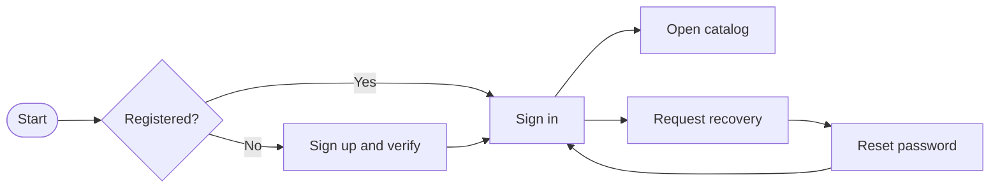
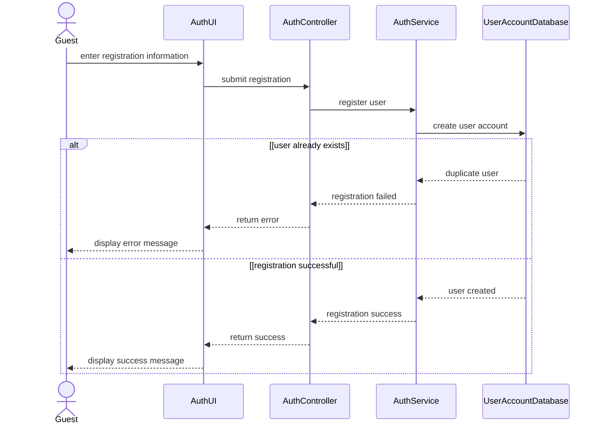
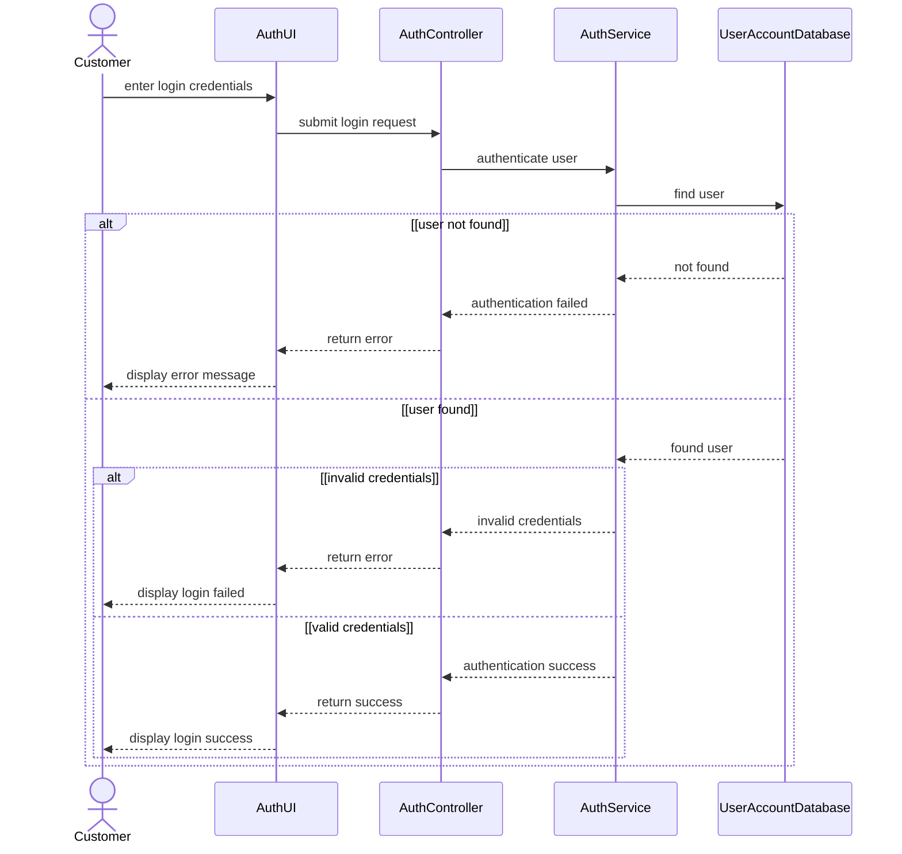

# Spec Document: Identity & Access

| Field | Value |
| --- | --- |
| Module ID | `MFG-01` |
| Module name | Identity & Access |
| Spec version | v1.0 |
| Author (team member) | Group B |
| Date | 2026-09-19 |
| Status | Draft |
| Approved by (Client role) | No approver assigned |
| DBIZ2 source | Historical IDs retained: Function List No. 1-11; `F-USER-001` .. `F-USER-011`; `UC-G03`, `UC-M01` .. `UC-M04`; S02-S06 and S08. External DBIZ2 comparison is not required. |

---

## 1. Purpose and scope (mandatory)

This module provides registration, verification, authentication, sign-out and password recovery. Public registration creates Customer capability only. Staff and System Admin access is provisioned by MFG-03.

**In scope:** register and verify a Customer; sign in with server-resolved capabilities; revoke a session; request and complete email recovery.

**Out of scope:** profile maintenance is MFG-02; staff provisioning is MFG-03; phone/SMS verification is disabled.

**Depends on:** a durable email outbox, secure session storage and server-side authorization.

## 2. Actors (mandatory)

| Actor | Role in this module | Where it comes from |
| --- | --- | --- |
| Guest | Registers, verifies, signs in and recovers access | MFG-01 resolved contract; UC-G03/UC-M01/UC-M02/UC-M03 |
| Member | Authenticated active user; signs out | MFG-01 resolved contract; UC-M04 |
| Customer | Capability created by public registration | MFG-01 role boundary |
| System | Issues tokens, sends email and enforces limits | MFG-01 function contract |

## 3. User scenarios and acceptance criteria (mandatory)

### US-1 (Must): Register account

1. **Given** a new normalized email and valid fields, **when** submitted, **then** one pending Customer and verification event are created atomically.
2. **Given** a duplicate email, **when** retried, **then** return 409 without another account.
3. **Given** a valid unconsumed verification link, **when** opened within 24 hours, **then** activate exactly once.

### US-2 (Must): Log in

1. **Given** a verified active user, **when** credentials are correct, **then** create a revocable session with active capabilities.
2. **Given** invalid credentials, **when** attempts one through five occur in 15 minutes, **then** return generic 401; later attempts in the account/IP window return 429.
3. **Given** an external redirect, **when** login succeeds, **then** discard it and use an allowlisted internal route.

### US-3 (Must): Forgot password

1. **Given** any valid email syntax, **when** recovery is requested, **then** return the same acknowledgement.
2. **Given** an eligible account, **when** accepted, **then** queue a single-use 30-minute reset link.

### US-4 (Must): Reset password

1. **Given** a valid token and matching compliant password, **when** reset commits, **then** consume the token, replace the hash and revoke every session atomically.
2. **Given** concurrent use of one token, **when** both submit, **then** one succeeds and the other returns 409.

### US-5 (Must): Log out

1. **Given** an active session, **when** logout runs, **then** revoke it, clear the cookie and route to S03.
2. **Given** an already-revoked session, **when** repeated, **then** succeed as an idempotent no-op.

### Edge cases

- Expired, consumed or replaced tokens are rejected without revealing account details.
- Email failure does not roll back account/token state; delivery remains retryable.
- Recoverable errors preserve nonsecret input; passwords/tokens are never echoed.
- Missing authentication returns 401, prohibited action 403 and inaccessible object 404.

## 4. Flows (mandatory)

### 4.1 Usage flow

### 4.2 Sequence for the main flow

# UC-G03: Register account — SD-02: Sign Up

# UC-M01: Log in — SD-03: Log In

## 5. Functional requirements (mandatory)

| FR ID | DBIZ2 Subfunction ID | Requirement (system MUST ...) | Actor | Priority |
| --- | --- | --- | --- | --- |
| FR-001 | F-USER-001 | Render the registration form and verification guidance. | Guest | Must |
| FR-002 | F-USER-002 | Validate fields and atomically create one pending Customer. | Guest | Must |
| FR-003 | F-USER-003 | Issue a hashed verification token and durable email event. | Guest / System | Must |
| FR-004 | F-USER-004 | Render login and recovery entry. | Guest | Must |
| FR-005 | F-USER-005 | Authenticate, rate-limit and establish a secure server session. | Guest | Must |
| FR-006 | F-USER-006 | Revoke the current session idempotently. | Member | Must |
| FR-007 | F-USER-007 | Render the email-only recovery form. | Guest / Member | Must |
| FR-008 | F-USER-008 | Validate recovery input without exposing account existence. | Guest / Member | Must |
| FR-009 | F-USER-009 | Issue and deliver a hashed reset token. | System | Must |
| FR-010 | F-USER-010 | Verify token purpose, expiry and consumption state. | Guest | Must |
| FR-011 | F-USER-011 | Atomically replace the password and revoke sessions. | Valid token holder | Must |

### 5.1 Input / Output contract

| FR ID | Input field | Type | Required | Output field | Type | Notes / validation |
| --- | --- | --- | --- | --- | --- | --- |
| FR-001 | route/session context | Session context | Yes | registration form | View model | Name, email, password, confirmation |
| FR-002 | full_name, email, password, confirmation | Strings | Yes | pending Customer | Object | Name 1-100; password 12-128; 422 invalid; 409 duplicate |
| FR-003 | server user; resend email | UUID / email | Yes | token and email event | Object | Hashed, single-use, 24 hours, rate-limited |
| FR-004 | route/session context | Session context | Yes | login model | View model | Includes recovery link |
| FR-005 | email, password, redirect | Strings / URL | Yes | session and capabilities | Object | Generic 401; later limited attempts 429; redirect allowlisted |
| FR-006 | secure-cookie session | Session | Yes | session_invalidated | Boolean | Clear cookie; repeated call succeeds |
| FR-007 | route context | Route context | Yes | recovery form | View model | Email only |
| FR-008 | email | String | Yes | accepted | Boolean/status | Three requests/account/IP/hour; generic response |
| FR-009 | server user/channel | UUID / enum | Yes | reset email event | Object | Hashed 30-minute token; retries at 1, 5, 30 minutes |
| FR-010 | reset token | Opaque token | Yes | validity status | Enum | Purpose/expiry/consumption checked; one concurrent winner |
| FR-011 | token, new_password, confirmation | Token / strings | Yes | confirmation | Object | Consume token, replace hash, revoke sessions; 409/422 as specified |

### 5.2 Business rules

| Rule ID | Rule | Why it exists |
| --- | --- | --- |
| BR-001 | Email is case-normalized and globally unique. | Prevent duplicate identities. |
| BR-002 | Client-supplied role, user ID or company membership is never authority. | Prevent privilege escalation. |
| BR-003 | Password is 12-128 characters, spaces allowed, stored only as a hash. | Protect credentials. |
| BR-004 | Sessions use Secure, HttpOnly, SameSite=Lax cookies, CSRF protection, 30-minute idle and 24-hour absolute expiry. | Bound session exposure. |
| BR-005 | Tokens are random, hashed, purpose-bound, single-use and replaced on resend. | Prevent token replay/leakage. |
| BR-006 | UUIDs, UTC timestamps, version checks and idempotency apply. | Make retries and concurrency deterministic. |

## 6. Key entities (mandatory)

| Entity | Attributes (from Input/Output fields) | Relationships |
| --- | --- | --- |
| User | id, email, full_name, password_hash, customer_capability, verified_at, active, version | No single global staff role |
| Membership | id, company_id, user_id, role, active, version | Per-company Company Admin or Sales Consultant |
| SystemCapability | user_id, role, active | System Admin is separate |
| Session | id, user_id, token_hash, expiries, revoked_at | Raw token not stored/logged |
| OneTimeToken | user_id, purpose, token_hash, expires_at, consumed_at | Single-use and purpose-bound |

## 7. Screens involved

| Screen ID | Screen name | Priority | Screen Spec file |
| --- | --- | --- | --- |
| S02 | Registration | Must | `screens/S02-sign_up_screen.md` |
| S03 | Login and invitation acceptance | Must | `screens/S03-login_screen.md` |
| S04 | Recovery request | Must | `screens/S04-forgot_password_screen.md` |
| S05 | Password reset | Must | `screens/S05-reset_password_screen.md` |
| S06 | Session entry/logout | Must | `screens/S06-user_profile_screen.md` |
| S08 | Safe default catalog destination | Must | `screens/S08-product_catalog_screen.md` |

## 8. Success criteria (mandatory)

| SC ID | Criterion | How it is measured |
| --- | --- | --- |
| SC-001 | All eleven functions map one-to-one to FRs and retries/concurrency are deterministic. | Contract, idempotency and race tests. |
| SC-002 | Authentication and recovery do not disclose account existence. | Compare responses for known and unknown accounts. |
| SC-003 | Passwords, raw tokens and session secrets never appear in responses/logs/demo data. | Security and log inspection. |

## 9. Assumptions

- This is a DBIZ 3 classroom demo by Group B; no client approver is assigned.
- Organization/contact data are fictional labeled samples.
- Email is the only verification/recovery channel.

## 10. Open questions

| # | Question | Blocking? | Owner | Status |
| --- | --- | --- | --- | --- |
| 1 | Administrative project inputs | No | Group B | Group B; DBIZ 3; no approver; classroom demo with fictional labeled data. |
| 2 | Identity and access behavior | No | Group B | Resolved — no remaining open questions; roles, lifetimes, session policy, limits and email-only recovery are specified in sections 3, 5 and 9. |

## 11. Traceability to DBIZ2

Historical IDs are retained for continuity; external DBIZ2 comparison is not required.

| Spec section | DBIZ2 source | Location |
| --- | --- | --- |
| Registration | `UC-G03`; `F-USER-001` .. `003` | S02; Sections 3 and 5 |
| Login | `UC-M01`; `F-USER-004` .. `005` | S03; Sections 3 and 5 |
| Logout | `UC-M04`; `F-USER-006` | S06; Sections 3 and 5 |
| Recovery | `UC-M02`, `UC-M03`; `F-USER-007` .. `011` | S04-S05; Sections 3 and 5 |

## Completion checklist

- [x] Scope, actors, scenarios, flows and edge cases are defined.
- [x] Function, entity, screen and ID traceability is complete.
- [x] Assumptions and resolved decisions are explicit.
- [x] No unresolved placeholders remain.
