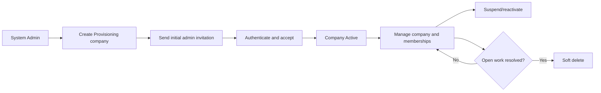
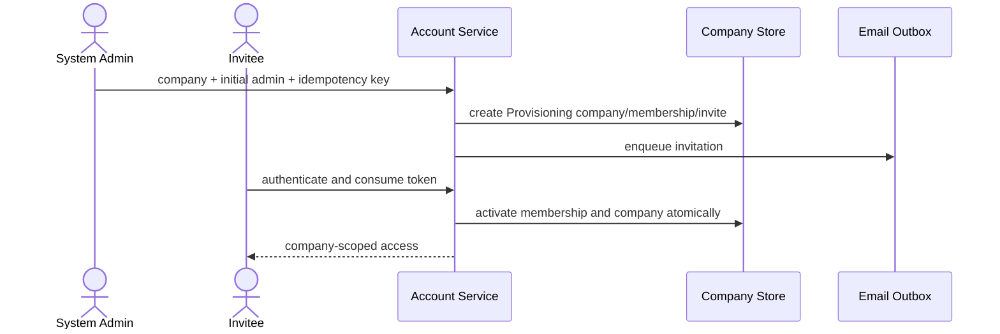

# Spec Document: Company Accounts

| Field | Value |
| --- | --- |
| Module ID | `MFG-03` |
| Module name | Company Accounts |
| Spec version | v1.1 |
| Author (team member) | Group B |
| Date | 2026-09-22 |
| Status | Draft |
| Approved by (Client role) | No approver assigned |
| DBIZ2 source | Historical IDs retained: Function List No. 17-24; `F-ACC-001` .. `F-ACC-008`; `UC-S06` .. `UC-S08`; S03 and S41. External DBIZ2 comparison is not required. |

---

## 1. Purpose and scope (mandatory)

System Admin provisions companies and company-scoped staff memberships. A Company Account is a Company plus memberships; Customer identity remains separate.

**In scope:** list/detail companies; create a Provisioning company; invite initial/subsequent staff; update company/membership state; soft-delete a company or membership after safety checks.

**Out of scope:** customer self-registration (MFG-01), product/order mutations, and private company financial exports. This full administration module is outside MVP; one seeded demo admin is sufficient for MVP.

## 2. Actors (mandatory)

| Actor | Role in this module | Where it comes from |
| --- | --- | --- |
| System Admin | Provisions companies and staff | MFG-03; UC-S06/UC-S07/UC-S08 |
| Company Admin invitee | Accepts initial or added membership | MFG-03 invitation contract |
| Sales Consultant invitee | Accepts company membership | MFG-03 invitation contract |
| System | Sends invitations and audit/outbox events | MFG-03 function contract |

## 3. User scenarios and acceptance criteria (mandatory)

### US-1 (Won't for MVP): Add account

1. Valid creation atomically makes one Provisioning company, inactive initial Company Admin membership, hashed 48-hour invitation and outbox event.
2. Company becomes Active only after the invitee authenticates/creates identity and consumes the invitation.
3. The same idempotency key/payload replays the original result; changed payload returns 409.

### US-2 (Won't for MVP): Update account info and role

1. Company/contact or membership changes require an allowlist and expected version.
2. The last active Company Admin and last active System Admin cannot be demoted/deactivated.
3. Suspending a company blocks new catalog/order/payment activity while preserving reads and reconciliation.

### US-3 (Won't for MVP): Delete account

1. Company deletion is soft and requires no open orders, active design requests (Submitted/UnderReview/FeeProposed/Approved/Assigned/InProgress), active batches or unresolved payment/refund work.
2. Membership removal requires reassignment of open consultant work and preserves the user and other memberships.
3. Successful deletion revokes affected sessions and preserves historical records/audit.

### US-4 (Won't for MVP): Manage company accounts

1. List/detail results are paginated and expose company/staff summaries plus open-work counts only.
2. Cross-company identifiers do not grant access; inaccessible records return 404.

### Edge cases

- Expired/replayed invitations cannot activate membership.
- Existing global identity must authenticate before invitation acceptance.
- Duplicate tax ID, active membership or pending invitation returns 409.
- Concurrent updates serialize by version; stale writes return 409.

## 4. Flows (mandatory)

### 4.1 Usage flow

### 4.2 Sequence for the main flow

## 5. Functional requirements (mandatory)

| FR ID | DBIZ2 Subfunction ID | Requirement (system MUST ...) | Actor | Priority |
| --- | --- | --- | --- | --- |
| FR-001 | F-ACC-001 | List companies with pagination and authorized filters. | System Admin | Won't |
| FR-002 | F-ACC-002 | Render the company creation form for an authorized System Admin. | System Admin | Won't |
| FR-003 | F-ACC-003 | Generate and deliver a hashed, single-use 48-hour invitation without exposing its raw token. | System | Won't |
| FR-004 | F-ACC-004 | Atomically create a Provisioning company, inactive initial admin membership, invitation and outbox event. | System Admin / System | Won't |
| FR-005 | F-ACC-005 | Return authorized company and membership details with open-work counts. | System Admin | Won't |
| FR-006 | F-ACC-006 | Update only allowlisted company/membership fields with expected-version checks and audit event. | System Admin | Won't |
| FR-007 | F-ACC-007 | Require explicit identity and consequence confirmation before removal. | System Admin | Won't |
| FR-008 | F-ACC-008 | Soft-delete/deactivate eligible accounts, revoke affected sessions and retain audit history. | System Admin | Won't |

### 5.1 Input / Output contract

| FR ID | Input field | Type | Required | Output field | Type | Notes / validation |
| --- | --- | --- | --- | --- | --- | --- |
| FR-001 | `page`, `page_size`, `status`, `query` | Integer / Integer / Enum / String | No | `companies`, `total` | Array<CompanySummary> / Integer | Positive bounded paging; filters are allowlisted; System Admin only. |
| FR-002 | Authenticated System Admin session | Session | Yes | `company_form` | ViewModel | Exposes company name, tax ID, address, contact and initial-admin email fields. |
| FR-003 | `company_id`, `email`, `role` | UUID / Email / Enum | Yes | `invitation_id`, `expires_at`, `delivery_status` | UUID / DateTime / Enum | Email is normalized; role is Company Admin or Sales Consultant; token is hashed, single-use and valid for 48 hours. |
| FR-004 | `company`, `initial_admin_email`, `idempotency_key` | Object / Email / UUID | Yes | `company_id`, `membership_id`, `invitation_id`, `status` | UUID / UUID / UUID / Enum | One transaction creates a Provisioning company, inactive membership, invitation and outbox event; repeated key returns the same result. |
| FR-005 | `company_id` | UUID | Yes | `company`, `memberships`, `open_work_counts` | Company / Array<Membership> / Object | Inaccessible company returns 404; secrets and raw invitation tokens are omitted. |
| FR-006 | `company_id`, `expected_version`, allowlisted changes | UUID / Integer / Object | Yes | `updated_company_or_membership`, `version` | Object / Integer | Reject stale version with 409; prevent removal of the last active administrator. |
| FR-007 | `target_id`, `target_type`, `expected_version`, `confirmation` | UUID / Enum / Integer / String | Yes | `eligibility`, `blocking_counts` | Boolean / Object | Confirmation must identify the target; unresolved orders, contracts, requests or batches block removal. |
| FR-008 | `target_id`, `expected_version`, `idempotency_key` | UUID / Integer / UUID | Yes | `status`, `revoked_session_count`, `audit_event_id` | Enum / Integer / UUID | Soft-delete only; retain history, revoke access and make repeated execution idempotent. |

### 5.2 Business rules

| Rule ID | Rule | Why it exists |
| --- | --- | --- |
| BR-001 | Staff role is per-company Membership; System Admin is a separate capability. | Keep authorization boundaries explicit. |
| BR-002 | Lifecycle is Provisioning → Active ↔ Suspended → Deleted; Deleted is terminal. | Make account state transitions deterministic. |
| BR-003 | Invitation is hashed, single-use, 48 hours; resend invalidates the prior token. | Prevent invitation replay. |
| BR-004 | No temporary password; new identity sets name/password during invitation acceptance. | Avoid insecure credential delivery. |
| BR-005 | Protect last active system/company admin and require open-work resolution before removal. | Preserve operational continuity. |
| BR-006 | Every deletion is soft, historical records remain, and sessions/access are revoked. | Preserve audit/history and end access. |

## 6. Key entities (mandatory)

| Entity | Attributes (from Input/Output fields) | Relationships |
| --- | --- | --- |
| Company | id, name, tax_id, address, contact, status, timestamps, version | Company/legal fields are demo samples in this project |
| Membership | id, company_id, user_id, role, active, version | One company-scoped staff authority |
| Invitation | company_id, email, role, token_hash, expires_at, accepted_at, version | Single-use; acceptance atomic |

## 7. Screens involved

| Screen ID | Screen name | Priority | Screen Spec file |
| --- | --- | --- | --- |
| S03 | Invitation authentication/identity setup | Won't | `screens/S03-login_screen.md` |
| S41 | Company and staff accounts | Won't | `screens/S41-company_and_staff_accounts_screen.md` |

## 8. Success criteria (mandatory)

| SC ID | Criterion | How it is measured |
| --- | --- | --- |
| SC-001 | Company cannot become Active without accepted initial-admin invitation. | Check activation preconditions and invitation consumption. |
| SC-002 | Cross-company membership never grants access to another company. | Verify same-company and foreign-company authorization. |
| SC-003 | Last-admin and open-work invariants prevent unsafe deletion; all eight functions map one-to-one to FRs. | Exercise deletion guards and compare F-ACC IDs with FRs. |

## 9. Assumptions

- DBIZ 3 classroom demo by Group B; no approver assigned.
- Legal/company/contact values are fictional labeled sample data.
- MVP uses one seeded admin login; full MFG-03 remains documented for a later release.

## 10. Open questions

| # | Question | Blocking? | Owner | Status |
| --- | --- | --- | --- | --- |
| 1 | Are any provisioning, invitation, lifecycle, role or deletion decisions still undecided? | No | Group B | Resolved — no remaining open questions; sections 3–6 define the complete behavior. |

## 11. Traceability to DBIZ2

Historical IDs are retained; external DBIZ2 comparison is not required.

| Spec section | DBIZ2 source | Location |
| --- | --- | --- |
| Scope and actors | Function List MFG-03 | Rows 17–24; IDs appear in FR table |
| Scenarios | UC-S06, UC-S07, UC-S08 | Use-case identifiers; resolved behavior in section 3 |
| Requirements and entities | F-ACC-001..008 | Function List MFG-03; sections 5–6 |
| Screens | S03, S41 | Screen list and current MFG-03 contract |

## Completion checklist

- [x] Scope, actors, scenarios, flows and edge cases are defined.
- [x] Lifecycle, concurrency, deletion and traceability are complete.
- [x] MVP status and demo-data assumptions are explicit.
- [x] No unresolved placeholders remain.
