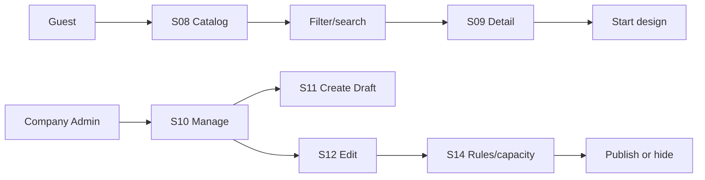
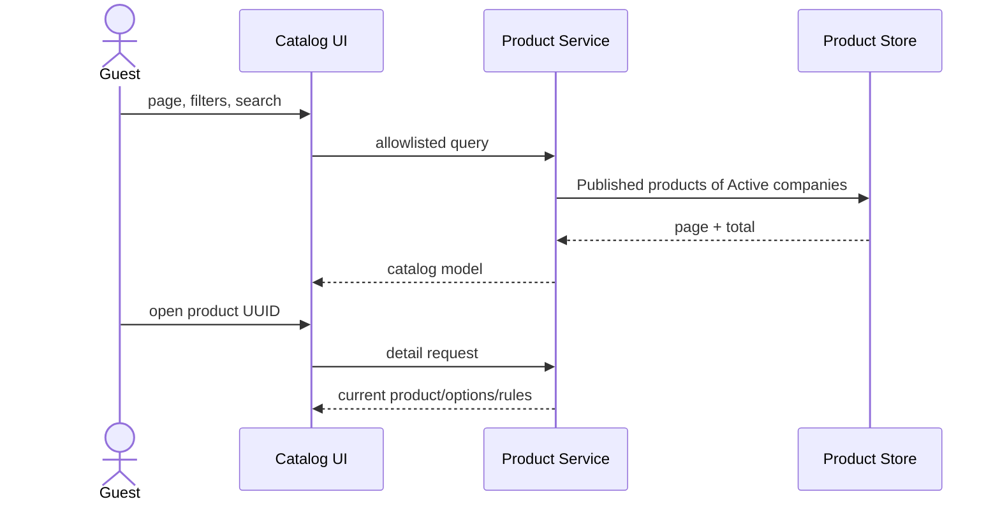

# Spec Document: Product Catalog

| Field | Value |
| --- | --- |
| Module ID | `MFG-04` |
| Module name | Product Catalog |
| Spec version | v1.0 |
| Author (team member) | Group B |
| Date | 2026-09-19 |
| Status | Draft |
| Approved by (Client role) | No approver assigned |
| DBIZ2 source | Historical IDs retained: Function List No. 25-35; `F-PROD-001` .. `F-PROD-011`; `UC-G01`, `UC-G02`, `UC-C24` .. `UC-C27`; S01, S08-S14. External DBIZ2 comparison is not required. |

---

## 1. Purpose and scope (mandatory)

Provide public discovery of Published products from Active companies and company-scoped catalog/design-rule administration. Catalog browsing/search/detail is Must for MVP.

**In scope:** browse/search/detail; create/edit/archive; publish/hide; configure supported options, print areas and finite per-order capacity.

**Out of scope:** design creation is MFG-05; checkout/order is MFG-06; capacity is a validation limit, not inventory reservation.

## 2. Actors (mandatory)

| Actor | Role in this module | Where it comes from |
| --- | --- | --- |
| Guest/Member | Browses/searches Published products | MFG-04 resolved contract; UC-G01/UC-G02 |
| Company Admin | Manages own-company products and rules | MFG-04 role boundary |
| System | Validates assets, versions and visibility | MFG-04 function contract |

## 3. User scenarios and acceptance criteria (mandatory)

### US-1 (Must): View product catalog

Valid page/filter returns only Published Active-company products with integer-VND prices and accurate pagination; empty data returns an empty list.

### US-2 (Must): Search products

Search accepts a trimmed keyword up to 100 characters plus allowlisted category/size/color/material/price filters; invalid range/sort returns 422/400 without broadening the query.

### US-3 (Post-MVP administration): Add product

Company Admin creates a Draft with validated fields/assets and idempotency. Duplicate company SKU conflicts; incomplete Draft is allowed.

### US-4 (Post-MVP administration): Update product info

Same-company update uses allowlisted fields and expected version. Rule-affecting changes invalidate unconsumed quotes; submitted order snapshots remain unchanged.

### US-5 (Post-MVP administration): Delete product

Archive is a soft, terminal deletion. Repeating archive succeeds; public visibility ends immediately while historical references remain.

### US-6 (Post-MVP administration): Publish / unpublish product

Publish requires all mandatory data and safe image; hide uses an explicit target state. Archived records never transition.

### US-7 (Post-MVP administration): Manage product catalog

S10-S14 expose permission-derived actions and optimistic concurrency. Product/design rule changes increment version.

### Edge cases

- Foreign/missing/nonpublic product UUID returns 404 for the relevant actor.
- Unsafe or oversized image is rejected before reference persistence.
- Quantity beyond `max_units_per_order` returns 422 `CAPACITY_EXCEEDED`.
- Suspended/Deleted company products cannot start new design/order/payment work.

## 4. Flows (mandatory)

### 4.1 Usage flow

### 4.2 Sequence for the main flow

## 5. Functional requirements (mandatory)

### 5.1 Input / Output contract

| FR ID | DBIZ2 Subfunction ID | Requirement (system MUST ...) | Actor | Priority |
| --- | --- | --- | --- | --- |
| FR-001 | F-PROD-001 | Return a paginated grid of Published products from Active companies using allowlisted category and sort values. | Guest/Member | Must |
| FR-002 | F-PROD-002 | Return a product detail and options for a canonical product UUID; nonpublic products return 404. | Guest/Member | Must |
| FR-003 | F-PROD-003 | Search using bounded keywords and allowlisted filters without broadening invalid queries. | Guest/Member | Must |
| FR-004 | F-PROD-004 | Show management actions only for same-company Company Admins. | Company Admin | Won't |
| FR-005 | F-PROD-005 | Render product creation form and upload constraints. | Company Admin | Won't |
| FR-006 | F-PROD-006 | Save a validated Draft product with idempotency and company-scoped SKU uniqueness. | Company Admin | Won't |
| FR-007 | F-PROD-007 | Render an authorized product edit model with current version. | Company Admin | Won't |
| FR-008 | F-PROD-008 | Update allowlisted product fields atomically with expected-version checks. | Company Admin | Won't |
| FR-009 | F-PROD-009 | Require explicit confirmation before archiving a product. | Company Admin | Won't |
| FR-010 | F-PROD-010 | Soft-archive a product while retaining historical references. | Company Admin | Won't |
| FR-011 | F-PROD-011 | Change product visibility to an explicitly requested valid state. | Company Admin | Won't |

### 5.1 Input / Output contract

| FR ID | Input field | Type | Required | Output field | Type | Notes / validation |
| --- | --- | --- | --- | --- | --- | --- |
| FR-001 | category, page, page_size, sort | Allowlisted values / integers | Optional | Published product grid | Paginated object | page >=1; size 1-100 |
| FR-002 | product UUID | UUID | Yes | product detail/options | Object | Nonpublic product 404 |
| FR-003 | keyword, filters, price range, page | String / allowlisted values | Optional | search results | Paginated object | Keyword <=100; invalid values rejected |
| FR-004 | same-company Company Admin session | Session | Yes | S10 management list/actions | View model | Foreign-company data inaccessible |
| FR-005 | authorized session | Session | Yes | S11 creation model | View model | Includes upload constraints |
| FR-006 | name, SKU, price, attributes, capacity, image UUIDs, key | Fields / integer / key | Yes | Draft UUID/version | Object | Bounds specified in source contract; 422 invalid; 409 duplicate SKU |
| FR-007 | same-company product UUID/session | UUID / session | Yes | S12 edit model/version | View model | Foreign product inaccessible |
| FR-008 | allowlisted changes, expected version | Values / integer | Yes | updated product/version | Object | Atomic; stale 409; relevant quote invalidation |
| FR-009 | same-company product/version | UUID / integer | Yes | confirmation/impact model | View model | Explicit confirmation |
| FR-010 | product UUID, confirmation, version | UUID / boolean / integer | Yes | archived product | Object | Soft archive; repeated success |
| FR-011 | product UUID, target state, version | UUID / enum / integer | Yes | visibility state | Object | Archived is terminal |

### 5.2 Business rules

| Rule ID | Rule | Why it exists |
| --- | --- | --- |
| BR-001 | SKU is unique within company; canonical public route uses globally unique UUID. | Avoid duplicate company catalog entries and ambiguous routes. |
| BR-002 | Amounts/surcharges are nonnegative integer VND; capacity is integer 1-10000. | Keep pricing and capacity bounded and deterministic. |
| BR-003 | Publish requires name, SKU, price, category, safe image, sizes, colors, materials and capacity. | Prevent incomplete public products. |
| BR-004 | Images are PNG/JPEG/WebP, actual MIME checked/scanned, <=10 MiB each and <=5/request. | Protect users and storage. |
| BR-005 | Lifecycle is Draft → Published ↔ Hidden → Archived; archive is terminal. | Make visibility transitions explicit. |
| BR-006 | Rule/product changes invalidate quotes; submitted orders retain immutable snapshots. | Preserve current quotes and historical order values. |
| BR-007 | S14 owns sizes, colors, materials, print methods/areas, surcharges and capacity; 2D preview required, 3D excluded. | Define supported customization scope. |

## 6. Key entities (mandatory)

| Entity | Attributes (from Input/Output fields) | Relationships |
| --- | --- | --- |
| Product | id, company_id, name, sku, description, category, unit_price_vnd, options, design_rules, capacity, images, status, version | Company-scoped SKU; immutable ordered snapshot |
| Asset | id, owner/company, MIME, scan status, storage key | Private; served by authorized expiring URL |
| ProductVersion | product_id, version, rule/price snapshot | Quotes reference current version |

## 7. Screens involved

| Screen ID | Screen name | Priority | Screen Spec file |
| --- | --- | --- | --- |
| S01 | Home and catalog entry | Must | `screens/S01-home_page.md` |
| S08 | Product catalog and search | Must | `screens/S08-product_catalog_screen.md` |
| S09 | Product detail and design entry | Must | `screens/S09-product_detail_screen.md` |
| S10 | Product management | Won't | `screens/S10-product_list_company_admin_screen.md` |
| S11 | Product creation | Won't | `screens/S11-product_create_screen.md` |
| S12 | Product edit/archive | Won't | `screens/S12-product_edit_screen.md` |
| S14 | Design rules and capacity | Won't | `screens/S14-product_design_rules_screen.md` |

## 8. Success criteria (mandatory)

| SC ID | Criterion | How it is measured |
| --- | --- | --- |
| SC-001 | MVP users can browse, search and view only eligible products. | Verify Published/Active filtering and empty results. |
| SC-002 | Publish/archive/version/capacity behavior is deterministic under retry/concurrency. | Exercise lifecycle, version and capacity boundaries. |
| SC-003 | Unsafe assets and cross-company access are blocked; all eleven functions map to FRs. | Test asset validation and authorization; compare F-PROD IDs with FRs. |

## 9. Assumptions

- DBIZ 3 classroom demo by Group B; no approver assigned; demo company/contact data are fictional samples.
- Catalog browsing/search/detail is MVP Must; administration remains specified for later operation.
- Capacity is a validation ceiling and does not represent stock.

## 10. Open questions

| # | Question | Blocking? | Owner | Status |
| --- | --- | --- | --- | --- |
| 1 | Are any product lifecycle, visibility, image, capacity or quote-invalidation decisions still undecided? | No | Group B | Resolved — no remaining open questions; sections 3–6 define the complete behavior. |

## 11. Traceability to DBIZ2

Historical IDs are retained; external DBIZ2 comparison is not required.

| Spec section | DBIZ2 source | Location |
| --- | --- | --- |
| Scope and actors | Function List MFG-04 | Rows 25–35; IDs appear in FR table |
| Browse and detail | UC-G01; F-PROD-001..002 | S08-S09; sections 3 and 5 |
| Search | UC-G02; F-PROD-003 | S08; sections 3 and 5 |
| Administration | UC-C24..UC-C27; F-PROD-004..011 | S10-S14; sections 3 and 5 |

## Completion checklist

- [x] Scope, actors, scenarios, flows and edge cases are defined.
- [x] All functions, entities, screens and lifecycle rules are traceable.
- [x] MVP priority and demo assumptions are explicit.
- [x] No unresolved placeholders remain.
