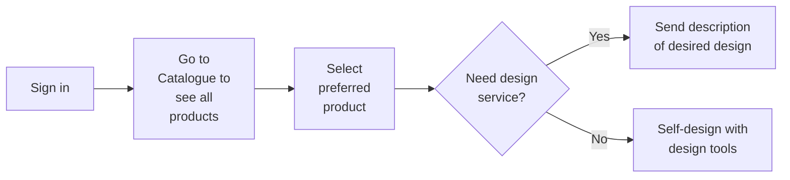
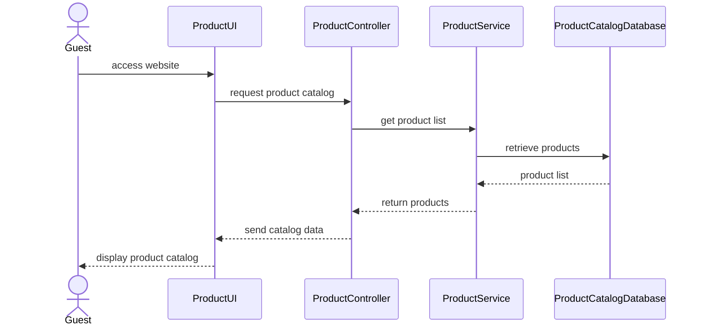
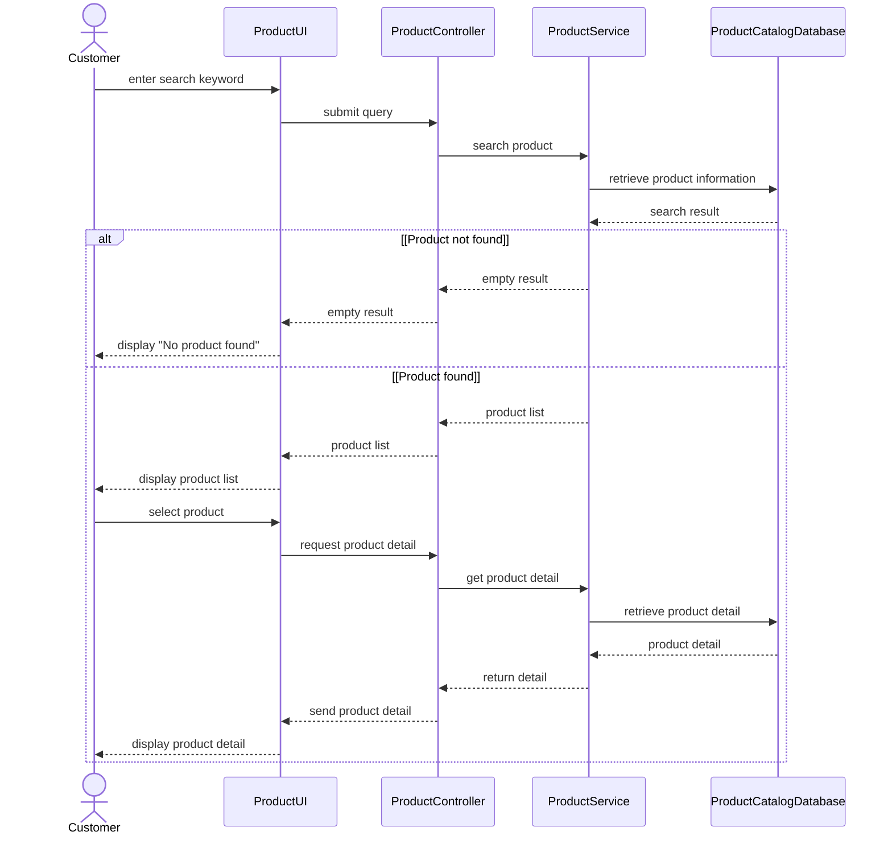

Warning: truncated output (original token count: 31572)
Total output lines: 782

# Spec Document: Product Catalog

| Field | Value |
| --- | --- |
| Module ID | `MFG-04` |
| Module name | Product Catalog |
| Spec version | v0.1 |
| Author (team member) | [NEEDS CLARIFICATION: Specify the responsible team member; Group B is named only as the team on the Session 1 scope sheet.] |
| Date | 2026-09-16 |
| Status | Draft |
| Approved by (Client role) | [NEEDS CLARIFICATION: Client approver role and approval are not supplied.] |
| DBIZ2 source | Function List `MFG-04`, No. 25-35, `F-PROD-001` .. `F-PROD-011`; Use Cases: View product catalog; Search products; Add product; Update product info; Delete product; Publish/ Unpublish product; Manage product catalog; Use Case IDs: UC-G01, UC-G02, UC-C24, UC-C25, UC-C26, UC-C27, UC-C23; Screens: `S01`, `S08`, `S09`, `S10`, `S11`, `S12`, `S13`, `S14`, `S15`, `S22`, `S38` |

---

## 1. Purpose and scope (mandatory)

Customers can browse and search garments and inspect their details before customization. Company administrators can maintain the catalog and control whether products are published or hidden.

Source: [docs/function-list.md](../docs/function-list.md), `MFG-04` (No. 25-35); Session 1 MVP PDF, page 1 section 3. [NEEDS CLARIFICATION: Original DBIZ2 Schematic 1.1/1.2 cells are unavailable; the PDF reproduces the project objective but is not Session 3 MVP Scope v3.]

**In scope**

- View Catalog
- Search Product
- Add Product
- Update Product
- Delete Product
- Publish Product

Session 1 marks browse, search and product detail as Must; it does not give a separate MVP priority for administrator catalog maintenance. All DBIZ2 subfunctions below are retained as documentation; this does not authorize release of deferred functions. [NEEDS CLARIFICATION: Supply MVP Scope v3 and Session 3 decisions to confirm current module scope.]

**Out of scope**

- Design customization and paid design requests belong to MFG-05.
- Order creation and payment belong to MFG-06.

**Depends on**

- MFG-05: the S09 design actions continue to S13/S15 (S09 section 5).

## 2. Actors (mandatory)

| Actor | Role in this module | Where it comes from |
| --- | --- | --- |
| Guest | Primary — View Catalog, Search Product | Function List `Actor` column, `MFG-04`: F-PROD-001, F-PROD-002, F-PROD-003 |
| Company Admin | Primary — Add Product, Update Product, Delete Product, Publish Product | Function List `Actor` column, `MFG-04`: F-PROD-004, F-PROD-005, F-PROD-006, F-PROD-007, F-PROD-008, F-PROD-009, F-PROD-010, F-PROD-011 |

Primary identifies the actor performing the listed subfunctions; it does not replace conflicting Use Case or sequence labels. External participants appear in section 4 only when supplied by the source.

## 3. User scenarios and acceptance criteria (mandatory)

[NEEDS CLARIFICATION: P1/P2 scenario ordering is not agreed in the supplied materials; no scenario priority is inferred from Function List High/Medium/Low.]

### US-1 ([NEEDS CLARIFICATION: Scenario priority not agreed.]): View product catalog

**Journey.** As a `Guest`, I want to `view product catalog`, so that [NEEDS CLARIFICATION: The Use Case names the goal but does not state a separate scenario benefit.].

Source: `docs/architecture/use-case.md`, line 3, “View product catalog”; related FRs `FR-001` / `F-PROD-001`, `FR-002` / `F-PROD-002`.

**Acceptance scenarios**

1. **Given** the catalog is available, **When** the guest opens the product catalog, **Then** the product catalog is displayed.
2. **Given** a guest searches for a product that does not exist, **When** the search completes, **Then** the user sees "No product found" (SD-04).

### US-2 ([NEEDS CLARIFICATION: Scenario priority not agreed.]): Search products

**Journey.** As a `Guest`, I want to `search products`, so that [NEEDS CLARIFICATION: The Use Case names the goal but does not state a separate scenario benefit.].

Source: `docs/architecture/use-case.md`, line 4, “Search products”; related FRs `FR-003` / `F-PROD-003`.

**Acceptance scenarios**

1. **Given** the product search is available, **When** the guest searches for products, **Then** the search result is displayed.
2. **Given** no product matches the search, **When** the search completes, **Then** "No product found" is displayed (SD-04).

### US-3 ([NEEDS CLARIFICATION: Scenario priority not agreed.]): Add product

**Journey.** As a `Company Admin`, I want to `add product`, so that [NEEDS CLARIFICATION: The Use Case names the goal but does not state a separate scenario benefit.].

Source: `docs/architecture/use-case.md`, line 40, “Add product”; related FRs `FR-004` / `F-PROD-004`, `FR-005` / `F-PROD-005`, `FR-006` / `F-PROD-006`. Actor association in the Use Case: [NEEDS CLARIFICATION: no direct actor association shown].

[NEEDS CLARIFICATION: No detailed Usage Flow or sequence for this use case is supplied; the criterion records the named goal and any explicitly cited Function List outcome. Confirm preconditions, action sequence and failure behavior before treating it as an agreed acceptance test.]

**Acceptance scenarios**

1. **Given** the company administrator is managing the product catalog, **When** the administrator adds a product, **Then** a new product record with the supplied specifications is created (F-PROD-006).

### US-4 ([NEEDS CLARIFICATION: Scenario priority not agreed.]): Update product info

**Journey.** As a `Company Admin`, I want to `update product info`, so that [NEEDS CLARIFICATION: The Use Case names the goal but does not state a separate scenario benefit.].

Source: `docs/architecture/use-case.md`, line 41, “Update product info”; related FRs `FR-007` / `F-PROD-007`, `FR-008` / `F-PROD-008`. Actor association in the Use Case: [NEEDS CLARIFICATION: no direct actor association shown].

[NEEDS CLARIFICATION: No detailed Usage Flow or sequence for this use case is supplied; the criterion records the named goal and any explicitly cited Function List outcome. Confirm preconditions, action sequence and failure behavior before treating it as an agreed acceptance test.]

**Acceptance scenarios**

1. **Given** the company administrator is managing an existing product, **When** the administrator updates product information, **Then** the existing product record contains the submitted changes (F-PROD-008).

### US-5 ([NEEDS CLARIFICATION: Scenario priority not agreed.]): Delete product

**Journey.** As a `Company Admin`, I want to `delete product`, so that [NEEDS CLARIFICATION: The Use Case names the goal but does not state a separate scenario benefit.].

Source: `docs/architecture/use-case.md`, line 42, “Delete product”; related FRs `FR-009` / `F-PROD-009`, `FR-010` / `F-PROD-010`. Actor association in the Use Case: [NEEDS CLARIFICATION: no direct actor association shown].

[NEEDS CLARIFICATION: No detailed Usage Flow or sequence for this use case is supplied; the criterion records the named goal and any explicitly cited Function List outcome. Confirm preconditions, action sequence and failure behavior before treating it as an agreed acceptance test.]

**Acceptance scenarios**

1. **Given** the company administrator is managing an existing product, **When** the administrator deletes the product, **Then** the confirmed product is removed from the catalog display (F-PROD-010); [NEEDS CLARIFICATION: Whether the underlying product record is archived or deleted is unresolved.].

### US-6 ([NEEDS CLARIFICATION: Scenario priority not agreed.]): Publish/ Unpublish product

**Journey.** As a `Company Admin`, I want to `publish/ unpublish product`, so that [NEEDS CLARIFICATION: The Use Case names the goal but does not state a separate scenario benefit.].

Source: `docs/architecture/use-case.md`, line 43, “Publish/ Unpublish product”; related FRs `FR-011` / `F-PROD-011`. Actor association in the Use Case: [NEEDS CLARIFICATION: no direct actor association shown].

[NEEDS CLARIFICATION: No detailed Usage Flow or sequence for this use case is supplied; the criterion records the named goal and any explicitly cited Function List outcome. Confirm preconditions, action sequence and failure behavior before treating it as an agreed acceptance test.]

**Acceptance scenarios**

1. **Given** the company administrator is managing an existing product, **When** the administrator publishes or unpublishes it, **Then** the product storefront state switches between Published and Hidden (F-PROD-011).

### US-7 ([NEEDS CLARIFICATION: Scenario priority not agreed.]): Manage product catalog

**Journey.** As a `Company Admin`, I want to `manage product catalog`, so that [NEEDS CLARIFICATION: The Use Case names the goal but does not state a separate scenario benefit.].

Source: `docs/architecture/use-case.md`, line 44, “Manage product catalog”; related FRs `FR-004` / `F-PROD-004`, `FR-005` / `F-PROD-005`, `FR-006` / `F-PROD-006`, `FR-007` / `F-PROD-007`, `FR-008` / `F-PROD-008`, `FR-009` / `F-PROD-009`, `FR-010` / `F-PROD-010`, `FR-011` / `F-PROD-011`.

[NEEDS CLARIFICATION: No detailed Usage Flow or sequence for this use case is supplied; the criterion records the named goal and any explicitly cited Function List outcome. Confirm preconditions, action sequence and failure behavior before treating it as an agreed acceptance test.]

**Acceptance scenarios**

1. **Given** the company administrator is managing the product catalog, **When** the administrator chooses a related management action, **Then** Add product, Update product info, Delete product or Publish/ Unpublish product is entered.

### Edge cases

- [NEEDS CLARIFICATION: Document missing/invalid inputs and empty-data outcomes not already covered by the supplied screens or sequences.]
- [NEEDS CLARIFICATION: Document behavior when a required external service or data operation is unavailable; do not infer retries or fallback paths.]
- [NEEDS CLARIFICATION: Document repeated actions and simultaneous-user outcomes; no concurrency or duplicate-submission rule is supplied.]

## 4. Flows (mandatory)

### 4.1 Usage flow

Exact module-relevant excerpt from `docs/architecture/usage-flow.md`. Boundary nodes retain cross-module context; all included decisions keep both branches. Original node names, labels and connector types are unchanged. This is a subset of the supplied overall journey, not a replacement flow.

[NEEDS CLARIFICATION: The original DBIZ2 Usage Flow image is not supplied; verify this transcription against the original figure before approving the diagram checklist.]

### 4.2 Sequence for the main flow

**SD-01: Browse Product Catalog (Guest)**

**SD-04 – Search and View Product Detail**

Copied unchanged from `docs/architecture/sequence.md`; participants and messages are source text. Cross-module participants remain to preserve the supplied interaction. [NEEDS CLARIFICATION: Confirm which supplied sequence is the agreed main flow; sequences for other listed use cases are not available.]

## 5. Functional requirements (mandatory)

One FR per original Function List subfunction, in source order. FR IDs are local to this module; cite `MFG-04/FR-nnn` with the unchanged Subfunction ID. Original function names and High/Medium/Low values are preserved in each requirement note. MoSCoW values are used only for capabilities explicitly prioritized on page 2 of the Session 1 PDF; [NEEDS CLARIFICATION: Confirm per-subfunction priority mapping and the current Session 3 release scope.]

| FR ID | DBIZ2 Subfunction ID | Requirement (system MUST ...) | Actor | Priority |
| --- | --- | --- | --- | --- |
| FR-001 | F-PROD-001 | The system MUST display the product list in a grid layout with images and basic pricing. DBIZ2 function: View Catalog; subfunction: Catalog Grid View; category: Screen; original priority: High. | Guest | Must |
| FR-002 | F-PROD-002 | The system MUST display detailed product information, technical specifications, and available options. DBIZ2 function: View Catalog; subfunction: Product Detail View; category: Screen; original priority: High. | Guest | Must |
| FR-003 | F-PROD-003 | The system MUST display a list of products matching the user's search keywords. DBIZ2 function: Search Product; subfunction: Search Result View; category: Screen; original priority: Medium. | Guest | Must |
| FR-004 | F-PROD-004 | The system MUST display the product management interface specifically for administrators. DBIZ2 function: Add Product; subfunction: Management Dashboard; category: Screen; original priority: Medium. | Company Admin | [NEEDS CLARIFICATION: No agreed Must/Should/Could priority for this subfunction; preserve the original DBIZ2 priority in the source note.] |
| FR-005 | F-PROD-005 | The system MUST display a form for the admin to enter info and upload images for new products. DBIZ2 function: Add Product; subfunction: Add Product Form; category: Screen; original priority: High. | Company Admin | [NEEDS CLARIFICATION: No agreed Must/Should/Could priority for this subfunction; preserve the original DBIZ2 priority in the source note.] |
| FR-006 | F-PROD-006 | The system MUST create a new product record in the database with full specifications. DBIZ2 function: Add Product; subfunction: Save Product Logic; category: Process; original priority: High. | Company Admin | [NEEDS CLARIFICATION: No agreed Must/Should/Could priority for this subfunction; preserve the original DBIZ2 priority in the source note.] |
| FR-007 | F-PROD-007 | The system MUST display a form containing current product information for editing purposes. DBIZ2 function: Update Product; subfunction: Edit Product Form; category: Screen; original priority: Medium. | Company Admin | [NEEDS CLARIFICATION: No agreed Must/Should/Could priority for this subfunction; preserve the original DBIZ2 priority in the source note.] |
| FR-008 | F-PROD-008 | The system MUST save changes regarding price, description, or product images to the system. DBIZ2 function: Update Product; subfunction: Update Product Logic; category: Process; original priority: Medium. | Company Admin | [NEEDS CLARIFICATION: No agreed Must/Should/Could priority for this subfunction; preserve the original DBIZ2 priority in the source note.] |
| FR-009 | F-PROD-009 | The system MUST display a popup window requesting confirmation before deleting a product. DBIZ2 function: Delete Product; subfunction: Delete Prompt UI; category: Screen; original priority: Low. | Company Admin | [NEEDS CLARIFICATION: No agreed Must/Should/Could priority for this subfunction; preserve the original DBIZ2 priority in the source note.] |
| FR-010 | F-PROD-010 | The system MUST remove the product record from the catalog display in the system. DBIZ2 function: Delete Product; subfunction: Delete Product Logic; category: Process; original priority: Low. | Company Admin | [NEEDS CLARIFICATION: No agreed Must/Should/Could priority for this subfunction; preserve the original DBIZ2 priority in the source note.] |
| FR-011 | F-PROD-011 | The system MUST toggle the product status between "Published" and "Hidden" on the storefront. DBIZ2 function: Publish Product; subfunction: Toggle Status Logic; category: Screen; original priority: Low. | Company Admin | [NEEDS CLARIFICATION: No agreed Must/Should/Could priority for this subfunction; preserve the original DBIZ2 priority in the source note.] |

### 5.1 Input / Output contract

Literal Function List field names, types and required flags are preserved. Input and output rows are separate to avoid inventing field-to-field pairings. The template Required column applies to inputs; output required flags appear in Notes / validation. `—` means that side of this row is not applicable, not that a source field was omitted. Object contents, validation ranges and identifier formats are not inferred. [NEEDS CLARIFICATION: Supply nested Object/JSON/Array schemas and field validation where absent; apparent source type errors remain unchanged until clarified.]

| FR ID | Input field | Type | Required | Output field | Type | Notes / validation |
| --- | --- | --- | --- | --- | --- | --- |
| FR-001 | `category_filter` | [NEEDS CLARIFICATION: F-PROD-001 input category_filter: data type.] | No | — | — | Function List No. 25, F-PROD-001, Input column. |
| FR-001 | `page_number` | Integer | Yes | — | — | Function List No. 25, F-PROD-001, Input column. |
| FR-001 | `sorting_option` | [NEEDS CLARIFICATION: F-PROD-001 input sorting_option: data type.] | No | — | — | Function List No. 25, F-PROD-001, Input column. |
| FR-001 | — | — | — | `product_grid_ui` | [NEEDS CLARIFICATION: F-PROD-001 output product_grid_ui: UI representation type.] | Output required: Yes. Function List No. 25, F-PROD-001, Output column. |
| FR-001 | — | — | — | `pagination_controls` | [NEEDS CLARIFICATION: F-PROD-001 output pagination_controls: data type.] | Output required: Yes. Function List No. 25, F-PROD-001, Output column. |
| FR-002 | `product_sku_id` | String | Yes | — | — | Function List No. 26, F-PROD-002, Input column. |
| FR-002 | — | — | — | `full_product_details` | [NEEDS CLARIFICATION: F-PROD-002 output full_product_details: UI representation type.] | Output required: Yes. Function List No. 26, F-PROD-002, Output column. |
| FR-003 | `search_keyword` | String | No | — | — | Function List No. 27, F-PROD-003, Input column. |
| FR-003 | `filter_attributes` | Object | No | — | — | Function List No. 27, F-PROD-003, Input column. |
| FR-003 | — | — | — | `filtered_product_list` | [NEEDS CLARIFICATION: F-PROD-003 output filtered_product_list: data type.] | Output required: Yes. Function List No. 27, F-PROD-003, Output column. |
| FR-004 | `admin_credentials` | Object | Yes | — | — | Function List No. 28, F-PROD-004, Input column. |
| FR-004 | `view_permissions` | [NEEDS CLARIFICATION: F-PROD-004 input view_permissions: UI representation type.] | Yes | — | — | Function List No. 28, F-PROD-004, Input column. |
| FR-004 | — | — | — | `product_inventory_dashboard_ui` | [NEEDS CLARIFICATION: F-PROD-004 output product_inventory_dashboard_ui: UI representation type.] | Output required: Yes. Function List No. 28, F-PROD-004, Output column. |
| FR-005 | [NEEDS CLARIFICATION: F-PROD-005 input: no field specified.] | — | [NEEDS CLARIFICATION: F-PROD-005: input required flag unavailable.] | — | — | Function List No. 29, F-PROD-005, Input column |
| FR-005 | — | — | — | `new_product_input_form` | [NEEDS CLARIFICATION: F-PROD-005 output new_product_input_form: UI representation type.] | Output required: Yes. Function List No. 29, F-PROD-005, Output column. |
| FR-006 | `name` | String | Yes | — | — | Function List No. 30, F-PROD-006, Input column. |
| FR-006 | `sku` | String | Yes | — | — | Function List No. 30, F-PROD-006, Input column. |
| FR-006 | `price` | Decimal | Yes | — | — | Function List No. 30, F-PROD-006, Input column. |
| FR-006 | `stock` | [NEEDS CLARIFICATION: F-PROD-006 input stock: data type.] | Yes | — | — | Function List No. 30, F-PROD-006, Input column. |
| FR-006 | `category` | [NEEDS CLARIFICATION: F-PROD-006 input category: data type.] | Yes | — | — | Function List No. 30, F-PROD-006, Input column. |
| FR-006 | `image_files` | Array<File> | Yes | — | — | Function List No. 30, F-PROD-006, Input column. |
| FR-006 | — | — | — | `new_product_id` | String | Output required: Yes. Function List No. 30, F-PROD-006, Output column. |
| FR-006 | — | — | — | `saved_status` | String | Output required: Yes. Function List No. 30, F-PROD-006, Output column. |
| FR-007 | `product_id` | String | Yes | — | — | Function List No. 31, F-PROD-007, Input column. |
| FR-007 | — | — | — | `edit_form_with_existing_values` | [NEEDS CLARIFICATION: F-PROD-007 output edit_form_with_existing_values: UI representation type.] | Output required: Yes. Function List No. 31, F-PROD-007, Output column. |
| FR-008 | `product_id` | String | Yes | — | — | Function List No. 32, F-PROD-008, Input column. |
| FR-008 | `changed_attributes` | Object | Yes | — | — | Function List No. 32, F-PROD-008, Input column. |
| FR-008 | — | — | — | `updated_database_record` | Object | Output required: Yes. Function List No. 32, F-PROD-008, Output column. |
| FR-009 | `product_id` | String | Yes | — | — | Function List No. 33, F-PROD-009, Input column. |
| FR-009 | — | — | — | `delete_confirmation_dialog` | [NEEDS CLARIFICATION: F-PROD-009 output delete_confirmation_dialog: UI representation type.] | Output required: Yes. Function List No. 33, F-PROD-009, Output column. |
| FR-010 | `confirmed_product_id` | String | Yes | — | — | Function List No. 34, F-PROD-010, Input column. |
| FR-010 | — | — | — | `product_status_set_to_archived_deleted` | String | Output required: Yes. Function List No. 34, F-PROD-010, Output column. |
| FR-011 | `trigger_refresh_event` | [NEEDS CLARIFICATION: F-PROD-011 input trigger_refresh_event: data type.] | Yes | — | — | Function List No. 35, F-PROD-011, Input column. |
| FR-011 | — | — | — | `updated_dashboard_view` | [NEEDS CLARIFICATION: F-PROD-011 output updated_dashboard_view: UI representation type.] | Output required: Yes. Function List No. 35, F-PROD-011, Output column. |

### 5.2 Business rules

| Rule ID | Rule | Why it exists |
| --- | --- | --- |
| BR-001 | Product publication toggles between Published and Hidden. | F-PROD-011 explicitly names the two storefront publication states. Business rationale beyond the stated source is not separately documented. |
| BR-002 | Product deletion operates on a confirmed product identifier. | F-PROD-009 and F-PROD-010 require a confirmation prompt and confirmed_product_id. Business rationale beyond the stated source is not separately documented. |

## 6. Key entities (mandatory)

| Entity | Attributes (from Input/Output fields) | Relationships |
| --- | --- | --- |
| Product | `product_sku_id`, `full_product_details`, `name`, `sku`, `price`, `stock`, `category`, `image_files`, `new_product_id`, `product_id`, `changed_attributes`, `updated_database_record`, `confirmed_product_id`, `product_status_set_to_archived_deleted` | [NEEDS CLARIFICATION: Product: relationship cardinalities and nested field ownership are not specified in the Input/Output contract.] |
| Catalog query | `category_filter`, `page_number`, `sorting_option`, `search_keyword`, `filter_attributes`, `filtered_product_list` | [NEEDS CLARIFICATION: Catalog query: relationship cardinalities and nested field ownership are not specified in the Input/Output contract.] |

Names above group the literal section 5.1 fields for discussion. They do not introduce tables, extra attributes, foreign keys or relationship cardinalities.

## 7. Screens involved

| Screen ID | Screen name | Priority | Screen Spec file |
| --- | --- | --- | --- |
| S01 | Home Page — Direct module screen | [NEEDS CLARIFICATION: S01: Screen List provides no agreed Must/Should priority.] | `screens/S01-home_page.md` ([open](../screens/S01-home_page.md)) |
| S08 | Product Catalog Screen — Direct module screen | [NEEDS CLARIFICATION: S08: Screen List provides no agreed Must/Should priority.] | `screens/S08-product_catalog_screen.md` ([open](../screens/S08-product_catalog_screen.md)) |
| S09 | Product Detail Screen — Direct module screen | [NEEDS CLARIFICATION: S09: Screen List provides no agreed Must/Should priority.] | `screens/S09-product_detail_screen.md` ([open](../screens/S09-product_detail_screen.md)) |
| S10 | Product List Screen (Company Admin) — Direct module screen | [NEEDS CLARIFICATION: S10: Screen List provides no agreed Must/Should priority.] | [NEEDS CLARIFICATION: S10: no Screen Spec file supplied; do not invent a screen-spec filename.] |
| S11 | Product Create Screen — Direct module screen | [NEEDS CLARIFICATION: S11: Screen List provides no agreed Must/Should priority.] | [NEEDS CLARIFICATION: S11: no Screen Spec file supplied; do not invent a screen-spec filename.] |
| S12 | Product Edit Screen — Direct module screen | [NEEDS CLARIFICATION: S12: Screen List provides no agreed Must/Should priority.] | [NEEDS CLARIFICATION: S12: no Screen Spec file supplied; do not invent a screen-spec filename.] |
| S13 | Product Design Tool Screen — Shared screen / navigation boundary | [NEEDS CLARIFICATION: S13: Screen List provides no agreed Must/Should priority.] | `screens/S13-product_design_tool_screen.md` ([open](../screens/S13-product_design_tool_screen.md)) |
| S14 | Product Edit Screen — Direct module screen | [NEEDS CLARIFICATION: S14: Screen List provides no agreed Must/Should priority.] | [NEEDS CLARIFICATION: S14: no Screen Spec file supplied; do not invent a screen-spec filename.] |
| S15 | Design Service Request Screen — Shared screen / navigation boundary | [NEEDS CLARIFICATION: S15: Screen List provides no agreed Must/Should priority.] | `screens/S15-design_service_request_screen.md` ([open](../screens/S15-design_service_request_screen.md)) |
| S22 | Create Order Screen — Shared screen / navigation boundary | [NEEDS CLARIFICATION: S22: Screen List provides no agreed Must/Should priority.] | `screens/S22-create_order_screen.md` ([open](../screens/S22-create_order_screen.md)) |
| S38 | Notification Panel Screen — Shared screen / navigation boundary | [NEEDS CLARIFICATION: S38: Screen List provides no agreed Must/Should priority.] | [NEEDS CLARIFICATION: S38: no Screen Spec file supplied; do not invent a screen-spec filename.] |

Existing descriptive filenames are retained. Business navigation and notification-panel touchpoints are listed as shared boundaries; this module does not acquire their owning requirements. Screen Specs contain pre-existing “module spec unavailable” notes: these are resolved as file-existence issues by this delivery, not as behavioral approvals.

## 8. Success criteria (mandatory)

| SC ID | Criterion | How it is measured |
| --- | --- | --- |
| SC-001 | [NEEDS CLARIFICATION: No agreed measurable user-outcome success criterion is present in the supplied Session 1 scope sheet or DBIZ2 extracts; provide the Session 3 criterion for this module.] | [NEEDS CLARIFICATION: Confirm the user task, observable completion outcome, agreed target and evaluation method; none is supplied.] |

The source states feature priorities and project goals, not agreed outcome thresholds. No timing, conversion, cost-saving or technical-performance target is introduced.

## 9. Assumptions

- No separate module assumption is explicitly documented in the supplied sources. No assumption has been added to fill missing requirements.

## 10. Open questions

| # | Question | Blocking? | Owner | Status |
| --- | --- | --- | --- | --- |
| 1 | [NEEDS CLARIFICATION: Specify the responsible team member; Group B is named only as the team on the Session 1 scope sheet.] | Unassessed; see final question | Unassigned; see final question | Open |
| 2 | [NEEDS CLARIFICATION: Client approver role and approval are not supplied.] | Unassessed; see final question | Unassigned; see final question | Open |
| 3 | Use Case IDs: UC-G01, UC-G02, UC-C24, UC-C25, UC-C26, UC-C27, UC-C23 | Unassessed; see final question | Unassigned; see final question | Open |
| 4 | [NEEDS CLARIFICATION: Original DBIZ2 Schematic 1.1/1.2 cells are unavailable; the PDF reproduces the project objective but is not Session 3 MVP Scope v3.] | Unassessed; see final question | Unassigned; see final question | Open |
| 5 | [NEEDS CLARIFICATION: Supply MVP Scope v3 and Session 3 decisions to confirm current module scope.] | Unassessed; see final question | Unassigned; see final question | Open |
| 6 | [NEEDS CLARIFICATION: P1/P2 scenario ordering is not agreed in the supplied materials; no scenario priority is inferred from Function List High/Medium/Low.] | Unassessed; see final question | Unassigned; see final question | Open |
| 7 | [NEEDS CLARIFICATION: Scenario priority not agreed.] | Unassessed; see final question | Unassigned; see final question | Open |
| 8 | [NEEDS CLARIFICATION: The Use Case names the goal but does not state a separate scenario benefit.] | Unassessed; see final question | Unassigned; see final question | Open |
| 9 | [NEEDS CLARIFICATION: no direct actor association shown] | Unassessed; see final question | Unassigned; see final question | Open |
| 10 | [NEEDS CLARIFICATION: No detailed Usage Flow or sequence for this use case is supplied; the criterion records the named goal and any explicitly cited Function List outcome. Confirm preconditions, action sequence and failure behavior before treating it as an agreed acceptance test.] | Unassessed; see final question | Unassigned; see final question | Open |
| 11 | [NEEDS CLARIFICATION: Whether the underlying product record is archived or deleted is unresolved.] | Unassessed; see final question | Unassigned; see final question | Open |
| 12 | [NEEDS CLARIFICATION: Document missing/invalid inputs and empty-data outcomes not already covered by the supplied screens or sequences.] | Unassessed; see final question | Unassigned; see final question | Open |
| 13 | [NEEDS CLARIFICATION: Document behavior when a required external service or data operation is unavailable; do not infer retries or fallback paths.] | Unassessed; see final question | Unassigned; see final question | Open |
| 14 | [NEEDS CLARIFICATION: Document repeated actions and simultaneous-user outcomes; no concurrency or duplicate-submission rule is supplied.] | Unassessed; see final question | Unassigned; see final question | Open |
| 15 | [NEEDS CLARIFICATION: The original DBIZ2 Usage Flow image is not supplied; verify this transcription against the original figure before approving the diagram checklist.] | Unassessed; see final question | Unassigned; see final question | Open |
| 16 | [NEEDS CLARIFICATION: Confirm which supplied sequence is the agreed main flow; sequences for other listed use cases are not available.] | Unassessed; see final question | Unassigned; see final question | Open |
| 17 | [NEEDS CLARIFICATION: Confirm per-subfunction priority mapping and the current Session 3 release scope.] | Unassessed; see final question | Unassigned; see final question | Open |
| 18 | [NEEDS CLARIFICATION: No agreed Must/Should/Could priority for this subfunction; preserve the original DBIZ2 priority in the source note.] | Unassessed; see final question | Unassigned; see final question | Open |
| 19 | [NEEDS CLARIFICATION: Supply nested Object/JSON/Array schemas and field validation where absent; apparent source type errors remain unchanged until clarified.] | Unassessed; see final question | Unassigned; see final question | Open |
| 20 | [NEEDS CLARIFICATION: F-PROD-001 input category_filter: data type.] | Unassessed; see final question | Unassigned; see final question | Open |
| 21 | [NEEDS CLARIFICATION: F-PROD-001 input sorting_option: data type.] | Unassessed; see final question | Unassigned; see final question | Open |
| 22 | [NEEDS CLARIFICATION: F-PROD-001 output product_grid_ui: UI representation type.] | Unassessed; see final question | Unassigned; see final question | Open |
| 23 | [NEEDS CLARIFICATION: F-PROD-001 output pagination_controls: data type.] | Unassessed; see final question | Unassigned; see final question | Open |
| 24 | [NEEDS CLARIFICATION: F-PROD-002 output full_product_details: UI representation type.] | Unassessed; see final question | Unassigned; see final question | Open |
| 25 | [NEEDS CLARIFICATION: F-PROD-003 output filtered_product_list: data type.] | Unassessed; see final question | Unassigned; see final question | Open |
| 26 | [NEEDS CLARIFICATION: F-PROD-004 input view_permissions: UI representation type.] | Unassessed; see final question | Unassigned; see final question | Open |
| 27 | [NEEDS CLARIFICATION: F-PROD-004 output product_inventory_dashboard_ui: UI representation type.] | Unassessed; see final question | Unassigned; see final question | Open |
| 28 | [NEEDS CLARIFICATION: F-PROD-005 input: no field specified.] | Unassessed; see final question | Unassigned; see final question | Open |
| 29 | [NEEDS CLARIFICATION: F-PROD-005: input required flag unavailable.] | Unassessed; see final question | Unassigned; see final question | Open |
| 30 | [NEEDS CLARIFICATION: F-PROD-005 output new_product_input_form: UI representation type.] | Unassessed; see final question | Unassigned; see final question | Open |
| 31 | [NEEDS CLARIFICATION: F-PROD-006 input stock: data type.] | Unassessed; see final question | Unassigned; see final question | Open |
| 32 | [NEEDS CLARIFICATION: F-PROD-006 input category: data type.] | Unassessed; see final question | Unassigned; see final question | Open |
| 33 | [NEEDS CLARIFICATION: F-PROD-007 output edit_form_with_existing_values: UI representation type.] | Unassessed; see final question | Unassigned; see final question | Open |
| 34 | [NEEDS CLARIFICATION: F-PROD-009 output delete_confirmation_dialog: UI representation type.] | Unassessed; see final question | Unassigned; see final question | Open |
| 35 | [NEEDS CLARIFICATION: F-PROD-011 input trigger_refresh_event: data type.] | Unassessed; see final question | Unassigned; see final question | Open |
| 36 | [NEEDS CLARIFICATION: F-PROD-011 output updated_dashboard_view: UI representation type.] | Unassessed; see final question | Unassigned; see final question | Open |
| 37 | [NEEDS CLARIFICATION: Product: relationship cardinalities and nested field ownership are not specified in the Input/Output contract.] | Unassessed; see final question | Unassigned; see final question | Open |
| 38 | [NEEDS CLARIFICATION: Catalog query: relationship cardinalities and nested field ownership are not specified in the Input/Output contract.] | Unassessed; see final question | Unassigned; see final question | Open |
| 39 | [NEEDS CLARIFICATION: S01: Screen List provides no agreed Must/Should priority.] | Unassessed; see final question | Unassigned; see final question | Open |
| 40 | [NEEDS CLARIFICATION: S08: Screen List provides no agreed Must/Should priority.] | Unassessed; see final question | Unassigned; see final question | Open |
| 41 | [NEEDS CLARIFICATION: S09: Screen List provides no agreed Must/Should priority.] | Unassessed; see final question | Unassigned; see final question | Open |
| 42 | [NEEDS CLARIFICATION: S10: Screen List provides no agreed Must/Should priority.] | Unassessed; see final question | Unassigned; see final question | Open |
| 43 | [NEEDS CLARIFICATION: S10: no Screen Spec file supplied; do not invent a screen-spec filename.] | Unassessed; see final question | Unassigned; see final question | Open |
| 44 | [NEEDS CLARIFICATION: S11: Screen List provides no agreed Must/Should priority.] | Unassessed; see final question | Unassigned; see final question | Open |
| 45 | [NEEDS CLARIFICATION: S11: no Screen Spec file supplied; do not invent a screen-spec filename.] | Unassessed; see final question | Unassigned; see final question | Open |
| 46 | [NEEDS CLARIFICATION: S12: Screen List provides no agreed Must/Should priority.] | Unassessed; see final question | Unassigned; see final question | Open |
| 47 | [NEEDS CLARIFICATION: S12: no Screen Spec file supplied; do not invent a screen-spec filename.] | Unassessed; see final question | Unassigned; see final question | Open |
| 48 | [NEEDS CLARIFICATION: S13: Screen List provides no agreed Must/Should priority.] | Unassessed; see final question | Unassigned; see final question | Open |
| 49 | [NEEDS CLARIFICATION: S14: Screen List provides no agreed Must/Should priority.] | Unassessed; see final question | Unassigned; see final question | Open |
| 50 | [NEEDS CLARIFICATION: S14: no Screen Spec file supplied; do not invent a screen-spec filename.] | Unassessed; see final question | Unassigned; see final question | Open |
| 51 | [NEEDS CLARIFICATION: S15: Screen List provides no agreed Must/Should priority.] | Unassessed; see final question | Unassigned; see final question | Open |
| 52 | [NEEDS CLARIFICATION: S22: Screen List provides no agreed Must/Should priority.] | Unassessed; see final question | Unassigned; see final question | Open |
| 53 | [NEEDS CLARIFICATION: S38: Screen List provides no agreed Must/Should priority.] | Unassessed; see final question | Unassigned; see final question | Open |
| 54 | [NEEDS CLARIFICATION: S38: no Screen Spec file supplied; do not invent a screen-spec filename.] | Unassessed; see final question | Unassigned; see final question | Open |
| 55 | [NEEDS CLARIFICATION: No agreed measurable user-outcome success criterion is present in the supplied Session 1 scope sheet or DBIZ2 extracts; provide the Session 3 criterion for this module.] | Unassessed; see final question | Unassigned; see final question | Open |
| 56 | [NEEDS CLARIFICATION: Confirm the user task, observable completion outcome, agreed target and evaluation method; none is supplied.] | Unassessed; see final question | Unassigned; see final question | Open |
| 57 | [NEEDS CLARIFICATION: S12 and S14 both describe editing products; confirm their distinct roles and the F-PROD-007/F-PROD-008 mapping.] | Unassessed; see final question | Unassigned; see final question | Open |
| 58 | [NEEDS CLARIFICATION: The usage flow puts sign-in before the catalog, while the Use Case, Function List and SD-01 allow Guest browsing; confirm whether sign-in is a precondition or only one documented journey.] | Unassessed; see final question | Unassigned; see final question | Open |
| 59 | [NEEDS CLARIFICATION: F-PROD-011 says Published/Hidden but its contract only supplies trigger_refresh_event and updated_dashboard_view; confirm product identification and target status inputs.] | Unassessed; see final question | Unassigned; see final question | Open |
| 60 | [NEEDS CLARIFICATION: F-PROD-010 describes removal and outputs archived_deleted; confirm the actual product lifecycle without choosing a deletion strategy.] | Unassessed; see final question | Unassigned; see final question | Open |
| 61 | [NEEDS CLARIFICATION: S01, [NEEDS CLARIFICATION: Must / Should / Could not given in Screen List]: Must / Should / Could not given in Screen List] Source: `screens/S01-home_page.md`, line 16. | Unassessed; see final question | Unassigned; see final question | Open |
| 62 | [NEEDS CLARIFICATION: S01, **The user leaves this screen when:** [NEEDS CLARIFICATION: all exit paths are not specifi: all exit paths are not specified; documented interactions appear in section 5.] Source: `screens/S01-home_page.md`, line 25. | Unassessed; see final question | Unassigned; see final question | Open |
| 63 | [NEEDS CLARIFICATION: S01, Hero call to action: text and action] Source: `screens/S01-home_page.md`, line 49. | Unassessed; see final question | Unassigned; see final question | Open |
| 64 | [NEEDS CLARIFICATION: S01, [NEEDS CLARIFICATION: loading treatment for product or promotion content]: loading treatment for product or promotion content] Source: `screens/S01-home_page.md`, line 109. | Unassessed; see final question | Unassigned; see final question | Open |
| 65 | [NEEDS CLARIFICATION: S01, [NEEDS CLARIFICATION: error treatment for unavailable product or promotion content]: error treatment for unavailable product or promotion content] Source: `screens/S01-home_page.md`, line 110. | Unassessed; see final question | Unassigned; see final question | Open |
| 66 | [NEEDS CLARIFICATION: S01, Home About Dony link: destination] Source: `screens/S01-home_page.md`, line 119. | Unassessed; see final question | Unassigned; see final question | Open |
| 67 | [NEEDS CLARIFICATION: S01, Home Contact Us link: destination] Source: `screens/S01-home_page.md`, line 122. | Unassessed; see final question | Unassigned; see final question | Open |
| 68 | [NEEDS CLARIFICATION: S01, Hero call to action: button purpose] Source: `screens/S01-home_page.md`, line 125. | Unassessed; see final question | Unassigned; see final question | Open |
| 69 | [NEEDS CLARIFICATION: S01, Add design card TRY NOW: base product selection before design] Source: `screens/S01-home_page.md`, line 130. | Unassessed; see final question | Unassigned; see final question | Open |
| 70 | [NEEDS CLARIFICATION: S01, Request consultation card TRY NOW: base product selection before service request] Source: `screens/S01-home_page.md`, line 131. | Unassessed; see final question | Unassigned; see final question | Open |
| 71 | [NEEDS CLARIFICATION: S01, Get started button: destination] Source: `screens/S01-home_page.md`, line 132. | Unassessed; see final question | Unassigned; see final question | Open |
| 72 | [NEEDS CLARIFICATION: S01, Zalo contact button: contact destination] Source: `screens/S01-home_page.md`, line 134. | Unassessed; see final question | Unassigned; see final question | Open |
| 73 | [NEEDS CLARIFICATION: S01, Telephone contact button: dial behavior] Source: `screens/S01-home_page.md`, line 135. | Unassessed; see final question | Unassigned; see final question | Open |
| 74 | [NEEDS CLARIFICATION: S01, Footer Facebook icon: external or in-system destination] Source: `screens/S01-home_page.md`, line 136. | Unassessed; see final question | Unassigned; see final question | Open |
| 75 | [NEEDS CLARIFICATION: S01, Footer X icon: external or in-system destination] Source: `screens/S01-home_page.md`, line 137. | Unassessed; see final question | Unassigned; see final question | Open |
| 76 | [NEEDS CLARIFICATION: S01, Footer LinkedIn icon: external or in-system destination] Source: `screens/S01-home_page.md`, line 138. | Unassessed; see final question | Unassigned; see final question | Open |
| 77 | [NEEDS CLARIFICATION: S01, Footer YouTube icon: external or in-system destination] Source: `screens/S01-home_page.md`, line 139. | Unassessed; see final question | Unassigned; see final question | Open |
| 78 | [NEEDS CLARIFICATION: S01, Footer TikTok icon: external or in-system destination] Source: `screens/S01-home_page.md`, line 140. | Unassessed; see final question | Unassigned; see final question | Open |
| 79 | [NEEDS CLARIFICATION: S01, Company profile link: external or in-system destination] Source: `screens/S01-home_page.md`, line 141. | Unassessed; see final question | Unassigned; see final question | Open |
| 80 | [NEEDS CLARIFICATION: S01, Quality policy link: external or in-system destination] Source: `screens/S01-home_page.md`, line 142. | Unassessed; see final question | Unassigned; see final question | Open |
| 81 | [NEEDS CLARIFICATION: S01, Warranty policy link: external or in-system destination] Source: `screens/S01-home_page.md`, line 143. | Unassessed; see final question | Unassigned; see final question | Open |
| 82 | [NEEDS CLARIFICATION: S01, Delivery and return policy link: external or in-system destination] Source: `screens/S01-home_page.md`, line 144. | Unassessed; see final question | Unassigned; see final question | Open |
| 83 | [NEEDS CLARIFICATION: S01, Second warranty policy link: external or in-system destination] Source: `screens/S01-home_page.md`, line 145. | Unassessed; see final question | Unassigned; see final question | Open |
| 84 | [NEEDS CLARIFICATION: S01, Shipping policy link: external or in-system destination] Source: `screens/S01-home_page.md`, line 146. | Unassessed; see final question | Unassigned; see final question | Open |
| 85 | [NEEDS CLARIFICATION: S01, Payment methods link: external or in-system destination] Source: `screens/S01-home_page.md`, line 147. | Unassessed; see final question | Unassigned; see final question | Open |
| 86 | [NEEDS CLARIFICATION: S01, Business areas link: external or in-system destination] Source: `screens/S01-home_page.md`, line 148. | Unassessed; see final question | Unassigned; see final question | Open |
| 87 | [NEEDS CLARIFICATION: S01, FAQ link: external or in-system destination] Source: `screens/S01-home_page.md`, line 149. | Unassessed; see final question | Unassigned; see final question | Open |
| 88 | [NEEDS CLARIFICATION: S01, - Smallest supported width: [NEEDS CLARIFICATION: not specified in sources.]: not specified in sources.] Source: `screens/S01-home_page.md`, line 166. | Unassessed; see final question | Unassigned; see final question | Open |
| 89 | [NEEDS CLARIFICATION: S01, - What collapses or stacks on a narrow screen: [NEEDS CLARIFICATION: no narrow-screen mock: no narrow-screen mockup or rule provided.] Source: `screens/S01-home_page.md`, line 168. | Unassessed; see final question | Unassigned; see final question | Open |
| 90 | [NEEDS CLARIFICATION: S01, - Text that must remain readable (contrast, minimum size): [NEEDS CLARIFICATION: no numeri: no numeric accessibility criteria provided.] Source: `screens/S01-home_page.md`, line 170. | Unassessed; see final question | Unassigned; see final question | Open |
| 91 | [NEEDS CLARIFICATION: S01, [NEEDS CLARIFICATION: Screen List does not provide Must / Should / Could priority.]: Screen List does not provide Must / Should / Could priority.] Source: `screens/S01-home_page.md`, line 176. | Unassessed; see final question | Unassigned; see final question | Open |
| 92 | [NEEDS CLARIFICATION: S01, [NEEDS CLARIFICATION: smallest supported width, narrow layout, and accessibility minimums are not specified.]: smallest supported width, narrow layout, and accessibility minimums are not specified.] Source: `screens/S01-home_page.md`, line 178. | Unassessed; see final question | Unassigned; see final question | Open |
| 93 | [NEEDS CLARIFICATION: S01, [NEEDS CLARIFICATION: Are bestseller and discount cards dynamic or fixed?]: Are bestseller and discount cards dynamic or fixed?] Source: `screens/S01-home_page.md`, line 179. | Unassessed; see final question | Unassigned; see final question | Open |
| 94 | [NEEDS CLARIFICATION: S01, [NEEDS CLARIFICATION: mockup file uses a descriptive suffix; template assumes img/<SCREEN-ID>.png.]: mockup file uses a descriptive suffix; template assumes img/<SCREEN-ID>.png.] Source: `screens/S01-home_page.md`, line 180. | Unassessed; see final question | Unassigned; see final question | Open |
| 95 | [NEEDS CLARIFICATION: S01, - [ ] The mockup is a separate cropped image file, named with the Screen ID. [NEEDS CLARIF: actual image filenames include descriptive suffixes.] Source: `screens/S01-home_page.md`, line 186. | Unassessed; see final question | Unassigned; see final question | Open |
| 96 | [NEEDS CLARIFICATION: S08, [NEEDS CLARIFICATION: Must / Should / Could not given in Screen List]: Must / Should / Could not given in Screen List] Source: `screens/S08-product_catalog_screen.md`, line 16. | Unassessed; see final question | Unassigned; see final question | Open |
| 97 | [NEEDS CLARIFICATION: S08, **The user leaves this screen when:** [NEEDS CLARIFICATION: all exit paths are not specifi: all exit paths are not specified; documented interactions appear in section 5.] Source: `screens/S08-product_catalog_screen.md`, line 25. | Unassessed; see final question | Unassigned; see final question | Open |
| 98 | [NEEDS CLARIFICATION: S08, Search product input: search rules] Source: `screens/S08-product_catalog_screen.md`, line 54. | Unassessed; see final question | Unassigned; see final question | Open |
| 99 | [NEEDS CLARIFICATION: S08, Product 1 image: field schema] Source: `screens/S08-product_catalog_screen.md`, line 61. | Unassessed; see final question | Unassigned; see final question | Open |
| 100 | [NEEDS CLARIFICATION: S08, Product 1 name: field schema] Source: `screens/S08-product_catalog_screen.md`, line 62. | Unassessed; see final question | Unassigned; see final question | Open |
| 101 | [NEEDS CLARIFICATION: S08, Product 1 price: field schema] Source: `screens/S08-product_catalog_screen.md`, line 63. | Unassessed; see final question | Unassigned; see final question | Open |
| 102 | [NEEDS CLARIFICATION: S08, Product 2 image: field schema] Source: `screens/S08-product_catalog_screen.md`, line 64. | Unassessed; see final question | Unassigned; see final question | Open |
| 103 | [NEEDS CLARIFICATION: S08, Product 2 name: field schema] Source: `screens/S08-product_catalog_screen.md`, line 65. | Unassessed; see final question | Unassigned; see final question | Open |
| 104 | [NEEDS CLARIFICATION: S08, Product 2 price: field schema] Source: `screens/S08-product_catalog_screen.md`, line 66. | Unassessed; see final question | Unassigned; see final question | Open |
| 105 | [NEEDS CLARIFICATION: S08, Product 3 image: field schema] Source: `screens/S08-product_catalog_screen.md`, line 67. | Unassessed; see final question | Unassigned; see final question | Open |
| 106 | [NEEDS CLARIFICATION: S08, Product 3 name: field schema] Source: `screens/S08-product_catalog_screen.md`, line 68. | Unassessed; see final question | Unassigned; see final question | Open |
| 107 | [NEEDS CLARIFICATION: S08, Product 3 price: field schema] Source: `screens/S08-product_catalog_screen.md`, line 69. | Unassessed; see final question | Unassigned; see final question | Open |
| 108 | [NEEDS CLARIFICATION: S08, Product 4 image: field schema] Source: `screens/S08-product_catalog_screen.md`, line 70. | Unassessed; see final question | Unassigned; see final question | Open |
| 109 | [NEEDS CLARIFICATION: S08, Product 4 name: field schema] Source: `screens/S08-product_catalog_screen.md`, line 71. | Unassessed; see final question | Unassigned; see final question | Open |
| 110 | [NEEDS CLARIFICATION: S08, Product 4 price: field schema] Source: `screens/S08-product_catalog_screen.md`, line 72. | Unassessed; see final question | Unassigned; see final question | Open |
| 111 | [NEEDS CLARIFICATION: S08, Product 5 image: field schema] Source: `screens/S08-product_catalog_screen.md`, line 73. | Unassessed; see final question | Unassigned; see final question | Open |
| 112 | [NEEDS CLARIFICATION: S08, Product 5 name: field schema] Source: `screens/S08-product_catalog_screen.md`, line 74. | Unassessed; see final question | Unassigned; see final question | Open |
| 113 | [NEEDS CLARIFICATION: S08, Product 5 price: field schema] Source: `screens/S08-product_catalog_screen.md`, line 75. | Unassessed; see final question | Unassigned; see final question | Open |
| 114 | [NEEDS CLARIFICATION: S08, Product 6 image: field schema] Source: `screens/S08-product_catalog_screen.md`, line 76. | Unassessed; see final question | Unassigned; see final question | Open |
| 115 | [NEEDS CLARIFICATION: S08, Product 6 name: field schema] Source: `screens/S08-product_catalog_screen.md`, line 77. | Unassessed; see final question | Unassigned; see final question | Open |
| 116 | [NEEDS CLARIFICATION: S08, Product 6 price: field schema] Source: `screens/S08-product_catalog_screen.md`, line 78. | Unassessed; see final question | Unassigned; see final question | Open |
| 117 | [NEEDS CLARIFICATION: S08, Product 7 image: field schema] Source: `screens/S08-product_catalog_screen.md`, line 79. | Unassessed; see final question | Unassigned; see final question | Open |
| 118 | [NEEDS CLARIFICATION: S08, Product 7 name: field schema] Source: `screens/S08-product_catalog_screen.md`, line 80. | Unassessed; see final question | Unassigned; see final question | Open |
| 119 | [NEEDS CLARIFICATION: S08, Product 7 price: field schema] Source: `screens/S08-product_catalog_screen.md`, line 81. | Unassessed; see final question | Unassigned; see final question | Open |
| 120 | [NEEDS CLARIFICATION: S08, Product 8 image: field schema] Source: `screens/S08-product_catalog_screen.md`, line 82. | Unassessed; see final question | Unassigned; see final question | Open |
| 121 | [NEEDS CLARIFICATION: S08, Product 8 name: field schema] Source: `screens/S08-product_catalog_screen.md`, line 83. | Unassessed; see final question | Unassigned; see final question | Open |
| 122 | [NEEDS CLARIFICATION: S08, Product 8 price: field schema] Source: `screens/S08-product_catalog_screen.md`, line 84. | Unassessed; see final question | Unassigned; see final question | Open |
| 123 | [NEEDS CLARIFICATION: S08, Product 9 image: field schema] Source: `screens/S08-product_catalog_screen.md`, line 85. | Unassessed; see final question | Unassigned; see final question | Open |
| 124 | [NEEDS CLARIFICATION: S08, Product 9 name: field schema] Source: `screens/S08-product_catalog_screen.md`, line 86. | Unassessed; see final question | Unassigned; see final question | Open |
| 125 | [NEEDS CLARIFICATION: S08, Product 9 price: field schema] Source: `screens/S08-product_catalog_screen.md`, line 87. | Unassessed; see final question | Unassigned; see final question | Open |
| 126 | [NEEDS CLARIFICATION: S08, Product 10 image: field schema] Source: `screens/S08-product_catalog_screen.md`, line 88. | Unassessed; see final question | Unassigned; see final question | Open |
| 127 | [NEEDS CLARIFICATION: S08, Product 10 name: field schema] Source: `screens/S08-product_catalog_screen.md`, line 89. | Unassessed; see final question | Unassigned; see final question | Open |
| 128 | [NEEDS CLARIFICATION: S08, Product 10 price: field schema] Source: `screens/S08-product_catalog_screen.md`, line 90. | Unassessed; see final question | Unassigned; see final question | Open |
| 129 | [NEEDS CLARIFICATION: S08, Product 11 image: field schema] Source: `screens/S08-product_catalog_screen.md`, line 91. | Unassessed; see final question | Unassigned; see final question | Open |
| 130 | [NEEDS CLARIFICATION: S08, Product 11 name: field schema] Source: `screens/S08-product_catalog_screen.md`, line 92. | Unassessed; see final question | Unassigned; see final question | Open |
| 131 | [NEEDS CLARIFICATION: S08, Product 11 price: field schema] Source: `screens/S08-product_catalog_screen.md`, line 93. | Unassessed; see final question | Unassigned; see final question | Open |
| 132 | [NEEDS CLARIFICATION: S08, Product 12 image: field schema] Source: `screens/S08-product_catalog_screen.md`, line 94. | Unassessed; see final question | Unassigned; see final question | Open |
| 133 | [NEEDS CLARIFICATION: S08, Product 12 name: field schema] Source: `screens/S08-product_catalog_screen.md`, line 95. | Unassessed; see final question | Unassigned; see final question | Open |
| 134 | [NEEDS CLARIFICATION: S08, Product 12 price: field schema] Source: `screens/S08-product_catalog_screen.md`, line 96. | Unassessed; see final question | Unassigned; see final question | Open |
| 135 | [NEEDS CLARIFICATION: S08, Product 13 image: field schema] Source: `screens/S08-product_catalog_screen.md`, line 97. | Unassessed; see final question | Unassigned; see final question | Open |
| 136 | [NEEDS CLARIFICATION: S08, Product 13 name: field schema] Source: `screens/S08-product_catalog_screen.md`, line 98. | Unassessed; see final question | Unassigned; see final question | Open |
| 137 | [NEEDS CLARIFICATION: S08, Product 13 price: field schema] Source: `screens/S08-product_catalog_screen.md`, line 99. | Unassessed; see final question | Unassigned; see final question | Open |
| 138 | [NEEDS CLARIFICATION: S08, Product 14 image: field schema] Source: `screens/S08-product_catalog_screen.md`, line 100. | Unassessed; see final question | Unassigned; see final question | Open |
| 139 | [NEEDS CLARIFICATION: S08, Product 14 name: field schema] Source: `screens/S08-product_catalog_screen.md`, line 101. | Unassessed; see final question | Unassigned; see final question | Open |
| 140 | [NEEDS CLARIFICATION: S08, Product 14 price: field schema] Source: `screens/S08-product_catalog_screen.md`, line 102. | Unassessed; see final question | Unassigned; see final question | Open |
| 141 | [NEEDS CLARIFICATION: S08, Product 15 image: field schema] Source: `screens/S08-product_catalog_screen.md`, line 103. | Unassessed; see final question | Unassigned; see final question | Open |
| 142 | [NEEDS CLARIFICATION: S08, Product 15 name: field schema] Source: `screens/S08-product_catalog_screen.md`, line 104. | Unassessed; see final question | Unassigned; see final question | Open |
| 143 | [NEEDS CLARIFICATION: S08, Product 15 price: field schema] Source: `screens/S08-product_catalog_screen.md`, line 105. | Unassessed; see final question | Unassigned; see final question | Open |
| 144 | [NEEDS CLARIFICATION: S08, Product 16 image: field schema] Source: `screens/S08-product_catalog_screen.md`, line 106. | Unassessed; see final question | Unassigned; see final question | Open |
| 145 | [NEEDS CLARIFICATION: S08, Product 16 name: field schema] Source: `screens/S08-product_catalog_screen.md`, line 107. | Unassessed; see final question | Unassigned; see final question | Open |
| 146 | [NEEDS CLARIFICATION: S08, Product 16 price: field schema] Source: `screens/S08-product_catalog_screen.md`, line 108. | Unassessed; see final question | Unassigned; see final question | Open |
| 147 | [NEEDS CLARIFICATION: S08, [NEEDS CLARIFICATION: empty search or catalog message]: empty search or catalog message] Source: `screens/S08-product_catalog_screen.md`, line 145. | Unassessed; see final question | Unassigned; see final question | Open |
| 14…1572 tokens truncated…ee final question | Open |
| 175 | [NEEDS CLARIFICATION: S08, [NEEDS CLARIFICATION: Screen List does not provide Must / Should / Could priority.]: Screen List does not provide Must / Should / Could priority.] Source: `screens/S08-product_catalog_screen.md`, line 250. | Unassessed; see final question | Unassigned; see final question | Open |
| 176 | [NEEDS CLARIFICATION: S08, [NEEDS CLARIFICATION: smallest supported width, narrow layout, and accessibility minimums are not specified.]: smallest supported width, narrow layout, and accessibility minimums are not specified.] Source: `screens/S08-product_catalog_screen.md`, line 252. | Unassessed; see final question | Unassigned; see final question | Open |
| 177 | [NEEDS CLARIFICATION: S08, [NEEDS CLARIFICATION: Function list requires pagination_controls, but none are visible in this mockup. How is pagination shown?]: Function list requires pagination_controls, but none are visible in this mockup. How is pagination shown?] Source: `screens/S08-product_catalog_screen.md`, line 253. | Unassessed; see final question | Unassigned; see final question | Open |
| 178 | [NEEDS CLARIFICATION: S08, [NEEDS CLARIFICATION: mockup file uses a descriptive suffix; template assumes img/<SCREEN-ID>.png.]: mockup file uses a descriptive suffix; template assumes img/<SCREEN-ID>.png.] Source: `screens/S08-product_catalog_screen.md`, line 254. | Unassessed; see final question | Unassigned; see final question | Open |
| 179 | [NEEDS CLARIFICATION: S08, - [ ] The mockup is a separate cropped image file, named with the Screen ID. [NEEDS CLARIF: actual image filenames include descriptive suffixes.] Source: `screens/S08-product_catalog_screen.md`, line 260. | Unassessed; see final question | Unassigned; see final question | Open |
| 180 | [NEEDS CLARIFICATION: S09, [NEEDS CLARIFICATION: Must / Should / Could not given in Screen List]: Must / Should / Could not given in Screen List] Source: `screens/S09-product_detail_screen.md`, line 16. | Unassessed; see final question | Unassigned; see final question | Open |
| 181 | [NEEDS CLARIFICATION: S09, **The user leaves this screen when:** [NEEDS CLARIFICATION: all exit paths are not specifi: all exit paths are not specified; documented interactions appear in section 5.] Source: `screens/S09-product_detail_screen.md`, line 25. | Unassessed; see final question | Unassigned; see final question | Open |
| 182 | [NEEDS CLARIFICATION: S09, Product name: field schema] Source: `screens/S09-product_detail_screen.md`, line 57. | Unassessed; see final question | Unassigned; see final question | Open |
| 183 | [NEEDS CLARIFICATION: S09, About description: field schema] Source: `screens/S09-product_detail_screen.md`, line 62. | Unassessed; see final question | Unassigned; see final question | Open |
| 184 | [NEEDS CLARIFICATION: S09, [NEEDS CLARIFICATION: missing product display]: missing product display] Source: `screens/S09-product_detail_screen.md`, line 110. | Unassessed; see final question | Unassigned; see final question | Open |
| 185 | [NEEDS CLARIFICATION: S09, [NEEDS CLARIFICATION: product detail loading treatment]: product detail loading treatment] Source: `screens/S09-product_detail_screen.md`, line 111. | Unassessed; see final question | Unassigned; see final question | Open |
| 186 | [NEEDS CLARIFICATION: S09, [NEEDS CLARIFICATION: unavailable product error treatment]: unavailable product error treatment] Source: `screens/S09-product_detail_screen.md`, line 112. | Unassessed; see final question | Unassigned; see final question | Open |
| 187 | [NEEDS CLARIFICATION: S09, About Dony navigation: destination not in Screen List] Source: `screens/S09-product_detail_screen.md`, line 121. | Unassessed; see final question | Unassigned; see final question | Open |
| 188 | [NEEDS CLARIFICATION: S09, Contact Us navigation: destination not in Screen List] Source: `screens/S09-product_detail_screen.md`, line 124. | Unassessed; see final question | Unassigned; see final question | Open |
| 189 | [NEEDS CLARIFICATION: S09, Zalo contact button: contact destination] Source: `screens/S09-product_detail_screen.md`, line 141. | Unassessed; see final question | Unassigned; see final question | Open |
| 190 | [NEEDS CLARIFICATION: S09, Telephone contact button: dial behavior] Source: `screens/S09-product_detail_screen.md`, line 142. | Unassessed; see final question | Unassigned; see final question | Open |
| 191 | [NEEDS CLARIFICATION: S09, Footer Facebook icon: external or in-system destination] Source: `screens/S09-product_detail_screen.md`, line 143. | Unassessed; see final question | Unassigned; see final question | Open |
| 192 | [NEEDS CLARIFICATION: S09, Footer X icon: external or in-system destination] Source: `screens/S09-product_detail_screen.md`, line 144. | Unassessed; see final question | Unassigned; see final question | Open |
| 193 | [NEEDS CLARIFICATION: S09, Footer LinkedIn icon: external or in-system destination] Source: `screens/S09-product_detail_screen.md`, line 145. | Unassessed; see final question | Unassigned; see final question | Open |
| 194 | [NEEDS CLARIFICATION: S09, Footer YouTube icon: external or in-system destination] Source: `screens/S09-product_detail_screen.md`, line 146. | Unassessed; see final question | Unassigned; see final question | Open |
| 195 | [NEEDS CLARIFICATION: S09, Footer TikTok icon: external or in-system destination] Source: `screens/S09-product_detail_screen.md`, line 147. | Unassessed; see final question | Unassigned; see final question | Open |
| 196 | [NEEDS CLARIFICATION: S09, Company profile link: external or in-system destination] Source: `screens/S09-product_detail_screen.md`, line 148. | Unassessed; see final question | Unassigned; see final question | Open |
| 197 | [NEEDS CLARIFICATION: S09, Quality policy link: external or in-system destination] Source: `screens/S09-product_detail_screen.md`, line 149. | Unassessed; see final question | Unassigned; see final question | Open |
| 198 | [NEEDS CLARIFICATION: S09, Warranty policy link: external or in-system destination] Source: `screens/S09-product_detail_screen.md`, line 150. | Unassessed; see final question | Unassigned; see final question | Open |
| 199 | [NEEDS CLARIFICATION: S09, Delivery and return policy link: external or in-system destination] Source: `screens/S09-product_detail_screen.md`, line 151. | Unassessed; see final question | Unassigned; see final question | Open |
| 200 | [NEEDS CLARIFICATION: S09, Second warranty policy link: external or in-system destination] Source: `screens/S09-product_detail_screen.md`, line 152. | Unassessed; see final question | Unassigned; see final question | Open |
| 201 | [NEEDS CLARIFICATION: S09, Shipping policy link: external or in-system destination] Source: `screens/S09-product_detail_screen.md`, line 153. | Unassessed; see final question | Unassigned; see final question | Open |
| 202 | [NEEDS CLARIFICATION: S09, Payment methods link: external or in-system destination] Source: `screens/S09-product_detail_screen.md`, line 154. | Unassessed; see final question | Unassigned; see final question | Open |
| 203 | [NEEDS CLARIFICATION: S09, Business areas link: external or in-system destination] Source: `screens/S09-product_detail_screen.md`, line 155. | Unassessed; see final question | Unassigned; see final question | Open |
| 204 | [NEEDS CLARIFICATION: S09, FAQ link: external or in-system destination] Source: `screens/S09-product_detail_screen.md`, line 156. | Unassessed; see final question | Unassigned; see final question | Open |
| 205 | [NEEDS CLARIFICATION: S09, - Smallest supported width: [NEEDS CLARIFICATION: not specified in sources.]: not specified in sources.] Source: `screens/S09-product_detail_screen.md`, line 174. | Unassessed; see final question | Unassigned; see final question | Open |
| 206 | [NEEDS CLARIFICATION: S09, - What collapses or stacks on a narrow screen: [NEEDS CLARIFICATION: no narrow-screen mock: no narrow-screen mockup or rule provided.] Source: `screens/S09-product_detail_screen.md`, line 176. | Unassessed; see final question | Unassigned; see final question | Open |
| 207 | [NEEDS CLARIFICATION: S09, - Text that must remain readable (contrast, minimum size): [NEEDS CLARIFICATION: no numeri: no numeric accessibility criteria provided.] Source: `screens/S09-product_detail_screen.md`, line 178. | Unassessed; see final question | Unassigned; see final question | Open |
| 208 | [NEEDS CLARIFICATION: S09, [NEEDS CLARIFICATION: Screen List does not provide Must / Should / Could priority.]: Screen List does not provide Must / Should / Could priority.] Source: `screens/S09-product_detail_screen.md`, line 184. | Unassessed; see final question | Unassigned; see final question | Open |
| 209 | [NEEDS CLARIFICATION: S09, [NEEDS CLARIFICATION: smallest supported width, narrow layout, and accessibility minimums are not specified.]: smallest supported width, narrow layout, and accessibility minimums are not specified.] Source: `screens/S09-product_detail_screen.md`, line 186. | Unassessed; see final question | Unassigned; see final question | Open |
| 210 | [NEEDS CLARIFICATION: S09, [NEEDS CLARIFICATION: Screen Overview mentions an order creation entry point, but none is visible in this mockup.]: Screen Overview mentions an order creation entry point, but none is visible in this mockup.] Source: `screens/S09-product_detail_screen.md`, line 187. | Unassessed; see final question | Unassigned; see final question | Open |
| 211 | [NEEDS CLARIFICATION: S09, [NEEDS CLARIFICATION: mockup file uses a descriptive suffix; template assumes img/<SCREEN-ID>.png.]: mockup file uses a descriptive suffix; template assumes img/<SCREEN-ID>.png.] Source: `screens/S09-product_detail_screen.md`, line 188. | Unassessed; see final question | Unassigned; see final question | Open |
| 212 | [NEEDS CLARIFICATION: S09, - [ ] The mockup is a separate cropped image file, named with the Screen ID. [NEEDS CLARIF: actual image filenames include descriptive suffixes.] Source: `screens/S09-product_detail_screen.md`, line 194. | Unassessed; see final question | Unassigned; see final question | Open |
| 213 | [NEEDS CLARIFICATION: S13, [NEEDS CLARIFICATION: Must / Should / Could not given in Screen List]: Must / Should / Could not given in Screen List] Source: `screens/S13-product_design_tool_screen.md`, line 16. | Unassessed; see final question | Unassigned; see final question | Open |
| 214 | [NEEDS CLARIFICATION: S13, **The user leaves this screen when:** [NEEDS CLARIFICATION: all exit paths are not specifi: all exit paths are not specified; documented interactions appear in section 5.] Source: `screens/S13-product_design_tool_screen.md`, line 25. | Unassessed; see final question | Unassigned; see final question | Open |
| 215 | [NEEDS CLARIFICATION: S13, [NEEDS CLARIFICATION: image upload/preview/save loading treatment]: image upload/preview/save loading treatment] Source: `screens/S13-product_design_tool_screen.md`, line 98. | Unassessed; see final question | Unassigned; see final question | Open |
| 216 | [NEEDS CLARIFICATION: S13, [NEEDS CLARIFICATION: invalid upload or save error treatment]: invalid upload or save error treatment] Source: `screens/S13-product_design_tool_screen.md`, line 99. | Unassessed; see final question | Unassigned; see final question | Open |
| 217 | [NEEDS CLARIFICATION: S13, F-DES-003 saves design; confirmation and navigation [NEEDS CLARIFICATION].: Unspecified requirement; inspect the cited source row.] Source: `screens/S13-product_design_tool_screen.md`, line 100. | Unassessed; see final question | Unassigned; see final question | Open |
| 218 | [NEEDS CLARIFICATION: S13, About Dony navigation: destination not in Screen List] Source: `screens/S13-product_design_tool_screen.md`, line 108. | Unassessed; see final question | Unassigned; see final question | Open |
| 219 | [NEEDS CLARIFICATION: S13, Contact Us navigation: destination not in Screen List] Source: `screens/S13-product_design_tool_screen.md`, line 111. | Unassessed; see final question | Unassigned; see final question | Open |
| 220 | [NEEDS CLARIFICATION: S13, Upload tool: Unspecified requirement; inspect the cited source row.] Source: `screens/S13-product_design_tool_screen.md`, line 114. | Unassessed; see final question | Unassigned; see final question | Open |
| 221 | [NEEDS CLARIFICATION: S13, Add Text tool: Unspecified requirement; inspect the cited source row.] Source: `screens/S13-product_design_tool_screen.md`, line 115. | Unassessed; see final question | Unassigned; see final question | Open |
| 222 | [NEEDS CLARIFICATION: S13, My Library tool: Unspecified requirement; inspect the cited source row.] Source: `screens/S13-product_design_tool_screen.md`, line 116. | Unassessed; see final question | Unassigned; see final question | Open |
| 223 | [NEEDS CLARIFICATION: S13, Graphics tool: Unspecified requirement; inspect the cited source row.] Source: `screens/S13-product_design_tool_screen.md`, line 117. | Unassessed; see final question | Unassigned; see final question | Open |
| 224 | [NEEDS CLARIFICATION: S13, Templates tool: Unspecified requirement; inspect the cited source row.] Source: `screens/S13-product_design_tool_screen.md`, line 118. | Unassessed; see final question | Unassigned; see final question | Open |
| 225 | [NEEDS CLARIFICATION: S13, Product design canvas: canvas gestures and editable properties] Source: `screens/S13-product_design_tool_screen.md`, line 122. | Unassessed; see final question | Unassigned; see final question | Open |
| 226 | [NEEDS CLARIFICATION: S13, Zoom percentage: zoom selector behavior] Source: `screens/S13-product_design_tool_screen.md`, line 126. | Unassessed; see final question | Unassigned; see final question | Open |
| 227 | [NEEDS CLARIFICATION: S13, Save product button: Unspecified requirement; inspect the cited source row.] Source: `screens/S13-product_design_tool_screen.md`, line 129. | Unassessed; see final question | Unassigned; see final question | Open |
| 228 | [NEEDS CLARIFICATION: S13, Zalo contact button: contact destination] Source: `screens/S13-product_design_tool_screen.md`, line 130. | Unassessed; see final question | Unassigned; see final question | Open |
| 229 | [NEEDS CLARIFICATION: S13, Telephone contact button: dial behavior] Source: `screens/S13-product_design_tool_screen.md`, line 131. | Unassessed; see final question | Unassigned; see final question | Open |
| 230 | [NEEDS CLARIFICATION: S13, Footer Facebook icon: external or in-system destination] Source: `screens/S13-product_design_tool_screen.md`, line 132. | Unassessed; see final question | Unassigned; see final question | Open |
| 231 | [NEEDS CLARIFICATION: S13, Footer X icon: external or in-system destination] Source: `screens/S13-product_design_tool_screen.md`, line 133. | Unassessed; see final question | Unassigned; see final question | Open |
| 232 | [NEEDS CLARIFICATION: S13, Footer LinkedIn icon: external or in-system destination] Source: `screens/S13-product_design_tool_screen.md`, line 134. | Unassessed; see final question | Unassigned; see final question | Open |
| 233 | [NEEDS CLARIFICATION: S13, Footer YouTube icon: external or in-system destination] Source: `screens/S13-product_design_tool_screen.md`, line 135. | Unassessed; see final question | Unassigned; see final question | Open |
| 234 | [NEEDS CLARIFICATION: S13, Footer TikTok icon: external or in-system destination] Source: `screens/S13-product_design_tool_screen.md`, line 136. | Unassessed; see final question | Unassigned; see final question | Open |
| 235 | [NEEDS CLARIFICATION: S13, Company profile link: external or in-system destination] Source: `screens/S13-product_design_tool_screen.md`, line 137. | Unassessed; see final question | Unassigned; see final question | Open |
| 236 | [NEEDS CLARIFICATION: S13, Quality policy link: external or in-system destination] Source: `screens/S13-product_design_tool_screen.md`, line 138. | Unassessed; see final question | Unassigned; see final question | Open |
| 237 | [NEEDS CLARIFICATION: S13, Warranty policy link: external or in-system destination] Source: `screens/S13-product_design_tool_screen.md`, line 139. | Unassessed; see final question | Unassigned; see final question | Open |
| 238 | [NEEDS CLARIFICATION: S13, Delivery and return policy link: external or in-system destination] Source: `screens/S13-product_design_tool_screen.md`, line 140. | Unassessed; see final question | Unassigned; see final question | Open |
| 239 | [NEEDS CLARIFICATION: S13, Second warranty policy link: external or in-system destination] Source: `screens/S13-product_design_tool_screen.md`, line 141. | Unassessed; see final question | Unassigned; see final question | Open |
| 240 | [NEEDS CLARIFICATION: S13, Shipping policy link: external or in-system destination] Source: `screens/S13-product_design_tool_screen.md`, line 142. | Unassessed; see final question | Unassigned; see final question | Open |
| 241 | [NEEDS CLARIFICATION: S13, Payment methods link: external or in-system destination] Source: `screens/S13-product_design_tool_screen.md`, line 143. | Unassessed; see final question | Unassigned; see final question | Open |
| 242 | [NEEDS CLARIFICATION: S13, Business areas link: external or in-system destination] Source: `screens/S13-product_design_tool_screen.md`, line 144. | Unassessed; see final question | Unassigned; see final question | Open |
| 243 | [NEEDS CLARIFICATION: S13, FAQ link: external or in-system destination] Source: `screens/S13-product_design_tool_screen.md`, line 145. | Unassessed; see final question | Unassigned; see final question | Open |
| 244 | [NEEDS CLARIFICATION: S13, - Smallest supported width: [NEEDS CLARIFICATION: not specified in sources.]: not specified in sources.] Source: `screens/S13-product_design_tool_screen.md`, line 163. | Unassessed; see final question | Unassigned; see final question | Open |
| 245 | [NEEDS CLARIFICATION: S13, - What collapses or stacks on a narrow screen: [NEEDS CLARIFICATION: no narrow-screen mock: no narrow-screen mockup or rule provided.] Source: `screens/S13-product_design_tool_screen.md`, line 165. | Unassessed; see final question | Unassigned; see final question | Open |
| 246 | [NEEDS CLARIFICATION: S13, - Text that must remain readable (contrast, minimum size): [NEEDS CLARIFICATION: no numeri: no numeric accessibility criteria provided.] Source: `screens/S13-product_design_tool_screen.md`, line 167. | Unassessed; see final question | Unassigned; see final question | Open |
| 247 | [NEEDS CLARIFICATION: S13, [NEEDS CLARIFICATION: Screen List does not provide Must / Should / Could priority.]: Screen List does not provide Must / Should / Could priority.] Source: `screens/S13-product_design_tool_screen.md`, line 173. | Unassessed; see final question | Unassigned; see final question | Open |
| 248 | [NEEDS CLARIFICATION: S13, [NEEDS CLARIFICATION: smallest supported width, narrow layout, and accessibility minimums are not specified.]: smallest supported width, narrow layout, and accessibility minimums are not specified.] Source: `screens/S13-product_design_tool_screen.md`, line 175. | Unassessed; see final question | Unassigned; see final question | Open |
| 249 | [NEEDS CLARIFICATION: S13, [NEEDS CLARIFICATION: How are colors and materials customized? Function List mentions them, but no controls are visible.]: How are colors and materials customized? Function List mentions them, but no controls are visible.] Source: `screens/S13-product_design_tool_screen.md`, line 176. | Unassessed; see final question | Unassigned; see final question | Open |
| 250 | [NEEDS CLARIFICATION: S13, [NEEDS CLARIFICATION: Is Save product intended to save a design rather than a product?]: Is Save product intended to save a design rather than a product?] Source: `screens/S13-product_design_tool_screen.md`, line 177. | Unassessed; see final question | Unassigned; see final question | Open |
| 251 | [NEEDS CLARIFICATION: S13, [NEEDS CLARIFICATION: mockup file uses a descriptive suffix; template assumes img/<SCREEN-ID>.png.]: mockup file uses a descriptive suffix; template assumes img/<SCREEN-ID>.png.] Source: `screens/S13-product_design_tool_screen.md`, line 178. | Unassessed; see final question | Unassigned; see final question | Open |
| 252 | [NEEDS CLARIFICATION: S13, - [ ] The mockup is a separate cropped image file, named with the Screen ID. [NEEDS CLARIF: actual image filenames include descriptive suffixes.] Source: `screens/S13-product_design_tool_screen.md`, line 184. | Unassessed; see final question | Unassigned; see final question | Open |
| 253 | [NEEDS CLARIFICATION: S15, [NEEDS CLARIFICATION: Must / Should / Could not given in Screen List]: Must / Should / Could not given in Screen List] Source: `screens/S15-design_service_request_screen.md`, line 16. | Unassessed; see final question | Unassigned; see final question | Open |
| 254 | [NEEDS CLARIFICATION: S15, **The user leaves this screen when:** [NEEDS CLARIFICATION: all exit paths are not specifi: all exit paths are not specified; documented interactions appear in section 5.] Source: `screens/S15-design_service_request_screen.md`, line 25. | Unassessed; see final question | Unassigned; see final question | Open |
| 255 | [NEEDS CLARIFICATION: S15, Product name: request field mapping] Source: `screens/S15-design_service_request_screen.md`, line 50. | Unassessed; see final question | Unassigned; see final question | Open |
| 256 | [NEEDS CLARIFICATION: S15, Product SKU: request field mapping] Source: `screens/S15-design_service_request_screen.md`, line 51. | Unassessed; see final question | Unassigned; see final question | Open |
| 257 | [NEEDS CLARIFICATION: S15, Description input: validation rule not specified] Source: `screens/S15-design_service_request_screen.md`, line 53. | Unassessed; see final question | Unassigned; see final question | Open |
| 258 | [NEEDS CLARIFICATION: S15, Desired delivery date input: date constraints not specified] Source: `screens/S15-design_service_request_screen.md`, line 56. | Unassessed; see final question | Unassigned; see final question | Open |
| 259 | [NEEDS CLARIFICATION: S15, Additional notes input: field absent from F-DES-006] Source: `screens/S15-design_service_request_screen.md`, line 58. | Unassessed; see final question | Unassigned; see final question | Open |
| 260 | [NEEDS CLARIFICATION: S15, Additional notes input: Unspecified requirement; inspect the cited source row.] Source: `screens/S15-design_service_request_screen.md`, line 58. | Unassessed; see final question | Unassigned; see final question | Open |
| 261 | [NEEDS CLARIFICATION: S15, Additional notes input: validation rule not specified] Source: `screens/S15-design_service_request_screen.md`, line 58. | Unassessed; see final question | Unassigned; see final question | Open |
| 262 | [NEEDS CLARIFICATION: S15, Agreement checkbox: mandatory status] Source: `screens/S15-design_service_request_screen.md`, line 61. | Unassessed; see final question | Unassigned; see final question | Open |
| 263 | [NEEDS CLARIFICATION: S15, Agreement checkbox: validation rule not specified] Source: `screens/S15-design_service_request_screen.md`, line 61. | Unassessed; see final question | Unassigned; see final question | Open |
| 264 | [NEEDS CLARIFICATION: S15, [NEEDS CLARIFICATION: empty form and absent product image handling]: empty form and absent product image handling] Source: `screens/S15-design_service_request_screen.md`, line 95. | Unassessed; see final question | Unassigned; see final question | Open |
| 265 | [NEEDS CLARIFICATION: S15, [NEEDS CLARIFICATION: request submission loading treatment]: request submission loading treatment] Source: `screens/S15-design_service_request_screen.md`, line 96. | Unassessed; see final question | Unassigned; see final question | Open |
| 266 | [NEEDS CLARIFICATION: S15, [NEEDS CLARIFICATION: request error treatment]: request error treatment] Source: `screens/S15-design_service_request_screen.md`, line 97. | Unassessed; see final question | Unassigned; see final question | Open |
| 267 | [NEEDS CLARIFICATION: S15, About Dony navigation: destination not in Screen List] Source: `screens/S15-design_service_request_screen.md`, line 106. | Unassessed; see final question | Unassigned; see final question | Open |
| 268 | [NEEDS CLARIFICATION: S15, Contact Us navigation: destination not in Screen List] Source: `screens/S15-design_service_request_screen.md`, line 109. | Unassessed; see final question | Unassigned; see final question | Open |
| 269 | [NEEDS CLARIFICATION: S15, Attachments control: Unspecified requirement; inspect the cited source row.] Source: `screens/S15-design_service_request_screen.md`, line 116. | Unassessed; see final question | Unassigned; see final question | Open |
| 270 | [NEEDS CLARIFICATION: S15, Zalo contact button: contact destination] Source: `screens/S15-design_service_request_screen.md`, line 119. | Unassessed; see final question | Unassigned; see final question | Open |
| 271 | [NEEDS CLARIFICATION: S15, Telephone contact button: dial behavior] Source: `screens/S15-design_service_request_screen.md`, line 120. | Unassessed; see final question | Unassigned; see final question | Open |
| 272 | [NEEDS CLARIFICATION: S15, Footer Facebook icon: external or in-system destination] Source: `screens/S15-design_service_request_screen.md`, line 121. | Unassessed; see final question | Unassigned; see final question | Open |
| 273 | [NEEDS CLARIFICATION: S15, Footer X icon: external or in-system destination] Source: `screens/S15-design_service_request_screen.md`, line 122. | Unassessed; see final question | Unassigned; see final question | Open |
| 274 | [NEEDS CLARIFICATION: S15, Footer LinkedIn icon: external or in-system destination] Source: `screens/S15-design_service_request_screen.md`, line 123. | Unassessed; see final question | Unassigned; see final question | Open |
| 275 | [NEEDS CLARIFICATION: S15, Footer YouTube icon: external or in-system destination] Source: `screens/S15-design_service_request_screen.md`, line 124. | Unassessed; see final question | Unassigned; see final question | Open |
| 276 | [NEEDS CLARIFICATION: S15, Footer TikTok icon: external or in-system destination] Source: `screens/S15-design_service_request_screen.md`, line 125. | Unassessed; see final question | Unassigned; see final question | Open |
| 277 | [NEEDS CLARIFICATION: S15, Company profile link: external or in-system destination] Source: `screens/S15-design_service_request_screen.md`, line 126. | Unassessed; see final question | Unassigned; see final question | Open |
| 278 | [NEEDS CLARIFICATION: S15, Quality policy link: external or in-system destination] Source: `screens/S15-design_service_request_screen.md`, line 127. | Unassessed; see final question | Unassigned; see final question | Open |
| 279 | [NEEDS CLARIFICATION: S15, Warranty policy link: external or in-system destination] Source: `screens/S15-design_service_request_screen.md`, line 128. | Unassessed; see final question | Unassigned; see final question | Open |
| 280 | [NEEDS CLARIFICATION: S15, Delivery and return policy link: external or in-system destination] Source: `screens/S15-design_service_request_screen.md`, line 129. | Unassessed; see final question | Unassigned; see final question | Open |
| 281 | [NEEDS CLARIFICATION: S15, Second warranty policy link: external or in-system destination] Source: `screens/S15-design_service_request_screen.md`, line 130. | Unassessed; see final question | Unassigned; see final question | Open |
| 282 | [NEEDS CLARIFICATION: S15, Shipping policy link: external or in-system destination] Source: `screens/S15-design_service_request_screen.md`, line 131. | Unassessed; see final question | Unassigned; see final question | Open |
| 283 | [NEEDS CLARIFICATION: S15, Payment methods link: external or in-system destination] Source: `screens/S15-design_service_request_screen.md`, line 132. | Unassessed; see final question | Unassigned; see final question | Open |
| 284 | [NEEDS CLARIFICATION: S15, Business areas link: external or in-system destination] Source: `screens/S15-design_service_request_screen.md`, line 133. | Unassessed; see final question | Unassigned; see final question | Open |
| 285 | [NEEDS CLARIFICATION: S15, FAQ link: external or in-system destination] Source: `screens/S15-design_service_request_screen.md`, line 134. | Unassessed; see final question | Unassigned; see final question | Open |
| 286 | [NEEDS CLARIFICATION: S15, - Smallest supported width: [NEEDS CLARIFICATION: not specified in sources.]: not specified in sources.] Source: `screens/S15-design_service_request_screen.md`, line 151. | Unassessed; see final question | Unassigned; see final question | Open |
| 287 | [NEEDS CLARIFICATION: S15, - What collapses or stacks on a narrow screen: [NEEDS CLARIFICATION: no narrow-screen mock: no narrow-screen mockup or rule provided.] Source: `screens/S15-design_service_request_screen.md`, line 153. | Unassessed; see final question | Unassigned; see final question | Open |
| 288 | [NEEDS CLARIFICATION: S15, - Text that must remain readable (contrast, minimum size): [NEEDS CLARIFICATION: no numeri: no numeric accessibility criteria provided.] Source: `screens/S15-design_service_request_screen.md`, line 155. | Unassessed; see final question | Unassigned; see final question | Open |
| 289 | [NEEDS CLARIFICATION: S15, [NEEDS CLARIFICATION: Screen List does not provide Must / Should / Could priority.]: Screen List does not provide Must / Should / Could priority.] Source: `screens/S15-design_service_request_screen.md`, line 161. | Unassessed; see final question | Unassigned; see final question | Open |
| 290 | [NEEDS CLARIFICATION: S15, [NEEDS CLARIFICATION: smallest supported width, narrow layout, and accessibility minimums are not specified.]: smallest supported width, narrow layout, and accessibility minimums are not specified.] Source: `screens/S15-design_service_request_screen.md`, line 163. | Unassessed; see final question | Unassigned; see final question | Open |
| 291 | [NEEDS CLARIFICATION: S15, [NEEDS CLARIFICATION: Where are Additional notes stored?]: Where are Additional notes stored?] Source: `screens/S15-design_service_request_screen.md`, line 164. | Unassessed; see final question | Unassigned; see final question | Open |
| 292 | [NEEDS CLARIFICATION: S15, [NEEDS CLARIFICATION: Are terms agreement and product selection mandatory?]: Are terms agreement and product selection mandatory?] Source: `screens/S15-design_service_request_screen.md`, line 165. | Unassessed; see final question | Unassigned; see final question | Open |
| 293 | [NEEDS CLARIFICATION: S15, [NEEDS CLARIFICATION: mockup file uses a descriptive suffix; template assumes img/<SCREEN-ID>.png.]: mockup file uses a descriptive suffix; template assumes img/<SCREEN-ID>.png.] Source: `screens/S15-design_service_request_screen.md`, line 166. | Unassessed; see final question | Unassigned; see final question | Open |
| 294 | [NEEDS CLARIFICATION: S15, - [ ] The mockup is a separate cropped image file, named with the Screen ID. [NEEDS CLARIF: actual image filenames include descriptive suffixes.] Source: `screens/S15-design_service_request_screen.md`, line 172. | Unassessed; see final question | Unassigned; see final question | Open |
| 295 | [NEEDS CLARIFICATION: S22, [NEEDS CLARIFICATION: Must / Should / Could not given in Screen List]: Must / Should / Could not given in Screen List] Source: `screens/S22-create_order_screen.md`, line 16. | Unassessed; see final question | Unassigned; see final question | Open |
| 296 | [NEEDS CLARIFICATION: S22, **The user leaves this screen when:** [NEEDS CLARIFICATION: all exit paths are not specifi: all exit paths are not specified; documented interactions appear in section 5.] Source: `screens/S22-create_order_screen.md`, line 25. | Unassessed; see final question | Unassigned; see final question | Open |
| 297 | [NEEDS CLARIFICATION: S22, Product name: schema] Source: `screens/S22-create_order_screen.md`, line 51. | Unassessed; see final question | Unassigned; see final question | Open |
| 298 | [NEEDS CLARIFICATION: S22, Size S quantity input: Unspecified requirement; inspect the cited source row.] Source: `screens/S22-create_order_screen.md`, line 58. | Unassessed; see final question | Unassigned; see final question | Open |
| 299 | [NEEDS CLARIFICATION: S22, Size S quantity input: quantity rules] Source: `screens/S22-create_order_screen.md`, line 58. | Unassessed; see final question | Unassigned; see final question | Open |
| 300 | [NEEDS CLARIFICATION: S22, Size M quantity input: Unspecified requirement; inspect the cited source row.] Source: `screens/S22-create_order_screen.md`, line 62. | Unassessed; see final question | Unassigned; see final question | Open |
| 301 | [NEEDS CLARIFICATION: S22, Size M quantity input: quantity rules] Source: `screens/S22-create_order_screen.md`, line 62. | Unassessed; see final question | Unassigned; see final question | Open |
| 302 | [NEEDS CLARIFICATION: S22, Size L quantity input: Unspecified requirement; inspect the cited source row.] Source: `screens/S22-create_order_screen.md`, line 66. | Unassessed; see final question | Unassigned; see final question | Open |
| 303 | [NEEDS CLARIFICATION: S22, Size L quantity input: quantity rules] Source: `screens/S22-create_order_screen.md`, line 66. | Unassessed; see final question | Unassigned; see final question | Open |
| 304 | [NEEDS CLARIFICATION: S22, Size XL quantity input: Unspecified requirement; inspect the cited source row.] Source: `screens/S22-create_order_screen.md`, line 70. | Unassessed; see final question | Unassigned; see final question | Open |
| 305 | [NEEDS CLARIFICATION: S22, Size XL quantity input: quantity rules] Source: `screens/S22-create_order_screen.md`, line 70. | Unassessed; see final question | Unassigned; see final question | Open |
| 306 | [NEEDS CLARIFICATION: S22, Size 2XL quantity input: Unspecified requirement; inspect the cited source row.] Source: `screens/S22-create_order_screen.md`, line 74. | Unassessed; see final question | Unassigned; see final question | Open |
| 307 | [NEEDS CLARIFICATION: S22, Size 2XL quantity input: quantity rules] Source: `screens/S22-create_order_screen.md`, line 74. | Unassessed; see final question | Unassigned; see final question | Open |
| 308 | [NEEDS CLARIFICATION: S22, Size 3XL quantity input: Unspecified requirement; inspect the cited source row.] Source: `screens/S22-create_order_screen.md`, line 78. | Unassessed; see final question | Unassigned; see final question | Open |
| 309 | [NEEDS CLARIFICATION: S22, Size 3XL quantity input: quantity rules] Source: `screens/S22-create_order_screen.md`, line 78. | Unassessed; see final question | Unassigned; see final question | Open |
| 310 | [NEEDS CLARIFICATION: S22, Size 4XL quantity input: Unspecified requirement; inspect the cited source row.] Source: `screens/S22-create_order_screen.md`, line 82. | Unassessed; see final question | Unassigned; see final question | Open |
| 311 | [NEEDS CLARIFICATION: S22, Size 4XL quantity input: quantity rules] Source: `screens/S22-create_order_screen.md`, line 82. | Unassessed; see final question | Unassigned; see final question | Open |
| 312 | [NEEDS CLARIFICATION: S22, Total items: Unspecified requirement; inspect the cited source row.] Source: `screens/S22-create_order_screen.md`, line 84. | Unassessed; see final question | Unassigned; see final question | Open |
| 313 | [NEEDS CLARIFICATION: S22, Email Address input: schema] Source: `screens/S22-create_order_screen.md`, line 86. | Unassessed; see final question | Unassigned; see final question | Open |
| 314 | [NEEDS CLARIFICATION: S22, Email Address input: Unspecified requirement; inspect the cited source row.] Source: `screens/S22-create_order_screen.md`, line 86. | Unassessed; see final question | Unassigned; see final question | Open |
| 315 | [NEEDS CLARIFICATION: S22, Email Address input: validation rule not specified] Source: `screens/S22-create_order_screen.md`, line 86. | Unassessed; see final question | Unassigned; see final question | Open |
| 316 | [NEEDS CLARIFICATION: S22, Full Name input: schema] Source: `screens/S22-create_order_screen.md`, line 87. | Unassessed; see final question | Unassigned; see final question | Open |
| 317 | [NEEDS CLARIFICATION: S22, Full Name input: Unspecified requirement; inspect the cited source row.] Source: `screens/S22-create_order_screen.md`, line 87. | Unassessed; see final question | Unassigned; see final question | Open |
| 318 | [NEEDS CLARIFICATION: S22, Full Name input: validation rule not specified] Source: `screens/S22-create_order_screen.md`, line 87. | Unassessed; see final question | Unassigned; see final question | Open |
| 319 | [NEEDS CLARIFICATION: S22, Address input: schema] Source: `screens/S22-create_order_screen.md`, line 88. | Unassessed; see final question | Unassigned; see final question | Open |
| 320 | [NEEDS CLARIFICATION: S22, Address input: Unspecified requirement; inspect the cited source row.] Source: `screens/S22-create_order_screen.md`, line 88. | Unassessed; see final question | Unassigned; see final question | Open |
| 321 | [NEEDS CLARIFICATION: S22, Address input: validation rule not specified] Source: `screens/S22-create_order_screen.md`, line 88. | Unassessed; see final question | Unassigned; see final question | Open |
| 322 | [NEEDS CLARIFICATION: S22, City input: schema] Source: `screens/S22-create_order_screen.md`, line 89. | Unassessed; see final question | Unassigned; see final question | Open |
| 323 | [NEEDS CLARIFICATION: S22, City input: Unspecified requirement; inspect the cited source row.] Source: `screens/S22-create_order_screen.md`, line 89. | Unassessed; see final question | Unassigned; see final question | Open |
| 324 | [NEEDS CLARIFICATION: S22, City input: validation rule not specified] Source: `screens/S22-create_order_screen.md`, line 89. | Unassessed; see final question | Unassigned; see final question | Open |
| 325 | [NEEDS CLARIFICATION: S22, Zip Code input: schema] Source: `screens/S22-create_order_screen.md`, line 90. | Unassessed; see final question | Unassigned; see final question | Open |
| 326 | [NEEDS CLARIFICATION: S22, Zip Code input: Unspecified requirement; inspect the cited source row.] Source: `screens/S22-create_order_screen.md`, line 90. | Unassessed; see final question | Unassigned; see final question | Open |
| 327 | [NEEDS CLARIFICATION: S22, Zip Code input: validation rule not specified] Source: `screens/S22-create_order_screen.md`, line 90. | Unassessed; see final question | Unassigned; see final question | Open |
| 328 | [NEEDS CLARIFICATION: S22, [NEEDS CLARIFICATION: no selected design or no shipping data]: no selected design or no shipping data] Source: `screens/S22-create_order_screen.md`, line 124. | Unassessed; see final question | Unassigned; see final question | Open |
| 329 | [NEEDS CLARIFICATION: S22, [NEEDS CLARIFICATION: address/save loading treatment]: address/save loading treatment] Source: `screens/S22-create_order_screen.md`, line 125. | Unassessed; see final question | Unassigned; see final question | Open |
| 330 | [NEEDS CLARIFICATION: S22, [NEEDS CLARIFICATION: address/quantity error treatment]: address/quantity error treatment] Source: `screens/S22-create_order_screen.md`, line 126. | Unassessed; see final question | Unassigned; see final question | Open |
| 331 | [NEEDS CLARIFICATION: S22, [NEEDS CLARIFICATION: address saved confirmation]: address saved confirmation] Source: `screens/S22-create_order_screen.md`, line 127. | Unassessed; see final question | Unassigned; see final question | Open |
| 332 | [NEEDS CLARIFICATION: S22, About Dony navigation: destination not in Screen List] Source: `screens/S22-create_order_screen.md`, line 135. | Unassessed; see final question | Unassigned; see final question | Open |
| 333 | [NEEDS CLARIFICATION: S22, Contact Us navigation: destination not in Screen List] Source: `screens/S22-create_order_screen.md`, line 138. | Unassessed; see final question | Unassigned; see final question | Open |
| 334 | [NEEDS CLARIFICATION: S22, Size S decrement: limits] Source: `screens/S22-create_order_screen.md`, line 142. | Unassessed; see final question | Unassigned; see final question | Open |
| 335 | [NEEDS CLARIFICATION: S22, Size M decrement: limits] Source: `screens/S22-create_order_screen.md`, line 143. | Unassessed; see final question | Unassigned; see final question | Open |
| 336 | [NEEDS CLARIFICATION: S22, Size L decrement: limits] Source: `screens/S22-create_order_screen.md`, line 144. | Unassessed; see final question | Unassigned; see final question | Open |
| 337 | [NEEDS CLARIFICATION: S22, Size XL decrement: limits] Source: `screens/S22-create_order_screen.md`, line 145. | Unassessed; see final question | Unassigned; see final question | Open |
| 338 | [NEEDS CLARIFICATION: S22, Size 2XL decrement: limits] Source: `screens/S22-create_order_screen.md`, line 146. | Unassessed; see final question | Unassigned; see final question | Open |
| 339 | [NEEDS CLARIFICATION: S22, Size 3XL decrement: limits] Source: `screens/S22-create_order_screen.md`, line 147. | Unassessed; see final question | Unassigned; see final question | Open |
| 340 | [NEEDS CLARIFICATION: S22, Size 4XL decrement: limits] Source: `screens/S22-create_order_screen.md`, line 148. | Unassessed; see final question | Unassigned; see final question | Open |
| 341 | [NEEDS CLARIFICATION: S22, Size S quantity input: validation] Source: `screens/S22-create_order_screen.md`, line 149. | Unassessed; see final question | Unassigned; see final question | Open |
| 342 | [NEEDS CLARIFICATION: S22, Size M quantity input: validation] Source: `screens/S22-create_order_screen.md`, line 150. | Unassessed; see final question | Unassigned; see final question | Open |
| 343 | [NEEDS CLARIFICATION: S22, Size L quantity input: validation] Source: `screens/S22-create_order_screen.md`, line 151. | Unassessed; see final question | Unassigned; see final question | Open |
| 344 | [NEEDS CLARIFICATION: S22, Size XL quantity input: validation] Source: `screens/S22-create_order_screen.md`, line 152. | Unassessed; see final question | Unassigned; see final question | Open |
| 345 | [NEEDS CLARIFICATION: S22, Size 2XL quantity input: validation] Source: `screens/S22-create_order_screen.md`, line 153. | Unassessed; see final question | Unassigned; see final question | Open |
| 346 | [NEEDS CLARIFICATION: S22, Size 3XL quantity input: validation] Source: `screens/S22-create_order_screen.md`, line 154. | Unassessed; see final question | Unassigned; see final question | Open |
| 347 | [NEEDS CLARIFICATION: S22, Size 4XL quantity input: validation] Source: `screens/S22-create_order_screen.md`, line 155. | Unassessed; see final question | Unassigned; see final question | Open |
| 348 | [NEEDS CLARIFICATION: S22, Save address button: Unspecified requirement; inspect the cited source row.] Source: `screens/S22-create_order_screen.md`, line 168. | Unassessed; see final question | Unassigned; see final question | Open |
| 349 | [NEEDS CLARIFICATION: S22, Move to editor button: Unspecified requirement; inspect the cited source row.] Source: `screens/S22-create_order_screen.md`, line 169. | Unassessed; see final question | Unassigned; see final question | Open |
| 350 | [NEEDS CLARIFICATION: S22, Zalo contact button: contact destination] Source: `screens/S22-create_order_screen.md`, line 170. | Unassessed; see final question | Unassigned; see final question | Open |
| 351 | [NEEDS CLARIFICATION: S22, Telephone contact button: dial behavior] Source: `screens/S22-create_order_screen.md`, line 171. | Unassessed; see final question | Unassigned; see final question | Open |
| 352 | [NEEDS CLARIFICATION: S22, Footer Facebook icon: external or in-system destination] Source: `screens/S22-create_order_screen.md`, line 172. | Unassessed; see final question | Unassigned; see final question | Open |
| 353 | [NEEDS CLARIFICATION: S22, Footer X icon: external or in-system destination] Source: `screens/S22-create_order_screen.md`, line 173. | Unassessed; see final question | Unassigned; see final question | Open |
| 354 | [NEEDS CLARIFICATION: S22, Footer LinkedIn icon: external or in-system destination] Source: `screens/S22-create_order_screen.md`, line 174. | Unassessed; see final question | Unassigned; see final question | Open |
| 355 | [NEEDS CLARIFICATION: S22, Footer YouTube icon: external or in-system destination] Source: `screens/S22-create_order_screen.md`, line 175. | Unassessed; see final question | Unassigned; see final question | Open |
| 356 | [NEEDS CLARIFICATION: S22, Footer TikTok icon: external or in-system destination] Source: `screens/S22-create_order_screen.md`, line 176. | Unassessed; see final question | Unassigned; see final question | Open |
| 357 | [NEEDS CLARIFICATION: S22, Company profile link: external or in-system destination] Source: `screens/S22-create_order_screen.md`, line 177. | Unassessed; see final question | Unassigned; see final question | Open |
| 358 | [NEEDS CLARIFICATION: S22, Quality policy link: external or in-system destination] Source: `screens/S22-create_order_screen.md`, line 178. | Unassessed; see final question | Unassigned; see final question | Open |
| 359 | [NEEDS CLARIFICATION: S22, Warranty policy link: external or in-system destination] Source: `screens/S22-create_order_screen.md`, line 179. | Unassessed; see final question | Unassigned; see final question | Open |
| 360 | [NEEDS CLARIFICATION: S22, Delivery and return policy link: external or in-system destination] Source: `screens/S22-create_order_screen.md`, line 180. | Unassessed; see final question | Unassigned; see final question | Open |
| 361 | [NEEDS CLARIFICATION: S22, Second warranty policy link: external or in-system destination] Source: `screens/S22-create_order_screen.md`, line 181. | Unassessed; see final question | Unassigned; see final question | Open |
| 362 | [NEEDS CLARIFICATION: S22, Shipping policy link: external or in-system destination] Source: `screens/S22-create_order_screen.md`, line 182. | Unassessed; see final question | Unassigned; see final question | Open |
| 363 | [NEEDS CLARIFICATION: S22, Payment methods link: external or in-system destination] Source: `screens/S22-create_order_screen.md`, line 183. | Unassessed; see final question | Unassigned; see final question | Open |
| 364 | [NEEDS CLARIFICATION: S22, Business areas link: external or in-system destination] Source: `screens/S22-create_order_screen.md`, line 184. | Unassessed; see final question | Unassigned; see final question | Open |
| 365 | [NEEDS CLARIFICATION: S22, FAQ link: external or in-system destination] Source: `screens/S22-create_order_screen.md`, line 185. | Unassessed; see final question | Unassigned; see final question | Open |
| 366 | [NEEDS CLARIFICATION: S22, - Smallest supported width: [NEEDS CLARIFICATION: not specified in sources.]: not specified in sources.] Source: `screens/S22-create_order_screen.md`, line 202. | Unassessed; see final question | Unassigned; see final question | Open |
| 367 | [NEEDS CLARIFICATION: S22, - What collapses or stacks on a narrow screen: [NEEDS CLARIFICATION: no narrow-screen mock: no narrow-screen mockup or rule provided.] Source: `screens/S22-create_order_screen.md`, line 204. | Unassessed; see final question | Unassigned; see final question | Open |
| 368 | [NEEDS CLARIFICATION: S22, - Text that must remain readable (contrast, minimum size): [NEEDS CLARIFICATION: no numeri: no numeric accessibility criteria provided.] Source: `screens/S22-create_order_screen.md`, line 206. | Unassessed; see final question | Unassigned; see final question | Open |
| 369 | [NEEDS CLARIFICATION: S22, [NEEDS CLARIFICATION: Screen List does not provide Must / Should / Could priority.]: Screen List does not provide Must / Should / Could priority.] Source: `screens/S22-create_order_screen.md`, line 212. | Unassessed; see final question | Unassigned; see final question | Open |
| 370 | [NEEDS CLARIFICATION: S22, [NEEDS CLARIFICATION: smallest supported width, narrow layout, and accessibility minimums are not specified.]: smallest supported width, narrow layout, and accessibility minimums are not specified.] Source: `screens/S22-create_order_screen.md`, line 214. | Unassessed; see final question | Unassigned; see final question | Open |
| 371 | [NEEDS CLARIFICATION: S22, [NEEDS CLARIFICATION: What does Move to editor do? The usage flow indicates merge choice next.]: What does Move to editor do? The usage flow indicates merge choice next.] Source: `screens/S22-create_order_screen.md`, line 215. | Unassessed; see final question | Unassigned; see final question | Open |
| 372 | [NEEDS CLARIFICATION: S22, [NEEDS CLARIFICATION: What are quantity and shipping field rules?]: What are quantity and shipping field rules?] Source: `screens/S22-create_order_screen.md`, line 216. | Unassessed; see final question | Unassigned; see final question | Open |
| 373 | [NEEDS CLARIFICATION: S22, [NEEDS CLARIFICATION: mockup file uses a descriptive suffix; template assumes img/<SCREEN-ID>.png.]: mockup file uses a descriptive suffix; template assumes img/<SCREEN-ID>.png.] Source: `screens/S22-create_order_screen.md`, line 217. | Unassessed; see final question | Unassigned; see final question | Open |
| 374 | [NEEDS CLARIFICATION: S22, - [ ] The mockup is a separate cropped image file, named with the Screen ID. [NEEDS CLARIF: actual image filenames include descriptive suffixes.] Source: `screens/S22-create_order_screen.md`, line 223. | Unassessed; see final question | Unassigned; see final question | Open |
| 375 | [NEEDS CLARIFICATION: No Session 3 Clarify meeting notes are supplied; carry over all unresolved decisions once provided.] | Unassessed; see final question | Unassigned; see final question | Open |
| 376 | [NEEDS CLARIFICATION: Original spreadsheet cells and figure numbers are unavailable; the traceability below uses exact supplied Markdown lines and the PDF page/section instead.] | Unassessed; see final question | Unassigned; see final question | Open |
| 377 | [NEEDS CLARIFICATION: Mermaid rendering has not been verified with a Mermaid renderer; source copying and node/edge checks alone do not establish rendering correctness.] | Unassessed; see final question | Unassigned; see final question | Open |
| 378 | [NEEDS CLARIFICATION: Open-question owners and blocking impacts have not been assigned.] | Unassessed; see final question | Unassigned; see final question | Open |

## 11. Traceability to DBIZ2

| Spec section | DBIZ2 source | Location |
| --- | --- | --- |
| 1. Purpose / scope | Function List module heading and all module rows; objective reproduced in Session 1 scope | `docs/function-list.md`, lines 30-41; `MVP_Score-WeaveLink.docx.pdf`, page 1 section 3 and page 2 section 4 |
| 2. Actors | Function List Actor column | `docs/function-list.md`, lines 31-41 |
| 4.1 Usage flow | Supplied customer usage flow | `docs/architecture/usage-flow.md`, original node IDs: SignIn, Catalogue, PreferredProduct, DesignService, SendDescription, SelfDesign |
| 8. Success criteria / 9. Assumptions | Available scope document | `MVP_Score-WeaveLink.docx.pdf`, page 1 sections 1-3 and page 2 section 4; no measurable acceptance target or Session 3 document supplied |
| 3. US-1 | Use Case “View product catalog” (UC-G01) | `docs/architecture/use-case.md`, line 3 |
| 3. US-2 | Use Case “Search products” (UC-G02) | `docs/architecture/use-case.md`, line 4 |
| 3. US-3 | Use Case “Add product” (UC-C24) | `docs/architecture/use-case.md`, line 40 |
| 3. US-4 | Use Case “Update product info” (UC-C25) | `docs/architecture/use-case.md`, line 41 |
| 3. US-5 | Use Case “Delete product” (UC-C26) | `docs/architecture/use-case.md`, line 42 |
| 3. US-6 | Use Case “Publish/ Unpublish product” (UC-C27) | `docs/architecture/use-case.md`, line 43 |
| 3. US-7 | Use Case “Manage product catalog” (UC-C23) | `docs/architecture/use-case.md`, line 44 |
| 4.2 Sequence | SD-01: Browse Product Catalog (Guest) | `docs/architecture/sequence.md`, line 1 |
| 4.2 Sequence | SD-04 – Search and View Product Detail | `docs/architecture/sequence.md`, line 81 |
| 5 / 5.1 / 6: FR-001 | `MFG-04` / `F-PROD-001` / View Catalog; US-1: View product catalog | `docs/function-list.md`, line 31, No. 25; Screens: S01, S08; sequence: SD-01; Usage Flow: Catalogue. Diagrams support only the steps actually shown; the full contract remains sourced to the Function List. |
| 5 / 5.1 / 6: FR-002 | `MFG-04` / `F-PROD-002` / View Catalog; US-1: View product catalog | `docs/function-list.md`, line 32, No. 26; Screens: S01, S09; sequence: SD-04; Usage Flow: PreferredProduct. Diagrams support only the steps actually shown; the full contract remains sourced to the Function List. |
| 5 / 5.1 / 6: FR-003 | `MFG-04` / `F-PROD-003` / Search Product; US-2: Search products | `docs/function-list.md`, line 33, No. 27; Screens: S08; sequence: SD-04; Usage Flow: this behavior is not separately shown in the supplied usage flow. Diagrams support only the steps actually shown; the full contract remains sourced to the Function List. |
| 5 / 5.1 / 6: FR-004 | `MFG-04` / `F-PROD-004` / Add Product; US-3: Add product; US-7: Manage product catalog | `docs/function-list.md`, line 34, No. 28; Screens: S10; sequence: this behavior is not separately shown in a supplied sequence; Usage Flow: this behavior is not separately shown in the supplied usage flow. Diagrams support only the steps actually shown; the full contract remains sourced to the Function List. |
| 5 / 5.1 / 6: FR-005 | `MFG-04` / `F-PROD-005` / Add Product; US-3: Add product; US-7: Manage product catalog | `docs/function-list.md`, line 35, No. 29; Screens: S11; sequence: this behavior is not separately shown in a supplied sequence; Usage Flow: this behavior is not separately shown in the supplied usage flow. Diagrams support only the steps actually shown; the full contract remains sourced to the Function List. |
| 5 / 5.1 / 6: FR-006 | `MFG-04` / `F-PROD-006` / Add Product; US-3: Add product; US-7: Manage product catalog | `docs/function-list.md`, line 36, No. 30; Screens: S11; sequence: this behavior is not separately shown in a supplied sequence; Usage Flow: this behavior is not separately shown in the supplied usage flow. Diagrams support only the steps actually shown; the full contract remains sourced to the Function List. |
| 5 / 5.1 / 6: FR-007 | `MFG-04` / `F-PROD-007` / Update Product; US-4: Update product info; US-7: Manage product catalog | `docs/function-list.md`, line 37, No. 31; Screens: S12, S14; sequence: this behavior is not separately shown in a supplied sequence; Usage Flow: this behavior is not separately shown in the supplied usage flow. Diagrams support only the steps actually shown; the full contract remains sourced to the Function List. |
| 5 / 5.1 / 6: FR-008 | `MFG-04` / `F-PROD-008` / Update Product; US-4: Update product info; US-7: Manage product catalog | `docs/function-list.md`, line 38, No. 32; Screens: S12, S14; sequence: this behavior is not separately shown in a supplied sequence; Usage Flow: this behavior is not separately shown in the supplied usage flow. Diagrams support only the steps actually shown; the full contract remains sourced to the Function List. |
| 5 / 5.1 / 6: FR-009 | `MFG-04` / `F-PROD-009` / Delete Product; US-5: Delete product; US-7: Manage product catalog | `docs/function-list.md`, line 39, No. 33; Screens: S10; sequence: this behavior is not separately shown in a supplied sequence; Usage Flow: this behavior is not separately shown in the supplied usage flow. Diagrams support only the steps actually shown; the full contract remains sourced to the Function List. |
| 5 / 5.1 / 6: FR-010 | `MFG-04` / `F-PROD-010` / Delete Product; US-5: Delete product; US-7: Manage product catalog | `docs/function-list.md`, line 40, No. 34; Screens: S10; sequence: this behavior is not separately shown in a supplied sequence; Usage Flow: this behavior is not separately shown in the supplied usage flow. Diagrams support only the steps actually shown; the full contract remains sourced to the Function List. |
| 5 / 5.1 / 6: FR-011 | `MFG-04` / `F-PROD-011` / Publish Product; US-6: Publish/ Unpublish product; US-7: Manage product catalog | `docs/function-list.md`, line 41, No. 35; Screens: S10; sequence: this behavior is not separately shown in a supplied sequence; Usage Flow: this behavior is not separately shown in the supplied usage flow. Diagrams support only the steps actually shown; the full contract remains sourced to the Function List. |
| 5.2 BR-001 | Explicit source rule | F-PROD-011 explicitly names the two storefront publication states. |
| 5.2 BR-002 | Explicit source rule | F-PROD-009 and F-PROD-010 require a confirmation prompt and confirmed_product_id. |
| 7. S01 | Home Page | `docs/screen-list.md`, line 3; `screens/S01-home_page.md`, sections 1, 3-7 and 9 |
| 7. S08 | Product Catalog Screen | `docs/screen-list.md`, line 10; `screens/S08-product_catalog_screen.md`, sections 1, 3-7 and 9 |
| 7. S09 | Product Detail Screen | `docs/screen-list.md`, line 11; `screens/S09-product_detail_screen.md`, sections 1, 3-7 and 9 |
| 7. S10 | Product List Screen (Company Admin) | `docs/screen-list.md`, line 12; Screen Spec not supplied |
| 7. S11 | Product Create Screen | `docs/screen-list.md`, line 13; Screen Spec not supplied |
| 7. S12 | Product Edit Screen | `docs/screen-list.md`, line 14; Screen Spec not supplied |
| 7. S13 | Product Design Tool Screen | `docs/screen-list.md`, line 15; `screens/S13-product_design_tool_screen.md`, sections 1, 3-7 and 9 |
| 7. S14 | Product Edit Screen | `docs/screen-list.md`, line 16; Screen Spec not supplied |
| 7. S15 | Design Service Request Screen | `docs/screen-list.md`, line 17; `screens/S15-design_service_request_screen.md`, sections 1, 3-7 and 9 |
| 7. S22 | Create Order Screen | `docs/screen-list.md`, line 24; `screens/S22-create_order_screen.md`, sections 1, 3-7 and 9 |
| 7. S38 | Notification Panel Screen | `docs/screen-list.md`, line 40; Screen Spec not supplied |

---

## Completion checklist

Tick every box before you call this spec done.

- [x] Every subfunction of this module in the DBIZ2 Function List appears as an FR row.
- [ ] Every Input and Output field has a type and a required flag.
- [ ] Every Mermaid block renders without an error.
- [ ] Every node and arrow in the Mermaid flow exists in the original DBIZ2 diagram, and nothing
     was invented. (Check this against the picture, line by line.)
- [x] At least one business rule is written that is not visible in any diagram.
- [ ] Every screen this module touches is listed with an existing Screen Spec file.
- [ ] Success criteria contain no technology words.
- [ ] Open questions carry the unresolved items from the Session 3 Clarify meeting.
- [ ] The traceability table points to real cells and figures, not "see the report".

Unchecked items remain unverified or blocked by the clarification items above. The success-criteria box remains open because the agreed criteria themselves are missing.

---

Template source: adapted from GitHub Spec Kit `templates/spec-template.md`

(github.com/github/spec-kit, accessed 09/2026), mapped onto the DBIZ2 Product Design Package.

DBIZ3, VJCBI College - FTU.
