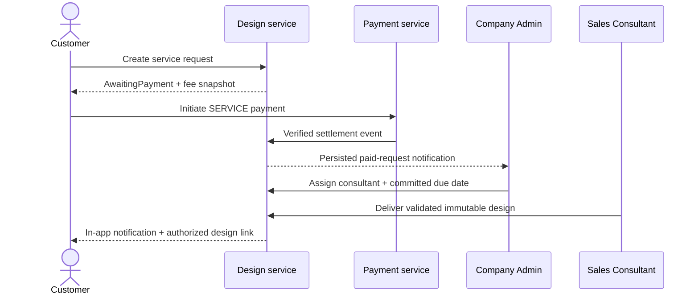

# MFG-05 — Product Design and Design Service

**Contract:** Complete-system target. All listed functions are in scope. Decisions D01–D05 and D11–D12 in [system-decisions.md](../docs/system-decisions.md) govern shared behavior. Human facts, if later supplied, belong only in [user-input-needed.md](../docs/user-input-needed.md).

## Purpose, actors, and boundary

Customers configure a company product, preview and save versioned designs, inspect their own saved designs, and optionally request paid design work. Sales Consultants deliver designs only for requests assigned to them. Company Admin assigns paid requests and establishes a committed due date. Payment settlement belongs to MFG-06; this module consumes its authoritative settlement event and does not process payment callbacks. Product rule authoring belongs to MFG-04; this module validates against its active version. Order creation and immutable order snapshots belong to MFG-06.

Every record is company-scoped. Customer calls require ownership; consultant calls require active same-company membership and assignment; Company Admin calls require same-company membership. Server enforces access: 401 unauthenticated, 403 prohibited, 404 inaccessible IDs. Submitted customer/company/role values are ignored in favor of session identity.

## Entities and state

`Design`: UUID id, company_id, customer_id, product_id, product_version, version, status (Draft, Saved, Delivered), options_json, print_assets[], preview_asset_id, created_at, updated_at. Each save creates an immutable version; edits to ordered designs fork a version and never mutate an order snapshot. Only Saved and Delivered versions may be ordered.

`DesignRequest`: UUID id, company_id, customer_id, product_id, requirements (20–5000 chars), attachment_ids (0–5 private safe image assets), requested_deadline, committed_due_at nullable, fee_vnd integer (default 200000, snapshotted), status, assigned_consultant_id nullable, version, created_at, updated_at. States: AwaitingPayment → Paid → Assigned → InProgress → Delivered; AwaitingPayment → Cancelled/Expired; Paid while unassigned → Cancelled with full refund. No assignment before Paid; cancellation after assignment is rejected.

Design-request lifecycle operations: customer may cancel an own AwaitingPayment request, or a Paid request before assignment, by submitting `request_id`, `expected_version`, `reason` (optional, 1–500 chars) and Idempotency-Key. Cancellation atomically sets Cancelled; for Paid, MFG-06 creates a full SERVICE refund intent. Assignment or later state returns 409. A scheduled expiration after 24 hours changes still-AwaitingPayment to Expired. Company Admin assigns through MFG-08/F-ORD-003, which atomically sets the customer's assigned consultant, request assignee and committed_due_at; F-DES-009 then lists only assigned actionable requests.

`Consultation` is a separate CRM record: id, company_id, customer_id, consultant_id, notes, related request/order IDs, status New → Contacted → InProgress → ClosedWon/ClosedLost. Reopen a closed record only as Company Admin. Consultation outcomes never alter order status. Internal notes are visible only to assigned consultant and Company Admin.

## Function contracts and functional requirements

| FR / function | Inputs and output | Validation, effect, and failure |
|---|---|---|
| FR-001 / F-DES-001 Design Workspace | Route `product_id`; output design view model with active product version, supported options, 2D canvas and print-area coordinates. | Product must be Published and belong to selected company. No request body. Inaccessible/unavailable product returns 404; loading/error states retain route. 3D is not required. |
| FR-002 / F-DES-002 Preview Logic | `design_id?`, `product_id`, options object, asset UUIDs; output compatibility result and preview asset UUID. | Validate each option against current product rules, asset ownership/access, supported MIME and image bounds. Reject incompatible combinations with 422 field errors; changed product version invalidates preview and requests review. Unsafe files rejected. Preview is non-persistent until saved. |
| FR-003 / F-DES-003 Save Design Logic | `configuration_json`, authenticated customer session, `product_id`, expected product/design version, Idempotency-Key; output `saved_design_id`, version, asset UUID/private expiring URL. | Validate against D04 and D02; customer_id comes from session. Transaction stores design/version and assets. Stale version 409; invalid rules 422; same key/payload replays result; changed payload with same key 409. |
| FR-004 / F-DES-004 Saved Designs List | Customer route/query with page, page_size, allowlisted sort/filter; output gallery view model `items,total,page,page_size`. | Own saved/delivered designs only, company scoped; drafts excluded unless explicitly viewing own editor drafts. Invalid pagination 400. Empty list is successful. |
| FR-005 / F-DES-005 Request Form | Route product_id and current session; output form view model with requirements, attachment and requested-deadline fields plus snapshotted fee. | Product must be Published; no business write. |
| FR-006 / F-DES-006 Create Request Logic | product_id, requirements, attachment_ids, requested_deadline, expected version, Idempotency-Key; output request record in AwaitingPayment and payable fee. | Trimmed requirements 20–5000 chars; deadline at least 3 calendar days ahead in Asia/Ho_Chi_Minh; 0–5 safe files <=10 MiB each, PNG/JPEG/WebP actual MIME checked/scanned. Create AwaitingPayment before payment initiation; fee defaults 200000 VND and snapshots active config. No notification/assignment until paid. Invalid fields 422; duplicate key replays; company suspended 409. |
| FR-007 / F-DES-007 Update Payment Status | Internal verified SERVICE settlement event with payment_transaction_id and request_id; output updated request and notification event ID. | Only the payment service may invoke. Lock request/payment; exactly-once AwaitingPayment→Paid. Duplicate event returns existing result. Late or cancelled-resource settlement follows D08 refund path; never resurrect request. |
| FR-008 / F-DES-008 Notify Admin Logic | Internal event plus request summary; output durable notification/outbox event ID and delivery state. | Enqueue actionable Company Admin notification transactionally on Paid. In-app inbox is authoritative; email retries per D03 and cannot roll back payment. Deduplicate by event/recipient. |
| FR-009 / F-DES-009 Customer Select View | Consultant session, optional filter, pagination; output assigned paid request list with customer, product, due date and status. | Only requests assigned to this consultant in same company; Company Admin may view the company queue. No unassigned unpaid requests appear. |
| FR-010 / F-DES-010 Push Design Logic | request_id, design payload/assets, expected request version, Idempotency-Key; output immutable Delivered design version and private asset references. | Caller must be assigned active consultant or Company Admin; request must be InProgress (Paid may first be assigned and started by Admin). Validate design against current product rules and asset checks. Store new immutable design version, set Delivered atomically, notify owner through outbox. Stale state 409; invalid design 422. |
| FR-011 / F-DES-011 Notify Customer Logic | Internal delivery event; output notification/outbox event ID. | Notify request owner with authorized design route/private expiring link only after commit. No raw public asset URL or caller-supplied email. Deduplicate; email failure does not undo delivery. |

## Flows and acceptance

Acceptance scenarios: a customer saves a compatible design and sees it in their gallery; an incompatible option or stale product rule is rejected with actionable field errors and no saved state; a service request persists AwaitingPayment before payment and only verified settlement makes it actionable; repeated payment/delivery requests are idempotent; two concurrent deliveries using one version yield one success and one 409; an email outage leaves the in-app notification and delivered design intact; another customer or unassigned consultant receives 404/403 without leaking details; cancellation of an unassigned paid request creates a full refund workflow, while assigned cancellation is rejected.

Screens: S09 product detail is the design entry point; S13 is the design workspace/preview; S15 creates a service request; S16 shows its payment/status; S17 lists owned designs; S18 is the Company Admin request queue; S19 assigns a paid request; S20 lists consultant tasks; S21 displays request context and delivers the final design; S22 starts ordering an eligible design; S38 shows notifications. Shared status, form, and loading/error behavior follows D11. Traceability: F-DES-001..011 and FR-001..011; UC-C02, UC-C03, UC-C04, UC-S03.
