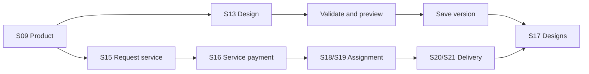
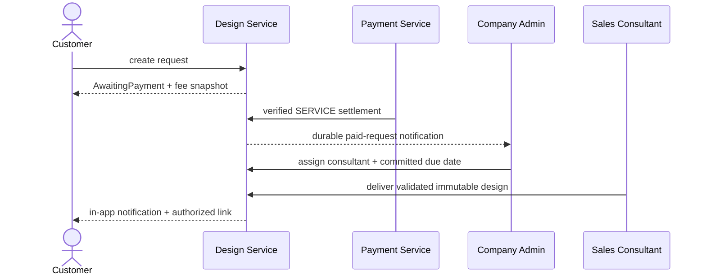

# Spec Document: Product Design

| Field | Value |
| --- | --- |
| Module ID | `MFG-05` |
| Module name | Product Design |
| Spec version | v1.0 |
| Author (team member) | Group B |
| Date | 2026-09-19 |
| Status | Draft |
| Approved by (Client role) | No approver assigned |
| DBIZ2 source | Historical IDs retained: Function List No. 36-46; `F-DES-001` .. `F-DES-011`; `UC-C02` .. `UC-C04`, `UC-S03`; S09, S13, S15-S22, S38. External DBIZ2 comparison is not required. |

---

## 1. Purpose and scope (mandatory)

Customers configure, preview and save versioned product designs and may request paid consultant design work. Self-design/upload/preview/save is MVP Must; paid design service is MVP Could.

**In scope:** validate product options/assets; save immutable design versions; list owned designs; create/cancel paid requests; consume verified settlement; assign via MFG-08; deliver consultant design and notify owner.

**Out of scope:** payment callback processing is MFG-06; product-rule authoring is MFG-04; order creation is MFG-06.

## 2. Actors (mandatory)

| Actor | Role in this module | Where it comes from |
| --- | --- | --- |
| Customer | Creates own designs/requests and views own results | MFG-05 resolved contract; UC-C02/UC-C03/UC-C04 |
| Sales Consultant | Works assigned paid requests | MFG-05 role boundary |
| Company Admin | Views queue, assigns, sets committed due date, may deliver | MFG-05 role boundary |
| Payment/System | Sends verified settlement and durable notifications | MFG-05 function contract |

## 3. User scenarios and acceptance criteria (mandatory)

### US-1 (Must): Design product

Compatible options/assets produce a 2D preview and immutable Saved version. Incompatible/stale rules return actionable 422/409 and persist nothing. Only Saved/Delivered versions are orderable.

### US-2 (Must): Product customization

Every option and print asset is validated against the current Published product version, ownership, actual MIME, scan result and print-area bounds.

### US-3 (Must): View saved design

Customer receives only own same-company Saved/Delivered designs with pagination; empty result is successful. Editing an ordered design forks a version.

### US-4 (Could): Request design service

Valid request creates AwaitingPayment with fee snapshot. Verified SERVICE settlement changes it exactly once to Paid and notifies Company Admin. An unassigned Paid request may cancel with full refund; assignment or later rejects cancellation.

### US-5 (Could): Send design to customer

Assigned consultant/Admin validates and stores an immutable Delivered version, atomically updates request and sends an authorized notification. Concurrent deliveries yield one success and one 409.

### Edge cases

- Another customer or unassigned consultant receives 404/403 without data leakage.
- AwaitingPayment expires after 24 hours; late settlement follows refund flow and never resurrects it.
- Email outage leaves in-app notification/state intact.
- Unsafe/oversized attachments are rejected before persistence.

## 4. Flows (mandatory)

### 4.1 Usage flow

### 4.2 Sequence for the main flow

## 5. Functional requirements (mandatory)

### 5.1 Input / Output contract

| FR ID | DBIZ2 Subfunction ID | Requirement (system MUST ...) | Actor | Priority |
| --- | --- | --- | --- | --- |
| FR-001 | F-DES-001 | Render the design workspace using current Published product rules and options. | Customer | Must |
| FR-002 | F-DES-002 | Validate compatibility/assets and produce a nonpersistent 2D preview. | Customer | Must |
| FR-003 | F-DES-003 | Save an immutable design version transactionally with idempotency. | Customer | Must |
| FR-004 | F-DES-004 | List only the customer's Saved/Delivered designs with pagination. | Customer | Must |
| FR-005 | F-DES-005 | Render the paid design-service request form and fee. | Customer | Could |
| FR-006 | F-DES-006 | Create a validated AwaitingPayment request with fee snapshot and idempotency. | Customer | Could |
| FR-007 | F-DES-007 | Settle a SERVICE request exactly once from a verified internal payment event. | System | Could |
| FR-008 | F-DES-008 | Notify same-company administrators after request payment commits. | System | Could |
| FR-009 | F-DES-009 | List paid requests available to authorized consultants/admins. | Sales Consultant / Company Admin | Could |
| FR-010 | F-DES-010 | Deliver an immutable validated design for an assigned request atomically. | Sales Consultant / Company Admin | Could |
| FR-011 | F-DES-011 | Notify the owning customer after design delivery. | System | Could |

### 5.1 Input / Output contract

| FR ID | Input field | Type | Required | Output field | Type | Notes / validation |
| --- | --- | --- | --- | --- | --- | --- |
| FR-001 | product UUID, session | UUID / session | Yes | S13 workspace model | View model | Published same-company product |
| FR-002 | product/design/options/assets | IDs / configuration | Yes | compatibility and preview UUID | Object | Current rules, ownership, MIME and bounds; 422 incompatible |
| FR-003 | configuration, versions, idempotency key | Object / integers / key | Yes | saved design ID/version | Object | Immutable; stale/key conflict 409 |
| FR-004 | page, filters, sort, session | Integers / values / session | Optional | own design gallery | Paginated object | Saved/Delivered only; empty success |
| FR-005 | product UUID, session | UUID / session | Yes | S15 form and fee | View model | Published product; read only |
| FR-006 | requirements, attachments, deadline, key | Strings / assets / date / key | Yes | AwaitingPayment request | Object | Requirements 20-5000; 0-5 attachments; deadline >=3 days; default 200000 VND |
| FR-007 | verified SERVICE event | Internal event | Yes | Paid request/event | Object | Settle once; late/cancelled event refunded |
| FR-008 | paid event | Internal event | Yes | durable notification | Object | In-app authoritative; deduplicated |
| FR-009 | company/assignment filters, session | Values / session | Optional | authorized paid requests | Paginated object | Same company and assignment |
| FR-010 | request/design/assets/version/key | IDs / values / key | Yes | Delivered immutable design | Object | Assignment/current rules; stale 409 |
| FR-011 | delivery event | Internal event | Yes | notification/outbox ID | UUID | Owner only; private expiring link |

### 5.2 Business rules

| Rule ID | Rule | Why it exists |
| --- | --- | --- |
| BR-001 | Design status is Draft, Saved or Delivered; every save is immutable and ordered designs fork on edit. | Preserve designs referenced by quotes/orders. |
| BR-002 | Request state: AwaitingPayment → Paid → Assigned → InProgress → Delivered; AwaitingPayment → Cancelled/Expired; unassigned Paid → Cancelled + full refund. | Define service request lifecycle. |
| BR-003 | No assignment before Paid; cancellation after assignment is rejected. | Prevent unpaid work and unsafe cancellation. |
| BR-004 | Fee is integer VND, default 200000, snapshotted on creation. | Keep request price stable. |
| BR-005 | Attachments are 0-5 PNG/JPEG/WebP files <=10 MiB each, actual MIME checked/scanned. | Protect users and storage. |
| BR-006 | Consultation CRM state is independent and never changes order status. | Keep sales workflow separate from fulfillment. |

## 6. Key entities (mandatory)

| Entity | Attributes (from Input/Output fields) | Relationships |
| --- | --- | --- |
| Design | company/customer/product IDs, product/design versions, status, options, assets, preview, timestamps | Immutable saved versions; owner/company scoped |
| DesignRequest | company/customer/product, requirements, attachments, deadlines, fee, state, assignee, version | Paid before assignment; optimistic versioning |
| Consultation | company/customer/consultant, notes, related IDs, CRM status | Internal notes visible to assignee/Admin only |
| Notification | event/recipient/type/payload/delivery state | Deduplicated; in-app record authoritative |

## 7. Screens involved

| Screen ID | Screen name | Priority | Screen Spec file |
| --- | --- | --- | --- |
| S09 | Product detail and design entry | Must | `screens/S09-product_detail_screen.md` |
| S13 | Product design workspace | Must | `screens/S13-product_design_tool_screen.md` |
| S17 | Customer designs | Must | `screens/S17-customer_designs_screen.md` |
| S15 | Design service request | Could | `screens/S15-design_service_request_screen.md` |
| S16 | Design service payment | Could | `screens/S16-design_service_payment_screen.md` |
| S18/S19 | Consultation queue and assignment | Could | `screens/S18-consultation_requests_and_customers_screen.md` |
| S20/S21 | Consultant tasks and delivery | Could | `screens/S20-consultant_tasks_and_customers_screen.md` |
| S22 | Order eligible design | Must | `screens/S22-create_order_screen.md` |
| S38 | Notifications | Could | `screens/S38-notification_panel_screen.md` |

## 8. Success criteria (mandatory)

| SC ID | Criterion | How it is measured |
| --- | --- | --- |
| SC-001 | MVP self-design safely saves versioned, orderable work. | Verify rule validation, saved versions and order eligibility. |
| SC-002 | Verified settlement alone makes a paid request actionable. | Confirm request state changes only on verified settlement. |
| SC-003 | Ownership, assignment, idempotency and concurrent delivery are enforced; all functions map to FRs. | Exercise authorization/retry/race cases and compare F-DES IDs with FRs. |

## 9. Assumptions

- DBIZ 3 classroom demo by Group B; no approver; demo business/contact data are fictional samples.
- Self-design is Must; paid design service and consultant workflow are Could.
- 2D preview is required; 3D preview is outside this scope.

## 10. Open questions

| # | Question | Blocking? | Owner | Status |
| --- | --- | --- | --- | --- |
| 1 | Are any design/request state, fee, deadline, cancellation, refund or delivery decisions still undecided? | No | Group B | Resolved — no remaining open questions; sections 3–6 define the complete behavior. |

## 11. Traceability to DBIZ2

Historical IDs are retained; external DBIZ2 comparison is not required.

| Spec section | DBIZ2 source | Location |
| --- | --- | --- |
| Scope and actors | Function List MFG-05 | Rows 36–46; IDs appear in FR table |
| Design/customize | UC-C02; F-DES-001..003 | S13; sections 3 and 5 |
| Saved designs | UC-C03; F-DES-004 | S17; sections 3 and 5 |
| Service request/delivery | UC-C04, UC-S03; F-DES-005..011 | S15-S21; sections 3 and 5 |

## Completion checklist

- [x] Scope, actors, scenarios, flows and edge cases are defined.
- [x] Function, state, entity, screen and ID traceability is complete.
- [x] MVP priorities and demo assumptions are explicit.
- [x] No unresolved placeholders remain.
