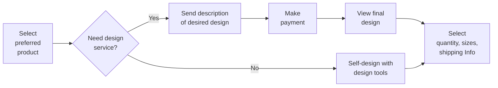
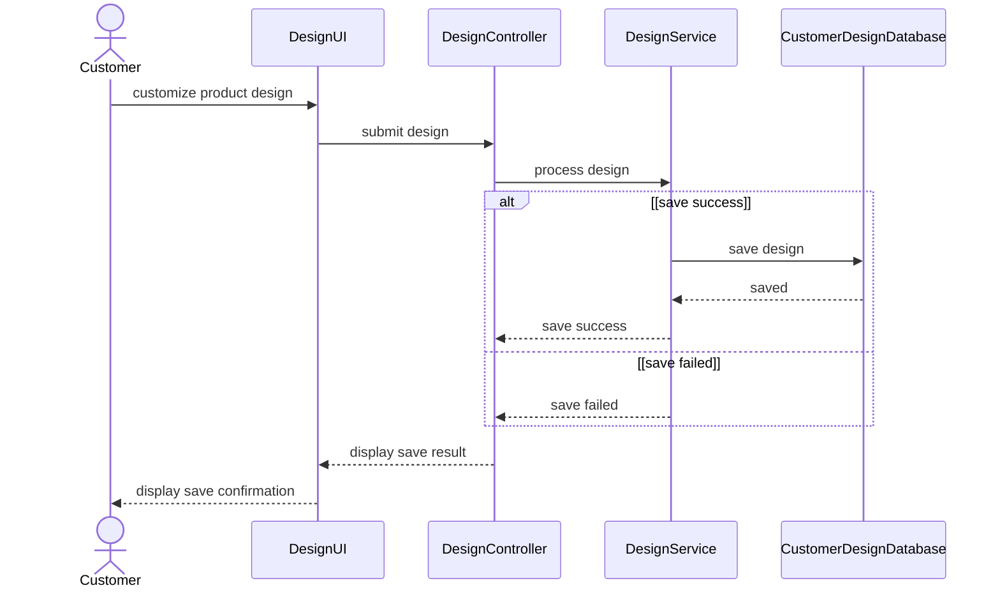
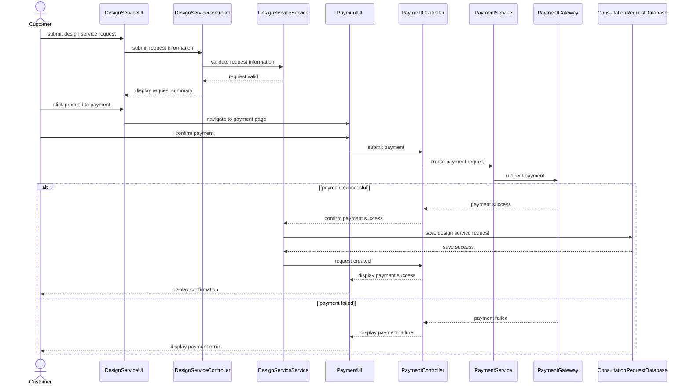
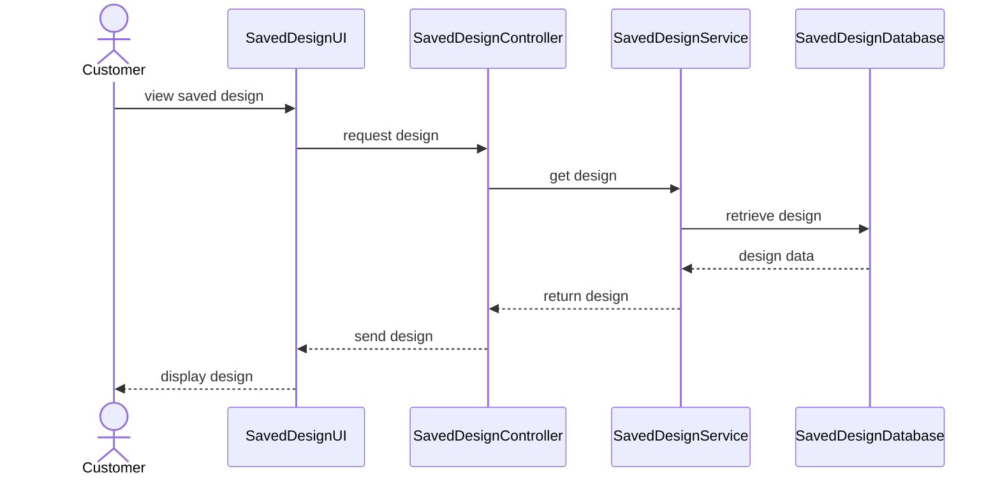

# Spec Document: Product Design

| Field | Value |
| --- | --- |
| Module ID | `MFG-05` |
| Module name | Product Design |
| Spec version | v0.1 |
| Author (team member) | [NEEDS CLARIFICATION: Specify the responsible team member; Group B is named only as the team on the Session 1 scope sheet.] |
| Date | 2026-09-16 |
| Status | Draft |
| Approved by (Client role) | [NEEDS CLARIFICATION: Client approver role and approval are not supplied.] |
| DBIZ2 source | Function List `MFG-05`, No. 36-46, `F-DES-001` .. `F-DES-011`; Use Cases: Design product; Product Customization; View saved design; Request design service; Send design to customer; [NEEDS CLARIFICATION: Use Case IDs are not visible in the supplied table.]; Screens: `S09`, `S13`, `S15`, `S16`, `S17`, `S18`, `S20`, `S21`, `S22`, `S38` |

---

## 1. Purpose and scope (mandatory)

Customers can customize a base product, preview it, and retain their designs for later ordering. They can alternatively request a paid design service and receive a finished design from a sales consultant.

Source: [docs/function-list.md](../docs/function-list.md), `MFG-05` (No. 36-46); Session 1 MVP PDF, page 1 section 3. [NEEDS CLARIFICATION: Original DBIZ2 Schematic 1.1/1.2 cells are unavailable; the PDF reproduces the project objective but is not Session 3 MVP Scope v3.]

**In scope**

- Design Product
- View Designs
- Request Service
- Send Design

Session 1 marks self-design, artwork upload, preview and save as Must; paid design service is Could. Saved-design viewing and consultant delivery are not individually prioritized. All DBIZ2 subfunctions below are retained as documentation; this does not authorize release of deferred functions. [NEEDS CLARIFICATION: Supply MVP Scope v3 and Session 3 decisions to confirm current module scope.]

**Out of scope**

- Production order creation and payment belong to MFG-06; S16 explicitly limits its payment to the design service.
- Consultant assignment is specified under MFG-08.

**Depends on**

- MFG-04: a selected base product (`base_product_id`, F-DES-001).
- MFG-06/payment participants and Payment Gateway: paid design service sequence SD-05B. [NEEDS CLARIFICATION: Confirm whether design-service payment is owned by MFG-06; F-PAY contracts explicitly describe order payments.]
- MFG-08: consultant request context and delivery are connected through S21; [NEEDS CLARIFICATION: Confirm the exact ownership boundary of S21 between assignment and sending designs.]

## 2. Actors (mandatory)

| Actor | Role in this module | Where it comes from |
| --- | --- | --- |
| Customer | Primary — Design Product, View Designs, Request Service | Function List `Actor` column, `MFG-05`: F-DES-001, F-DES-002, F-DES-003, F-DES-004, F-DES-005, F-DES-006, F-DES-007, F-DES-008 |
| Sales Consultant | Primary — Send Design | Function List `Actor` column, `MFG-05`: F-DES-009, F-DES-010, F-DES-011 |

Primary identifies the actor performing the listed subfunctions; it does not replace conflicting Use Case or sequence labels. External participants appear in section 4 only when supplied by the source.

## 3. User scenarios and acceptance criteria (mandatory)

[NEEDS CLARIFICATION: P1/P2 scenario ordering is not agreed in the supplied materials; no scenario priority is inferred from Function List High/Medium/Low.]

### US-1 ([NEEDS CLARIFICATION: Scenario priority not agreed.]): Design product

**Journey.** As a `Customer`, I want to `design product`, so that [NEEDS CLARIFICATION: The Use Case names the goal but does not state a separate scenario benefit.].

Source: `docs/architecture/use-case.md`, line 14, “Design product”; related FRs `FR-001` / `F-DES-001`, `FR-002` / `F-DES-002`, `FR-003` / `F-DES-003`. Actor association in the Use Case: [NEEDS CLARIFICATION: no direct actor association shown].

**Acceptance scenarios**

1. **Given** the customer has selected a preferred product, **When** the customer chooses No at Need design service?, **Then** the customer proceeds to Self-design with design tools and then quantity, sizes and shipping information.
2. **Given** a design is being saved, **When** saving fails, **Then** save failed is returned to DesignController (SD-05A); [NEEDS CLARIFICATION: SD-05A still labels the final display save confirmation; confirm the user-visible failure outcome.].

### US-2 ([NEEDS CLARIFICATION: Scenario priority not agreed.]): Product Customization

**Journey.** As a `Customer`, I want to `product customization`, so that [NEEDS CLARIFICATION: The Use Case names the goal but does not state a separate scenario benefit.].

Source: `docs/architecture/use-case.md`, line 15, “Product Customization”; related FRs `FR-001` / `F-DES-001`, `FR-002` / `F-DES-002`, `FR-003` / `F-DES-003`, `FR-004` / `F-DES-004`, `FR-005` / `F-DES-005`, `FR-006` / `F-DES-006`, `FR-007` / `F-DES-007`, `FR-008` / `F-DES-008`.

**Acceptance scenarios**

1. **Given** the customer has selected a preferred product, **When** the customer chooses the design-service branch or the self-design branch, **Then** the chosen branch reaches quantity, sizes and shipping information through the supplied path.

### US-3 ([NEEDS CLARIFICATION: Scenario priority not agreed.]): View saved design

**Journey.** As a `Customer`, I want to `view saved design`, so that [NEEDS CLARIFICATION: The Use Case names the goal but does not state a separate scenario benefit.].

Source: `docs/architecture/use-case.md`, line 16, “View saved design”; related FRs `FR-004` / `F-DES-004`. Actor association in the Use Case: [NEEDS CLARIFICATION: no direct actor association shown].

**Acceptance scenarios**

1. **Given** a customer has a saved design, **When** the customer requests View saved design, **Then** the saved design is displayed.

### US-4 ([NEEDS CLARIFICATION: Scenario priority not agreed.]): Request design service

**Journey.** As a `Customer`, I want to `request design service`, so that [NEEDS CLARIFICATION: The Use Case names the goal but does not state a separate scenario benefit.].

Source: `docs/architecture/use-case.md`, line 17, “Request design service”; related FRs `FR-005` / `F-DES-005`, `FR-006` / `F-DES-006`, `FR-007` / `F-DES-007`, `FR-008` / `F-DES-008`. Actor association in the Use Case: [NEEDS CLARIFICATION: no direct actor association shown].

**Acceptance scenarios**

1. **Given** the customer has selected a preferred product, **When** the customer chooses Yes at Need design service?, **Then** the customer sends a description, makes the design payment and views the final design before entering order details.
2. **Given** the customer confirms the design-service payment, **When** payment fails, **Then** a payment error is displayed (SD-05B).
3. **Given** the customer confirms the design-service payment, **When** payment succeeds, **Then** SD-05B saves the request and displays confirmation; [NEEDS CLARIFICATION: Reconcile this with F-DES-006 creating the request before payment.].

### US-5 ([NEEDS CLARIFICATION: Scenario priority not agreed.]): Send design to customer

**Journey.** As a `Sales Consultant`, I want to `send design to customer`, so that [NEEDS CLARIFICATION: The Use Case names the goal but does not state a separate scenario benefit.].

Source: `docs/architecture/use-case.md`, line 28, “Send design to customer”; related FRs `FR-009` / `F-DES-009`, `FR-010` / `F-DES-010`, `FR-011` / `F-DES-011`.

[NEEDS CLARIFICATION: No detailed Usage Flow or sequence for this use case is supplied; the criterion records the named goal and any explicitly cited Function List outcome. Confirm preconditions, action sequence and failure behavior before treating it as an agreed acceptance test.]

**Acceptance scenarios**

1. **Given** the sales consultant has a finished design for the customer, **When** the consultant sends the design to the customer, **Then** the finished file is assigned to the customer workspace and a design-ready notification is sent (F-DES-010/F-DES-011).

### Edge cases

- [NEEDS CLARIFICATION: Document missing/invalid inputs and empty-data outcomes not already covered by the supplied screens or sequences.]
- [NEEDS CLARIFICATION: Document behavior when a required external service or data operation is unavailable; do not infer retries or fallback paths.]
- [NEEDS CLARIFICATION: Document repeated actions and simultaneous-user outcomes; no concurrency or duplicate-submission rule is supplied.]

## 4. Flows (mandatory)

### 4.1 Usage flow

Exact module-relevant excerpt from `docs/architecture/usage-flow.md`. Boundary nodes retain cross-module context; all included decisions keep both branches. Original node names, labels and connector types are unchanged. This is a subset of the supplied overall journey, not a replacement flow.

[NEEDS CLARIFICATION: The original DBIZ2 Usage Flow image is not supplied; verify this transcription against the original figure before approving the diagram checklist.]

### 4.2 Sequence for the main flow

**SD-05A: Self Design Product**

**SD-05B: Request Design Service**

**SD-06: View Saved Design**

Copied unchanged from `docs/architecture/sequence.md`; participants and messages are source text. Cross-module participants remain to preserve the supplied interaction. [NEEDS CLARIFICATION: Confirm which supplied sequence is the agreed main flow; sequences for other listed use cases are not available.]

## 5. Functional requirements (mandatory)

One FR per original Function List subfunction, in source order. FR IDs are local to this module; cite `MFG-05/FR-nnn` with the unchanged Subfunction ID. Original function names and High/Medium/Low values are preserved in each requirement note. MoSCoW values are used only for capabilities explicitly prioritized on page 2 of the Session 1 PDF; [NEEDS CLARIFICATION: Confirm per-subfunction priority mapping and the current Session 3 release scope.]

| FR ID | DBIZ2 Subfunction ID | Requirement (system MUST ...) | Actor | Priority |
| --- | --- | --- | --- | --- |
| FR-001 | F-DES-001 | The system MUST display a visual design interface allowing customization of colors and materials. DBIZ2 function: Design Product; subfunction: Design Workspace; category: Screen; original priority: High. | Customer | Must |
| FR-002 | F-DES-002 | The system MUST check compatibility rules and generate a real-time preview image of the product. DBIZ2 function: Design Product; subfunction: Preview Logic; category: Process; original priority: High. | Customer | Must |
| FR-003 | F-DES-003 | The system MUST save the customer's custom design configuration into the database. DBIZ2 function: Design Product; subfunction: Save Design Logic; category: Process; original priority: High. | Customer | Must |
| FR-004 | F-DES-004 | The system MUST display a list of design templates the user has previously saved. DBIZ2 function: View Designs; subfunction: Saved Designs List; category: Screen; original priority: Medium. | Customer | [NEEDS CLARIFICATION: No agreed Must/Should/Could priority for this subfunction; preserve the original DBIZ2 priority in the source note.] |
| FR-005 | F-DES-005 | The system MUST display a form for customers to enter special design service requirements. DBIZ2 function: Request Service; subfunction: Request Form; category: Screen; original priority: Medium. | Customer | Could |
| FR-006 | F-DES-006 | The system MUST create a new design service request record and await payment processing. DBIZ2 function: Request Service; subfunction: Create Request Logic; category: Process; original priority: Medium. | Customer | Could |
| FR-007 | F-DES-007 | The system MUST update the design request status to "Paid" upon successful transaction. DBIZ2 function: Request Service; subfunction: Update Payment Status; category: Process; original priority: High. | Customer | Could |
| FR-008 | F-DES-008 | The system MUST send an email notification to the Admin when a new design request is created. DBIZ2 function: Request Service; subfunction: Notify Admin Logic; category: Process; original priority: Medium. | Customer | Could |
| FR-009 | F-DES-009 | The system MUST display a list of customers waiting to receive completed designs from the Admin. DBIZ2 function: Send Design; subfunction: Customer Select View; category: Screen; original priority: Medium. | Sales Consultant | [NEEDS CLARIFICATION: No agreed Must/Should/Could priority for this subfunction; preserve the original DBIZ2 priority in the source note.] |
| FR-010 | F-DES-010 | The system MUST save and assign the finished design file to the customer's workspace. DBIZ2 function: Send Design; subfunction: Push Design Logic; category: Process; original priority: High. | Sales Consultant | [NEEDS CLARIFICATION: No agreed Must/Should/Could priority for this subfunction; preserve the original DBIZ2 priority in the source note.] |
| FR-011 | F-DES-011 | The system MUST send a notification informing the customer that the design is ready for viewing. DBIZ2 function: Send Design; subfunction: Notify Customer Logic; category: Process; original priority: Medium. | Sales Consultant | [NEEDS CLARIFICATION: No agreed Must/Should/Could priority for this subfunction; preserve the original DBIZ2 priority in the source note.] |

### 5.1 Input / Output contract

Literal Function List field names, types and required flags are preserved. Input and output rows are separate to avoid inventing field-to-field pairings. The template Required column applies to inputs; output required flags appear in Notes / validation. `—` means that side of this row is not applicable, not that a source field was omitted. Object contents, validation ranges and identifier formats are not inferred. [NEEDS CLARIFICATION: Supply nested Object/JSON/Array schemas and field validation where absent; apparent source type errors remain unchanged until clarified.]

| FR ID | Input field | Type | Required | Output field | Type | Notes / validation |
| --- | --- | --- | --- | --- | --- | --- |
| FR-001 | `base_product_id` | String | Yes | — | — | Function List No. 36, F-DES-001, Input column. |
| FR-001 | — | — | — | `interactive_canvas_3d_configurator_ui` | [NEEDS CLARIFICATION: F-DES-001 output interactive_canvas_3d_configurator_ui: UI representation type.] | Output required: Yes. Function List No. 36, F-DES-001, Output column. |
| FR-002 | `selected_options` | [NEEDS CLARIFICATION: F-DES-002 input selected_options: data type.] | Yes | — | — | Function List No. 37, F-DES-002, Input column. |
| FR-002 | — | — | — | `rendered_image_model` | File | Output required: Yes. Function List No. 37, F-DES-002, Output column. |
| FR-002 | — | — | — | `validation` | [NEEDS CLARIFICATION: F-DES-002 output validation: data type.] | Output required: Yes. Function List No. 37, F-DES-002, Output column. |
| FR-003 | `configuration_json` | JSON | Yes | — | — | Function List No. 38, F-DES-003, Input column. |
| FR-003 | `customer_id` | String | Yes | — | — | Function List No. 38, F-DES-003, Input column. |
| FR-003 | — | — | — | `saved_design_id` | String | Output required: Yes. Function List No. 38, F-DES-003, Output column. |
| FR-003 | — | — | — | `storage_url` | URL | Output required: Yes. Function List No. 38, F-DES-003, Output column. |
| FR-004 | `customer_id` | String | Yes | — | — | Function List No. 39, F-DES-004, Input column. |
| FR-004 | — | — | — | `gallery_of_saved_designs` | [NEEDS CLARIFICATION: F-DES-004 output gallery_of_saved_designs: UI representation type.] | Output required: Yes. Function List No. 39, F-DES-004, Output column. |
| FR-005 | [NEEDS CLARIFICATION: F-DES-005 input: no field specified.] | — | [NEEDS CLARIFICATION: F-DES-005: input required flag unavailable.] | — | — | Function List No. 40, F-DES-005, Input column |
| FR-005 | — | — | — | `service_request_form_ui` | [NEEDS CLARIFICATION: F-DES-005 output service_request_form_ui: UI representation type.] | Output required: Yes. Function List No. 40, F-DES-005, Output column. |
| FR-006 | `requirement_text` | String | Yes | — | — | Function List No. 41, F-DES-006, Input column. |
| FR-006 | `attached_ref_images` | Array<File> | No | — | — | Function List No. 41, F-DES-006, Input column. |
| FR-006 | `deadline` | DateTime | Yes | — | — | Function List No. 41, F-DES-006, Input column. |
| FR-006 | — | — | — | `new_request_record` | Object | Output required: Yes. Function List No. 41, F-DES-006, Output column. |
| FR-007 | `payment_transaction_id` | String | Yes | — | — | Function List No. 42, F-DES-007, Input column. |
| FR-007 | `request_id` | String | Yes | — | — | Function List No. 42, F-DES-007, Input column. |
| FR-007 | — | — | — | `status_update:_paid` | String | Output required: Yes. Function List No. 42, F-DES-007, Output column. |
| FR-007 | — | — | — | `trigger_notification` | [NEEDS CLARIFICATION: F-DES-007 output trigger_notification: data type.] | Output required: Yes. Function List No. 42, F-DES-007, Output column. |
| FR-008 | `request_details_object` | Object | Yes | — | — | Function List No. 43, F-DES-008, Input column. |
| FR-008 | — | — | — | `email_to_admin_group` | String | Output required: Yes. Function List No. 43, F-DES-008, Output column. |
| FR-009 | `filter` | String | No | — | — | Function List No. 44, F-DES-009, Input column. |
| FR-009 | — | — | — | `list_of_customers_requests` | Array<Object> | Output required: Yes. Function List No. 44, F-DES-009, Output column. |
| FR-010 | `design_file` | File | Yes | — | — | Function List No. 45, F-DES-010, Input column. |
| FR-010 | `customer_id` | String | Yes | — | — | Function List No. 45, F-DES-010, Input column. |
| FR-010 | `request_id` | String | Yes | — | — | Function List No. 45, F-DES-010, Input column. |
| FR-010 | — | — | — | `file_stored` | File | Output required: Yes. Function List No. 45, F-DES-010, Output column. |
| FR-010 | — | — | — | `link_generated` | [NEEDS CLARIFICATION: F-DES-010 output link_generated: data type.] | Output required: Yes. Function List No. 45, F-DES-010, Output column. |
| FR-010 | — | — | — | `request_closed` | [NEEDS CLARIFICATION: F-DES-010 output request_closed: data type.] | Output required: Yes. Function List No. 45, F-DES-010, Output column. |
| FR-011 | `customer_email` | String | Yes | — | — | Function List No. 46, F-DES-011, Input column. |
| FR-011 | `design_link` | [NEEDS CLARIFICATION: F-DES-011 input design_link: data type.] | Yes | — | — | Function List No. 46, F-DES-011, Input column. |
| FR-011 | — | — | — | `notification_sent` | String | Output required: Yes. Function List No. 46, F-DES-011, Output column. |

### 5.2 Business rules

| Rule ID | Rule | Why it exists |
| --- | --- | --- |
| BR-001 | A design-service request requires requirement_text and deadline; attached_ref_images are optional. | F-DES-006 Input column; also S15 section 6. Business rationale beyond the stated source is not separately documented. |
| BR-002 | Design-service payment applies only to the design service; production orders are paid later. | S16 section 6 SR-001. Business rationale beyond the stated source is not separately documented. |
| BR-003 | A successful design-service transaction updates the request status to Paid. | F-DES-007; creation timing conflicts with SD-05B and is left open. Business rationale beyond the stated source is not separately documented. |

## 6. Key entities (mandatory)

| Entity | Attributes (from Input/Output fields) | Relationships |
| --- | --- | --- |
| Design | `base_product_id`, `selected_options`, `rendered_image_model`, `validation`, `configuration_json`, `customer_id`, `saved_design_id`, `storage_url`, `design_file`, `file_stored`, `design_link` | [NEEDS CLARIFICATION: Design: relationship cardinalities and nested field ownership are not specified in the Input/Output contract.] |
| Design-service request | `requirement_text`, `attached_ref_images`, `deadline`, `new_request_record`, `payment_transaction_id`, `request_id`, `status_update:_paid`, `request_details_object`, `request_closed` | [NEEDS CLARIFICATION: Design-service request: relationship cardinalities and nested field ownership are not specified in the Input/Output contract.] |

Names above group the literal section 5.1 fields for discussion. They do not introduce tables, extra attributes, foreign keys or relationship cardinalities.

## 7. Screens involved

| Screen ID | Screen name | Priority | Screen Spec file |
| --- | --- | --- | --- |
| S09 | Product Detail Screen — Shared screen / navigation boundary | [NEEDS CLARIFICATION: S09: Screen List provides no agreed Must/Should priority.] | `screens/S09-product_detail_screen.md` ([open](../screens/S09-product_detail_screen.md)) |
| S13 | Product Design Tool Screen — Direct module screen | [NEEDS CLARIFICATION: S13: Screen List provides no agreed Must/Should priority.] | `screens/S13-product_design_tool_screen.md` ([open](../screens/S13-product_design_tool_screen.md)) |
| S15 | Design Service Request Screen — Direct module screen | [NEEDS CLARIFICATION: S15: Screen List provides no agreed Must/Should priority.] | `screens/S15-design_service_request_screen.md` ([open](../screens/S15-design_service_request_screen.md)) |
| S16 | Design Service Payment Screen — Direct module screen | [NEEDS CLARIFICATION: S16: Screen List provides no agreed Must/Should priority.] | `screens/S16-design_service_payment_screen.md` ([open](../screens/S16-design_service_payment_screen.md)) |
| S17 | Customer Designs Screen — Direct module screen | [NEEDS CLARIFICATION: S17: Screen List provides no agreed Must/Should priority.] | `screens/S17-customer_designs_screen.md` ([open](../screens/S17-customer_designs_screen.md)) |
| S18 | Consultation Request List Screen (Company Admin) — Shared screen / navigation boundary | [NEEDS CLARIFICATION: S18: Screen List provides no agreed Must/Should priority.] | [NEEDS CLARIFICATION: S18: no Screen Spec file supplied; do not invent a screen-spec filename.] |
| S20 | Consultant Task List Screen — Shared screen / navigation boundary | [NEEDS CLARIFICATION: S20: Screen List provides no agreed Must/Should priority.] | [NEEDS CLARIFICATION: S20: no Screen Spec file supplied; do not invent a screen-spec filename.] |
| S21 | Consultation Detail Screen (Consultant) — Direct module screen | [NEEDS CLARIFICATION: S21: Screen List provides no agreed Must/Should priority.] | [NEEDS CLARIFICATION: S21: no Screen Spec file supplied; do not invent a screen-spec filename.] |
| S22 | Create Order Screen — Shared screen / navigation boundary | [NEEDS CLARIFICATION: S22: Screen List provides no agreed Must/Should priority.] | `screens/S22-create_order_screen.md` ([open](../screens/S22-create_order_screen.md)) |
| S38 | Notification Panel Screen — Shared screen / navigation boundary | [NEEDS CLARIFICATION: S38: Screen List provides no agreed Must/Should priority.] | [NEEDS CLARIFICATION: S38: no Screen Spec file supplied; do not invent a screen-spec filename.] |

Existing descriptive filenames are retained. Business navigation and notification-panel touchpoints are listed as shared boundaries; this module does not acquire their owning requirements. Screen Specs contain pre-existing “module spec unavailable” notes: these are resolved as file-existence issues by this delivery, not as behavioral approvals.

## 8. Success criteria (mandatory)

| SC ID | Criterion | How it is measured |
| --- | --- | --- |
| SC-001 | [NEEDS CLARIFICATION: No agreed measurable user-outcome success criterion is present in the supplied Session 1 scope sheet or DBIZ2 extracts; provide the Session 3 criterion for this module.] | [NEEDS CLARIFICATION: Confirm the user task, observable completion outcome, agreed target and evaluation method; none is supplied.] |

The source states feature priorities and project goals, not agreed outcome thresholds. No timing, conversion, cost-saving or technical-performance target is introduced.

## 9. Assumptions

- No separate module assumption is explicitly documented in the supplied sources. No assumption has been added to fill missing requirements.

## 10. Open questions

| # | Question | Blocking? | Owner | Status |
| --- | --- | --- | --- | --- |
| 1 | [NEEDS CLARIFICATION: Specify the responsible team member; Group B is named only as the team on the Session 1 scope sheet.] | Unassessed; see final question | Unassigned; see final question | Open |
| 2 | [NEEDS CLARIFICATION: Client approver role and approval are not supplied.] | Unassessed; see final question | Unassigned; see final question | Open |
| 3 | [NEEDS CLARIFICATION: Use Case IDs are not visible in the supplied table.] | Unassessed; see final question | Unassigned; see final question | Open |
| 4 | [NEEDS CLARIFICATION: Original DBIZ2 Schematic 1.1/1.2 cells are unavailable; the PDF reproduces the project objective but is not Session 3 MVP Scope v3.] | Unassessed; see final question | Unassigned; see final question | Open |
| 5 | [NEEDS CLARIFICATION: Supply MVP Scope v3 and Session 3 decisions to confirm current module scope.] | Unassessed; see final question | Unassigned; see final question | Open |
| 6 | [NEEDS CLARIFICATION: Confirm whether design-service payment is owned by MFG-06; F-PAY contracts explicitly describe order payments.] | Unassessed; see final question | Unassigned; see final question | Open |
| 7 | [NEEDS CLARIFICATION: Confirm the exact ownership boundary of S21 between assignment and sending designs.] | Unassessed; see final question | Unassigned; see final question | Open |
| 8 | [NEEDS CLARIFICATION: P1/P2 scenario ordering is not agreed in the supplied materials; no scenario priority is inferred from Function List High/Medium/Low.] | Unassessed; see final question | Unassigned; see final question | Open |
| 9 | [NEEDS CLARIFICATION: Scenario priority not agreed.] | Unassessed; see final question | Unassigned; see final question | Open |
| 10 | [NEEDS CLARIFICATION: The Use Case names the goal but does not state a separate scenario benefit.] | Unassessed; see final question | Unassigned; see final question | Open |
| 11 | [NEEDS CLARIFICATION: no direct actor association shown] | Unassessed; see final question | Unassigned; see final question | Open |
| 12 | [NEEDS CLARIFICATION: SD-05A still labels the final display save confirmation; confirm the user-visible failure outcome.] | Unassessed; see final question | Unassigned; see final question | Open |
| 13 | [NEEDS CLARIFICATION: Reconcile this with F-DES-006 creating the request before payment.] | Unassessed; see final question | Unassigned; see final question | Open |
| 14 | [NEEDS CLARIFICATION: No detailed Usage Flow or sequence for this use case is supplied; the criterion records the named goal and any explicitly cited Function List outcome. Confirm preconditions, action sequence and failure behavior before treating it as an agreed acceptance test.] | Unassessed; see final question | Unassigned; see final question | Open |
| 15 | [NEEDS CLARIFICATION: Document missing/invalid inputs and empty-data outcomes not already covered by the supplied screens or sequences.] | Unassessed; see final question | Unassigned; see final question | Open |
| 16 | [NEEDS CLARIFICATION: Document behavior when a required external service or data operation is unavailable; do not infer retries or fallback paths.] | Unassessed; see final question | Unassigned; see final question | Open |
| 17 | [NEEDS CLARIFICATION: Document repeated actions and simultaneous-user outcomes; no concurrency or duplicate-submission rule is supplied.] | Unassessed; see final question | Unassigned; see final question | Open |
| 18 | [NEEDS CLARIFICATION: The original DBIZ2 Usage Flow image is not supplied; verify this transcription against the original figure before approving the diagram checklist.] | Unassessed; see final question | Unassigned; see final question | Open |
| 19 | [NEEDS CLARIFICATION: Confirm which supplied sequence is the agreed main flow; sequences for other listed use cases are not available.] | Unassessed; see final question | Unassigned; see final question | Open |
| 20 | [NEEDS CLARIFICATION: Confirm per-subfunction priority mapping and the current Session 3 release scope.] | Unassessed; see final question | Unassigned; see final question | Open |
| 21 | [NEEDS CLARIFICATION: No agreed Must/Should/Could priority for this subfunction; preserve the original DBIZ2 priority in the source note.] | Unassessed; see final question | Unassigned; see final question | Open |
| 22 | [NEEDS CLARIFICATION: Supply nested Object/JSON/Array schemas and field validation where absent; apparent source type errors remain unchanged until clarified.] | Unassessed; see final question | Unassigned; see final question | Open |
| 23 | [NEEDS CLARIFICATION: F-DES-001 output interactive_canvas_3d_configurator_ui: UI representation type.] | Unassessed; see final question | Unassigned; see final question | Open |
| 24 | [NEEDS CLARIFICATION: F-DES-002 input selected_options: data type.] | Unassessed; see final question | Unassigned; see final question | Open |
| 25 | [NEEDS CLARIFICATION: F-DES-002 output validation: data type.] | Unassessed; see final question | Unassigned; see final question | Open |
| 26 | [NEEDS CLARIFICATION: F-DES-004 output gallery_of_saved_designs: UI representation type.] | Unassessed; see final question | Unassigned; see final question | Open |
| 27 | [NEEDS CLARIFICATION: F-DES-005 input: no field specified.] | Unassessed; see final question | Unassigned; see final question | Open |
| 28 | [NEEDS CLARIFICATION: F-DES-005: input required flag unavailable.] | Unassessed; see final question | Unassigned; see final question | Open |
| 29 | [NEEDS CLARIFICATION: F-DES-005 output service_request_form_ui: UI representation type.] | Unassessed; see final question | Unassigned; see final question | Open |
| 30 | [NEEDS CLARIFICATION: F-DES-007 output trigger_notification: data type.] | Unassessed; see final question | Unassigned; see final question | Open |
| 31 | [NEEDS CLARIFICATION: F-DES-010 output link_generated: data type.] | Unassessed; see final question | Unassigned; see final question | Open |
| 32 | [NEEDS CLARIFICATION: F-DES-010 output request_closed: data type.] | Unassessed; see final question | Unassigned; see final question | Open |
| 33 | [NEEDS CLARIFICATION: F-DES-011 input design_link: data type.] | Unassessed; see final question | Unassigned; see final question | Open |
| 34 | [NEEDS CLARIFICATION: Design: relationship cardinalities and nested field ownership are not specified in the Input/Output contract.] | Unassessed; see final question | Unassigned; see final question | Open |
| 35 | [NEEDS CLARIFICATION: Design-service request: relationship cardinalities and nested field ownership are not specified in the Input/Output contract.] | Unassessed; see final question | Unassigned; see final question | Open |
| 36 | [NEEDS CLARIFICATION: S09: Screen List provides no agreed Must/Should priority.] | Unassessed; see final question | Unassigned; see final question | Open |
| 37 | [NEEDS CLARIFICATION: S13: Screen List provides no agreed Must/Should priority.] | Unassessed; see final question | Unassigned; see final question | Open |
| 38 | [NEEDS CLARIFICATION: S15: Screen List provides no agreed Must/Should priority.] | Unassessed; see final question | Unassigned; see final question | Open |
| 39 | [NEEDS CLARIFICATION: S16: Screen List provides no agreed Must/Should priority.] | Unassessed; see final question | Unassigned; see final question | Open |
| 40 | [NEEDS CLARIFICATION: S17: Screen List provides no agreed Must/Should priority.] | Unassessed; see final question | Unassigned; see final question | Open |
| 41 | [NEEDS CLARIFICATION: S18: Screen List provides no agreed Must/Should priority.] | Unassessed; see final question | Unassigned; see final question | Open |
| 42 | [NEEDS CLARIFICATION: S18: no Screen Spec file supplied; do not invent a screen-spec filename.] | Unassessed; see final question | Unassigned; see final question | Open |
| 43 | [NEEDS CLARIFICATION: S20: Screen List provides no agreed Must/Should priority.] | Unassessed; see final question | Unassigned; see final question | Open |
| 44 | [NEEDS CLARIFICATION: S20: no Screen Spec file supplied; do not invent a screen-spec filename.] | Unassessed; see final question | Unassigned; see final question | Open |
| 45 | [NEEDS CLARIFICATION: S21: Screen List provides no agreed Must/Should priority.] | Unassessed; see final question | Unassigned; see final question | Open |
| 46 | [NEEDS CLARIFICATION: S21: no Screen Spec file supplied; do not invent a screen-spec filename.] | Unassessed; see final question | Unassigned; see final question | Open |
| 47 | [NEEDS CLARIFICATION: S22: Screen List provides no agreed Must/Should priority.] | Unassessed; see final question | Unassigned; see final question | Open |
| 48 | [NEEDS CLARIFICATION: S38: Screen List provides no agreed Must/Should priority.] | Unassessed; see final question | Unassigned; see final question | Open |
| 49 | [NEEDS CLARIFICATION: S38: no Screen Spec file supplied; do not invent a screen-spec filename.] | Unassessed; see final question | Unassigned; see final question | Open |
| 50 | [NEEDS CLARIFICATION: No agreed measurable user-outcome success criterion is present in the supplied Session 1 scope sheet or DBIZ2 extracts; provide the Session 3 criterion for this module.] | Unassessed; see final question | Unassigned; see final question | Open |
| 51 | [NEEDS CLARIFICATION: Confirm the user task, observable completion outcome, agreed target and evaluation method; none is supplied.] | Unassessed; see final question | Unassigned; see final question | Open |
| 52 | [NEEDS CLARIFICATION: F-DES-006 creates a request before payment, while SD-05B saves the request only after successful payment. Confirm persistence timing.] | Unassessed; see final question | Unassigned; see final question | Open |
| 53 | [NEEDS CLARIFICATION: F-DES-008 notifies Admin when a request is created, while F-DES-007 triggers notification upon payment; confirm which event triggers each notice.] | Unassessed; see final question | Unassigned; see final question | Open |
| 54 | [NEEDS CLARIFICATION: What compatibility rules does F-DES-002 validate, and what is the structure of selected_options and configuration_json?] | Unassessed; see final question | Unassigned; see final question | Open |
| 55 | [NEEDS CLARIFICATION: How do artwork uploads and S13 print-file limits map to the F-DES-001 through F-DES-003 contracts?] | Unassessed; see final question | Unassigned; see final question | Open |
| 56 | [NEEDS CLARIFICATION: F-DES-009 asks for a customer selection view, whereas S21 describes consultation detail/upload; confirm the exact screen mapping.] | Unassessed; see final question | Unassigned; see final question | Open |
| 57 | [NEEDS CLARIFICATION: S09, [NEEDS CLARIFICATION: Must / Should / Could not given in Screen List]: Must / Should / Could not given in Screen List] Source: `screens/S09-product_detail_screen.md`, line 16. | Unassessed; see final question | Unassigned; see final question | Open |
| 58 | [NEEDS CLARIFICATION: S09, **The user leaves this screen when:** [NEEDS CLARIFICATION: all exit paths are not specifi: all exit paths are not specified; documented interactions appear in section 5.] Source: `screens/S09-product_detail_screen.md`, line 25. | Unassessed; see final question | Unassigned; see final question | Open |
| 59 | [NEEDS CLARIFICATION: S09, Product name: field schema] Source: `screens/S09-product_detail_screen.md`, line 57. | Unassessed; see final question | Unassigned; see final question | Open |
| 60 | [NEEDS CLARIFICATION: S09, About description: field schema] Source: `screens/S09-product_detail_screen.md`, line 62. | Unassessed; see final question | Unassigned; see final question | Open |
| 61 | [NEEDS CLARIFICATION: S09, [NEEDS CLARIFICATION: missing product display]: missing product display] Source: `screens/S09-product_detail_screen.md`, line 110. | Unassessed; see final question | Unassigned; see final question | Open |
| 62 | [NEEDS CLARIFICATION: S09, [NEEDS CLARIFICATION: product detail loading treatment]: product detail loading treatment] Source: `screens/S09-product_detail_screen.md`, line 111. | Unassessed; see final question | Unassigned; see final question | Open |
| 63 | [NEEDS CLARIFICATION: S09, [NEEDS CLARIFICATION: unavailable product error treatment]: unavailable product error treatment] Source: `screens/S09-product_detail_screen.md`, line 112. | Unassessed; see final question | Unassigned; see final question | Open |
| 64 | [NEEDS CLARIFICATION: S09, About Dony navigation: destination not in Screen List] Source: `screens/S09-product_detail_screen.md`, line 121. | Unassessed; see final question | Unassigned; see final question | Open |
| 65 | [NEEDS CLARIFICATION: S09, Contact Us navigation: destination not in Screen List] Source: `screens/S09-product_detail_screen.md`, line 124. | Unassessed; see final question | Unassigned; see final question | Open |
| 66 | [NEEDS CLARIFICATION: S09, Zalo contact button: contact destination] Source: `screens/S09-product_detail_screen.md`, line 141. | Unassessed; see final question | Unassigned; see final question | Open |
| 67 | [NEEDS CLARIFICATION: S09, Telephone contact button: dial behavior] Source: `screens/S09-product_detail_screen.md`, line 142. | Unassessed; see final question | Unassigned; see final question | Open |
| 68 | [NEEDS CLARIFICATION: S09, Footer Facebook icon: external or in-system destination] Source: `screens/S09-product_detail_screen.md`, line 143. | Unassessed; see final question | Unassigned; see final question | Open |
| 69 | [NEEDS CLARIFICATION: S09, Footer X icon: external or in-system destination] Source: `screens/S09-product_detail_screen.md`, line 144. | Unassessed; see final question | Unassigned; see final question | Open |
| 70 | [NEEDS CLARIFICATION: S09, Footer LinkedIn icon: external or in-system destination] Source: `screens/S09-product_detail_screen.md`, line 145. | Unassessed; see final question | Unassigned; see final question | Open |
| 71 | [NEEDS CLARIFICATION: S09, Footer YouTube icon: external or in-system destination] Source: `screens/S09-product_detail_screen.md`, line 146. | Unassessed; see final question | Unassigned; see final question | Open |
| 72 | [NEEDS CLARIFICATION: S09, Footer TikTok icon: external or in-system destination] Source: `screens/S09-product_detail_screen.md`, line 147. | Unassessed; see final question | Unassigned; see final question | Open |
| 73 | [NEEDS CLARIFICATION: S09, Company profile link: external or in-system destination] Source: `screens/S09-product_detail_screen.md`, line 148. | Unassessed; see final question | Unassigned; see final question | Open |
| 74 | [NEEDS CLARIFICATION: S09, Quality policy link: external or in-system destination] Source: `screens/S09-product_detail_screen.md`, line 149. | Unassessed; see final question | Unassigned; see final question | Open |
| 75 | [NEEDS CLARIFICATION: S09, Warranty policy link: external or in-system destination] Source: `screens/S09-product_detail_screen.md`, line 150. | Unassessed; see final question | Unassigned; see final question | Open |
| 76 | [NEEDS CLARIFICATION: S09, Delivery and return policy link: external or in-system destination] Source: `screens/S09-product_detail_screen.md`, line 151. | Unassessed; see final question | Unassigned; see final question | Open |
| 77 | [NEEDS CLARIFICATION: S09, Second warranty policy link: external or in-system destination] Source: `screens/S09-product_detail_screen.md`, line 152. | Unassessed; see final question | Unassigned; see final question | Open |
| 78 | [NEEDS CLARIFICATION: S09, Shipping policy link: external or in-system destination] Source: `screens/S09-product_detail_screen.md`, line 153. | Unassessed; see final question | Unassigned; see final question | Open |
| 79 | [NEEDS CLARIFICATION: S09, Payment methods link: external or in-system destination] Source: `screens/S09-product_detail_screen.md`, line 154. | Unassessed; see final question | Unassigned; see final question | Open |
| 80 | [NEEDS CLARIFICATION: S09, Business areas link: external or in-system destination] Source: `screens/S09-product_detail_screen.md`, line 155. | Unassessed; see final question | Unassigned; see final question | Open |
| 81 | [NEEDS CLARIFICATION: S09, FAQ link: external or in-system destination] Source: `screens/S09-product_detail_screen.md`, line 156. | Unassessed; see final question | Unassigned; see final question | Open |
| 82 | [NEEDS CLARIFICATION: S09, - Smallest supported width: [NEEDS CLARIFICATION: not specified in sources.]: not specified in sources.] Source: `screens/S09-product_detail_screen.md`, line 174. | Unassessed; see final question | Unassigned; see final question | Open |
| 83 | [NEEDS CLARIFICATION: S09, - What collapses or stacks on a narrow screen: [NEEDS CLARIFICATION: no narrow-screen mock: no narrow-screen mockup or rule provided.] Source: `screens/S09-product_detail_screen.md`, line 176. | Unassessed; see final question | Unassigned; see final question | Open |
| 84 | [NEEDS CLARIFICATION: S09, - Text that must remain readable (contrast, minimum size): [NEEDS CLARIFICATION: no numeri: no numeric accessibility criteria provided.] Source: `screens/S09-product_detail_screen.md`, line 178. | Unassessed; see final question | Unassigned; see final question | Open |
| 85 | [NEEDS CLARIFICATION: S09, [NEEDS CLARIFICATION: Screen List does not provide Must / Should / Could priority.]: Screen List does not provide Must / Should / Could priority.] Source: `screens/S09-product_detail_screen.md`, line 184. | Unassessed; see final question | Unassigned; see final question | Open |
| 86 | [NEEDS CLARIFICATION: S09, [NEEDS CLARIFICATION: smallest supported width, narrow layout, and accessibility minimums are not specified.]: smallest supported width, narrow layout, and accessibility minimums are not specified.] Source: `screens/S09-product_detail_screen.md`, line 186. | Unassessed; see final question | Unassigned; see final question | Open |
| 87 | [NEEDS CLARIFICATION: S09, [NEEDS CLARIFICATION: Screen Overview mentions an order creation entry point, but none is visible in this mockup.]: Screen Overview mentions an order creation entry point, but none is visible in this mockup.] Source: `screens/S09-product_detail_screen.md`, line 187. | Unassessed; see final question | Unassigned; see final question | Open |
| 88 | [NEEDS CLARIFICATION: S09, [NEEDS CLARIFICATION: mockup file uses a descriptive suffix; template assumes img/<SCREEN-ID>.png.]: mockup file uses a descriptive suffix; template assumes img/<SCREEN-ID>.png.] Source: `screens/S09-product_detail_screen.md`, line 188. | Unassessed; see final question | Unassigned; see final question | Open |
| 89 | [NEEDS CLARIFICATION: S09, - [ ] The mockup is a separate cropped image file, named with the Screen ID. [NEEDS CLARIF: actual image filenames include descriptive suffixes.] Source: `screens/S09-product_detail_screen.md`, line 194. | Unassessed; see final question | Unassigned; see final question | Open |
| 90 | [NEEDS CLARIFICATION: S13, [NEEDS CLARIFICATION: Must / Should / Could not given in Screen List]: Must / Should / Could not given in Screen List] Source: `screens/S13-product_design_tool_screen.md`, line 16. | Unassessed; see final question | Unassigned; see final question | Open |
| 91 | [NEEDS CLARIFICATION: S13, **The user leaves this screen when:** [NEEDS CLARIFICATION: all exit paths are not specifi: all exit paths are not specified; documented interactions appear in section 5.] Source: `screens/S13-product_design_tool_screen.md`, line 25. | Unassessed; see final question | Unassigned; see final question | Open |
| 92 | [NEEDS CLARIFICATION: S13, [NEEDS CLARIFICATION: image upload/preview/save loading treatment]: image upload/preview/save loading treatment] Source: `screens/S13-product_design_tool_screen.md`, line 98. | Unassessed; see final question | Unassigned; see final question | Open |
| 93 | [NEEDS CLARIFICATION: S13, [NEEDS CLARIFICATION: invalid upload or save error treatment]: invalid upload or save error treatment] Source: `screens/S13-product_design_tool_screen.md`, line 99. | Unassessed; see final question | Unassigned; see final question | Open |
| 94 | [NEEDS CLARIFICATION: S13, F-DES-003 saves design; confirmation and navigation [NEEDS CLARIFICATION].: Unspecified requirement; inspect the cited source row.] Source: `screens/S13-product_design_tool_screen.md`, line 100. | Unassessed; see final question | Unassigned; see final question | Open |
| 95 | [NEEDS CLARIFICATION: S13, About Dony navigation: destination not in Screen List] Source: `screens/S13-product_design_tool_screen.md`, line 108. | Unassessed; see final question | Unassigned; see final question | Open |
| 96 | [NEEDS CLARIFICATION: S13, Contact Us navigation: destination not in Screen List] Source: `screens/S13-product_design_tool_screen.md`, line 111. | Unassessed; see final question | Unassigned; see final question | Open |
| 97 | [NEEDS CLARIFICATION: S13, Upload tool: Unspecified requirement; inspect the cited source row.] Source: `screens/S13-product_design_tool_screen.md`, line 114. | Unassessed; see final question | Unassigned; see final question | Open |
| 98 | [NEEDS CLARIFICATION: S13, Add Text tool: Unspecified requirement; inspect the cited source row.] Source: `screens/S13-product_design_tool_screen.md`, line 115. | Unassessed; see final question | Unassigned; see final question | Open |
| 99 | [NEEDS CLARIFICATION: S13, My Library tool: Unspecified requirement; inspect the cited source row.] Source: `screens/S13-product_design_tool_screen.md`, line 116. | Unassessed; see final question | Unassigned; see final question | Open |
| 100 | [NEEDS CLARIFICATION: S13, Graphics tool: Unspecified requirement; inspect the cited source row.] Source: `screens/S13-product_design_tool_screen.md`, line 117. | Unassessed; see final question | Unassigned; see final question | Open |
| 101 | [NEEDS CLARIFICATION: S13, Templates tool: Unspecified requirement; inspect the cited source row.] Source: `screens/S13-product_design_tool_screen.md`, line 118. | Unassessed; see final question | Unassigned; see final question | Open |
| 102 | [NEEDS CLARIFICATION: S13, Product design canvas: canvas gestures and editable properties] Source: `screens/S13-product_design_tool_screen.md`, line 122. | Unassessed; see final question | Unassigned; see final question | Open |
| 103 | [NEEDS CLARIFICATION: S13, Zoom percentage: zoom selector behavior] Source: `screens/S13-product_design_tool_screen.md`, line 126. | Unassessed; see final question | Unassigned; see final question | Open |
| 104 | [NEEDS CLARIFICATION: S13, Save product button: Unspecified requirement; inspect the cited source row.] Source: `screens/S13-product_design_tool_screen.md`, line 129. | Unassessed; see final question | Unassigned; see final question | Open |
| 105 | [NEEDS CLARIFICATION: S13, Zalo contact button: contact destination] Source: `screens/S13-product_design_tool_screen.md`, line 130. | Unassessed; see final question | Unassigned; see final question | Open |
| 106 | [NEEDS CLARIFICATION: S13, Telephone contact button: dial behavior] Source: `screens/S13-product_design_tool_screen.md`, line 131. | Unassessed; see final question | Unassigned; see final question | Open |
| 107 | [NEEDS CLARIFICATION: S13, Footer Facebook icon: external or in-system destination] Source: `screens/S13-product_design_tool_screen.md`, line 132. | Unassessed; see final question | Unassigned; see final question | Open |
| 108 | [NEEDS CLARIFICATION: S13, Footer X icon: external or in-system destination] Source: `screens/S13-product_design_tool_screen.md`, line 133. | Unassessed; see final question | Unassigned; see final question | Open |
| 109 | [NEEDS CLARIFICATION: S13, Footer LinkedIn icon: external or in-system destination] Source: `screens/S13-product_design_tool_screen.md`, line 134. | Unassessed; see final question | Unassigned; see final question | Open |
| 110 | [NEEDS CLARIFICATION: S13, Footer YouTube icon: external or in-system destination] Source: `screens/S13-product_design_tool_screen.md`, line 135. | Unassessed; see final question | Unassigned; see final question | Open |
| 111 | [NEEDS CLARIFICATION: S13, Footer TikTok icon: external or in-system destination] Source: `screens/S13-product_design_tool_screen.md`, line 136. | Unassessed; see final question | Unassigned; see final question | Open |
| 112 | [NEEDS CLARIFICATION: S13, Company profile link: external or in-system destination] Source: `screens/S13-product_design_tool_screen.md`, line 137. | Unassessed; see final question | Unassigned; see final question | Open |
| 113 | [NEEDS CLARIFICATION: S13, Quality policy link: external or in-system destination] Source: `screens/S13-product_design_tool_screen.md`, line 138. | Unassessed; see final question | Unassigned; see final question | Open |
| 114 | [NEEDS CLARIFICATION: S13, Warranty policy link: external or in-system destination] Source: `screens/S13-product_design_tool_screen.md`, line 139. | Unassessed; see final question | Unassigned; see final question | Open |
| 115 | [NEEDS CLARIFICATION: S13, Delivery and return policy link: external or in-system destination] Source: `screens/S13-product_design_tool_screen.md`, line 140. | Unassessed; see final question | Unassigned; see final question | Open |
| 116 | [NEEDS CLARIFICATION: S13, Second warranty policy link: external or in-system destination] Source: `screens/S13-product_design_tool_screen.md`, line 141. | Unassessed; see final question | Unassigned; see final question | Open |
| 117 | [NEEDS CLARIFICATION: S13, Shipping policy link: external or in-system destination] Source: `screens/S13-product_design_tool_screen.md`, line 142. | Unassessed; see final question | Unassigned; see final question | Open |
| 118 | [NEEDS CLARIFICATION: S13, Payment methods link: external or in-system destination] Source: `screens/S13-product_design_tool_screen.md`, line 143. | Unassessed; see final question | Unassigned; see final question | Open |
| 119 | [NEEDS CLARIFICATION: S13, Business areas link: external or in-system destination] Source: `screens/S13-product_design_tool_screen.md`, line 144. | Unassessed; see final question | Unassigned; see final question | Open |
| 120 | [NEEDS CLARIFICATION: S13, FAQ link: external or in-system destination] Source: `screens/S13-product_design_tool_screen.md`, line 145. | Unassessed; see final question | Unassigned; see final question | Open |
| 121 | [NEEDS CLARIFICATION: S13, - Smallest supported width: [NEEDS CLARIFICATION: not specified in sources.]: not specified in sources.] Source: `screens/S13-product_design_tool_screen.md`, line 163. | Unassessed; see final question | Unassigned; see final question | Open |
| 122 | [NEEDS CLARIFICATION: S13, - What collapses or stacks on a narrow screen: [NEEDS CLARIFICATION: no narrow-screen mock: no narrow-screen mockup or rule provided.] Source: `screens/S13-product_design_tool_screen.md`, line 165. | Unassessed; see final question | Unassigned; see final question | Open |
| 123 | [NEEDS CLARIFICATION: S13, - Text that must remain readable (contrast, minimum size): [NEEDS CLARIFICATION: no numeri: no numeric accessibility criteria provided.] Source: `screens/S13-product_design_tool_screen.md`, line 167. | Unassessed; see final question | Unassigned; see final question | Open |
| 124 | [NEEDS CLARIFICATION: S13, [NEEDS CLARIFICATION: Screen List does not provide Must / Should / Could priority.]: Screen List does not provide Must / Should / Could priority.] Source: `screens/S13-product_design_tool_screen.md`, line 173. | Unassessed; see final question | Unassigned; see final question | Open |
| 125 | [NEEDS CLARIFICATION: S13, [NEEDS CLARIFICATION: smallest supported width, narrow layout, and accessibility minimums are not specified.]: smallest supported width, narrow layout, and accessibility minimums are not specified.] Source: `screens/S13-product_design_tool_screen.md`, line 175. | Unassessed; see final question | Unassigned; see final question | Open |
| 126 | [NEEDS CLARIFICATION: S13, [NEEDS CLARIFICATION: How are colors and materials customized? Function List mentions them, but no controls are visible.]: How are colors and materials customized? Function List mentions them, but no controls are visible.] Source: `screens/S13-product_design_tool_screen.md`, line 176. | Unassessed; see final question | Unassigned; see final question | Open |
| 127 | [NEEDS CLARIFICATION: S13, [NEEDS CLARIFICATION: Is Save product intended to save a design rather than a product?]: Is Save product intended to save a design rather than a product?] Source: `screens/S13-product_design_tool_screen.md`, line 177. | Unassessed; see final question | Unassigned; see final question | Open |
| 128 | [NEEDS CLARIFICATION: S13, [NEEDS CLARIFICATION: mockup file uses a descriptive suffix; template assumes img/<SCREEN-ID>.png.]: mockup file uses a descriptive suffix; template assumes img/<SCREEN-ID>.png.] Source: `screens/S13-product_design_tool_screen.md`, line 178. | Unassessed; see final question | Unassigned; see final question | Open |
| 129 | [NEEDS CLARIFICATION: S13, - [ ] The mockup is a separate cropped image file, named with the Screen ID. [NEEDS CLARIF: actual image filenames include descriptive suffixes.] Source: `screens/S13-product_design_tool_screen.md`, line 184. | Unassessed; see final question | Unassigned; see final question | Open |
| 130 | [NEEDS CLARIFICATION: S15, [NEEDS CLARIFICATION: Must / Should / Could not given in Screen List]: Must / Should / Could not given in Screen List] Source: `screens/S15-design_service_request_screen.md`, line 16. | Unassessed; see final question | Unassigned; see final question | Open |
| 131 | [NEEDS CLARIFICATION: S15, **The user leaves this screen when:** [NEEDS CLARIFICATION: all exit paths are not specifi: all exit paths are not specified; documented interactions appear in section 5.] Source: `screens/S15-design_service_request_screen.md`, line 25. | Unassessed; see final question | Unassigned; see final question | Open |
| 132 | [NEEDS CLARIFICATION: S15, Product name: request field mapping] Source: `screens/S15-design_service_request_screen.md`, line 50. | Unassessed; see final question | Unassigned; see final question | Open |
| 133 | [NEEDS CLARIFICATION: S15, Product SKU: request field mapping] Source: `screens/S15-design_service_request_screen.md`, line 51. | Unassessed; see final question | Unassigned; see final question | Open |
| 134 | [NEEDS CLARIFICATION: S15, Description input: validation rule not specified] Source: `screens/S15-design_service_request_screen.md`, line 53. | Unassessed; see final question | Unassigned; see final question | Open |
| 135 | [NEEDS CLARIFICATION: S15, Desired delivery date input: date constraints not specified] Source: `screens/S15-design_service_request_screen.md`, line 56. | Unassessed; see final question | Unassigned; see final question | Open |
| 136 | [NEEDS CLARIFICATION: S15, Additional notes input: field absent from F-DES-006] Source: `screens/S15-design_service_request_screen.md`, line 58. | Unassessed; see final question | Unassigned; see final question | Open |
| 137 | [NEEDS CLARIFICATION: S15, Additional notes input: Unspecified requirement; inspect the cited source row.] Source: `screens/S15-design_service_request_screen.md`, line 58. | Unassessed; see final question | Unassigned; see final question | Open |
| 138 | [NEEDS CLARIFICATION: S15, Additional notes input: validation rule not specified] Source: `screens/S15-design_service_request_screen.md`, line 58. | Unassessed; see final question | Unassigned; see final question | Open |
| 139 | [NEEDS CLARIFICATION: S15, Agreement checkbox: mandatory status] Source: `screens/S15-design_service_request_screen.md`, line 61. | Unassessed; see final question | Unassigned; see final question | Open |
| 140 | [NEEDS CLARIFICATION: S15, Agreement checkbox: validation rule not specified] Source: `screens/S15-design_service_request_screen.md`, line 61. | Unassessed; see final question | Unassigned; see final question | Open |
| 141 | [NEEDS CLARIFICATION: S15, [NEEDS CLARIFICATION: empty form and absent product image handling]: empty form and absent product image handling] Source: `screens/S15-design_service_request_screen.md`, line 95. | Unassessed; see final question | Unassigned; see final question | Open |
| 142 | [NEEDS CLARIFICATION: S15, [NEEDS CLARIFICATION: request submission loading treatment]: request submission loading treatment] Source: `screens/S15-design_service_request_screen.md`, line 96. | Unassessed; see final question | Unassigned; see final question | Open |
| 143 | [NEEDS CLARIFICATION: S15, [NEEDS CLARIFICATION: request error treatment]: request error treatment] Source: `screens/S15-design_service_request_screen.md`, line 97. | Unassessed; see final question | Unassigned; see final question | Open |
| 144 | [NEEDS CLARIFICATION: S15, About Dony navigation: destination not in Screen List] Source: `screens/S15-design_service_request_screen.md`, line 106. | Unassessed; see final question | Unassigned; see final question | Open |
| 145 | [NEEDS CLARIFICATION: S15, Contact Us navigation: destination not in Screen List] Source: `screens/S15-design_service_request_screen.md`, line 109. | Unassessed; see final question | Unassigned; see final question | Open |
| 146 | [NEEDS CLARIFICATION: S15, Attachments control: Unspecified requirement; inspect the cited source row.] Source: `screens/S15-design_service_request_screen.md`, line 116. | Unassessed; see final question | Unassigned; see final question | Open |
| 147 | [NEEDS CLARIFICATION: S15, Zalo contact button: contact destination] Source: `screens/S15-design_service_request_screen.md`, line 119. | Unassessed; see final question | Unassigned; see final question | Open |
| 148 | [NEEDS CLARIFICATION: S15, Telephone contact button: dial behavior] Source: `screens/S15-design_service_request_screen.md`, line 120. | Unassessed; see final question | Unassigned; see final question | Open |
| 149 | [NEEDS CLARIFICATION: S15, Footer Facebook icon: external or in-system destination] Source: `screens/S15-design_service_request_screen.md`, line 121. | Unassessed; see final question | Unassigned; see final question | Open |
| 150 | [NEEDS CLARIFICATION: S15, Footer X icon: external or in-system destination] Source: `screens/S15-design_service_request_screen.md`, line 122. | Unassessed; see final question | Unassigned; see final question | Open |
| 151 | [NEEDS CLARIFICATION: S15, Footer LinkedIn icon: external or in-system destination] Source: `screens/S15-design_service_request_screen.md`, line 123. | Unassessed; see final question | Unassigned; see final question | Open |
| 152 | [NEEDS CLARIFICATION: S15, Footer YouTube icon: external or in-system destination] Source: `screens/S15-design_service_request_screen.md`, line 124. | Unassessed; see final question | Unassigned; see final question | Open |
| 153 | [NEEDS CLARIFICATION: S15, Footer TikTok icon: external or in-system destination] Source: `screens/S15-design_service_request_screen.md`, line 125. | Unassessed; see final question | Unassigned; see final question | Open |
| 154 | [NEEDS CLARIFICATION: S15, Company profile link: external or in-system destination] Source: `screens/S15-design_service_request_screen.md`, line 126. | Unassessed; see final question | Unassigned; see final question | Open |
| 155 | [NEEDS CLARIFICATION: S15, Quality policy link: external or in-system destination] Source: `screens/S15-design_service_request_screen.md`, line 127. | Unassessed; see final question | Unassigned; see final question | Open |
| 156 | [NEEDS CLARIFICATION: S15, Warranty policy link: external or in-system destination] Source: `screens/S15-design_service_request_screen.md`, line 128. | Unassessed; see final question | Unassigned; see final question | Open |
| 157 | [NEEDS CLARIFICATION: S15, Delivery and return policy link: external or in-system destination] Source: `screens/S15-design_service_request_screen.md`, line 129. | Unassessed; see final question | Unassigned; see final question | Open |
| 158 | [NEEDS CLARIFICATION: S15, Second warranty policy link: external or in-system destination] Source: `screens/S15-design_service_request_screen.md`, line 130. | Unassessed; see final question | Unassigned; see final question | Open |
| 159 | [NEEDS CLARIFICATION: S15, Shipping policy link: external or in-system destination] Source: `screens/S15-design_service_request_screen.md`, line 131. | Unassessed; see final question | Unassigned; see final question | Open |
| 160 | [NEEDS CLARIFICATION: S15, Payment methods link: external or in-system destination] Source: `screens/S15-design_service_request_screen.md`, line 132. | Unassessed; see final question | Unassigned; see final question | Open |
| 161 | [NEEDS CLARIFICATION: S15, Business areas link: external or in-system destination] Source: `screens/S15-design_service_request_screen.md`, line 133. | Unassessed; see final question | Unassigned; see final question | Open |
| 162 | [NEEDS CLARIFICATION: S15, FAQ link: external or in-system destination] Source: `screens/S15-design_service_request_screen.md`, line 134. | Unassessed; see final question | Unassigned; see final question | Open |
| 163 | [NEEDS CLARIFICATION: S15, - Smallest supported width: [NEEDS CLARIFICATION: not specified in sources.]: not specified in sources.] Source: `screens/S15-design_service_request_screen.md`, line 151. | Unassessed; see final question | Unassigned; see final question | Open |
| 164 | [NEEDS CLARIFICATION: S15, - What collapses or stacks on a narrow screen: [NEEDS CLARIFICATION: no narrow-screen mock: no narrow-screen mockup or rule provided.] Source: `screens/S15-design_service_request_screen.md`, line 153. | Unassessed; see final question | Unassigned; see final question | Open |
| 165 | [NEEDS CLARIFICATION: S15, - Text that must remain readable (contrast, minimum size): [NEEDS CLARIFICATION: no numeri: no numeric accessibility criteria provided.] Source: `screens/S15-design_service_request_screen.md`, line 155. | Unassessed; see final question | Unassigned; see final question | Open |
| 166 | [NEEDS CLARIFICATION: S15, [NEEDS CLARIFICATION: Screen List does not provide Must / Should / Could priority.]: Screen List does not provide Must / Should / Could priority.] Source: `screens/S15-design_service_request_screen.md`, line 161. | Unassessed; see final question | Unassigned; see final question | Open |
| 167 | [NEEDS CLARIFICATION: S15, [NEEDS CLARIFICATION: smallest supported width, narrow layout, and accessibility minimums are not specified.]: smallest supported width, narrow layout, and accessibility minimums are not specified.] Source: `screens/S15-design_service_request_screen.md`, line 163. | Unassessed; see final question | Unassigned; see final question | Open |
| 168 | [NEEDS CLARIFICATION: S15, [NEEDS CLARIFICATION: Where are Additional notes stored?]: Where are Additional notes stored?] Source: `screens/S15-design_service_request_screen.md`, line 164. | Unassessed; see final question | Unassigned; see final question | Open |
| 169 | [NEEDS CLARIFICATION: S15, [NEEDS CLARIFICATION: Are terms agreement and product selection mandatory?]: Are terms agreement and product selection mandatory?] Source: `screens/S15-design_service_request_screen.md`, line 165. | Unassessed; see final question | Unassigned; see final question | Open |
| 170 | [NEEDS CLARIFICATION: S15, [NEEDS CLARIFICATION: mockup file uses a descriptive suffix; template assumes img/<SCREEN-ID>.png.]: mockup file uses a descriptive suffix; template assumes img/<SCREEN-ID>.png.] Source: `screens/S15-design_service_request_screen.md`, line 166. | Unassessed; see final question | Unassigned; see final question | Open |
| 171 | [NEEDS CLARIFICATION: S15, - [ ] The mockup is a separate cropped image file, named with the Screen ID. [NEEDS CLARIF: actual image filenames include descriptive suffixes.] Source: `screens/S15-design_service_request_screen.md`, line 172. | Unassessed; see final question | Unassigned; see final question | Open |
| 172 | [NEEDS CLARIFICATION: S16, [NEEDS CLARIFICATION: Must / Should / Could not given in Screen List]: Must / Should / Could not given in Screen List] Source: `screens/S16-design_service_payment_screen.md`, line 16. | Unassessed; see final question | Unassigned; see final question | Open |
| 173 | [NEEDS CLARIFICATION: S16, **The user leaves this screen when:** [NEEDS CLARIFICATION: all exit paths are not specifi: all exit paths are not specified; documented interactions appear in section 5.] Source: `screens/S16-design_service_payment_screen.md`, line 25. | Unassessed; see final question | Unassigned; see final question | Open |
| 174 | [NEEDS CLARIFICATION: S16, Product name: field schema] Source: `screens/S16-design_service_payment_screen.md`, line 52. | Unassessed; see final question | Unassigned; see final question | Open |
| 175 | [NEEDS CLARIFICATION: S16, Additional notes: notes field absent from F-DES-006] Source: `screens/S16-design_service_payment_screen.md`, line 55. | Unassessed; see final question | Unassigned; see final question | Open |
| 176 | [NEEDS CLARIFICATION: S16, Design fee: fee data source] Source: `screens/S16-design_service_payment_screen.md`, line 56. | Unassessed; see final question | Unassigned; see final question | Open |
| 177 | [NEEDS CLARIFICATION: S16, [NEEDS CLARIFICATION: missing design request behavior]: missing design request behavior] Source: `screens/S16-design_service_payment_screen.md`, line 90. | Unassessed; see final question | Unassigned; see final question | Open |
| 178 | [NEEDS CLARIFICATION: S16, [NEEDS CLARIFICATION: payment processing indicator]: payment processing indicator] Source: `screens/S16-design_service_payment_screen.md`, line 91. | Unassessed; see final question | Unassigned; see final question | Open |
| 179 | [NEEDS CLARIFICATION: S16, [NEEDS CLARIFICATION: failed payment display]: failed payment display] Source: `screens/S16-design_service_payment_screen.md`, line 92. | Unassessed; see final question | Unassigned; see final question | Open |
| 180 | [NEEDS CLARIFICATION: S16, F-DES-007 sets request status Paid; confirmation presentation [NEEDS CLARIFICATION].: Unspecified requirement; inspect the cited source row.] Source: `screens/S16-design_service_payment_screen.md`, line 93. | Unassessed; see final question | Unassigned; see final question | Open |
| 181 | [NEEDS CLARIFICATION: S16, About Dony navigation: destination not in Screen List] Source: `screens/S16-design_service_payment_screen.md`, line 101. | Unassessed; see final question | Unassigned; see final question | Open |
| 182 | [NEEDS CLARIFICATION: S16, Contact Us navigation: destination not in Screen List] Source: `screens/S16-design_service_payment_screen.md`, line 104. | Unassessed; see final question | Unassigned; see final question | Open |
| 183 | [NEEDS CLARIFICATION: S16, Confirm and Pay button: Unspecified requirement; inspect the cited source row.] Source: `screens/S16-design_service_payment_screen.md`, line 108. | Unassessed; see final question | Unassigned; see final question | Open |
| 184 | [NEEDS CLARIFICATION: S16, Zalo contact button: contact destination] Source: `screens/S16-design_service_payment_screen.md`, line 109. | Unassessed; see final question | Unassigned; see final question | Open |
| 185 | [NEEDS CLARIFICATION: S16, Telephone contact button: dial behavior] Source: `screens/S16-design_service_payment_screen.md`, line 110. | Unassessed; see final question | Unassigned; see final question | Open |
| 186 | [NEEDS CLARIFICATION: S16, Footer Facebook icon: external or in-system destination] Source: `screens/S16-design_service_payment_screen.md`, line 111. | Unassessed; see final question | Unassigned; see final question | Open |
| 187 | [NEEDS CLARIFICATION: S16, Footer X icon: external or in-system destination] Source: `screens/S16-design_service_payment_screen.md`, line 112. | Unassessed; see final question | Unassigned; see final question | Open |
| 188 | [NEEDS CLARIFICATION: S16, Footer LinkedIn icon: external or in-system destination] Source: `screens/S16-design_service_payment_screen.md`, line 113. | Unassessed; see final question | Unassigned; see final question | Open |
| 189 | [NEEDS CLARIFICATION: S16, Footer YouTube icon: external or in-system destination] Source: `screens/S16-design_service_payment_screen.md`, line 114. | Unassessed; see final question | Unassigned; see final question | Open |
| 190 | [NEEDS CLARIFICATION: S16, Footer TikTok icon: external or in-system destination] Source: `screens/S16-design_service_payment_screen.md`, line 115. | Unassessed; see final question | Unassigned; see final question | Open |
| 191 | [NEEDS CLARIFICATION: S16, Company profile link: external or in-system destination] Source: `screens/S16-design_service_payment_screen.md`, line 116. | Unassessed; see final question | Unassigned; see final question | Open |
| 192 | [NEEDS CLARIFICATION: S16, Quality policy link: external or in-system destination] Source: `screens/S16-design_service_payment_screen.md`, line 117. | Unassessed; see final question | Unassigned; see final question | Open |
| 193 | [NEEDS CLARIFICATION: S16, Warranty policy link: external or in-system destination] Source: `screens/S16-design_service_payment_screen.md`, line 118. | Unassessed; see final question | Unassigned; see final question | Open |
| 194 | [NEEDS CLARIFICATION: S16, Delivery and return policy link: external or in-system destination] Source: `screens/S16-design_service_payment_screen.md`, line 119. | Unassessed; see final question | Unassigned; see final question | Open |
| 195 | [NEEDS CLARIFICATION: S16, Second warranty policy link: external or in-system destination] Source: `screens/S16-design_service_payment_screen.md`, line 120. | Unassessed; see final question | Unassigned; see final question | Open |
| 196 | [NEEDS CLARIFICATION: S16, Shipping policy link: external or in-system destination] Source: `screens/S16-design_service_payment_screen.md`, line 121. | Unassessed; see final question | Unassigned; see final question | Open |
| 197 | [NEEDS CLARIFICATION: S16, Payment methods link: external or in-system destination] Source: `screens/S16-design_service_payment_screen.md`, line 122. | Unassessed; see final question | Unassigned; see final question | Open |
| 198 | [NEEDS CLARIFICATION: S16, Business areas link: external or in-system destination] Source: `screens/S16-design_service_payment_screen.md`, line 123. | Unassessed; see final question | Unassigned; see final question | Open |
| 199 | [NEEDS CLARIFICATION: S16, FAQ link: external or in-system destination] Source: `screens/S16-design_service_payment_screen.md`, line 124. | Unassessed; see final question | Unassigned; see final question | Open |
| 200 | [NEEDS CLARIFICATION: S16, - Smallest supported width: [NEEDS CLARIFICATION: not specified in sources.]: not specified in sources.] Source: `screens/S16-design_service_payment_screen.md`, line 140. | Unassessed; see final question | Unassigned; see final question | Open |
| 201 | [NEEDS CLARIFICATION: S16, - What collapses or stacks on a narrow screen: [NEEDS CLARIFICATION: no narrow-screen mock: no narrow-screen mockup or rule provided.] Source: `screens/S16-design_service_payment_screen.md`, line 142. | Unassessed; see final question | Unassigned; see final question | Open |
| 202 | [NEEDS CLARIFICATION: S16, - Text that must remain readable (contrast, minimum size): [NEEDS CLARIFICATION: no numeri: no numeric accessibility criteria provided.] Source: `screens/S16-design_service_payment_screen.md`, line 144. | Unassessed; see final question | Unassigned; see final question | Open |
| 203 | [NEEDS CLARIFICATION: S16, [NEEDS CLARIFICATION: Screen List does not provide Must / Should / Could priority.]: Screen List does not provide Must / Should / Could priority.] Source: `screens/S16-design_service_payment_screen.md`, line 150. | Unassessed; see final question | Unassigned; see final question | Open |
| 204 | [NEEDS CLARIFICATION: S16, [NEEDS CLARIFICATION: smallest supported width, narrow layout, and accessibility minimums are not specified.]: smallest supported width, narrow layout, and accessibility minimums are not specified.] Source: `screens/S16-design_service_payment_screen.md`, line 152. | Unassessed; see final question | Unassigned; see final question | Open |
| 205 | [NEEDS CLARIFICATION: S16, [NEEDS CLARIFICATION: What service payment provider, transaction flow, and return screen are used?]: What service payment provider, transaction flow, and return screen are used?] Source: `screens/S16-design_service_payment_screen.md`, line 153. | Unassessed; see final question | Unassigned; see final question | Open |
| 206 | [NEEDS CLARIFICATION: S16, [NEEDS CLARIFICATION: mockup file uses a descriptive suffix; template assumes img/<SCREEN-ID>.png.]: mockup file uses a descriptive suffix; template assumes img/<SCREEN-ID>.png.] Source: `screens/S16-design_service_payment_screen.md`, line 154. | Unassessed; see final question | Unassigned; see final question | Open |
| 207 | [NEEDS CLARIFICATION: S16, - [ ] The mockup is a separate cropped image file, named with the Screen ID. [NEEDS CLARIF: actual image filenames include descriptive suffixes.] Source: `screens/S16-design_service_payment_screen.md`, line 160. | Unassessed; see final question | Unassigned; see final question | Open |
| 208 | [NEEDS CLARIFICATION: S17, [NEEDS CLARIFICATION: Must / Should / Could not given in Screen List]: Must / Should / Could not given in Screen List] Source: `screens/S17-customer_designs_screen.md`, line 16. | Unassessed; see final question | Unassigned; see final question | Open |
| 209 | [NEEDS CLARIFICATION: S17, **The user leaves this screen when:** [NEEDS CLARIFICATION: all exit paths are not specifi: all exit paths are not specified; documented interactions appear in section 5.] Source: `screens/S17-customer_designs_screen.md`, line 25. | Unassessed; see final question | Unassigned; see final question | Open |
| 210 | [NEEDS CLARIFICATION: S17, Search designs input: search field not specified by F-DES-004] Source: `screens/S17-customer_designs_screen.md`, line 51. | Unassessed; see final question | Unassigned; see final question | Open |
| 211 | [NEEDS CLARIFICATION: S17, Search designs input: search matching rules] Source: `screens/S17-customer_designs_screen.md`, line 51. | Unassessed; see final question | Unassigned; see final question | Open |
| 212 | [NEEDS CLARIFICATION: S17, Design row 1 thumbnail: schema] Source: `screens/S17-customer_designs_screen.md`, line 55. | Unassessed; see final question | Unassigned; see final question | Open |
| 213 | [NEEDS CLARIFICATION: S17, Design row 1 name: schema] Source: `screens/S17-customer_designs_screen.md`, line 56. | Unassessed; see final question | Unassigned; see final question | Open |
| 214 | [NEEDS CLARIFICATION: S17, Design row 1 category: schema] Source: `screens/S17-customer_designs_screen.md`, line 57. | Unassessed; see final question | Unassigned; see final question | Open |
| 215 | [NEEDS CLARIFICATION: S17, Design row 1 created date: schema] Source: `screens/S17-customer_designs_screen.md`, line 58. | Unassessed; see final question | Unassigned; see final question | Open |
| 216 | [NEEDS CLARIFICATION: S17, Design row 1 updated date: schema] Source: `screens/S17-customer_designs_screen.md`, line 59. | Unassessed; see final question | Unassigned; see final question | Open |
| 217 | [NEEDS CLARIFICATION: S17, Design row 2 thumbnail: schema] Source: `screens/S17-customer_designs_screen.md`, line 64. | Unassessed; see final question | Unassigned; see final question | Open |
| 218 | [NEEDS CLARIFICATION: S17, Design row 2 name: schema] Source: `screens/S17-customer_designs_screen.md`, line 65. | Unassessed; see final question | Unassigned; see final question | Open |
| 219 | [NEEDS CLARIFICATION: S17, Design row 2 category: schema] Source: `screens/S17-customer_designs_screen.md`, line 66. | Unassessed; see final question | Unassigned; see final question | Open |
| 220 | [NEEDS CLARIFICATION: S17, Design row 2 created date: schema] Source: `screens/S17-customer_designs_screen.md`, line 67. | Unassessed; see final question | Unassigned; see final question | Open |
| 221 | [NEEDS CLARIFICATION: S17, Design row 2 updated date: schema] Source: `screens/S17-customer_designs_screen.md`, line 68. | Unassessed; see final question | Unassigned; see final question | Open |
| 222 | [NEEDS CLARIFICATION: S17, Design row 3 thumbnail: schema] Source: `screens/S17-customer_designs_screen.md`, line 73. | Unassessed; see final question | Unassigned; see final question | Open |
| 223 | [NEEDS CLARIFICATION: S17, Design row 3 name: schema] Source: `screens/S17-customer_designs_screen.md`, line 74. | Unassessed; see final question | Unassigned; see final question | Open |
| 224 | [NEEDS CLARIFICATION: S17, Design row 3 category: schema] Source: `screens/S17-customer_designs_screen.md`, line 75. | Unassessed; see final question | Unassigned; see final question | Open |
| 225 | [NEEDS CLARIFICATION: S17, Design row 3 created date: schema] Source: `screens/S17-customer_designs_screen.md`, line 76. | Unassessed; see final question | Unassigned; see final question | Open |
| 226 | [NEEDS CLARIFICATION: S17, Design row 3 updated date: schema] Source: `screens/S17-customer_designs_screen.md`, line 77. | Unassessed; see final question | Unassigned; see final question | Open |
| 227 | [NEEDS CLARIFICATION: S17, Design row 4 thumbnail: schema] Source: `screens/S17-customer_designs_screen.md`, line 82. | Unassessed; see final question | Unassigned; see final question | Open |
| 228 | [NEEDS CLARIFICATION: S17, Design row 4 name: schema] Source: `screens/S17-customer_designs_screen.md`, line 83. | Unassessed; see final question | Unassigned; see final question | Open |
| 229 | [NEEDS CLARIFICATION: S17, Design row 4 category: schema] Source: `screens/S17-customer_designs_screen.md`, line 84. | Unassessed; see final question | Unassigned; see final question | Open |
| 230 | [NEEDS CLARIFICATION: S17, Design row 4 created date: schema] Source: `screens/S17-customer_designs_screen.md`, line 85. | Unassessed; see final question | Unassigned; see final question | Open |
| 231 | [NEEDS CLARIFICATION: S17, Design row 4 updated date: schema] Source: `screens/S17-customer_designs_screen.md`, line 86. | Unassessed; see final question | Unassigned; see final question | Open |
| 232 | [NEEDS CLARIFICATION: S17, Design row 5 thumbnail: schema] Source: `screens/S17-customer_designs_screen.md`, line 91. | Unassessed; see final question | Unassigned; see final question | Open |
| 233 | [NEEDS CLARIFICATION: S17, Design row 5 name: schema] Source: `screens/S17-customer_designs_screen.md`, line 92. | Unassessed; see final question | Unassigned; see final question | Open |
| 234 | [NEEDS CLARIFICATION: S17, Design row 5 category: schema] Source: `screens/S17-customer_designs_screen.md`, line 93. | Unassessed; see final question | Unassigned; see final question | Open |
| 235 | [NEEDS CLARIFICATION: S17, Design row 5 created date: schema] Source: `screens/S17-customer_designs_screen.md`, line 94. | Unassessed; see final question | Unassigned; see final question | Open |
| 236 | [NEEDS CLARIFICATION: S17, Design row 5 updated date: schema] Source: `screens/S17-customer_designs_screen.md`, line 95. | Unassessed; see final question | Unassigned; see final question | Open |
| 237 | [NEEDS CLARIFICATION: S17, [NEEDS CLARIFICATION: empty designs message]: empty designs message] Source: `screens/S17-customer_designs_screen.md`, line 137. | Unassessed; see final question | Unassigned; see final question | Open |
| 238 | [NEEDS CLARIFICATION: S17, [NEEDS CLARIFICATION: design list loading treatment]: design list loading treatment] Source: `screens/S17-customer_designs_screen.md`, line 138. | Unassessed; see final question | Unassigned; see final question | Open |
| 239 | [NEEDS CLARIFICATION: S17, [NEEDS CLARIFICATION: design list error treatment]: design list error treatment] Source: `screens/S17-customer_designs_screen.md`, line 139. | Unassessed; see final question | Unassigned; see final question | Open |
| 240 | [NEEDS CLARIFICATION: S17, [NEEDS CLARIFICATION: edit/copy/delete confirmation behavior]: edit/copy/delete confirmation behavior] Source: `screens/S17-customer_designs_screen.md`, line 140. | Unassessed; see final question | Unassigned; see final question | Open |
| 241 | [NEEDS CLARIFICATION: S17, About Dony navigation: destination not in Screen List] Source: `screens/S17-customer_designs_screen.md`, line 148. | Unassessed; see final question | Unassigned; see final question | Open |
| 242 | [NEEDS CLARIFICATION: S17, Contact Us navigation: destination not in Screen List] Source: `screens/S17-customer_designs_screen.md`, line 151. | Unassessed; see final question | Unassigned; see final question | Open |
| 243 | [NEEDS CLARIFICATION: S17, Search designs input: filtering behavior] Source: `screens/S17-customer_designs_screen.md`, line 155. | Unassessed; see final question | Unassigned; see final question | Open |
| 244 | [NEEDS CLARIFICATION: S17, Category filter: filter choices] Source: `screens/S17-customer_designs_screen.md`, line 156. | Unassessed; see final question | Unassigned; see final question | Open |
| 245 | [NEEDS CLARIFICATION: S17, Date filter: filter choices] Source: `screens/S17-customer_designs_screen.md`, line 157. | Unassessed; see final question | Unassigned; see final question | Open |
| 246 | [NEEDS CLARIFICATION: S17, Design row 1 copy icon: duplicate behavior] Source: `screens/S17-customer_designs_screen.md`, line 163. | Unassessed; see final question | Unassigned; see final question | Open |
| 247 | [NEEDS CLARIFICATION: S17, Design row 2 copy icon: duplicate behavior] Source: `screens/S17-customer_designs_screen.md`, line 164. | Unassessed; see final question | Unassigned; see final question | Open |
| 248 | [NEEDS CLARIFICATION: S17, Design row 3 copy icon: duplicate behavior] Source: `screens/S17-customer_designs_screen.md`, line 165. | Unassessed; see final question | Unassigned; see final question | Open |
| 249 | [NEEDS CLARIFICATION: S17, Design row 4 copy icon: duplicate behavior] Source: `screens/S17-customer_designs_screen.md`, line 166. | Unassessed; see final question | Unassigned; see final question | Open |
| 250 | [NEEDS CLARIFICATION: S17, Design row 5 copy icon: duplicate behavior] Source: `screens/S17-customer_designs_screen.md`, line 167. | Unassessed; see final question | Unassigned; see final question | Open |
| 251 | [NEEDS CLARIFICATION: S17, Design row 1 delete icon: delete behavior] Source: `screens/S17-customer_designs_screen.md`, line 168. | Unassessed; see final question | Unassigned; see final question | Open |
| 252 | [NEEDS CLARIFICATION: S17, Design row 2 delete icon: delete behavior] Source: `screens/S17-customer_designs_screen.md`, line 169. | Unassessed; see final question | Unassigned; see final question | Open |
| 253 | [NEEDS CLARIFICATION: S17, Design row 3 delete icon: delete behavior] Source: `screens/S17-customer_designs_screen.md`, line 170. | Unassessed; see final question | Unassigned; see final question | Open |
| 254 | [NEEDS CLARIFICATION: S17, Design row 4 delete icon: delete behavior] Source: `screens/S17-customer_designs_screen.md`, line 171. | Unassessed; see final question | Unassigned; see final question | Open |
| 255 | [NEEDS CLARIFICATION: S17, Design row 5 delete icon: delete behavior] Source: `screens/S17-customer_designs_screen.md`, line 172. | Unassessed; see final question | Unassigned; see final question | Open |
| 256 | [NEEDS CLARIFICATION: S17, Zalo contact button: contact destination] Source: `screens/S17-customer_designs_screen.md`, line 183. | Unassessed; see final question | Unassigned; see final question | Open |
| 257 | [NEEDS CLARIFICATION: S17, Telephone contact button: dial behavior] Source: `screens/S17-customer_designs_screen.md`, line 184. | Unassessed; see final question | Unassigned; see final question | Open |
| 258 | [NEEDS CLARIFICATION: S17, Footer Facebook icon: external or in-system destination] Source: `screens/S17-customer_designs_screen.md`, line 185. | Unassessed; see final question | Unassigned; see final question | Open |
| 259 | [NEEDS CLARIFICATION: S17, Footer X icon: external or in-system destination] Source: `screens/S17-customer_designs_screen.md`, line 186. | Unassessed; see final question | Unassigned; see final question | Open |
| 260 | [NEEDS CLARIFICATION: S17, Footer LinkedIn icon: external or in-system destination] Source: `screens/S17-customer_designs_screen.md`, line 187. | Unassessed; see final question | Unassigned; see final question | Open |
| 261 | [NEEDS CLARIFICATION: S17, Footer YouTube icon: external or in-system destination] Source: `screens/S17-customer_designs_screen.md`, line 188. | Unassessed; see final question | Unassigned; see final question | Open |
| 262 | [NEEDS CLARIFICATION: S17, Footer TikTok icon: external or in-system destination] Source: `screens/S17-customer_designs_screen.md`, line 189. | Unassessed; see final question | Unassigned; see final question | Open |
| 263 | [NEEDS CLARIFICATION: S17, Company profile link: external or in-system destination] Source: `screens/S17-customer_designs_screen.md`, line 190. | Unassessed; see final question | Unassigned; see final question | Open |
| 264 | [NEEDS CLARIFICATION: S17, Quality policy link: external or in-system destination] Source: `screens/S17-customer_designs_screen.md`, line 191. | Unassessed; see final question | Unassigned; see final question | Open |
| 265 | [NEEDS CLARIFICATION: S17, Warranty policy link: external or in-system destination] Source: `screens/S17-customer_designs_screen.md`, line 192. | Unassessed; see final question | Unassigned; see final question | Open |
| 266 | [NEEDS CLARIFICATION: S17, Delivery and return policy link: external or in-system destination] Source: `screens/S17-customer_designs_screen.md`, line 193. | Unassessed; see final question | Unassigned; see final question | Open |
| 267 | [NEEDS CLARIFICATION: S17, Second warranty policy link: external or in-system destination] Source: `screens/S17-customer_designs_screen.md`, line 194. | Unassessed; see final question | Unassigned; see final question | Open |
| 268 | [NEEDS CLARIFICATION: S17, Shipping policy link: external or in-system destination] Source: `screens/S17-customer_designs_screen.md`, line 195. | Unassessed; see final question | Unassigned; see final question | Open |
| 269 | [NEEDS CLARIFICATION: S17, Payment methods link: external or in-system destination] Source: `screens/S17-customer_designs_screen.md`, line 196. | Unassessed; see final question | Unassigned; see final question | Open |
| 270 | [NEEDS CLARIFICATION: S17, Business areas link: external or in-system destination] Source: `screens/S17-customer_designs_screen.md`, line 197. | Unassessed; see final question | Unassigned; see final question | Open |
| 271 | [NEEDS CLARIFICATION: S17, FAQ link: external or in-system destination] Source: `screens/S17-customer_designs_screen.md`, line 198. | Unassessed; see final question | Unassigned; see final question | Open |
| 272 | [NEEDS CLARIFICATION: S17, - Smallest supported width: [NEEDS CLARIFICATION: not specified in sources.]: not specified in sources.] Source: `screens/S17-customer_designs_screen.md`, line 214. | Unassessed; see final question | Unassigned; see final question | Open |
| 273 | [NEEDS CLARIFICATION: S17, - What collapses or stacks on a narrow screen: [NEEDS CLARIFICATION: no narrow-screen mock: no narrow-screen mockup or rule provided.] Source: `screens/S17-customer_designs_screen.md`, line 216. | Unassessed; see final question | Unassigned; see final question | Open |
| 274 | [NEEDS CLARIFICATION: S17, - Text that must remain readable (contrast, minimum size): [NEEDS CLARIFICATION: no numeri: no numeric accessibility criteria provided.] Source: `screens/S17-customer_designs_screen.md`, line 218. | Unassessed; see final question | Unassigned; see final question | Open |
| 275 | [NEEDS CLARIFICATION: S17, [NEEDS CLARIFICATION: Screen List does not provide Must / Should / Could priority.]: Screen List does not provide Must / Should / Could priority.] Source: `screens/S17-customer_designs_screen.md`, line 224. | Unassessed; see final question | Unassigned; see final question | Open |
| 276 | [NEEDS CLARIFICATION: S17, [NEEDS CLARIFICATION: smallest supported width, narrow layout, and accessibility minimums are not specified.]: smallest supported width, narrow layout, and accessibility minimums are not specified.] Source: `screens/S17-customer_designs_screen.md`, line 226. | Unassessed; see final question | Unassigned; see final question | Open |
| 277 | [NEEDS CLARIFICATION: S17, [NEEDS CLARIFICATION: Are consultant-provided designs distinguished visually from self-designed designs?]: Are consultant-provided designs distinguished visually from self-designed designs?] Source: `screens/S17-customer_designs_screen.md`, line 227. | Unassessed; see final question | Unassigned; see final question | Open |
| 278 | [NEEDS CLARIFICATION: S17, [NEEDS CLARIFICATION: mockup file uses a descriptive suffix; template assumes img/<SCREEN-ID>.png.]: mockup file uses a descriptive suffix; template assumes img/<SCREEN-ID>.png.] Source: `screens/S17-customer_designs_screen.md`, line 228. | Unassessed; see final question | Unassigned; see final question | Open |
| 279 | [NEEDS CLARIFICATION: S17, - [ ] The mockup is a separate cropped image file, named with the Screen ID. [NEEDS CLARIF: actual image filenames include descriptive suffixes.] Source: `screens/S17-customer_designs_screen.md`, line 234. | Unassessed; see final question | Unassigned; see final question | Open |
| 280 | [NEEDS CLARIFICATION: S22, [NEEDS CLARIFICATION: Must / Should / Could not given in Screen List]: Must / Should / Could not given in Screen List] Source: `screens/S22-create_order_screen.md`, line 16. | Unassessed; see final question | Unassigned; see final question | Open |
| 281 | [NEEDS CLARIFICATION: S22, **The user leaves this screen when:** [NEEDS CLARIFICATION: all exit paths are not specifi: all exit paths are not specified; documented interactions appear in section 5.] Source: `screens/S22-create_order_screen.md`, line 25. | Unassessed; see final question | Unassigned; see final question | Open |
| 282 | [NEEDS CLARIFICATION: S22, Product name: schema] Source: `screens/S22-create_order_screen.md`, line 51. | Unassessed; see final question | Unassigned; see final question | Open |
| 283 | [NEEDS CLARIFICATION: S22, Size S quantity input: Unspecified requirement; inspect the cited source row.] Source: `screens/S22-create_order_screen.md`, line 58. | Unassessed; see final question | Unassigned; see final question | Open |
| 284 | [NEEDS CLARIFICATION: S22, Size S quantity input: quantity rules] Source: `screens/S22-create_order_screen.md`, line 58. | Unassessed; see final question | Unassigned; see final question | Open |
| 285 | [NEEDS CLARIFICATION: S22, Size M quantity input: Unspecified requirement; inspect the cited source row.] Source: `screens/S22-create_order_screen.md`, line 62. | Unassessed; see final question | Unassigned; see final question | Open |
| 286 | [NEEDS CLARIFICATION: S22, Size M quantity input: quantity rules] Source: `screens/S22-create_order_screen.md`, line 62. | Unassessed; see final question | Unassigned; see final question | Open |
| 287 | [NEEDS CLARIFICATION: S22, Size L quantity input: Unspecified requirement; inspect the cited source row.] Source: `screens/S22-create_order_screen.md`, line 66. | Unassessed; see final question | Unassigned; see final question | Open |
| 288 | [NEEDS CLARIFICATION: S22, Size L quantity input: quantity rules] Source: `screens/S22-create_order_screen.md`, line 66. | Unassessed; see final question | Unassigned; see final question | Open |
| 289 | [NEEDS CLARIFICATION: S22, Size XL quantity input: Unspecified requirement; inspect the cited source row.] Source: `screens/S22-create_order_screen.md`, line 70. | Unassessed; see final question | Unassigned; see final question | Open |
| 290 | [NEEDS CLARIFICATION: S22, Size XL quantity input: quantity rules] Source: `screens/S22-create_order_screen.md`, line 70. | Unassessed; see final question | Unassigned; see final question | Open |
| 291 | [NEEDS CLARIFICATION: S22, Size 2XL quantity input: Unspecified requirement; inspect the cited source row.] Source: `screens/S22-create_order_screen.md`, line 74. | Unassessed; see final question | Unassigned; see final question | Open |
| 292 | [NEEDS CLARIFICATION: S22, Size 2XL quantity input: quantity rules] Source: `screens/S22-create_order_screen.md`, line 74. | Unassessed; see final question | Unassigned; see final question | Open |
| 293 | [NEEDS CLARIFICATION: S22, Size 3XL quantity input: Unspecified requirement; inspect the cited source row.] Source: `screens/S22-create_order_screen.md`, line 78. | Unassessed; see final question | Unassigned; see final question | Open |
| 294 | [NEEDS CLARIFICATION: S22, Size 3XL quantity input: quantity rules] Source: `screens/S22-create_order_screen.md`, line 78. | Unassessed; see final question | Unassigned; see final question | Open |
| 295 | [NEEDS CLARIFICATION: S22, Size 4XL quantity input: Unspecified requirement; inspect the cited source row.] Source: `screens/S22-create_order_screen.md`, line 82. | Unassessed; see final question | Unassigned; see final question | Open |
| 296 | [NEEDS CLARIFICATION: S22, Size 4XL quantity input: quantity rules] Source: `screens/S22-create_order_screen.md`, line 82. | Unassessed; see final question | Unassigned; see final question | Open |
| 297 | [NEEDS CLARIFICATION: S22, Total items: Unspecified requirement; inspect the cited source row.] Source: `screens/S22-create_order_screen.md`, line 84. | Unassessed; see final question | Unassigned; see final question | Open |
| 298 | [NEEDS CLARIFICATION: S22, Email Address input: schema] Source: `screens/S22-create_order_screen.md`, line 86. | Unassessed; see final question | Unassigned; see final question | Open |
| 299 | [NEEDS CLARIFICATION: S22, Email Address input: Unspecified requirement; inspect the cited source row.] Source: `screens/S22-create_order_screen.md`, line 86. | Unassessed; see final question | Unassigned; see final question | Open |
| 300 | [NEEDS CLARIFICATION: S22, Email Address input: validation rule not specified] Source: `screens/S22-create_order_screen.md`, line 86. | Unassessed; see final question | Unassigned; see final question | Open |
| 301 | [NEEDS CLARIFICATION: S22, Full Name input: schema] Source: `screens/S22-create_order_screen.md`, line 87. | Unassessed; see final question | Unassigned; see final question | Open |
| 302 | [NEEDS CLARIFICATION: S22, Full Name input: Unspecified requirement; inspect the cited source row.] Source: `screens/S22-create_order_screen.md`, line 87. | Unassessed; see final question | Unassigned; see final question | Open |
| 303 | [NEEDS CLARIFICATION: S22, Full Name input: validation rule not specified] Source: `screens/S22-create_order_screen.md`, line 87. | Unassessed; see final question | Unassigned; see final question | Open |
| 304 | [NEEDS CLARIFICATION: S22, Address input: schema] Source: `screens/S22-create_order_screen.md`, line 88. | Unassessed; see final question | Unassigned; see final question | Open |
| 305 | [NEEDS CLARIFICATION: S22, Address input: Unspecified requirement; inspect the cited source row.] Source: `screens/S22-create_order_screen.md`, line 88. | Unassessed; see final question | Unassigned; see final question | Open |
| 306 | [NEEDS CLARIFICATION: S22, Address input: validation rule not specified] Source: `screens/S22-create_order_screen.md`, line 88. | Unassessed; see final question | Unassigned; see final question | Open |
| 307 | [NEEDS CLARIFICATION: S22, City input: schema] Source: `screens/S22-create_order_screen.md`, line 89. | Unassessed; see final question | Unassigned; see final question | Open |
| 308 | [NEEDS CLARIFICATION: S22, City input: Unspecified requirement; inspect the cited source row.] Source: `screens/S22-create_order_screen.md`, line 89. | Unassessed; see final question | Unassigned; see final question | Open |
| 309 | [NEEDS CLARIFICATION: S22, City input: validation rule not specified] Source: `screens/S22-create_order_screen.md`, line 89. | Unassessed; see final question | Unassigned; see final question | Open |
| 310 | [NEEDS CLARIFICATION: S22, Zip Code input: schema] Source: `screens/S22-create_order_screen.md`, line 90. | Unassessed; see final question | Unassigned; see final question | Open |
| 311 | [NEEDS CLARIFICATION: S22, Zip Code input: Unspecified requirement; inspect the cited source row.] Source: `screens/S22-create_order_screen.md`, line 90. | Unassessed; see final question | Unassigned; see final question | Open |
| 312 | [NEEDS CLARIFICATION: S22, Zip Code input: validation rule not specified] Source: `screens/S22-create_order_screen.md`, line 90. | Unassessed; see final question | Unassigned; see final question | Open |
| 313 | [NEEDS CLARIFICATION: S22, [NEEDS CLARIFICATION: no selected design or no shipping data]: no selected design or no shipping data] Source: `screens/S22-create_order_screen.md`, line 124. | Unassessed; see final question | Unassigned; see final question | Open |
| 314 | [NEEDS CLARIFICATION: S22, [NEEDS CLARIFICATION: address/save loading treatment]: address/save loading treatment] Source: `screens/S22-create_order_screen.md`, line 125. | Unassessed; see final question | Unassigned; see final question | Open |
| 315 | [NEEDS CLARIFICATION: S22, [NEEDS CLARIFICATION: address/quantity error treatment]: address/quantity error treatment] Source: `screens/S22-create_order_screen.md`, line 126. | Unassessed; see final question | Unassigned; see final question | Open |
| 316 | [NEEDS CLARIFICATION: S22, [NEEDS CLARIFICATION: address saved confirmation]: address saved confirmation] Source: `screens/S22-create_order_screen.md`, line 127. | Unassessed; see final question | Unassigned; see final question | Open |
| 317 | [NEEDS CLARIFICATION: S22, About Dony navigation: destination not in Screen List] Source: `screens/S22-create_order_screen.md`, line 135. | Unassessed; see final question | Unassigned; see final question | Open |
| 318 | [NEEDS CLARIFICATION: S22, Contact Us navigation: destination not in Screen List] Source: `screens/S22-create_order_screen.md`, line 138. | Unassessed; see final question | Unassigned; see final question | Open |
| 319 | [NEEDS CLARIFICATION: S22, Size S decrement: limits] Source: `screens/S22-create_order_screen.md`, line 142. | Unassessed; see final question | Unassigned; see final question | Open |
| 320 | [NEEDS CLARIFICATION: S22, Size M decrement: limits] Source: `screens/S22-create_order_screen.md`, line 143. | Unassessed; see final question | Unassigned; see final question | Open |
| 321 | [NEEDS CLARIFICATION: S22, Size L decrement: limits] Source: `screens/S22-create_order_screen.md`, line 144. | Unassessed; see final question | Unassigned; see final question | Open |
| 322 | [NEEDS CLARIFICATION: S22, Size XL decrement: limits] Source: `screens/S22-create_order_screen.md`, line 145. | Unassessed; see final question | Unassigned; see final question | Open |
| 323 | [NEEDS CLARIFICATION: S22, Size 2XL decrement: limits] Source: `screens/S22-create_order_screen.md`, line 146. | Unassessed; see final question | Unassigned; see final question | Open |
| 324 | [NEEDS CLARIFICATION: S22, Size 3XL decrement: limits] Source: `screens/S22-create_order_screen.md`, line 147. | Unassessed; see final question | Unassigned; see final question | Open |
| 325 | [NEEDS CLARIFICATION: S22, Size 4XL decrement: limits] Source: `screens/S22-create_order_screen.md`, line 148. | Unassessed; see final question | Unassigned; see final question | Open |
| 326 | [NEEDS CLARIFICATION: S22, Size S quantity input: validation] Source: `screens/S22-create_order_screen.md`, line 149. | Unassessed; see final question | Unassigned; see final question | Open |
| 327 | [NEEDS CLARIFICATION: S22, Size M quantity input: validation] Source: `screens/S22-create_order_screen.md`, line 150. | Unassessed; see final question | Unassigned; see final question | Open |
| 328 | [NEEDS CLARIFICATION: S22, Size L quantity input: validation] Source: `screens/S22-create_order_screen.md`, line 151. | Unassessed; see final question | Unassigned; see final question | Open |
| 329 | [NEEDS CLARIFICATION: S22, Size XL quantity input: validation] Source: `screens/S22-create_order_screen.md`, line 152. | Unassessed; see final question | Unassigned; see final question | Open |
| 330 | [NEEDS CLARIFICATION: S22, Size 2XL quantity input: validation] Source: `screens/S22-create_order_screen.md`, line 153. | Unassessed; see final question | Unassigned; see final question | Open |
| 331 | [NEEDS CLARIFICATION: S22, Size 3XL quantity input: validation] Source: `screens/S22-create_order_screen.md`, line 154. | Unassessed; see final question | Unassigned; see final question | Open |
| 332 | [NEEDS CLARIFICATION: S22, Size 4XL quantity input: validation] Source: `screens/S22-create_order_screen.md`, line 155. | Unassessed; see final question | Unassigned; see final question | Open |
| 333 | [NEEDS CLARIFICATION: S22, Save address button: Unspecified requirement; inspect the cited source row.] Source: `screens/S22-create_order_screen.md`, line 168. | Unassessed; see final question | Unassigned; see final question | Open |
| 334 | [NEEDS CLARIFICATION: S22, Move to editor button: Unspecified requirement; inspect the cited source row.] Source: `screens/S22-create_order_screen.md`, line 169. | Unassessed; see final question | Unassigned; see final question | Open |
| 335 | [NEEDS CLARIFICATION: S22, Zalo contact button: contact destination] Source: `screens/S22-create_order_screen.md`, line 170. | Unassessed; see final question | Unassigned; see final question | Open |
| 336 | [NEEDS CLARIFICATION: S22, Telephone contact button: dial behavior] Source: `screens/S22-create_order_screen.md`, line 171. | Unassessed; see final question | Unassigned; see final question | Open |
| 337 | [NEEDS CLARIFICATION: S22, Footer Facebook icon: external or in-system destination] Source: `screens/S22-create_order_screen.md`, line 172. | Unassessed; see final question | Unassigned; see final question | Open |
| 338 | [NEEDS CLARIFICATION: S22, Footer X icon: external or in-system destination] Source: `screens/S22-create_order_screen.md`, line 173. | Unassessed; see final question | Unassigned; see final question | Open |
| 339 | [NEEDS CLARIFICATION: S22, Footer LinkedIn icon: external or in-system destination] Source: `screens/S22-create_order_screen.md`, line 174. | Unassessed; see final question | Unassigned; see final question | Open |
| 340 | [NEEDS CLARIFICATION: S22, Footer YouTube icon: external or in-system destination] Source: `screens/S22-create_order_screen.md`, line 175. | Unassessed; see final question | Unassigned; see final question | Open |
| 341 | [NEEDS CLARIFICATION: S22, Footer TikTok icon: external or in-system destination] Source: `screens/S22-create_order_screen.md`, line 176. | Unassessed; see final question | Unassigned; see final question | Open |
| 342 | [NEEDS CLARIFICATION: S22, Company profile link: external or in-system destination] Source: `screens/S22-create_order_screen.md`, line 177. | Unassessed; see final question | Unassigned; see final question | Open |
| 343 | [NEEDS CLARIFICATION: S22, Quality policy link: external or in-system destination] Source: `screens/S22-create_order_screen.md`, line 178. | Unassessed; see final question | Unassigned; see final question | Open |
| 344 | [NEEDS CLARIFICATION: S22, Warranty policy link: external or in-system destination] Source: `screens/S22-create_order_screen.md`, line 179. | Unassessed; see final question | Unassigned; see final question | Open |
| 345 | [NEEDS CLARIFICATION: S22, Delivery and return policy link: external or in-system destination] Source: `screens/S22-create_order_screen.md`, line 180. | Unassessed; see final question | Unassigned; see final question | Open |
| 346 | [NEEDS CLARIFICATION: S22, Second warranty policy link: external or in-system destination] Source: `screens/S22-create_order_screen.md`, line 181. | Unassessed; see final question | Unassigned; see final question | Open |
| 347 | [NEEDS CLARIFICATION: S22, Shipping policy link: external or in-system destination] Source: `screens/S22-create_order_screen.md`, line 182. | Unassessed; see final question | Unassigned; see final question | Open |
| 348 | [NEEDS CLARIFICATION: S22, Payment methods link: external or in-system destination] Source: `screens/S22-create_order_screen.md`, line 183. | Unassessed; see final question | Unassigned; see final question | Open |
| 349 | [NEEDS CLARIFICATION: S22, Business areas link: external or in-system destination] Source: `screens/S22-create_order_screen.md`, line 184. | Unassessed; see final question | Unassigned; see final question | Open |
| 350 | [NEEDS CLARIFICATION: S22, FAQ link: external or in-system destination] Source: `screens/S22-create_order_screen.md`, line 185. | Unassessed; see final question | Unassigned; see final question | Open |
| 351 | [NEEDS CLARIFICATION: S22, - Smallest supported width: [NEEDS CLARIFICATION: not specified in sources.]: not specified in sources.] Source: `screens/S22-create_order_screen.md`, line 202. | Unassessed; see final question | Unassigned; see final question | Open |
| 352 | [NEEDS CLARIFICATION: S22, - What collapses or stacks on a narrow screen: [NEEDS CLARIFICATION: no narrow-screen mock: no narrow-screen mockup or rule provided.] Source: `screens/S22-create_order_screen.md`, line 204. | Unassessed; see final question | Unassigned; see final question | Open |
| 353 | [NEEDS CLARIFICATION: S22, - Text that must remain readable (contrast, minimum size): [NEEDS CLARIFICATION: no numeri: no numeric accessibility criteria provided.] Source: `screens/S22-create_order_screen.md`, line 206. | Unassessed; see final question | Unassigned; see final question | Open |
| 354 | [NEEDS CLARIFICATION: S22, [NEEDS CLARIFICATION: Screen List does not provide Must / Should / Could priority.]: Screen List does not provide Must / Should / Could priority.] Source: `screens/S22-create_order_screen.md`, line 212. | Unassessed; see final question | Unassigned; see final question | Open |
| 355 | [NEEDS CLARIFICATION: S22, [NEEDS CLARIFICATION: smallest supported width, narrow layout, and accessibility minimums are not specified.]: smallest supported width, narrow layout, and accessibility minimums are not specified.] Source: `screens/S22-create_order_screen.md`, line 214. | Unassessed; see final question | Unassigned; see final question | Open |
| 356 | [NEEDS CLARIFICATION: S22, [NEEDS CLARIFICATION: What does Move to editor do? The usage flow indicates merge choice next.]: What does Move to editor do? The usage flow indicates merge choice next.] Source: `screens/S22-create_order_screen.md`, line 215. | Unassessed; see final question | Unassigned; see final question | Open |
| 357 | [NEEDS CLARIFICATION: S22, [NEEDS CLARIFICATION: What are quantity and shipping field rules?]: What are quantity and shipping field rules?] Source: `screens/S22-create_order_screen.md`, line 216. | Unassessed; see final question | Unassigned; see final question | Open |
| 358 | [NEEDS CLARIFICATION: S22, [NEEDS CLARIFICATION: mockup file uses a descriptive suffix; template assumes img/<SCREEN-ID>.png.]: mockup file uses a descriptive suffix; template assumes img/<SCREEN-ID>.png.] Source: `screens/S22-create_order_screen.md`, line 217. | Unassessed; see final question | Unassigned; see final question | Open |
| 359 | [NEEDS CLARIFICATION: S22, - [ ] The mockup is a separate cropped image file, named with the Screen ID. [NEEDS CLARIF: actual image filenames include descriptive suffixes.] Source: `screens/S22-create_order_screen.md`, line 223. | Unassessed; see final question | Unassigned; see final question | Open |
| 360 | [NEEDS CLARIFICATION: No Session 3 Clarify meeting notes are supplied; carry over all unresolved decisions once provided.] | Unassessed; see final question | Unassigned; see final question | Open |
| 361 | [NEEDS CLARIFICATION: Original spreadsheet cells and figure numbers are unavailable; the traceability below uses exact supplied Markdown lines and the PDF page/section instead.] | Unassessed; see final question | Unassigned; see final question | Open |
| 362 | [NEEDS CLARIFICATION: Mermaid rendering has not been verified with a Mermaid renderer; source copying and node/edge checks alone do not establish rendering correctness.] | Unassessed; see final question | Unassigned; see final question | Open |
| 363 | [NEEDS CLARIFICATION: Open-question owners and blocking impacts have not been assigned.] | Unassessed; see final question | Unassigned; see final question | Open |

## 11. Traceability to DBIZ2

| Spec section | DBIZ2 source | Location |
| --- | --- | --- |
| 1. Purpose / scope | Function List module heading and all module rows; objective reproduced in Session 1 scope | `docs/function-list.md`, lines 42-53; `MVP_Score-WeaveLink.docx.pdf`, page 1 section 3 and page 2 section 4 |
| 2. Actors | Function List Actor column | `docs/function-list.md`, lines 43-53 |
| 4.1 Usage flow | Supplied customer usage flow | `docs/architecture/usage-flow.md`, original node IDs: PreferredProduct, DesignService, SendDescription, DesignPayment, ViewFinalDesign, SelfDesign, SelectOrder |
| 8. Success criteria / 9. Assumptions | Available scope document | `MVP_Score-WeaveLink.docx.pdf`, page 1 sections 1-3 and page 2 section 4; no measurable acceptance target or Session 3 document supplied |
| 3. US-1 | Use Case “Design product” (original ID unavailable) | `docs/architecture/use-case.md`, line 14 |
| 3. US-2 | Use Case “Product Customization” (original ID unavailable) | `docs/architecture/use-case.md`, line 15 |
| 3. US-3 | Use Case “View saved design” (original ID unavailable) | `docs/architecture/use-case.md`, line 16 |
| 3. US-4 | Use Case “Request design service” (original ID unavailable) | `docs/architecture/use-case.md`, line 17 |
| 3. US-5 | Use Case “Send design to customer” (original ID unavailable) | `docs/architecture/use-case.md`, line 28 |
| 4.2 Sequence | SD-05A: Self Design Product | `docs/architecture/sequence.md`, line 115 |
| 4.2 Sequence | SD-05B: Request Design Service | `docs/architecture/sequence.md`, line 139 |
| 4.2 Sequence | SD-06: View Saved Design | `docs/architecture/sequence.md`, line 179 |
| 5 / 5.1 / 6: FR-001 | `MFG-05` / `F-DES-001` / Design Product; US-1: Design product; US-2: Product Customization | `docs/function-list.md`, line 43, No. 36; Screens: S09, S13; sequence: SD-05A; Usage Flow: SelfDesign. Diagrams support only the steps actually shown; the full contract remains sourced to the Function List. |
| 5 / 5.1 / 6: FR-002 | `MFG-05` / `F-DES-002` / Design Product; US-1: Design product; US-2: Product Customization | `docs/function-list.md`, line 44, No. 37; Screens: S13; sequence: this behavior is not separately shown in a supplied sequence; Usage Flow: SelfDesign (preview is not separately shown). Diagrams support only the steps actually shown; the full contract remains sourced to the Function List. |
| 5 / 5.1 / 6: FR-003 | `MFG-05` / `F-DES-003` / Design Product; US-1: Design product; US-2: Product Customization | `docs/function-list.md`, line 45, No. 38; Screens: S13; sequence: SD-05A; Usage Flow: SelfDesign (saving is not separately shown). Diagrams support only the steps actually shown; the full contract remains sourced to the Function List. |
| 5 / 5.1 / 6: FR-004 | `MFG-05` / `F-DES-004` / View Designs; US-2: Product Customization; US-3: View saved design | `docs/function-list.md`, line 46, No. 39; Screens: S17; sequence: SD-06; Usage Flow: ViewFinalDesign (saved-design retrieval is not separately shown). Diagrams support only the steps actually shown; the full contract remains sourced to the Function List. |
| 5 / 5.1 / 6: FR-005 | `MFG-05` / `F-DES-005` / Request Service; US-2: Product Customization; US-4: Request design service | `docs/function-list.md`, line 47, No. 40; Screens: S09, S15; sequence: SD-05B; Usage Flow: SendDescription. Diagrams support only the steps actually shown; the full contract remains sourced to the Function List. |
| 5 / 5.1 / 6: FR-006 | `MFG-05` / `F-DES-006` / Request Service; US-2: Product Customization; US-4: Request design service | `docs/function-list.md`, line 48, No. 41; Screens: S15; sequence: SD-05B; Usage Flow: SendDescription. Diagrams support only the steps actually shown; the full contract remains sourced to the Function List. |
| 5 / 5.1 / 6: FR-007 | `MFG-05` / `F-DES-007` / Request Service; US-2: Product Customization; US-4: Request design service | `docs/function-list.md`, line 49, No. 42; Screens: S16; sequence: SD-05B; Usage Flow: DesignPayment. Diagrams support only the steps actually shown; the full contract remains sourced to the Function List. |
| 5 / 5.1 / 6: FR-008 | `MFG-05` / `F-DES-008` / Request Service; US-2: Product Customization; US-4: Request design service | `docs/function-list.md`, line 50, No. 43; Screens: S15; sequence: this behavior is not separately shown in a supplied sequence; Usage Flow: this behavior is not separately shown in the supplied usage flow. Diagrams support only the steps actually shown; the full contract remains sourced to the Function List. |
| 5 / 5.1 / 6: FR-009 | `MFG-05` / `F-DES-009` / Send Design; US-5: Send design to customer | `docs/function-list.md`, line 51, No. 44; Screens: S21; sequence: this behavior is not separately shown in a supplied sequence; Usage Flow: this behavior is not separately shown in the supplied usage flow. Diagrams support only the steps actually shown; the full contract remains sourced to the Function List. |
| 5 / 5.1 / 6: FR-010 | `MFG-05` / `F-DES-010` / Send Design; US-5: Send design to customer | `docs/function-list.md`, line 52, No. 45; Screens: S21; sequence: this behavior is not separately shown in a supplied sequence; Usage Flow: this behavior is not separately shown in the supplied usage flow. Diagrams support only the steps actually shown; the full contract remains sourced to the Function List. |
| 5 / 5.1 / 6: FR-011 | `MFG-05` / `F-DES-011` / Send Design; US-5: Send design to customer | `docs/function-list.md`, line 53, No. 46; Screens: S21; sequence: this behavior is not separately shown in a supplied sequence; Usage Flow: this behavior is not separately shown in the supplied usage flow. Diagrams support only the steps actually shown; the full contract remains sourced to the Function List. |
| 5.2 BR-001 | Explicit source rule | F-DES-006 Input column; also S15 section 6. |
| 5.2 BR-002 | Explicit source rule | S16 section 6 SR-001. |
| 5.2 BR-003 | Explicit source rule | F-DES-007; creation timing conflicts with SD-05B and is left open. |
| 7. S09 | Product Detail Screen | `docs/screen-list.md`, line 11; `screens/S09-product_detail_screen.md`, sections 1, 3-7 and 9 |
| 7. S13 | Product Design Tool Screen | `docs/screen-list.md`, line 15; `screens/S13-product_design_tool_screen.md`, sections 1, 3-7 and 9 |
| 7. S15 | Design Service Request Screen | `docs/screen-list.md`, line 17; `screens/S15-design_service_request_screen.md`, sections 1, 3-7 and 9 |
| 7. S16 | Design Service Payment Screen | `docs/screen-list.md`, line 18; `screens/S16-design_service_payment_screen.md`, sections 1, 3-7 and 9 |
| 7. S17 | Customer Designs Screen | `docs/screen-list.md`, line 19; `screens/S17-customer_designs_screen.md`, sections 1, 3-7 and 9 |
| 7. S18 | Consultation Request List Screen (Company Admin) | `docs/screen-list.md`, line 20; Screen Spec not supplied |
| 7. S20 | Consultant Task List Screen | `docs/screen-list.md`, line 22; Screen Spec not supplied |
| 7. S21 | Consultation Detail Screen (Consultant) | `docs/screen-list.md`, line 23; Screen Spec not supplied |
| 7. S22 | Create Order Screen | `docs/screen-list.md`, line 24; `screens/S22-create_order_screen.md`, sections 1, 3-7 and 9 |
| 7. S38 | Notification Panel Screen | `docs/screen-list.md`, line 40; Screen Spec not supplied |

---

## Completion checklist

Tick every box before you call this spec done.

- [x] Every subfunction of this module in the DBIZ2 Function List appears as an FR row.
- [ ] Every Input and Output field has a type and a required flag.
- [ ] Every Mermaid block renders without an error.
- [ ] Every node and arrow in the Mermaid flow exists in the original DBIZ2 diagram, and nothing
     was invented. (Check this against the picture, line by line.)
- [x] At least one business rule is written that is not visible in any diagram.
- [ ] Every screen this module touches is listed with an existing Screen Spec file.
- [ ] Success criteria contain no technology words.
- [ ] Open questions carry the unresolved items from the Session 3 Clarify meeting.
- [ ] The traceability table points to real cells and figures, not "see the report".

Unchecked items remain unverified or blocked by the clarification items above. The success-criteria box remains open because the agreed criteria themselves are missing.

---

Template source: adapted from GitHub Spec Kit `templates/spec-template.md`

(github.com/github/spec-kit, accessed 09/2026), mapped onto the DBIZ2 Product Design Package.

DBIZ3, VJCBI College - FTU.
