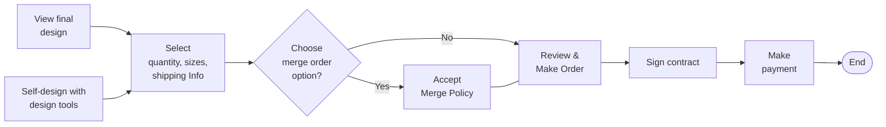
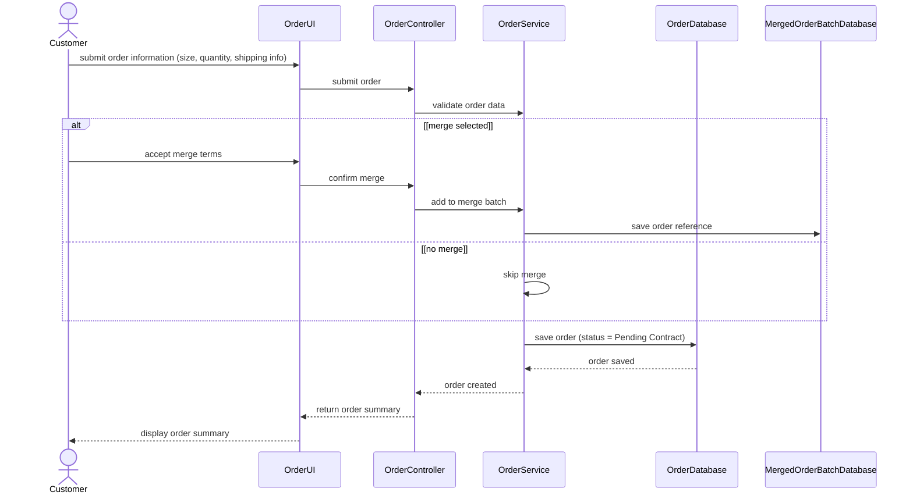
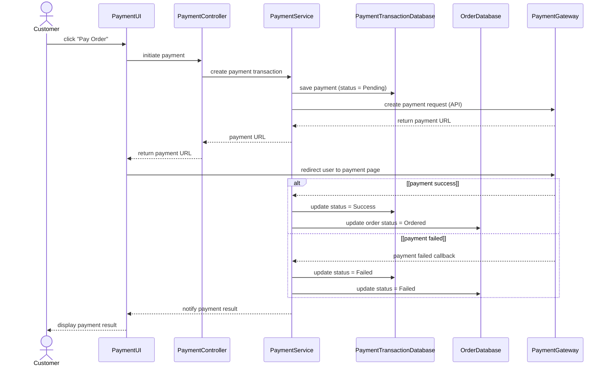

# Spec Document: Order & Payment

| Field | Value |
| --- | --- |
| Module ID | `MFG-06` |
| Module name | Order & Payment |
| Spec version | v0.1 |
| Author (team member) | [NEEDS CLARIFICATION: Specify the responsible team member; Group B is named only as the team on the Session 1 scope sheet.] |
| Date | 2026-09-16 |
| Status | Draft |
| Approved by (Client role) | [NEEDS CLARIFICATION: Client approver role and approval are not supplied.] |
| DBIZ2 source | Function List `MFG-06`, No. 47-52, `F-PAY-001` .. `F-PAY-006`; Use Cases: Finalize order; Make payment; [NEEDS CLARIFICATION: Use Case IDs are not visible in the supplied table.]; Screens: `S17`, `S22`, `S23`, `S25`, `S26`, `S34`, `S35`, `S36`, `S37`, `S38` |

---

## 1. Purpose and scope (mandatory)

Customers can review their garment order and shipping details and submit the order. They can pay for the order and see whether the payment succeeded or failed.

Source: [docs/function-list.md](../docs/function-list.md), `MFG-06` (No. 47-52); Session 1 MVP PDF, page 1 section 3. [NEEDS CLARIFICATION: Original DBIZ2 Schematic 1.1/1.2 cells are unavailable; the PDF reproduces the project objective but is not Session 3 MVP Scope v3.]

**In scope**

- Finalize Order
- Make Payment

Session 1 marks checkout, VNPay integration and order creation as Must. All DBIZ2 subfunctions below are retained as documentation; this does not authorize release of deferred functions. [NEEDS CLARIFICATION: Supply MVP Scope v3 and Session 3 decisions to confirm current module scope.]

**Out of scope**

- Design-service request creation/status belongs to MFG-05.
- Contract generation/signing belongs to MFG-09; merge batch execution belongs to MFG-10.

**Depends on**

- MFG-05: a selected design feeds S22 from S17.
- MFG-10: the supplied usage flow includes optional merge selection.
- MFG-09: the supplied usage flow signs a contract before payment.
- VNPay: F-PAY-004 and F-PAY-005 order payment exchange.

## 2. Actors (mandatory)

| Actor | Role in this module | Where it comes from |
| --- | --- | --- |
| Customer | Primary — Finalize Order, Make Payment | Function List `Actor` column, `MFG-06`: F-PAY-001, F-PAY-002, F-PAY-003, F-PAY-004, F-PAY-005, F-PAY-006 |

Primary identifies the actor performing the listed subfunctions; it does not replace conflicting Use Case or sequence labels. External participants appear in section 4 only when supplied by the source.

## 3. User scenarios and acceptance criteria (mandatory)

[NEEDS CLARIFICATION: P1/P2 scenario ordering is not agreed in the supplied materials; no scenario priority is inferred from Function List High/Medium/Low.]

### US-1 ([NEEDS CLARIFICATION: Scenario priority not agreed.]): Finalize order

**Journey.** As a `Customer`, I want to `finalize order`, so that [NEEDS CLARIFICATION: The Use Case names the goal but does not state a separate scenario benefit.].

Source: `docs/architecture/use-case.md`, line 18, “Finalize order”; related FRs `FR-001` / `F-PAY-001`, `FR-002` / `F-PAY-002`, `FR-003` / `F-PAY-003`.

**Acceptance scenarios**

1. **Given** the customer has a final or self-created design, **When** the customer enters quantity, sizes and shipping information and completes the merge-choice branch, **Then** the customer reaches Review & Make Order followed by Sign contract.

### US-2 ([NEEDS CLARIFICATION: Scenario priority not agreed.]): Make payment

**Journey.** As a `Customer`, I want to `make payment`, so that [NEEDS CLARIFICATION: The Use Case names the goal but does not state a separate scenario benefit.].

Source: `docs/architecture/use-case.md`, line 25, “Make payment”; related FRs `FR-004` / `F-PAY-004`, `FR-005` / `F-PAY-005`, `FR-006` / `F-PAY-006`.

**Acceptance scenarios**

1. **Given** the customer has passed Sign contract, **When** the customer completes Make payment, **Then** the supplied usage flow reaches End.
2. **Given** the customer starts order payment, **When** the gateway reports success, **Then** the payment result is displayed, with payment Success and order Ordered recorded in SD-09.
3. **Given** the customer starts order payment, **When** the gateway reports failure, **Then** the payment result is displayed, with payment and order Failed recorded in SD-09.

### Edge cases

- [NEEDS CLARIFICATION: Document missing/invalid inputs and empty-data outcomes not already covered by the supplied screens or sequences.]
- [NEEDS CLARIFICATION: Document behavior when a required external service or data operation is unavailable; do not infer retries or fallback paths.]
- [NEEDS CLARIFICATION: Document repeated actions and simultaneous-user outcomes; no concurrency or duplicate-submission rule is supplied.]

## 4. Flows (mandatory)

### 4.1 Usage flow

Exact module-relevant excerpt from `docs/architecture/usage-flow.md`. Boundary nodes retain cross-module context; all included decisions keep both branches. Original node names, labels and connector types are unchanged. This is a subset of the supplied overall journey, not a replacement flow.

[NEEDS CLARIFICATION: The original DBIZ2 Usage Flow image is not supplied; verify this transcription against the original figure before approving the diagram checklist.]

### 4.2 Sequence for the main flow

**SD-07: Create Order**

**SD-09: Make Order Payment**

Copied unchanged from `docs/architecture/sequence.md`; participants and messages are source text. Cross-module participants remain to preserve the supplied interaction. [NEEDS CLARIFICATION: Confirm which supplied sequence is the agreed main flow; sequences for other listed use cases are not available.]

## 5. Functional requirements (mandatory)

One FR per original Function List subfunction, in source order. FR IDs are local to this module; cite `MFG-06/FR-nnn` with the unchanged Subfunction ID. Original function names and High/Medium/Low values are preserved in each requirement note. MoSCoW values are used only for capabilities explicitly prioritized on page 2 of the Session 1 PDF; [NEEDS CLARIFICATION: Confirm per-subfunction priority mapping and the current Session 3 release scope.]

| FR ID | DBIZ2 Subfunction ID | Requirement (system MUST ...) | Actor | Priority |
| --- | --- | --- | --- | --- |
| FR-001 | F-PAY-001 | The system MUST display shopping cart information and the shipping address entry form. DBIZ2 function: Finalize Order; subfunction: Checkout View; category: Screen; original priority: High. | Customer | Must |
| FR-002 | F-PAY-002 | The system MUST display the order overview including shipping costs and taxes before payment. DBIZ2 function: Finalize Order; subfunction: Order Summary View; category: Screen; original priority: High. | Customer | Must |
| FR-003 | F-PAY-003 | The system MUST create a new order in the system with an initial status of "Pending". DBIZ2 function: Finalize Order; subfunction: Create Order Logic; category: Process; original priority: High. | Customer | Must |
| FR-004 | F-PAY-004 | The system MUST generate a secure hash string and redirect the user to the VNPay gateway. DBIZ2 function: Make Payment; subfunction: Payment Request Gen; category: Process; original priority: High. | Customer | Must |
| FR-005 | F-PAY-005 | The system MUST process the automatic response from VNPay to update the order payment status. DBIZ2 function: Make Payment; subfunction: IPN Handler Logic; category: Process; original priority: High. | Customer | Must |
| FR-006 | F-PAY-006 | The system MUST display the electronic receipt or transaction result (Success/Fail) to the user. DBIZ2 function: Make Payment; subfunction: Receipt View; category: Screen; original priority: Medium. | Customer | Must |

### 5.1 Input / Output contract

Literal Function List field names, types and required flags are preserved. Input and output rows are separate to avoid inventing field-to-field pairings. The template Required column applies to inputs; output required flags appear in Notes / validation. `—` means that side of this row is not applicable, not that a source field was omitted. Object contents, validation ranges and identifier formats are not inferred. [NEEDS CLARIFICATION: Supply nested Object/JSON/Array schemas and field validation where absent; apparent source type errors remain unchanged until clarified.]

| FR ID | Input field | Type | Required | Output field | Type | Notes / validation |
| --- | --- | --- | --- | --- | --- | --- |
| FR-001 | `cart_session_data` | Object | Yes | — | — | Function List No. 47, F-PAY-001, Input column. |
| FR-001 | — | — | — | `checkout_ui` | [NEEDS CLARIFICATION: F-PAY-001 output checkout_ui: UI representation type.] | Output required: Yes. Function List No. 47, F-PAY-001, Output column. |
| FR-002 | `shipping_address` | String | Yes | — | — | Function List No. 48, F-PAY-002, Input column. |
| FR-002 | `shipping_method` | String | Yes | — | — | Function List No. 48, F-PAY-002, Input column. |
| FR-002 | — | — | — | `calculated_total_cost` | Decimal | Output required: Yes. Function List No. 48, F-PAY-002, Output column. |
| FR-002 | — | — | — | `tax_amount` | Decimal | Output required: Yes. Function List No. 48, F-PAY-002, Output column. |
| FR-003 | `cart_items` | [NEEDS CLARIFICATION: F-PAY-003 input cart_items: data type.] | Yes | — | — | Function List No. 49, F-PAY-003, Input column. |
| FR-003 | `shipping_info` | Object | Yes | — | — | Function List No. 49, F-PAY-003, Input column. |
| FR-003 | `billing_info` | Object | Yes | — | — | Function List No. 49, F-PAY-003, Input column. |
| FR-003 | — | — | — | `new_order_id` | String | Output required: Yes. Function List No. 49, F-PAY-003, Output column. |
| FR-003 | — | — | — | `stock_reserved` | [NEEDS CLARIFICATION: F-PAY-003 output stock_reserved: data type.] | Output required: Yes. Function List No. 49, F-PAY-003, Output column. |
| FR-004 | `order_amount` | Decimal | Yes | — | — | Function List No. 50, F-PAY-004, Input column. |
| FR-004 | `order_info` | Object | Yes | — | — | Function List No. 50, F-PAY-004, Input column. |
| FR-004 | `merchant_key` | String | Yes | — | — | Function List No. 50, F-PAY-004, Input column. |
| FR-004 | — | — | — | `redirect_url_with_secure_hash` | URL | Output required: Yes. Function List No. 50, F-PAY-004, Output column. |
| FR-005 | `vnpay_response_data` | Object | Yes | — | — | Function List No. 51, F-PAY-005, Input column. |
| FR-005 | — | — | — | `payment_status_update` | String | Output required: Yes. Function List No. 51, F-PAY-005, Output column. |
| FR-006 | `payment_status` | String | Yes | — | — | Function List No. 52, F-PAY-006, Input column. |
| FR-006 | `order_details` | Object | Yes | — | — | Function List No. 52, F-PAY-006, Input column. |
| FR-006 | — | — | — | `receipt_page_error_message` | String | Output required: Yes. Function List No. 52, F-PAY-006, Output column. |

### 5.2 Business rules

| Rule ID | Rule | Why it exists |
| --- | --- | --- |
| BR-001 | Order payment is processed through VNPay, and its automatic response updates order payment status. | F-PAY-004 and F-PAY-005 explicitly identify the payment provider and response handling. Business rationale beyond the stated source is not separately documented. |
| BR-002 | The Merge Policy acknowledgment shown on order payment applies only when merge was chosen. | S35 section 6 SR-001; whether acknowledgment is mandatory is unresolved. Business rationale beyond the stated source is not separately documented. |

## 6. Key entities (mandatory)

| Entity | Attributes (from Input/Output fields) | Relationships |
| --- | --- | --- |
| Order | `cart_session_data`, `cart_items`, `shipping_address`, `shipping_method`, `shipping_info`, `billing_info`, `calculated_total_cost`, `tax_amount`, `new_order_id`, `stock_reserved`, `order_details` | [NEEDS CLARIFICATION: Order: relationship cardinalities and nested field ownership are not specified in the Input/Output contract.] |
| Order payment | `order_amount`, `order_info`, `merchant_key`, `redirect_url_with_secure_hash`, `vnpay_response_data`, `payment_status_update`, `payment_status`, `receipt_page_error_message` | [NEEDS CLARIFICATION: Order payment: relationship cardinalities and nested field ownership are not specified in the Input/Output contract.] |

Names above group the literal section 5.1 fields for discussion. They do not introduce tables, extra attributes, foreign keys or relationship cardinalities.

## 7. Screens involved

| Screen ID | Screen name | Priority | Screen Spec file |
| --- | --- | --- | --- |
| S17 | Customer Designs Screen — Shared screen / navigation boundary | [NEEDS CLARIFICATION: S17: Screen List provides no agreed Must/Should priority.] | `screens/S17-customer_designs_screen.md` ([open](../screens/S17-customer_designs_screen.md)) |
| S22 | Create Order Screen — Direct module screen | [NEEDS CLARIFICATION: S22: Screen List provides no agreed Must/Should priority.] | `screens/S22-create_order_screen.md` ([open](../screens/S22-create_order_screen.md)) |
| S23 | Merge Option Screen — Shared screen / navigation boundary | [NEEDS CLARIFICATION: S23: Screen List provides no agreed Must/Should priority.] | `screens/S23-merge_option_screen.md` ([open](../screens/S23-merge_option_screen.md)) |
| S25 | Order Summary Screen — Direct module screen | [NEEDS CLARIFICATION: S25: Screen List provides no agreed Must/Should priority.] | `screens/S25-order_summary_screen.md` ([open](../screens/S25-order_summary_screen.md)) |
| S26 | Customer Order List Screen — Shared screen / navigation boundary | [NEEDS CLARIFICATION: S26: Screen List provides no agreed Must/Should priority.] | `screens/S26-customer_order_list_screen.md` ([open](../screens/S26-customer_order_list_screen.md)) |
| S34 | Contract Detail Screen (Customer) — Shared screen / navigation boundary | [NEEDS CLARIFICATION: S34: Screen List provides no agreed Must/Should priority.] | `screens/S34-contract_detail_screen_customer.md` ([open](../screens/S34-contract_detail_screen_customer.md)) |
| S35 | Order Payment Screen — Direct module screen | [NEEDS CLARIFICATION: S35: Screen List provides no agreed Must/Should priority.] | `screens/S35-order_payment_screen.md` ([open](../screens/S35-order_payment_screen.md)) |
| S36 | Payment Transaction List Screen (Company Admin) — Direct module screen | [NEEDS CLARIFICATION: S36: Screen List provides no agreed Must/Should priority.] | [NEEDS CLARIFICATION: S36: no Screen Spec file supplied; do not invent a screen-spec filename.] |
| S37 | Payment Transaction Detail Screen — Direct module screen | [NEEDS CLARIFICATION: S37: Screen List provides no agreed Must/Should priority.] | [NEEDS CLARIFICATION: S37: no Screen Spec file supplied; do not invent a screen-spec filename.] |
| S38 | Notification Panel Screen — Shared screen / navigation boundary | [NEEDS CLARIFICATION: S38: Screen List provides no agreed Must/Should priority.] | [NEEDS CLARIFICATION: S38: no Screen Spec file supplied; do not invent a screen-spec filename.] |

Existing descriptive filenames are retained. Business navigation and notification-panel touchpoints are listed as shared boundaries; this module does not acquire their owning requirements. Screen Specs contain pre-existing “module spec unavailable” notes: these are resolved as file-existence issues by this delivery, not as behavioral approvals.

## 8. Success criteria (mandatory)

| SC ID | Criterion | How it is measured |
| --- | --- | --- |
| SC-001 | [NEEDS CLARIFICATION: No agreed measurable user-outcome success criterion is present in the supplied Session 1 scope sheet or DBIZ2 extracts; provide the Session 3 criterion for this module.] | [NEEDS CLARIFICATION: Confirm the user task, observable completion outcome, agreed target and evaluation method; none is supplied.] |

The source states feature priorities and project goals, not agreed outcome thresholds. No timing, conversion, cost-saving or technical-performance target is introduced.

## 9. Assumptions

- No separate module assumption is explicitly documented in the supplied sources. No assumption has been added to fill missing requirements.

## 10. Open questions

| # | Question | Blocking? | Owner | Status |
| --- | --- | --- | --- | --- |
| 1 | [NEEDS CLARIFICATION: Specify the responsible team member; Group B is named only as the team on the Session 1 scope sheet.] | Unassessed; see final question | Unassigned; see final question | Open |
| 2 | [NEEDS CLARIFICATION: Client approver role and approval are not supplied.] | Unassessed; see final question | Unassigned; see final question | Open |
| 3 | [NEEDS CLARIFICATION: Use Case IDs are not visible in the supplied table.] | Unassessed; see final question | Unassigned; see final question | Open |
| 4 | [NEEDS CLARIFICATION: Original DBIZ2 Schematic 1.1/1.2 cells are unavailable; the PDF reproduces the project objective but is not Session 3 MVP Scope v3.] | Unassessed; see final question | Unassigned; see final question | Open |
| 5 | [NEEDS CLARIFICATION: Supply MVP Scope v3 and Session 3 decisions to confirm current module scope.] | Unassessed; see final question | Unassigned; see final question | Open |
| 6 | [NEEDS CLARIFICATION: P1/P2 scenario ordering is not agreed in the supplied materials; no scenario priority is inferred from Function List High/Medium/Low.] | Unassessed; see final question | Unassigned; see final question | Open |
| 7 | [NEEDS CLARIFICATION: Scenario priority not agreed.] | Unassessed; see final question | Unassigned; see final question | Open |
| 8 | [NEEDS CLARIFICATION: The Use Case names the goal but does not state a separate scenario benefit.] | Unassessed; see final question | Unassigned; see final question | Open |
| 9 | [NEEDS CLARIFICATION: Document missing/invalid inputs and empty-data outcomes not already covered by the supplied screens or sequences.] | Unassessed; see final question | Unassigned; see final question | Open |
| 10 | [NEEDS CLARIFICATION: Document behavior when a required external service or data operation is unavailable; do not infer retries or fallback paths.] | Unassessed; see final question | Unassigned; see final question | Open |
| 11 | [NEEDS CLARIFICATION: Document repeated actions and simultaneous-user outcomes; no concurrency or duplicate-submission rule is supplied.] | Unassessed; see final question | Unassigned; see final question | Open |
| 12 | [NEEDS CLARIFICATION: The original DBIZ2 Usage Flow image is not supplied; verify this transcription against the original figure before approving the diagram checklist.] | Unassessed; see final question | Unassigned; see final question | Open |
| 13 | [NEEDS CLARIFICATION: Confirm which supplied sequence is the agreed main flow; sequences for other listed use cases are not available.] | Unassessed; see final question | Unassigned; see final question | Open |
| 14 | [NEEDS CLARIFICATION: Confirm per-subfunction priority mapping and the current Session 3 release scope.] | Unassessed; see final question | Unassigned; see final question | Open |
| 15 | [NEEDS CLARIFICATION: Supply nested Object/JSON/Array schemas and field validation where absent; apparent source type errors remain unchanged until clarified.] | Unassessed; see final question | Unassigned; see final question | Open |
| 16 | [NEEDS CLARIFICATION: F-PAY-001 output checkout_ui: UI representation type.] | Unassessed; see final question | Unassigned; see final question | Open |
| 17 | [NEEDS CLARIFICATION: F-PAY-003 input cart_items: data type.] | Unassessed; see final question | Unassigned; see final question | Open |
| 18 | [NEEDS CLARIFICATION: F-PAY-003 output stock_reserved: data type.] | Unassessed; see final question | Unassigned; see final question | Open |
| 19 | [NEEDS CLARIFICATION: Order: relationship cardinalities and nested field ownership are not specified in the Input/Output contract.] | Unassessed; see final question | Unassigned; see final question | Open |
| 20 | [NEEDS CLARIFICATION: Order payment: relationship cardinalities and nested field ownership are not specified in the Input/Output contract.] | Unassessed; see final question | Unassigned; see final question | Open |
| 21 | [NEEDS CLARIFICATION: S17: Screen List provides no agreed Must/Should priority.] | Unassessed; see final question | Unassigned; see final question | Open |
| 22 | [NEEDS CLARIFICATION: S22: Screen List provides no agreed Must/Should priority.] | Unassessed; see final question | Unassigned; see final question | Open |
| 23 | [NEEDS CLARIFICATION: S23: Screen List provides no agreed Must/Should priority.] | Unassessed; see final question | Unassigned; see final question | Open |
| 24 | [NEEDS CLARIFICATION: S25: Screen List provides no agreed Must/Should priority.] | Unassessed; see final question | Unassigned; see final question | Open |
| 25 | [NEEDS CLARIFICATION: S26: Screen List provides no agreed Must/Should priority.] | Unassessed; see final question | Unassigned; see final question | Open |
| 26 | [NEEDS CLARIFICATION: S34: Screen List provides no agreed Must/Should priority.] | Unassessed; see final question | Unassigned; see final question | Open |
| 27 | [NEEDS CLARIFICATION: S35: Screen List provides no agreed Must/Should priority.] | Unassessed; see final question | Unassigned; see final question | Open |
| 28 | [NEEDS CLARIFICATION: S36: Screen List provides no agreed Must/Should priority.] | Unassessed; see final question | Unassigned; see final question | Open |
| 29 | [NEEDS CLARIFICATION: S36: no Screen Spec file supplied; do not invent a screen-spec filename.] | Unassessed; see final question | Unassigned; see final question | Open |
| 30 | [NEEDS CLARIFICATION: S37: Screen List provides no agreed Must/Should priority.] | Unassessed; see final question | Unassigned; see final question | Open |
| 31 | [NEEDS CLARIFICATION: S37: no Screen Spec file supplied; do not invent a screen-spec filename.] | Unassessed; see final question | Unassigned; see final question | Open |
| 32 | [NEEDS CLARIFICATION: S38: Screen List provides no agreed Must/Should priority.] | Unassessed; see final question | Unassigned; see final question | Open |
| 33 | [NEEDS CLARIFICATION: S38: no Screen Spec file supplied; do not invent a screen-spec filename.] | Unassessed; see final question | Unassigned; see final question | Open |
| 34 | [NEEDS CLARIFICATION: No agreed measurable user-outcome success criterion is present in the supplied Session 1 scope sheet or DBIZ2 extracts; provide the Session 3 criterion for this module.] | Unassessed; see final question | Unassigned; see final question | Open |
| 35 | [NEEDS CLARIFICATION: Confirm the user task, observable completion outcome, agreed target and evaluation method; none is supplied.] | Unassessed; see final question | Unassigned; see final question | Open |
| 36 | [NEEDS CLARIFICATION: F-PAY-003 creates status Pending while SD-07 saves Pending Contract; confirm the initial order status.] | Unassessed; see final question | Unassigned; see final question | Open |
| 37 | [NEEDS CLARIFICATION: SD-07 returns the summary after saving, but S25 Screen List says summary before final submission; confirm the order creation boundary.] | Unassessed; see final question | Unassigned; see final question | Open |
| 38 | [NEEDS CLARIFICATION: The usage flow requires contract signing before payment, but Session 1 permits an emailed/paper contract as a launch stopgap; clarify the MVP path without changing the supplied flow.] | Unassessed; see final question | Unassigned; see final question | Open |
| 39 | [NEEDS CLARIFICATION: SD-09 has an unlabeled payment-success callback; provide its original message label and confirm callback inputs.] | Unassessed; see final question | Unassigned; see final question | Open |
| 40 | [NEEDS CLARIFICATION: SD-09 sets both payment and order to Failed after failed payment; confirm how this relates to F-PAY-005 payment_status_update.] | Unassessed; see final question | Unassigned; see final question | Open |
| 41 | [NEEDS CLARIFICATION: What documented rules determine shipping cost, tax, total cost, stock reservation and any reservation release?] | Unassessed; see final question | Unassigned; see final question | Open |
| 42 | [NEEDS CLARIFICATION: S17, [NEEDS CLARIFICATION: Must / Should / Could not given in Screen List]: Must / Should / Could not given in Screen List] Source: `screens/S17-customer_designs_screen.md`, line 16. | Unassessed; see final question | Unassigned; see final question | Open |
| 43 | [NEEDS CLARIFICATION: S17, **The user leaves this screen when:** [NEEDS CLARIFICATION: all exit paths are not specifi: all exit paths are not specified; documented interactions appear in section 5.] Source: `screens/S17-customer_designs_screen.md`, line 25. | Unassessed; see final question | Unassigned; see final question | Open |
| 44 | [NEEDS CLARIFICATION: S17, Search designs input: search field not specified by F-DES-004] Source: `screens/S17-customer_designs_screen.md`, line 51. | Unassessed; see final question | Unassigned; see final question | Open |
| 45 | [NEEDS CLARIFICATION: S17, Search designs input: search matching rules] Source: `screens/S17-customer_designs_screen.md`, line 51. | Unassessed; see final question | Unassigned; see final question | Open |
| 46 | [NEEDS CLARIFICATION: S17, Design row 1 thumbnail: schema] Source: `screens/S17-customer_designs_screen.md`, line 55. | Unassessed; see final question | Unassigned; see final question | Open |
| 47 | [NEEDS CLARIFICATION: S17, Design row 1 name: schema] Source: `screens/S17-customer_designs_screen.md`, line 56. | Unassessed; see final question | Unassigned; see final question | Open |
| 48 | [NEEDS CLARIFICATION: S17, Design row 1 category: schema] Source: `screens/S17-customer_designs_screen.md`, line 57. | Unassessed; see final question | Unassigned; see final question | Open |
| 49 | [NEEDS CLARIFICATION: S17, Design row 1 created date: schema] Source: `screens/S17-customer_designs_screen.md`, line 58. | Unassessed; see final question | Unassigned; see final question | Open |
| 50 | [NEEDS CLARIFICATION: S17, Design row 1 updated date: schema] Source: `screens/S17-customer_designs_screen.md`, line 59. | Unassessed; see final question | Unassigned; see final question | Open |
| 51 | [NEEDS CLARIFICATION: S17, Design row 2 thumbnail: schema] Source: `screens/S17-customer_designs_screen.md`, line 64. | Unassessed; see final question | Unassigned; see final question | Open |
| 52 | [NEEDS CLARIFICATION: S17, Design row 2 name: schema] Source: `screens/S17-customer_designs_screen.md`, line 65. | Unassessed; see final question | Unassigned; see final question | Open |
| 53 | [NEEDS CLARIFICATION: S17, Design row 2 category: schema] Source: `screens/S17-customer_designs_screen.md`, line 66. | Unassessed; see final question | Unassigned; see final question | Open |
| 54 | [NEEDS CLARIFICATION: S17, Design row 2 created date: schema] Source: `screens/S17-customer_designs_screen.md`, line 67. | Unassessed; see final question | Unassigned; see final question | Open |
| 55 | [NEEDS CLARIFICATION: S17, Design row 2 updated date: schema] Source: `screens/S17-customer_designs_screen.md`, line 68. | Unassessed; see final question | Unassigned; see final question | Open |
| 56 | [NEEDS CLARIFICATION: S17, Design row 3 thumbnail: schema] Source: `screens/S17-customer_designs_screen.md`, line 73. | Unassessed; see final question | Unassigned; see final question | Open |
| 57 | [NEEDS CLARIFICATION: S17, Design row 3 name: schema] Source: `screens/S17-customer_designs_screen.md`, line 74. | Unassessed; see final question | Unassigned; see final question | Open |
| 58 | [NEEDS CLARIFICATION: S17, Design row 3 category: schema] Source: `screens/S17-customer_designs_screen.md`, line 75. | Unassessed; see final question | Unassigned; see final question | Open |
| 59 | [NEEDS CLARIFICATION: S17, Design row 3 created date: schema] Source: `screens/S17-customer_designs_screen.md`, line 76. | Unassessed; see final question | Unassigned; see final question | Open |
| 60 | [NEEDS CLARIFICATION: S17, Design row 3 updated date: schema] Source: `screens/S17-customer_designs_screen.md`, line 77. | Unassessed; see final question | Unassigned; see final question | Open |
| 61 | [NEEDS CLARIFICATION: S17, Design row 4 thumbnail: schema] Source: `screens/S17-customer_designs_screen.md`, line 82. | Unassessed; see final question | Unassigned; see final question | Open |
| 62 | [NEEDS CLARIFICATION: S17, Design row 4 name: schema] Source: `screens/S17-customer_designs_screen.md`, line 83. | Unassessed; see final question | Unassigned; see final question | Open |
| 63 | [NEEDS CLARIFICATION: S17, Design row 4 category: schema] Source: `screens/S17-customer_designs_screen.md`, line 84. | Unassessed; see final question | Unassigned; see final question | Open |
| 64 | [NEEDS CLARIFICATION: S17, Design row 4 created date: schema] Source: `screens/S17-customer_designs_screen.md`, line 85. | Unassessed; see final question | Unassigned; see final question | Open |
| 65 | [NEEDS CLARIFICATION: S17, Design row 4 updated date: schema] Source: `screens/S17-customer_designs_screen.md`, line 86. | Unassessed; see final question | Unassigned; see final question | Open |
| 66 | [NEEDS CLARIFICATION: S17, Design row 5 thumbnail: schema] Source: `screens/S17-customer_designs_screen.md`, line 91. | Unassessed; see final question | Unassigned; see final question | Open |
| 67 | [NEEDS CLARIFICATION: S17, Design row 5 name: schema] Source: `screens/S17-customer_designs_screen.md`, line 92. | Unassessed; see final question | Unassigned; see final question | Open |
| 68 | [NEEDS CLARIFICATION: S17, Design row 5 category: schema] Source: `screens/S17-customer_designs_screen.md`, line 93. | Unassessed; see final question | Unassigned; see final question | Open |
| 69 | [NEEDS CLARIFICATION: S17, Design row 5 created date: schema] Source: `screens/S17-customer_designs_screen.md`, line 94. | Unassessed; see final question | Unassigned; see final question | Open |
| 70 | [NEEDS CLARIFICATION: S17, Design row 5 updated date: schema] Source: `screens/S17-customer_designs_screen.md`, line 95. | Unassessed; see final question | Unassigned; see final question | Open |
| 71 | [NEEDS CLARIFICATION: S17, [NEEDS CLARIFICATION: empty designs message]: empty designs message] Source: `screens/S17-customer_designs_screen.md`, line 137. | Unassessed; see final question | Unassigned; see final question | Open |
| 72 | [NEEDS CLARIFICATION: S17, [NEEDS CLARIFICATION: design list loading treatment]: design list loading treatment] Source: `screens/S17-customer_designs_screen.md`, line 138. | Unassessed; see final question | Unassigned; see final question | Open |
| 73 | [NEEDS CLARIFICATION: S17, [NEEDS CLARIFICATION: design list error treatment]: design list error treatment] Source: `screens/S17-customer_designs_screen.md`, line 139. | Unassessed; see final question | Unassigned; see final question | Open |
| 74 | [NEEDS CLARIFICATION: S17, [NEEDS CLARIFICATION: edit/copy/delete confirmation behavior]: edit/copy/delete confirmation behavior] Source: `screens/S17-customer_designs_screen.md`, line 140. | Unassessed; see final question | Unassigned; see final question | Open |
| 75 | [NEEDS CLARIFICATION: S17, About Dony navigation: destination not in Screen List] Source: `screens/S17-customer_designs_screen.md`, line 148. | Unassessed; see final question | Unassigned; see final question | Open |
| 76 | [NEEDS CLARIFICATION: S17, Contact Us navigation: destination not in Screen List] Source: `screens/S17-customer_designs_screen.md`, line 151. | Unassessed; see final question | Unassigned; see final question | Open |
| 77 | [NEEDS CLARIFICATION: S17, Search designs input: filtering behavior] Source: `screens/S17-customer_designs_screen.md`, line 155. | Unassessed; see final question | Unassigned; see final question | Open |
| 78 | [NEEDS CLARIFICATION: S17, Category filter: filter choices] Source: `screens/S17-customer_designs_screen.md`, line 156. | Unassessed; see final question | Unassigned; see final question | Open |
| 79 | [NEEDS CLARIFICATION: S17, Date filter: filter choices] Source: `screens/S17-customer_designs_screen.md`, line 157. | Unassessed; see final question | Unassigned; see final question | Open |
| 80 | [NEEDS CLARIFICATION: S17, Design row 1 copy icon: duplicate behavior] Source: `screens/S17-customer_designs_screen.md`, line 163. | Unassessed; see final question | Unassigned; see final question | Open |
| 81 | [NEEDS CLARIFICATION: S17, Design row 2 copy icon: duplicate behavior] Source: `screens/S17-customer_designs_screen.md`, line 164. | Unassessed; see final question | Unassigned; see final question | Open |
| 82 | [NEEDS CLARIFICATION: S17, Design row 3 copy icon: duplicate behavior] Source: `screens/S17-customer_designs_screen.md`, line 165. | Unassessed; see final question | Unassigned; see final question | Open |
| 83 | [NEEDS CLARIFICATION: S17, Design row 4 copy icon: duplicate behavior] Source: `screens/S17-customer_designs_screen.md`, line 166. | Unassessed; see final question | Unassigned; see final question | Open |
| 84 | [NEEDS CLARIFICATION: S17, Design row 5 copy icon: duplicate behavior] Source: `screens/S17-customer_designs_screen.md`, line 167. | Unassessed; see final question | Unassigned; see final question | Open |
| 85 | [NEEDS CLARIFICATION: S17, Design row 1 delete icon: delete behavior] Source: `screens/S17-customer_designs_screen.md`, line 168. | Unassessed; see final question | Unassigned; see final question | Open |
| 86 | [NEEDS CLARIFICATION: S17, Design row 2 delete icon: delete behavior] Source: `screens/S17-customer_designs_screen.md`, line 169. | Unassessed; see final question | Unassigned; see final question | Open |
| 87 | [NEEDS CLARIFICATION: S17, Design row 3 delete icon: delete behavior] Source: `screens/S17-customer_designs_screen.md`, line 170. | Unassessed; see final question | Unassigned; see final question | Open |
| 88 | [NEEDS CLARIFICATION: S17, Design row 4 delete icon: delete behavior] Source: `screens/S17-customer_designs_screen.md`, line 171. | Unassessed; see final question | Unassigned; see final question | Open |
| 89 | [NEEDS CLARIFICATION: S17, Design row 5 delete icon: delete behavior] Source: `screens/S17-customer_designs_screen.md`, line 172. | Unassessed; see final question | Unassigned; see final question | Open |
| 90 | [NEEDS CLARIFICATION: S17, Zalo contact button: contact destination] Source: `screens/S17-customer_designs_screen.md`, line 183. | Unassessed; see final question | Unassigned; see final question | Open |
| 91 | [NEEDS CLARIFICATION: S17, Telephone contact button: dial behavior] Source: `screens/S17-customer_designs_screen.md`, line 184. | Unassessed; see final question | Unassigned; see final question | Open |
| 92 | [NEEDS CLARIFICATION: S17, Footer Facebook icon: external or in-system destination] Source: `screens/S17-customer_designs_screen.md`, line 185. | Unassessed; see final question | Unassigned; see final question | Open |
| 93 | [NEEDS CLARIFICATION: S17, Footer X icon: external or in-system destination] Source: `screens/S17-customer_designs_screen.md`, line 186. | Unassessed; see final question | Unassigned; see final question | Open |
| 94 | [NEEDS CLARIFICATION: S17, Footer LinkedIn icon: external or in-system destination] Source: `screens/S17-customer_designs_screen.md`, line 187. | Unassessed; see final question | Unassigned; see final question | Open |
| 95 | [NEEDS CLARIFICATION: S17, Footer YouTube icon: external or in-system destination] Source: `screens/S17-customer_designs_screen.md`, line 188. | Unassessed; see final question | Unassigned; see final question | Open |
| 96 | [NEEDS CLARIFICATION: S17, Footer TikTok icon: external or in-system destination] Source: `screens/S17-customer_designs_screen.md`, line 189. | Unassessed; see final question | Unassigned; see final question | Open |
| 97 | [NEEDS CLARIFICATION: S17, Company profile link: external or in-system destination] Source: `screens/S17-customer_designs_screen.md`, line 190. | Unassessed; see final question | Unassigned; see final question | Open |
| 98 | [NEEDS CLARIFICATION: S17, Quality policy link: external or in-system destination] Source: `screens/S17-customer_designs_screen.md`, line 191. | Unassessed; see final question | Unassigned; see final question | Open |
| 99 | [NEEDS CLARIFICATION: S17, Warranty policy link: external or in-system destination] Source: `screens/S17-customer_designs_screen.md`, line 192. | Unassessed; see final question | Unassigned; see final question | Open |
| 100 | [NEEDS CLARIFICATION: S17, Delivery and return policy link: external or in-system destination] Source: `screens/S17-customer_designs_screen.md`, line 193. | Unassessed; see final question | Unassigned; see final question | Open |
| 101 | [NEEDS CLARIFICATION: S17, Second warranty policy link: external or in-system destination] Source: `screens/S17-customer_designs_screen.md`, line 194. | Unassessed; see final question | Unassigned; see final question | Open |
| 102 | [NEEDS CLARIFICATION: S17, Shipping policy link: external or in-system destination] Source: `screens/S17-customer_designs_screen.md`, line 195. | Unassessed; see final question | Unassigned; see final question | Open |
| 103 | [NEEDS CLARIFICATION: S17, Payment methods link: external or in-system destination] Source: `screens/S17-customer_designs_screen.md`, line 196. | Unassessed; see final question | Unassigned; see final question | Open |
| 104 | [NEEDS CLARIFICATION: S17, Business areas link: external or in-system destination] Source: `screens/S17-customer_designs_screen.md`, line 197. | Unassessed; see final question | Unassigned; see final question | Open |
| 105 | [NEEDS CLARIFICATION: S17, FAQ link: external or in-system destination] Source: `screens/S17-customer_designs_screen.md`, line 198. | Unassessed; see final question | Unassigned; see final question | Open |
| 106 | [NEEDS CLARIFICATION: S17, - Smallest supported width: [NEEDS CLARIFICATION: not specified in sources.]: not specified in sources.] Source: `screens/S17-customer_designs_screen.md`, line 214. | Unassessed; see final question | Unassigned; see final question | Open |
| 107 | [NEEDS CLARIFICATION: S17, - What collapses or stacks on a narrow screen: [NEEDS CLARIFICATION: no narrow-screen mock: no narrow-screen mockup or rule provided.] Source: `screens/S17-customer_designs_screen.md`, line 216. | Unassessed; see final question | Unassigned; see final question | Open |
| 108 | [NEEDS CLARIFICATION: S17, - Text that must remain readable (contrast, minimum size): [NEEDS CLARIFICATION: no numeri: no numeric accessibility criteria provided.] Source: `screens/S17-customer_designs_screen.md`, line 218. | Unassessed; see final question | Unassigned; see final question | Open |
| 109 | [NEEDS CLARIFICATION: S17, [NEEDS CLARIFICATION: Screen List does not provide Must / Should / Could priority.]: Screen List does not provide Must / Should / Could priority.] Source: `screens/S17-customer_designs_screen.md`, line 224. | Unassessed; see final question | Unassigned; see final question | Open |
| 110 | [NEEDS CLARIFICATION: S17, [NEEDS CLARIFICATION: smallest supported width, narrow layout, and accessibility minimums are not specified.]: smallest supported width, narrow layout, and accessibility minimums are not specified.] Source: `screens/S17-customer_designs_screen.md`, line 226. | Unassessed; see final question | Unassigned; see final question | Open |
| 111 | [NEEDS CLARIFICATION: S17, [NEEDS CLARIFICATION: Are consultant-provided designs distinguished visually from self-designed designs?]: Are consultant-provided designs distinguished visually from self-designed designs?] Source: `screens/S17-customer_designs_screen.md`, line 227. | Unassessed; see final question | Unassigned; see final question | Open |
| 112 | [NEEDS CLARIFICATION: S17, [NEEDS CLARIFICATION: mockup file uses a descriptive suffix; template assumes img/<SCREEN-ID>.png.]: mockup file uses a descriptive suffix; template assumes img/<SCREEN-ID>.png.] Source: `screens/S17-customer_designs_screen.md`, line 228. | Unassessed; see final question | Unassigned; see final question | Open |
| 113 | [NEEDS CLARIFICATION: S17, - [ ] The mockup is a separate cropped image file, named with the Screen ID. [NEEDS CLARIF: actual image filenames include descriptive suffixes.] Source: `screens/S17-customer_designs_screen.md`, line 234. | Unassessed; see final question | Unassigned; see final question | Open |
| 114 | [NEEDS CLARIFICATION: S22, [NEEDS CLARIFICATION: Must / Should / Could not given in Screen List]: Must / Should / Could not given in Screen List] Source: `screens/S22-create_order_screen.md`, line 16. | Unassessed; see final question | Unassigned; see final question | Open |
| 115 | [NEEDS CLARIFICATION: S22, **The user leaves this screen when:** [NEEDS CLARIFICATION: all exit paths are not specifi: all exit paths are not specified; documented interactions appear in section 5.] Source: `screens/S22-create_order_screen.md`, line 25. | Unassessed; see final question | Unassigned; see final question | Open |
| 116 | [NEEDS CLARIFICATION: S22, Product name: schema] Source: `screens/S22-create_order_screen.md`, line 51. | Unassessed; see final question | Unassigned; see final question | Open |
| 117 | [NEEDS CLARIFICATION: S22, Size S quantity input: Unspecified requirement; inspect the cited source row.] Source: `screens/S22-create_order_screen.md`, line 58. | Unassessed; see final question | Unassigned; see final question | Open |
| 118 | [NEEDS CLARIFICATION: S22, Size S quantity input: quantity rules] Source: `screens/S22-create_order_screen.md`, line 58. | Unassessed; see final question | Unassigned; see final question | Open |
| 119 | [NEEDS CLARIFICATION: S22, Size M quantity input: Unspecified requirement; inspect the cited source row.] Source: `screens/S22-create_order_screen.md`, line 62. | Unassessed; see final question | Unassigned; see final question | Open |
| 120 | [NEEDS CLARIFICATION: S22, Size M quantity input: quantity rules] Source: `screens/S22-create_order_screen.md`, line 62. | Unassessed; see final question | Unassigned; see final question | Open |
| 121 | [NEEDS CLARIFICATION: S22, Size L quantity input: Unspecified requirement; inspect the cited source row.] Source: `screens/S22-create_order_screen.md`, line 66. | Unassessed; see final question | Unassigned; see final question | Open |
| 122 | [NEEDS CLARIFICATION: S22, Size L quantity input: quantity rules] Source: `screens/S22-create_order_screen.md`, line 66. | Unassessed; see final question | Unassigned; see final question | Open |
| 123 | [NEEDS CLARIFICATION: S22, Size XL quantity input: Unspecified requirement; inspect the cited source row.] Source: `screens/S22-create_order_screen.md`, line 70. | Unassessed; see final question | Unassigned; see final question | Open |
| 124 | [NEEDS CLARIFICATION: S22, Size XL quantity input: quantity rules] Source: `screens/S22-create_order_screen.md`, line 70. | Unassessed; see final question | Unassigned; see final question | Open |
| 125 | [NEEDS CLARIFICATION: S22, Size 2XL quantity input: Unspecified requirement; inspect the cited source row.] Source: `screens/S22-create_order_screen.md`, line 74. | Unassessed; see final question | Unassigned; see final question | Open |
| 126 | [NEEDS CLARIFICATION: S22, Size 2XL quantity input: quantity rules] Source: `screens/S22-create_order_screen.md`, line 74. | Unassessed; see final question | Unassigned; see final question | Open |
| 127 | [NEEDS CLARIFICATION: S22, Size 3XL quantity input: Unspecified requirement; inspect the cited source row.] Source: `screens/S22-create_order_screen.md`, line 78. | Unassessed; see final question | Unassigned; see final question | Open |
| 128 | [NEEDS CLARIFICATION: S22, Size 3XL quantity input: quantity rules] Source: `screens/S22-create_order_screen.md`, line 78. | Unassessed; see final question | Unassigned; see final question | Open |
| 129 | [NEEDS CLARIFICATION: S22, Size 4XL quantity input: Unspecified requirement; inspect the cited source row.] Source: `screens/S22-create_order_screen.md`, line 82. | Unassessed; see final question | Unassigned; see final question | Open |
| 130 | [NEEDS CLARIFICATION: S22, Size 4XL quantity input: quantity rules] Source: `screens/S22-create_order_screen.md`, line 82. | Unassessed; see final question | Unassigned; see final question | Open |
| 131 | [NEEDS CLARIFICATION: S22, Total items: Unspecified requirement; inspect the cited source row.] Source: `screens/S22-create_order_screen.md`, line 84. | Unassessed; see final question | Unassigned; see final question | Open |
| 132 | [NEEDS CLARIFICATION: S22, Email Address input: schema] Source: `screens/S22-create_order_screen.md`, line 86. | Unassessed; see final question | Unassigned; see final question | Open |
| 133 | [NEEDS CLARIFICATION: S22, Email Address input: Unspecified requirement; inspect the cited source row.] Source: `screens/S22-create_order_screen.md`, line 86. | Unassessed; see final question | Unassigned; see final question | Open |
| 134 | [NEEDS CLARIFICATION: S22, Email Address input: validation rule not specified] Source: `screens/S22-create_order_screen.md`, line 86. | Unassessed; see final question | Unassigned; see final question | Open |
| 135 | [NEEDS CLARIFICATION: S22, Full Name input: schema] Source: `screens/S22-create_order_screen.md`, line 87. | Unassessed; see final question | Unassigned; see final question | Open |
| 136 | [NEEDS CLARIFICATION: S22, Full Name input: Unspecified requirement; inspect the cited source row.] Source: `screens/S22-create_order_screen.md`, line 87. | Unassessed; see final question | Unassigned; see final question | Open |
| 137 | [NEEDS CLARIFICATION: S22, Full Name input: validation rule not specified] Source: `screens/S22-create_order_screen.md`, line 87. | Unassessed; see final question | Unassigned; see final question | Open |
| 138 | [NEEDS CLARIFICATION: S22, Address input: schema] Source: `screens/S22-create_order_screen.md`, line 88. | Unassessed; see final question | Unassigned; see final question | Open |
| 139 | [NEEDS CLARIFICATION: S22, Address input: Unspecified requirement; inspect the cited source row.] Source: `screens/S22-create_order_screen.md`, line 88. | Unassessed; see final question | Unassigned; see final question | Open |
| 140 | [NEEDS CLARIFICATION: S22, Address input: validation rule not specified] Source: `screens/S22-create_order_screen.md`, line 88. | Unassessed; see final question | Unassigned; see final question | Open |
| 141 | [NEEDS CLARIFICATION: S22, City input: schema] Source: `screens/S22-create_order_screen.md`, line 89. | Unassessed; see final question | Unassigned; see final question | Open |
| 142 | [NEEDS CLARIFICATION: S22, City input: Unspecified requirement; inspect the cited source row.] Source: `screens/S22-create_order_screen.md`, line 89. | Unassessed; see final question | Unassigned; see final question | Open |
| 143 | [NEEDS CLARIFICATION: S22, City input: validation rule not specified] Source: `screens/S22-create_order_screen.md`, line 89. | Unassessed; see final question | Unassigned; see final question | Open |
| 144 | [NEEDS CLARIFICATION: S22, Zip Code input: schema] Source: `screens/S22-create_order_screen.md`, line 90. | Unassessed; see final question | Unassigned; see final question | Open |
| 145 | [NEEDS CLARIFICATION: S22, Zip Code input: Unspecified requirement; inspect the cited source row.] Source: `screens/S22-create_order_screen.md`, line 90. | Unassessed; see final question | Unassigned; see final question | Open |
| 146 | [NEEDS CLARIFICATION: S22, Zip Code input: validation rule not specified] Source: `screens/S22-create_order_screen.md`, line 90. | Unassessed; see final question | Unassigned; see final question | Open |
| 147 | [NEEDS CLARIFICATION: S22, [NEEDS CLARIFICATION: no selected design or no shipping data]: no selected design or no shipping data] Source: `screens/S22-create_order_screen.md`, line 124. | Unassessed; see final question | Unassigned; see final question | Open |
| 148 | [NEEDS CLARIFICATION: S22, [NEEDS CLARIFICATION: address/save loading treatment]: address/save loading treatment] Source: `screens/S22-create_order_screen.md`, line 125. | Unassessed; see final question | Unassigned; see final question | Open |
| 149 | [NEEDS CLARIFICATION: S22, [NEEDS CLARIFICATION: address/quantity error treatment]: address/quantity error treatment] Source: `screens/S22-create_order_screen.md`, line 126. | Unassessed; see final question | Unassigned; see final question | Open |
| 150 | [NEEDS CLARIFICATION: S22, [NEEDS CLARIFICATION: address saved confirmation]: address saved confirmation] Source: `screens/S22-create_order_screen.md`, line 127. | Unassessed; see final question | Unassigned; see final question | Open |
| 151 | [NEEDS CLARIFICATION: S22, About Dony navigation: destination not in Screen List] Source: `screens/S22-create_order_screen.md`, line 135. | Unassessed; see final question | Unassigned; see final question | Open |
| 152 | [NEEDS CLARIFICATION: S22, Contact Us navigation: destination not in Screen List] Source: `screens/S22-create_order_screen.md`, line 138. | Unassessed; see final question | Unassigned; see final question | Open |
| 153 | [NEEDS CLARIFICATION: S22, Size S decrement: limits] Source: `screens/S22-create_order_screen.md`, line 142. | Unassessed; see final question | Unassigned; see final question | Open |
| 154 | [NEEDS CLARIFICATION: S22, Size M decrement: limits] Source: `screens/S22-create_order_screen.md`, line 143. | Unassessed; see final question | Unassigned; see final question | Open |
| 155 | [NEEDS CLARIFICATION: S22, Size L decrement: limits] Source: `screens/S22-create_order_screen.md`, line 144. | Unassessed; see final question | Unassigned; see final question | Open |
| 156 | [NEEDS CLARIFICATION: S22, Size XL decrement: limits] Source: `screens/S22-create_order_screen.md`, line 145. | Unassessed; see final question | Unassigned; see final question | Open |
| 157 | [NEEDS CLARIFICATION: S22, Size 2XL decrement: limits] Source: `screens/S22-create_order_screen.md`, line 146. | Unassessed; see final question | Unassigned; see final question | Open |
| 158 | [NEEDS CLARIFICATION: S22, Size 3XL decrement: limits] Source: `screens/S22-create_order_screen.md`, line 147. | Unassessed; see final question | Unassigned; see final question | Open |
| 159 | [NEEDS CLARIFICATION: S22, Size 4XL decrement: limits] Source: `screens/S22-create_order_screen.md`, line 148. | Unassessed; see final question | Unassigned; see final question | Open |
| 160 | [NEEDS CLARIFICATION: S22, Size S quantity input: validation] Source: `screens/S22-create_order_screen.md`, line 149. | Unassessed; see final question | Unassigned; see final question | Open |
| 161 | [NEEDS CLARIFICATION: S22, Size M quantity input: validation] Source: `screens/S22-create_order_screen.md`, line 150. | Unassessed; see final question | Unassigned; see final question | Open |
| 162 | [NEEDS CLARIFICATION: S22, Size L quantity input: validation] Source: `screens/S22-create_order_screen.md`, line 151. | Unassessed; see final question | Unassigned; see final question | Open |
| 163 | [NEEDS CLARIFICATION: S22, Size XL quantity input: validation] Source: `screens/S22-create_order_screen.md`, line 152. | Unassessed; see final question | Unassigned; see final question | Open |
| 164 | [NEEDS CLARIFICATION: S22, Size 2XL quantity input: validation] Source: `screens/S22-create_order_screen.md`, line 153. | Unassessed; see final question | Unassigned; see final question | Open |
| 165 | [NEEDS CLARIFICATION: S22, Size 3XL quantity input: validation] Source: `screens/S22-create_order_screen.md`, line 154. | Unassessed; see final question | Unassigned; see final question | Open |
| 166 | [NEEDS CLARIFICATION: S22, Size 4XL quantity input: validation] Source: `screens/S22-create_order_screen.md`, line 155. | Unassessed; see final question | Unassigned; see final question | Open |
| 167 | [NEEDS CLARIFICATION: S22, Save address button: Unspecified requirement; inspect the cited source row.] Source: `screens/S22-create_order_screen.md`, line 168. | Unassessed; see final question | Unassigned; see final question | Open |
| 168 | [NEEDS CLARIFICATION: S22, Move to editor button: Unspecified requirement; inspect the cited source row.] Source: `screens/S22-create_order_screen.md`, line 169. | Unassessed; see final question | Unassigned; see final question | Open |
| 169 | [NEEDS CLARIFICATION: S22, Zalo contact button: contact destination] Source: `screens/S22-create_order_screen.md`, line 170. | Unassessed; see final question | Unassigned; see final question | Open |
| 170 | [NEEDS CLARIFICATION: S22, Telephone contact button: dial behavior] Source: `screens/S22-create_order_screen.md`, line 171. | Unassessed; see final question | Unassigned; see final question | Open |
| 171 | [NEEDS CLARIFICATION: S22, Footer Facebook icon: external or in-system destination] Source: `screens/S22-create_order_screen.md`, line 172. | Unassessed; see final question | Unassigned; see final question | Open |
| 172 | [NEEDS CLARIFICATION: S22, Footer X icon: external or in-system destination] Source: `screens/S22-create_order_screen.md`, line 173. | Unassessed; see final question | Unassigned; see final question | Open |
| 173 | [NEEDS CLARIFICATION: S22, Footer LinkedIn icon: external or in-system destination] Source: `screens/S22-create_order_screen.md`, line 174. | Unassessed; see final question | Unassigned; see final question | Open |
| 174 | [NEEDS CLARIFICATION: S22, Footer YouTube icon: external or in-system destination] Source: `screens/S22-create_order_screen.md`, line 175. | Unassessed; see final question | Unassigned; see final question | Open |
| 175 | [NEEDS CLARIFICATION: S22, Footer TikTok icon: external or in-system destination] Source: `screens/S22-create_order_screen.md`, line 176. | Unassessed; see final question | Unassigned; see final question | Open |
| 176 | [NEEDS CLARIFICATION: S22, Company profile link: external or in-system destination] Source: `screens/S22-create_order_screen.md`, line 177. | Unassessed; see final question | Unassigned; see final question | Open |
| 177 | [NEEDS CLARIFICATION: S22, Quality policy link: external or in-system destination] Source: `screens/S22-create_order_screen.md`, line 178. | Unassessed; see final question | Unassigned; see final question | Open |
| 178 | [NEEDS CLARIFICATION: S22, Warranty policy link: external or in-system destination] Source: `screens/S22-create_order_screen.md`, line 179. | Unassessed; see final question | Unassigned; see final question | Open |
| 179 | [NEEDS CLARIFICATION: S22, Delivery and return policy link: external or in-system destination] Source: `screens/S22-create_order_screen.md`, line 180. | Unassessed; see final question | Unassigned; see final question | Open |
| 180 | [NEEDS CLARIFICATION: S22, Second warranty policy link: external or in-system destination] Source: `screens/S22-create_order_screen.md`, line 181. | Unassessed; see final question | Unassigned; see final question | Open |
| 181 | [NEEDS CLARIFICATION: S22, Shipping policy link: external or in-system destination] Source: `screens/S22-create_order_screen.md`, line 182. | Unassessed; see final question | Unassigned; see final question | Open |
| 182 | [NEEDS CLARIFICATION: S22, Payment methods link: external or in-system destination] Source: `screens/S22-create_order_screen.md`, line 183. | Unassessed; see final question | Unassigned; see final question | Open |
| 183 | [NEEDS CLARIFICATION: S22, Business areas link: external or in-system destination] Source: `screens/S22-create_order_screen.md`, line 184. | Unassessed; see final question | Unassigned; see final question | Open |
| 184 | [NEEDS CLARIFICATION: S22, FAQ link: external or in-system destination] Source: `screens/S22-create_order_screen.md`, line 185. | Unassessed; see final question | Unassigned; see final question | Open |
| 185 | [NEEDS CLARIFICATION: S22, - Smallest supported width: [NEEDS CLARIFICATION: not specified in sources.]: not specified in sources.] Source: `screens/S22-create_order_screen.md`, line 202. | Unassessed; see final question | Unassigned; see final question | Open |
| 186 | [NEEDS CLARIFICATION: S22, - What collapses or stacks on a narrow screen: [NEEDS CLARIFICATION: no narrow-screen mock: no narrow-screen mockup or rule provided.] Source: `screens/S22-create_order_screen.md`, line 204. | Unassessed; see final question | Unassigned; see final question | Open |
| 187 | [NEEDS CLARIFICATION: S22, - Text that must remain readable (contrast, minimum size): [NEEDS CLARIFICATION: no numeri: no numeric accessibility criteria provided.] Source: `screens/S22-create_order_screen.md`, line 206. | Unassessed; see final question | Unassigned; see final question | Open |
| 188 | [NEEDS CLARIFICATION: S22, [NEEDS CLARIFICATION: Screen List does not provide Must / Should / Could priority.]: Screen List does not provide Must / Should / Could priority.] Source: `screens/S22-create_order_screen.md`, line 212. | Unassessed; see final question | Unassigned; see final question | Open |
| 189 | [NEEDS CLARIFICATION: S22, [NEEDS CLARIFICATION: smallest supported width, narrow layout, and accessibility minimums are not specified.]: smallest supported width, narrow layout, and accessibility minimums are not specified.] Source: `screens/S22-create_order_screen.md`, line 214. | Unassessed; see final question | Unassigned; see final question | Open |
| 190 | [NEEDS CLARIFICATION: S22, [NEEDS CLARIFICATION: What does Move to editor do? The usage flow indicates merge choice next.]: What does Move to editor do? The usage flow indicates merge choice next.] Source: `screens/S22-create_order_screen.md`, line 215. | Unassessed; see final question | Unassigned; see final question | Open |
| 191 | [NEEDS CLARIFICATION: S22, [NEEDS CLARIFICATION: What are quantity and shipping field rules?]: What are quantity and shipping field rules?] Source: `screens/S22-create_order_screen.md`, line 216. | Unassessed; see final question | Unassigned; see final question | Open |
| 192 | [NEEDS CLARIFICATION: S22, [NEEDS CLARIFICATION: mockup file uses a descriptive suffix; template assumes img/<SCREEN-ID>.png.]: mockup file uses a descriptive suffix; template assumes img/<SCREEN-ID>.png.] Source: `screens/S22-create_order_screen.md`, line 217. | Unassessed; see final question | Unassigned; see final question | Open |
| 193 | [NEEDS CLARIFICATION: S22, - [ ] The mockup is a separate cropped image file, named with the Screen ID. [NEEDS CLARIF: actual image filenames include descriptive suffixes.] Source: `screens/S22-create_order_screen.md`, line 223. | Unassessed; see final question | Unassigned; see final question | Open |
| 194 | [NEEDS CLARIFICATION: S23, [NEEDS CLARIFICATION: Must / Should / Could not given in Screen List]: Must / Should / Could not given in Screen List] Source: `screens/S23-merge_option_screen.md`, line 16. | Unassessed; see final question | Unassigned; see final question | Open |
| 195 | [NEEDS CLARIFICATION: S23, **The user leaves this screen when:** [NEEDS CLARIFICATION: all exit paths are not specifi: all exit paths are not specified; documented interactions appear in section 5.] Source: `screens/S23-merge_option_screen.md`, line 25. | Unassessed; see final question | Unassigned; see final question | Open |
| 196 | [NEEDS CLARIFICATION: S23, Merge price: pricing source] Source: `screens/S23-merge_option_screen.md`, line 63. | Unassessed; see final question | Unassigned; see final question | Open |
| 197 | [NEEDS CLARIFICATION: S23, [NEEDS CLARIFICATION: preference save loading treatment]: preference save loading treatment] Source: `screens/S23-merge_option_screen.md`, line 101. | Unassessed; see final question | Unassigned; see final question | Open |
| 198 | [NEEDS CLARIFICATION: S23, [NEEDS CLARIFICATION: preference save error treatment]: preference save error treatment] Source: `screens/S23-merge_option_screen.md`, line 102. | Unassessed; see final question | Unassigned; see final question | Open |
| 199 | [NEEDS CLARIFICATION: S23, About Dony navigation: destination not in Screen List] Source: `screens/S23-merge_option_screen.md`, line 111. | Unassessed; see final question | Unassigned; see final question | Open |
| 200 | [NEEDS CLARIFICATION: S23, Contact Us navigation: destination not in Screen List] Source: `screens/S23-merge_option_screen.md`, line 114. | Unassessed; see final question | Unassigned; see final question | Open |
| 201 | [NEEDS CLARIFICATION: S23, Zalo contact button: contact destination] Source: `screens/S23-merge_option_screen.md`, line 122. | Unassessed; see final question | Unassigned; see final question | Open |
| 202 | [NEEDS CLARIFICATION: S23, Telephone contact button: dial behavior] Source: `screens/S23-merge_option_screen.md`, line 123. | Unassessed; see final question | Unassigned; see final question | Open |
| 203 | [NEEDS CLARIFICATION: S23, Footer Facebook icon: external or in-system destination] Source: `screens/S23-merge_option_screen.md`, line 124. | Unassessed; see final question | Unassigned; see final question | Open |
| 204 | [NEEDS CLARIFICATION: S23, Footer X icon: external or in-system destination] Source: `screens/S23-merge_option_screen.md`, line 125. | Unassessed; see final question | Unassigned; see final question | Open |
| 205 | [NEEDS CLARIFICATION: S23, Footer LinkedIn icon: external or in-system destination] Source: `screens/S23-merge_option_screen.md`, line 126. | Unassessed; see final question | Unassigned; see final question | Open |
| 206 | [NEEDS CLARIFICATION: S23, Footer YouTube icon: external or in-system destination] Source: `screens/S23-merge_option_screen.md`, line 127. | Unassessed; see final question | Unassigned; see final question | Open |
| 207 | [NEEDS CLARIFICATION: S23, Footer TikTok icon: external or in-system destination] Source: `screens/S23-merge_option_screen.md`, line 128. | Unassessed; see final question | Unassigned; see final question | Open |
| 208 | [NEEDS CLARIFICATION: S23, Company profile link: external or in-system destination] Source: `screens/S23-merge_option_screen.md`, line 129. | Unassessed; see final question | Unassigned; see final question | Open |
| 209 | [NEEDS CLARIFICATION: S23, Quality policy link: external or in-system destination] Source: `screens/S23-merge_option_screen.md`, line 130. | Unassessed; see final question | Unassigned; see final question | Open |
| 210 | [NEEDS CLARIFICATION: S23, Warranty policy link: external or in-system destination] Source: `screens/S23-merge_option_screen.md`, line 131. | Unassessed; see final question | Unassigned; see final question | Open |
| 211 | [NEEDS CLARIFICATION: S23, Delivery and return policy link: external or in-system destination] Source: `screens/S23-merge_option_screen.md`, line 132. | Unassessed; see final question | Unassigned; see final question | Open |
| 212 | [NEEDS CLARIFICATION: S23, Second warranty policy link: external or in-system destination] Source: `screens/S23-merge_option_screen.md`, line 133. | Unassessed; see final question | Unassigned; see final question | Open |
| 213 | [NEEDS CLARIFICATION: S23, Shipping policy link: external or in-system destination] Source: `screens/S23-merge_option_screen.md`, line 134. | Unassessed; see final question | Unassigned; see final question | Open |
| 214 | [NEEDS CLARIFICATION: S23, Payment methods link: external or in-system destination] Source: `screens/S23-merge_option_screen.md`, line 135. | Unassessed; see final question | Unassigned; see final question | Open |
| 215 | [NEEDS CLARIFICATION: S23, Business areas link: external or in-system destination] Source: `screens/S23-merge_option_screen.md`, line 136. | Unassessed; see final question | Unassigned; see final question | Open |
| 216 | [NEEDS CLARIFICATION: S23, FAQ link: external or in-system destination] Source: `screens/S23-merge_option_screen.md`, line 137. | Unassessed; see final question | Unassigned; see final question | Open |
| 217 | [NEEDS CLARIFICATION: S23, - Smallest supported width: [NEEDS CLARIFICATION: not specified in sources.]: not specified in sources.] Source: `screens/S23-merge_option_screen.md`, line 155. | Unassessed; see final question | Unassigned; see final question | Open |
| 218 | [NEEDS CLARIFICATION: S23, - What collapses or stacks on a narrow screen: [NEEDS CLARIFICATION: no narrow-screen mock: no narrow-screen mockup or rule provided.] Source: `screens/S23-merge_option_screen.md`, line 157. | Unassessed; see final question | Unassigned; see final question | Open |
| 219 | [NEEDS CLARIFICATION: S23, - Text that must remain readable (contrast, minimum size): [NEEDS CLARIFICATION: no numeri: no numeric accessibility criteria provided.] Source: `screens/S23-merge_option_screen.md`, line 159. | Unassessed; see final question | Unassigned; see final question | Open |
| 220 | [NEEDS CLARIFICATION: S23, [NEEDS CLARIFICATION: Screen List does not provide Must / Should / Could priority.]: Screen List does not provide Must / Should / Could priority.] Source: `screens/S23-merge_option_screen.md`, line 165. | Unassessed; see final question | Unassigned; see final question | Open |
| 221 | [NEEDS CLARIFICATION: S23, [NEEDS CLARIFICATION: smallest supported width, narrow layout, and accessibility minimums are not specified.]: smallest supported width, narrow layout, and accessibility minimums are not specified.] Source: `screens/S23-merge_option_screen.md`, line 167. | Unassessed; see final question | Unassigned; see final question | Open |
| 222 | [NEEDS CLARIFICATION: S23, [NEEDS CLARIFICATION: Are displayed prices and lead times illustrative or calculated for the active order?]: Are displayed prices and lead times illustrative or calculated for the active order?] Source: `screens/S23-merge_option_screen.md`, line 168. | Unassessed; see final question | Unassigned; see final question | Open |
| 223 | [NEEDS CLARIFICATION: S23, [NEEDS CLARIFICATION: How should the merge price be reconciled? $2,199 minus $300 is $1,899, while the mockup shows $1,869.]: How should the merge price be reconciled? $2,199 minus $300 is $1,899, while the mockup shows $1,869.] Source: `screens/S23-merge_option_screen.md`, line 169. | Unassessed; see final question | Unassigned; see final question | Open |
| 224 | [NEEDS CLARIFICATION: S23, [NEEDS CLARIFICATION: mockup file uses a descriptive suffix; template assumes img/<SCREEN-ID>.png.]: mockup file uses a descriptive suffix; template assumes img/<SCREEN-ID>.png.] Source: `screens/S23-merge_option_screen.md`, line 170. | Unassessed; see final question | Unassigned; see final question | Open |
| 225 | [NEEDS CLARIFICATION: S23, - [ ] The mockup is a separate cropped image file, named with the Screen ID. [NEEDS CLARIF: actual image filenames include descriptive suffixes.] Source: `screens/S23-merge_option_screen.md`, line 176. | Unassessed; see final question | Unassigned; see final question | Open |
| 226 | [NEEDS CLARIFICATION: S25, [NEEDS CLARIFICATION: Must / Should / Could not given in Screen List]: Must / Should / Could not given in Screen List] Source: `screens/S25-order_summary_screen.md`, line 16. | Unassessed; see final question | Unassigned; see final question | Open |
| 227 | [NEEDS CLARIFICATION: S25, **The user leaves this screen when:** [NEEDS CLARIFICATION: all exit paths are not specifi: all exit paths are not specified; documented interactions appear in section 5.] Source: `screens/S25-order_summary_screen.md`, line 25. | Unassessed; see final question | Unassigned; see final question | Open |
| 228 | [NEEDS CLARIFICATION: S25, Product name: schema] Source: `screens/S25-order_summary_screen.md`, line 51. | Unassessed; see final question | Unassigned; see final question | Open |
| 229 | [NEEDS CLARIFICATION: S25, Email Address: schema] Source: `screens/S25-order_summary_screen.md`, line 54. | Unassessed; see final question | Unassigned; see final question | Open |
| 230 | [NEEDS CLARIFICATION: S25, Full Name: schema] Source: `screens/S25-order_summary_screen.md`, line 55. | Unassessed; see final question | Unassigned; see final question | Open |
| 231 | [NEEDS CLARIFICATION: S25, City: schema] Source: `screens/S25-order_summary_screen.md`, line 57. | Unassessed; see final question | Unassigned; see final question | Open |
| 232 | [NEEDS CLARIFICATION: S25, Zip Code: schema] Source: `screens/S25-order_summary_screen.md`, line 58. | Unassessed; see final question | Unassigned; see final question | Open |
| 233 | [NEEDS CLARIFICATION: S25, [NEEDS CLARIFICATION: missing cart or shipping information]: missing cart or shipping information] Source: `screens/S25-order_summary_screen.md`, line 92. | Unassessed; see final question | Unassigned; see final question | Open |
| 234 | [NEEDS CLARIFICATION: S25, [NEEDS CLARIFICATION: order creation loading treatment]: order creation loading treatment] Source: `screens/S25-order_summary_screen.md`, line 93. | Unassessed; see final question | Unassigned; see final question | Open |
| 235 | [NEEDS CLARIFICATION: S25, [NEEDS CLARIFICATION: order creation error treatment]: order creation error treatment] Source: `screens/S25-order_summary_screen.md`, line 94. | Unassessed; see final question | Unassigned; see final question | Open |
| 236 | [NEEDS CLARIFICATION: S25, About Dony navigation: destination not in Screen List] Source: `screens/S25-order_summary_screen.md`, line 103. | Unassessed; see final question | Unassigned; see final question | Open |
| 237 | [NEEDS CLARIFICATION: S25, Contact Us navigation: destination not in Screen List] Source: `screens/S25-order_summary_screen.md`, line 106. | Unassessed; see final question | Unassigned; see final question | Open |
| 238 | [NEEDS CLARIFICATION: S25, Zalo contact button: contact destination] Source: `screens/S25-order_summary_screen.md`, line 111. | Unassessed; see final question | Unassigned; see final question | Open |
| 239 | [NEEDS CLARIFICATION: S25, Telephone contact button: dial behavior] Source: `screens/S25-order_summary_screen.md`, line 112. | Unassessed; see final question | Unassigned; see final question | Open |
| 240 | [NEEDS CLARIFICATION: S25, Footer Facebook icon: external or in-system destination] Source: `screens/S25-order_summary_screen.md`, line 113. | Unassessed; see final question | Unassigned; see final question | Open |
| 241 | [NEEDS CLARIFICATION: S25, Footer X icon: external or in-system destination] Source: `screens/S25-order_summary_screen.md`, line 114. | Unassessed; see final question | Unassigned; see final question | Open |
| 242 | [NEEDS CLARIFICATION: S25, Footer LinkedIn icon: external or in-system destination] Source: `screens/S25-order_summary_screen.md`, line 115. | Unassessed; see final question | Unassigned; see final question | Open |
| 243 | [NEEDS CLARIFICATION: S25, Footer YouTube icon: external or in-system destination] Source: `screens/S25-order_summary_screen.md`, line 116. | Unassessed; see final question | Unassigned; see final question | Open |
| 244 | [NEEDS CLARIFICATION: S25, Footer TikTok icon: external or in-system destination] Source: `screens/S25-order_summary_screen.md`, line 117. | Unassessed; see final question | Unassigned; see final question | Open |
| 245 | [NEEDS CLARIFICATION: S25, Company profile link: external or in-system destination] Source: `screens/S25-order_summary_screen.md`, line 118. | Unassessed; see final question | Unassigned; see final question | Open |
| 246 | [NEEDS CLARIFICATION: S25, Quality policy link: external or in-system destination] Source: `screens/S25-order_summary_screen.md`, line 119. | Unassessed; see final question | Unassigned; see final question | Open |
| 247 | [NEEDS CLARIFICATION: S25, Warranty policy link: external or in-system destination] Source: `screens/S25-order_summary_screen.md`, line 120. | Unassessed; see final question | Unassigned; see final question | Open |
| 248 | [NEEDS CLARIFICATION: S25, Delivery and return policy link: external or in-system destination] Source: `screens/S25-order_summary_screen.md`, line 121. | Unassessed; see final question | Unassigned; see final question | Open |
| 249 | [NEEDS CLARIFICATION: S25, Second warranty policy link: external or in-system destination] Source: `screens/S25-order_summary_screen.md`, line 122. | Unassessed; see final question | Unassigned; see final question | Open |
| 250 | [NEEDS CLARIFICATION: S25, Shipping policy link: external or in-system destination] Source: `screens/S25-order_summary_screen.md`, line 123. | Unassessed; see final question | Unassigned; see final question | Open |
| 251 | [NEEDS CLARIFICATION: S25, Payment methods link: external or in-system destination] Source: `screens/S25-order_summary_screen.md`, line 124. | Unassessed; see final question | Unassigned; see final question | Open |
| 252 | [NEEDS CLARIFICATION: S25, Business areas link: external or in-system destination] Source: `screens/S25-order_summary_screen.md`, line 125. | Unassessed; see final question | Unassigned; see final question | Open |
| 253 | [NEEDS CLARIFICATION: S25, FAQ link: external or in-system destination] Source: `screens/S25-order_summary_screen.md`, line 126. | Unassessed; see final question | Unassigned; see final question | Open |
| 254 | [NEEDS CLARIFICATION: S25, - Smallest supported width: [NEEDS CLARIFICATION: not specified in sources.]: not specified in sources.] Source: `screens/S25-order_summary_screen.md`, line 143. | Unassessed; see final question | Unassigned; see final question | Open |
| 255 | [NEEDS CLARIFICATION: S25, - What collapses or stacks on a narrow screen: [NEEDS CLARIFICATION: no narrow-screen mock: no narrow-screen mockup or rule provided.] Source: `screens/S25-order_summary_screen.md`, line 145. | Unassessed; see final question | Unassigned; see final question | Open |
| 256 | [NEEDS CLARIFICATION: S25, - Text that must remain readable (contrast, minimum size): [NEEDS CLARIFICATION: no numeri: no numeric accessibility criteria provided.] Source: `screens/S25-order_summary_screen.md`, line 147. | Unassessed; see final question | Unassigned; see final question | Open |
| 257 | [NEEDS CLARIFICATION: S25, [NEEDS CLARIFICATION: Screen List does not provide Must / Should / Could priority.]: Screen List does not provide Must / Should / Could priority.] Source: `screens/S25-order_summary_screen.md`, line 153. | Unassessed; see final question | Unassigned; see final question | Open |
| 258 | [NEEDS CLARIFICATION: S25, [NEEDS CLARIFICATION: smallest supported width, narrow layout, and accessibility minimums are not specified.]: smallest supported width, narrow layout, and accessibility minimums are not specified.] Source: `screens/S25-order_summary_screen.md`, line 155. | Unassessed; see final question | Unassigned; see final question | Open |
| 259 | [NEEDS CLARIFICATION: S25, [NEEDS CLARIFICATION: Function List says calculated_total_cost and tax_amount appear in Order Summary View, but neither is visible here.]: Function List says calculated_total_cost and tax_amount appear in Order Summary View, but neither is visible here.] Source: `screens/S25-order_summary_screen.md`, line 156. | Unassessed; see final question | Unassigned; see final question | Open |
| 260 | [NEEDS CLARIFICATION: S25, [NEEDS CLARIFICATION: Where is billing_info collected for F-PAY-003?]: Where is billing_info collected for F-PAY-003?] Source: `screens/S25-order_summary_screen.md`, line 157. | Unassessed; see final question | Unassigned; see final question | Open |
| 261 | [NEEDS CLARIFICATION: S25, [NEEDS CLARIFICATION: mockup file uses a descriptive suffix; template assumes img/<SCREEN-ID>.png.]: mockup file uses a descriptive suffix; template assumes img/<SCREEN-ID>.png.] Source: `screens/S25-order_summary_screen.md`, line 158. | Unassessed; see final question | Unassigned; see final question | Open |
| 262 | [NEEDS CLARIFICATION: S25, - [ ] The mockup is a separate cropped image file, named with the Screen ID. [NEEDS CLARIF: actual image filenames include descriptive suffixes.] Source: `screens/S25-order_summary_screen.md`, line 164. | Unassessed; see final question | Unassigned; see final question | Open |
| 263 | [NEEDS CLARIFICATION: S26, [NEEDS CLARIFICATION: Must / Should / Could not given in Screen List]: Must / Should / Could not given in Screen List] Source: `screens/S26-customer_order_list_screen.md`, line 16. | Unassessed; see final question | Unassigned; see final question | Open |
| 264 | [NEEDS CLARIFICATION: S26, **The user leaves this screen when:** [NEEDS CLARIFICATION: all exit paths are not specifi: all exit paths are not specified; documented interactions appear in section 5.] Source: `screens/S26-customer_order_list_screen.md`, line 25. | Unassessed; see final question | Unassigned; see final question | Open |
| 265 | [NEEDS CLARIFICATION: S26, Order 1 ID: schema] Source: `screens/S26-customer_order_list_screen.md`, line 53. | Unassessed; see final question | Unassigned; see final question | Open |
| 266 | [NEEDS CLARIFICATION: S26, Order 1 payment status: schema] Source: `screens/S26-customer_order_list_screen.md`, line 54. | Unassessed; see final question | Unassigned; see final question | Open |
| 267 | [NEEDS CLARIFICATION: S26, Order 1 total: schema] Source: `screens/S26-customer_order_list_screen.md`, line 55. | Unassessed; see final question | Unassigned; see final question | Open |
| 268 | [NEEDS CLARIFICATION: S26, Order 1 contract status: schema] Source: `screens/S26-customer_order_list_screen.md`, line 56. | Unassessed; see final question | Unassigned; see final question | Open |
| 269 | [NEEDS CLARIFICATION: S26, Order 1 estimated arrival: schema] Source: `screens/S26-customer_order_list_screen.md`, line 57. | Unassessed; see final question | Unassigned; see final question | Open |
| 270 | [NEEDS CLARIFICATION: S26, Order 2 ID: schema] Source: `screens/S26-customer_order_list_screen.md`, line 62. | Unassessed; see final question | Unassigned; see final question | Open |
| 271 | [NEEDS CLARIFICATION: S26, Order 2 payment status: schema] Source: `screens/S26-customer_order_list_screen.md`, line 63. | Unassessed; see final question | Unassigned; see final question | Open |
| 272 | [NEEDS CLARIFICATION: S26, Order 2 total: schema] Source: `screens/S26-customer_order_list_screen.md`, line 64. | Unassessed; see final question | Unassigned; see final question | Open |
| 273 | [NEEDS CLARIFICATION: S26, Order 2 contract status: schema] Source: `screens/S26-customer_order_list_screen.md`, line 65. | Unassessed; see final question | Unassigned; see final question | Open |
| 274 | [NEEDS CLARIFICATION: S26, Order 2 estimated arrival: schema] Source: `screens/S26-customer_order_list_screen.md`, line 66. | Unassessed; see final question | Unassigned; see final question | Open |
| 275 | [NEEDS CLARIFICATION: S26, Order 3 ID: schema] Source: `screens/S26-customer_order_list_screen.md`, line 71. | Unassessed; see final question | Unassigned; see final question | Open |
| 276 | [NEEDS CLARIFICATION: S26, Order 3 payment status: schema] Source: `screens/S26-customer_order_list_screen.md`, line 72. | Unassessed; see final question | Unassigned; see final question | Open |
| 277 | [NEEDS CLARIFICATION: S26, Order 3 total: schema] Source: `screens/S26-customer_order_list_screen.md`, line 73. | Unassessed; see final question | Unassigned; see final question | Open |
| 278 | [NEEDS CLARIFICATION: S26, Order 3 contract status: schema] Source: `screens/S26-customer_order_list_screen.md`, line 74. | Unassessed; see final question | Unassigned; see final question | Open |
| 279 | [NEEDS CLARIFICATION: S26, Order 3 estimated arrival: schema] Source: `screens/S26-customer_order_list_screen.md`, line 75. | Unassessed; see final question | Unassigned; see final question | Open |
| 280 | [NEEDS CLARIFICATION: S26, [NEEDS CLARIFICATION: no orders message]: no orders message] Source: `screens/S26-customer_order_list_screen.md`, line 111. | Unassessed; see final question | Unassigned; see final question | Open |
| 281 | [NEEDS CLARIFICATION: S26, [NEEDS CLARIFICATION: list loading treatment]: list loading treatment] Source: `screens/S26-customer_order_list_screen.md`, line 112. | Unassessed; see final question | Unassigned; see final question | Open |
| 282 | [NEEDS CLARIFICATION: S26, [NEEDS CLARIFICATION: list error treatment]: list error treatment] Source: `screens/S26-customer_order_list_screen.md`, line 113. | Unassessed; see final question | Unassigned; see final question | Open |
| 283 | [NEEDS CLARIFICATION: S26, About Dony navigation: destination not in Screen List] Source: `screens/S26-customer_order_list_screen.md`, line 122. | Unassessed; see final question | Unassigned; see final question | Open |
| 284 | [NEEDS CLARIFICATION: S26, Contact Us navigation: destination not in Screen List] Source: `screens/S26-customer_order_list_screen.md`, line 125. | Unassessed; see final question | Unassigned; see final question | Open |
| 285 | [NEEDS CLARIFICATION: S26, Zalo contact button: contact destination] Source: `screens/S26-customer_order_list_screen.md`, line 143. | Unassessed; see final question | Unassigned; see final question | Open |
| 286 | [NEEDS CLARIFICATION: S26, Telephone contact button: dial behavior] Source: `screens/S26-customer_order_list_screen.md`, line 144. | Unassessed; see final question | Unassigned; see final question | Open |
| 287 | [NEEDS CLARIFICATION: S26, Footer Facebook icon: external or in-system destination] Source: `screens/S26-customer_order_list_screen.md`, line 145. | Unassessed; see final question | Unassigned; see final question | Open |
| 288 | [NEEDS CLARIFICATION: S26, Footer X icon: external or in-system destination] Source: `screens/S26-customer_order_list_screen.md`, line 146. | Unassessed; see final question | Unassigned; see final question | Open |
| 289 | [NEEDS CLARIFICATION: S26, Footer LinkedIn icon: external or in-system destination] Source: `screens/S26-customer_order_list_screen.md`, line 147. | Unassessed; see final question | Unassigned; see final question | Open |
| 290 | [NEEDS CLARIFICATION: S26, Footer YouTube icon: external or in-system destination] Source: `screens/S26-customer_order_list_screen.md`, line 148. | Unassessed; see final question | Unassigned; see final question | Open |
| 291 | [NEEDS CLARIFICATION: S26, Footer TikTok icon: external or in-system destination] Source: `screens/S26-customer_order_list_screen.md`, line 149. | Unassessed; see final question | Unassigned; see final question | Open |
| 292 | [NEEDS CLARIFICATION: S26, Company profile link: external or in-system destination] Source: `screens/S26-customer_order_list_screen.md`, line 150. | Unassessed; see final question | Unassigned; see final question | Open |
| 293 | [NEEDS CLARIFICATION: S26, Quality policy link: external or in-system destination] Source: `screens/S26-customer_order_list_screen.md`, line 151. | Unassessed; see final question | Unassigned; see final question | Open |
| 294 | [NEEDS CLARIFICATION: S26, Warranty policy link: external or in-system destination] Source: `screens/S26-customer_order_list_screen.md`, line 152. | Unassessed; see final question | Unassigned; see final question | Open |
| 295 | [NEEDS CLARIFICATION: S26, Delivery and return policy link: external or in-system destination] Source: `screens/S26-customer_order_list_screen.md`, line 153. | Unassessed; see final question | Unassigned; see final question | Open |
| 296 | [NEEDS CLARIFICATION: S26, Second warranty policy link: external or in-system destination] Source: `screens/S26-customer_order_list_screen.md`, line 154. | Unassessed; see final question | Unassigned; see final question | Open |
| 297 | [NEEDS CLARIFICATION: S26, Shipping policy link: external or in-system destination] Source: `screens/S26-customer_order_list_screen.md`, line 155. | Unassessed; see final question | Unassigned; see final question | Open |
| 298 | [NEEDS CLARIFICATION: S26, Payment methods link: external or in-system destination] Source: `screens/S26-customer_order_list_screen.md`, line 156. | Unassessed; see final question | Unassigned; see final question | Open |
| 299 | [NEEDS CLARIFICATION: S26, Business areas link: external or in-system destination] Source: `screens/S26-customer_order_list_screen.md`, line 157. | Unassessed; see final question | Unassigned; see final question | Open |
| 300 | [NEEDS CLARIFICATION: S26, FAQ link: external or in-system destination] Source: `screens/S26-customer_order_list_screen.md`, line 158. | Unassessed; see final question | Unassigned; see final question | Open |
| 301 | [NEEDS CLARIFICATION: S26, - Smallest supported width: [NEEDS CLARIFICATION: not specified in sources.]: not specified in sources.] Source: `screens/S26-customer_order_list_screen.md`, line 174. | Unassessed; see final question | Unassigned; see final question | Open |
| 302 | [NEEDS CLARIFICATION: S26, - What collapses or stacks on a narrow screen: [NEEDS CLARIFICATION: no narrow-screen mock: no narrow-screen mockup or rule provided.] Source: `screens/S26-customer_order_list_screen.md`, line 176. | Unassessed; see final question | Unassigned; see final question | Open |
| 303 | [NEEDS CLARIFICATION: S26, - Text that must remain readable (contrast, minimum size): [NEEDS CLARIFICATION: no numeri: no numeric accessibility criteria provided.] Source: `screens/S26-customer_order_list_screen.md`, line 178. | Unassessed; see final question | Unassigned; see final question | Open |
| 304 | [NEEDS CLARIFICATION: S26, [NEEDS CLARIFICATION: Screen List does not provide Must / Should / Could priority.]: Screen List does not provide Must / Should / Could priority.] Source: `screens/S26-customer_order_list_screen.md`, line 184. | Unassessed; see final question | Unassigned; see final question | Open |
| 305 | [NEEDS CLARIFICATION: S26, [NEEDS CLARIFICATION: smallest supported width, narrow layout, and accessibility minimums are not specified.]: smallest supported width, narrow layout, and accessibility minimums are not specified.] Source: `screens/S26-customer_order_list_screen.md`, line 186. | Unassessed; see final question | Unassigned; see final question | Open |
| 306 | [NEEDS CLARIFICATION: S26, [NEEDS CLARIFICATION: Are Pay Now and Sign Now actions enabled for every status shown?]: Are Pay Now and Sign Now actions enabled for every status shown?] Source: `screens/S26-customer_order_list_screen.md`, line 187. | Unassessed; see final question | Unassigned; see final question | Open |
| 307 | [NEEDS CLARIFICATION: S26, [NEEDS CLARIFICATION: mockup file uses a descriptive suffix; template assumes img/<SCREEN-ID>.png.]: mockup file uses a descriptive suffix; template assumes img/<SCREEN-ID>.png.] Source: `screens/S26-customer_order_list_screen.md`, line 188. | Unassessed; see final question | Unassigned; see final question | Open |
| 308 | [NEEDS CLARIFICATION: S26, - [ ] The mockup is a separate cropped image file, named with the Screen ID. [NEEDS CLARIF: actual image filenames include descriptive suffixes.] Source: `screens/S26-customer_order_list_screen.md`, line 194. | Unassessed; see final question | Unassigned; see final question | Open |
| 309 | [NEEDS CLARIFICATION: S34, [NEEDS CLARIFICATION: Must / Should / Could not given in Screen List]: Must / Should / Could not given in Screen List] Source: `screens/S34-contract_detail_screen_customer.md`, line 16. | Unassessed; see final question | Unassigned; see final question | Open |
| 310 | [NEEDS CLARIFICATION: S34, **The user leaves this screen when:** [NEEDS CLARIFICATION: all exit paths are not specifi: all exit paths are not specified; documented interactions appear in section 5.] Source: `screens/S34-contract_detail_screen_customer.md`, line 25. | Unassessed; see final question | Unassigned; see final question | Open |
| 311 | [NEEDS CLARIFICATION: S34, Contract agreement checkbox: mandatory status] Source: `screens/S34-contract_detail_screen_customer.md`, line 51. | Unassessed; see final question | Unassigned; see final question | Open |
| 312 | [NEEDS CLARIFICATION: S34, Contract agreement checkbox: validation rule not specified] Source: `screens/S34-contract_detail_screen_customer.md`, line 51. | Unassessed; see final question | Unassigned; see final question | Open |
| 313 | [NEEDS CLARIFICATION: S34, [NEEDS CLARIFICATION: no contract file behavior]: no contract file behavior] Source: `screens/S34-contract_detail_screen_customer.md`, line 85. | Unassessed; see final question | Unassigned; see final question | Open |
| 314 | [NEEDS CLARIFICATION: S34, [NEEDS CLARIFICATION: contract loading or signing treatment]: contract loading or signing treatment] Source: `screens/S34-contract_detail_screen_customer.md`, line 86. | Unassessed; see final question | Unassigned; see final question | Open |
| 315 | [NEEDS CLARIFICATION: S34, [NEEDS CLARIFICATION: signing failure display]: signing failure display] Source: `screens/S34-contract_detail_screen_customer.md`, line 87. | Unassessed; see final question | Unassigned; see final question | Open |
| 316 | [NEEDS CLARIFICATION: S34, F-CONTR-008 status Signed and F-CONTR-009 sends signed copy; on-screen confirmation [NEEDS CLARIFICATION].: Unspecified requirement; inspect the cited source row.] Source: `screens/S34-contract_detail_screen_customer.md`, line 88. | Unassessed; see final question | Unassigned; see final question | Open |
| 317 | [NEEDS CLARIFICATION: S34, About Dony navigation: destination not in Screen List] Source: `screens/S34-contract_detail_screen_customer.md`, line 96. | Unassessed; see final question | Unassigned; see final question | Open |
| 318 | [NEEDS CLARIFICATION: S34, Contact Us navigation: destination not in Screen List] Source: `screens/S34-contract_detail_screen_customer.md`, line 99. | Unassessed; see final question | Unassigned; see final question | Open |
| 319 | [NEEDS CLARIFICATION: S34, Back link: entry context] Source: `screens/S34-contract_detail_screen_customer.md`, line 102. | Unassessed; see final question | Unassigned; see final question | Open |
| 320 | [NEEDS CLARIFICATION: S34, Contract agreement checkbox: Unspecified requirement; inspect the cited source row.] Source: `screens/S34-contract_detail_screen_customer.md`, line 103. | Unassessed; see final question | Unassigned; see final question | Open |
| 321 | [NEEDS CLARIFICATION: S34, Contract Policy link: policy destination] Source: `screens/S34-contract_detail_screen_customer.md`, line 104. | Unassessed; see final question | Unassigned; see final question | Open |
| 322 | [NEEDS CLARIFICATION: S34, Continue to Payment button: Unspecified requirement; inspect the cited source row.] Source: `screens/S34-contract_detail_screen_customer.md`, line 105. | Unassessed; see final question | Unassigned; see final question | Open |
| 323 | [NEEDS CLARIFICATION: S34, Zalo contact button: contact destination] Source: `screens/S34-contract_detail_screen_customer.md`, line 106. | Unassessed; see final question | Unassigned; see final question | Open |
| 324 | [NEEDS CLARIFICATION: S34, Telephone contact button: dial behavior] Source: `screens/S34-contract_detail_screen_customer.md`, line 107. | Unassessed; see final question | Unassigned; see final question | Open |
| 325 | [NEEDS CLARIFICATION: S34, Footer Facebook icon: external or in-system destination] Source: `screens/S34-contract_detail_screen_customer.md`, line 108. | Unassessed; see final question | Unassigned; see final question | Open |
| 326 | [NEEDS CLARIFICATION: S34, Footer X icon: external or in-system destination] Source: `screens/S34-contract_detail_screen_customer.md`, line 109. | Unassessed; see final question | Unassigned; see final question | Open |
| 327 | [NEEDS CLARIFICATION: S34, Footer LinkedIn icon: external or in-system destination] Source: `screens/S34-contract_detail_screen_customer.md`, line 110. | Unassessed; see final question | Unassigned; see final question | Open |
| 328 | [NEEDS CLARIFICATION: S34, Footer YouTube icon: external or in-system destination] Source: `screens/S34-contract_detail_screen_customer.md`, line 111. | Unassessed; see final question | Unassigned; see final question | Open |
| 329 | [NEEDS CLARIFICATION: S34, Footer TikTok icon: external or in-system destination] Source: `screens/S34-contract_detail_screen_customer.md`, line 112. | Unassessed; see final question | Unassigned; see final question | Open |
| 330 | [NEEDS CLARIFICATION: S34, Company profile link: external or in-system destination] Source: `screens/S34-contract_detail_screen_customer.md`, line 113. | Unassessed; see final question | Unassigned; see final question | Open |
| 331 | [NEEDS CLARIFICATION: S34, Quality policy link: external or in-system destination] Source: `screens/S34-contract_detail_screen_customer.md`, line 114. | Unassessed; see final question | Unassigned; see final question | Open |
| 332 | [NEEDS CLARIFICATION: S34, Warranty policy link: external or in-system destination] Source: `screens/S34-contract_detail_screen_customer.md`, line 115. | Unassessed; see final question | Unassigned; see final question | Open |
| 333 | [NEEDS CLARIFICATION: S34, Delivery and return policy link: external or in-system destination] Source: `screens/S34-contract_detail_screen_customer.md`, line 116. | Unassessed; see final question | Unassigned; see final question | Open |
| 334 | [NEEDS CLARIFICATION: S34, Second warranty policy link: external or in-system destination] Source: `screens/S34-contract_detail_screen_customer.md`, line 117. | Unassessed; see final question | Unassigned; see final question | Open |
| 335 | [NEEDS CLARIFICATION: S34, Shipping policy link: external or in-system destination] Source: `screens/S34-contract_detail_screen_customer.md`, line 118. | Unassessed; see final question | Unassigned; see final question | Open |
| 336 | [NEEDS CLARIFICATION: S34, Payment methods link: external or in-system destination] Source: `screens/S34-contract_detail_screen_customer.md`, line 119. | Unassessed; see final question | Unassigned; see final question | Open |
| 337 | [NEEDS CLARIFICATION: S34, Business areas link: external or in-system destination] Source: `screens/S34-contract_detail_screen_customer.md`, line 120. | Unassessed; see final question | Unassigned; see final question | Open |
| 338 | [NEEDS CLARIFICATION: S34, FAQ link: external or in-system destination] Source: `screens/S34-contract_detail_screen_customer.md`, line 121. | Unassessed; see final question | Unassigned; see final question | Open |
| 339 | [NEEDS CLARIFICATION: S34, - Smallest supported width: [NEEDS CLARIFICATION: not specified in sources.]: not specified in sources.] Source: `screens/S34-contract_detail_screen_customer.md`, line 139. | Unassessed; see final question | Unassigned; see final question | Open |
| 340 | [NEEDS CLARIFICATION: S34, - What collapses or stacks on a narrow screen: [NEEDS CLARIFICATION: no narrow-screen mock: no narrow-screen mockup or rule provided.] Source: `screens/S34-contract_detail_screen_customer.md`, line 141. | Unassessed; see final question | Unassigned; see final question | Open |
| 341 | [NEEDS CLARIFICATION: S34, - Text that must remain readable (contrast, minimum size): [NEEDS CLARIFICATION: no numeri: no numeric accessibility criteria provided.] Source: `screens/S34-contract_detail_screen_customer.md`, line 143. | Unassessed; see final question | Unassigned; see final question | Open |
| 342 | [NEEDS CLARIFICATION: S34, [NEEDS CLARIFICATION: Screen List does not provide Must / Should / Could priority.]: Screen List does not provide Must / Should / Could priority.] Source: `screens/S34-contract_detail_screen_customer.md`, line 149. | Unassessed; see final question | Unassigned; see final question | Open |
| 343 | [NEEDS CLARIFICATION: S34, [NEEDS CLARIFICATION: smallest supported width, narrow layout, and accessibility minimums are not specified.]: smallest supported width, narrow layout, and accessibility minimums are not specified.] Source: `screens/S34-contract_detail_screen_customer.md`, line 151. | Unassessed; see final question | Unassigned; see final question | Open |
| 344 | [NEEDS CLARIFICATION: S34, [NEEDS CLARIFICATION: Where and how is the digital signature captured? A checkbox alone may not map to digital_signature_token.]: Where and how is the digital signature captured? A checkbox alone may not map to digital_signature_token.] Source: `screens/S34-contract_detail_screen_customer.md`, line 152. | Unassessed; see final question | Unassigned; see final question | Open |
| 345 | [NEEDS CLARIFICATION: S34, [NEEDS CLARIFICATION: How does Back choose between S25 and S26?]: How does Back choose between S25 and S26?] Source: `screens/S34-contract_detail_screen_customer.md`, line 153. | Unassessed; see final question | Unassigned; see final question | Open |
| 346 | [NEEDS CLARIFICATION: S34, [NEEDS CLARIFICATION: mockup file uses a descriptive suffix; template assumes img/<SCREEN-ID>.png.]: mockup file uses a descriptive suffix; template assumes img/<SCREEN-ID>.png.] Source: `screens/S34-contract_detail_screen_customer.md`, line 154. | Unassessed; see final question | Unassigned; see final question | Open |
| 347 | [NEEDS CLARIFICATION: S34, - [ ] The mockup is a separate cropped image file, named with the Screen ID. [NEEDS CLARIF: actual image filenames include descriptive suffixes.] Source: `screens/S34-contract_detail_screen_customer.md`, line 160. | Unassessed; see final question | Unassigned; see final question | Open |
| 348 | [NEEDS CLARIFICATION: S35, [NEEDS CLARIFICATION: Must / Should / Could not given in Screen List]: Must / Should / Could not given in Screen List] Source: `screens/S35-order_payment_screen.md`, line 16. | Unassessed; see final question | Unassigned; see final question | Open |
| 349 | [NEEDS CLARIFICATION: S35, **The user leaves this screen when:** [NEEDS CLARIFICATION: all exit paths are not specifi: all exit paths are not specified; documented interactions appear in section 5.] Source: `screens/S35-order_payment_screen.md`, line 25. | Unassessed; see final question | Unassigned; see final question | Open |
| 350 | [NEEDS CLARIFICATION: S35, Product name and color: schema] Source: `screens/S35-order_payment_screen.md`, line 52. | Unassessed; see final question | Unassigned; see final question | Open |
| 351 | [NEEDS CLARIFICATION: S35, Order number: schema] Source: `screens/S35-order_payment_screen.md`, line 55. | Unassessed; see final question | Unassigned; see final question | Open |
| 352 | [NEEDS CLARIFICATION: S35, Promo code input: promo code absent from F-PAY-004] Source: `screens/S35-order_payment_screen.md`, line 58. | Unassessed; see final question | Unassigned; see final question | Open |
| 353 | [NEEDS CLARIFICATION: S35, Promo code input: promo validation] Source: `screens/S35-order_payment_screen.md`, line 58. | Unassessed; see final question | Unassigned; see final question | Open |
| 354 | [NEEDS CLARIFICATION: S35, Merge fees: fee data source] Source: `screens/S35-order_payment_screen.md`, line 61. | Unassessed; see final question | Unassigned; see final question | Open |
| 355 | [NEEDS CLARIFICATION: S35, Merge savings: savings data source] Source: `screens/S35-order_payment_screen.md`, line 62. | Unassessed; see final question | Unassigned; see final question | Open |
| 356 | [NEEDS CLARIFICATION: S35, Terms and Privacy checkbox: mandatory status] Source: `screens/S35-order_payment_screen.md`, line 64. | Unassessed; see final question | Unassigned; see final question | Open |
| 357 | [NEEDS CLARIFICATION: S35, Terms and Privacy checkbox: validation rule not specified] Source: `screens/S35-order_payment_screen.md`, line 64. | Unassessed; see final question | Unassigned; see final question | Open |
| 358 | [NEEDS CLARIFICATION: S35, Merge Policy checkbox: conditional requirement] Source: `screens/S35-order_payment_screen.md`, line 67. | Unassessed; see final question | Unassigned; see final question | Open |
| 359 | [NEEDS CLARIFICATION: S35, Merge Policy checkbox: validation rule not specified] Source: `screens/S35-order_payment_screen.md`, line 67. | Unassessed; see final question | Unassigned; see final question | Open |
| 360 | [NEEDS CLARIFICATION: S35, Marketing email checkbox: validation rule not specified] Source: `screens/S35-order_payment_screen.md`, line 69. | Unassessed; see final question | Unassigned; see final question | Open |
| 361 | [NEEDS CLARIFICATION: S35, [NEEDS CLARIFICATION: no order data]: no order data] Source: `screens/S35-order_payment_screen.md`, line 102. | Unassessed; see final question | Unassigned; see final question | Open |
| 362 | [NEEDS CLARIFICATION: S35, [NEEDS CLARIFICATION: payment redirect/processing display]: payment redirect/processing display] Source: `screens/S35-order_payment_screen.md`, line 103. | Unassessed; see final question | Unassigned; see final question | Open |
| 363 | [NEEDS CLARIFICATION: S35, F-PAY-006 supports success/fail result; placement or screen [NEEDS CLARIFICATION].: Unspecified requirement; inspect the cited source row.] Source: `screens/S35-order_payment_screen.md`, line 104. | Unassessed; see final question | Unassigned; see final question | Open |
| 364 | [NEEDS CLARIFICATION: S35, F-PAY-006 supports receipt/transaction result; destination [NEEDS CLARIFICATION].: Unspecified requirement; inspect the cited source row.] Source: `screens/S35-order_payment_screen.md`, line 105. | Unassessed; see final question | Unassigned; see final question | Open |
| 365 | [NEEDS CLARIFICATION: S35, About Dony navigation: destination not in Screen List] Source: `screens/S35-order_payment_screen.md`, line 113. | Unassessed; see final question | Unassigned; see final question | Open |
| 366 | [NEEDS CLARIFICATION: S35, Contact Us navigation: destination not in Screen List] Source: `screens/S35-order_payment_screen.md`, line 116. | Unassessed; see final question | Unassigned; see final question | Open |
| 367 | [NEEDS CLARIFICATION: S35, Promo code input: Unspecified requirement; inspect the cited source row.] Source: `screens/S35-order_payment_screen.md`, line 120. | Unassessed; see final question | Unassigned; see final question | Open |
| 368 | [NEEDS CLARIFICATION: S35, Generate code button: code generation or coupon application behavior] Source: `screens/S35-order_payment_screen.md`, line 121. | Unassessed; see final question | Unassigned; see final question | Open |
| 369 | [NEEDS CLARIFICATION: S35, Terms and Condition link: destination] Source: `screens/S35-order_payment_screen.md`, line 123. | Unassessed; see final question | Unassigned; see final question | Open |
| 370 | [NEEDS CLARIFICATION: S35, Privacy Policy link: destination] Source: `screens/S35-order_payment_screen.md`, line 124. | Unassessed; see final question | Unassigned; see final question | Open |
| 371 | [NEEDS CLARIFICATION: S35, Make payment button: Unspecified requirement; inspect the cited source row.] Source: `screens/S35-order_payment_screen.md`, line 128. | Unassessed; see final question | Unassigned; see final question | Open |
| 372 | [NEEDS CLARIFICATION: S35, Zalo contact button: contact destination] Source: `screens/S35-order_payment_screen.md`, line 129. | Unassessed; see final question | Unassigned; see final question | Open |
| 373 | [NEEDS CLARIFICATION: S35, Telephone contact button: dial behavior] Source: `screens/S35-order_payment_screen.md`, line 130. | Unassessed; see final question | Unassigned; see final question | Open |
| 374 | [NEEDS CLARIFICATION: S35, Footer Facebook icon: external or in-system destination] Source: `screens/S35-order_payment_screen.md`, line 131. | Unassessed; see final question | Unassigned; see final question | Open |
| 375 | [NEEDS CLARIFICATION: S35, Footer X icon: external or in-system destination] Source: `screens/S35-order_payment_screen.md`, line 132. | Unassessed; see final question | Unassigned; see final question | Open |
| 376 | [NEEDS CLARIFICATION: S35, Footer LinkedIn icon: external or in-system destination] Source: `screens/S35-order_payment_screen.md`, line 133. | Unassessed; see final question | Unassigned; see final question | Open |
| 377 | [NEEDS CLARIFICATION: S35, Footer YouTube icon: external or in-system destination] Source: `screens/S35-order_payment_screen.md`, line 134. | Unassessed; see final question | Unassigned; see final question | Open |
| 378 | [NEEDS CLARIFICATION: S35, Footer TikTok icon: external or in-system destination] Source: `screens/S35-order_payment_screen.md`, line 135. | Unassessed; see final question | Unassigned; see final question | Open |
| 379 | [NEEDS CLARIFICATION: S35, Company profile link: external or in-system destination] Source: `screens/S35-order_payment_screen.md`, line 136. | Unassessed; see final question | Unassigned; see final question | Open |
| 380 | [NEEDS CLARIFICATION: S35, Quality policy link: external or in-system destination] Source: `screens/S35-order_payment_screen.md`, line 137. | Unassessed; see final question | Unassigned; see final question | Open |
| 381 | [NEEDS CLARIFICATION: S35, Warranty policy link: external or in-system destination] Source: `screens/S35-order_payment_screen.md`, line 138. | Unassessed; see final question | Unassigned; see final question | Open |
| 382 | [NEEDS CLARIFICATION: S35, Delivery and return policy link: external or in-system destination] Source: `screens/S35-order_payment_screen.md`, line 139. | Unassessed; see final question | Unassigned; see final question | Open |
| 383 | [NEEDS CLARIFICATION: S35, Second warranty policy link: external or in-system destination] Source: `screens/S35-order_payment_screen.md`, line 140. | Unassessed; see final question | Unassigned; see final question | Open |
| 384 | [NEEDS CLARIFICATION: S35, Shipping policy link: external or in-system destination] Source: `screens/S35-order_payment_screen.md`, line 141. | Unassessed; see final question | Unassigned; see final question | Open |
| 385 | [NEEDS CLARIFICATION: S35, Payment methods link: external or in-system destination] Source: `screens/S35-order_payment_screen.md`, line 142. | Unassessed; see final question | Unassigned; see final question | Open |
| 386 | [NEEDS CLARIFICATION: S35, Business areas link: external or in-system destination] Source: `screens/S35-order_payment_screen.md`, line 143. | Unassessed; see final question | Unassigned; see final question | Open |
| 387 | [NEEDS CLARIFICATION: S35, FAQ link: external or in-system destination] Source: `screens/S35-order_payment_screen.md`, line 144. | Unassessed; see final question | Unassigned; see final question | Open |
| 388 | [NEEDS CLARIFICATION: S35, - Smallest supported width: [NEEDS CLARIFICATION: not specified in sources.]: not specified in sources.] Source: `screens/S35-order_payment_screen.md`, line 163. | Unassessed; see final question | Unassigned; see final question | Open |
| 389 | [NEEDS CLARIFICATION: S35, - What collapses or stacks on a narrow screen: [NEEDS CLARIFICATION: no narrow-screen mock: no narrow-screen mockup or rule provided.] Source: `screens/S35-order_payment_screen.md`, line 165. | Unassessed; see final question | Unassigned; see final question | Open |
| 390 | [NEEDS CLARIFICATION: S35, - Text that must remain readable (contrast, minimum size): [NEEDS CLARIFICATION: no numeri: no numeric accessibility criteria provided.] Source: `screens/S35-order_payment_screen.md`, line 167. | Unassessed; see final question | Unassigned; see final question | Open |
| 391 | [NEEDS CLARIFICATION: S35, [NEEDS CLARIFICATION: Screen List does not provide Must / Should / Could priority.]: Screen List does not provide Must / Should / Could priority.] Source: `screens/S35-order_payment_screen.md`, line 173. | Unassessed; see final question | Unassigned; see final question | Open |
| 392 | [NEEDS CLARIFICATION: S35, [NEEDS CLARIFICATION: smallest supported width, narrow layout, and accessibility minimums are not specified.]: smallest supported width, narrow layout, and accessibility minimums are not specified.] Source: `screens/S35-order_payment_screen.md`, line 175. | Unassessed; see final question | Unassigned; see final question | Open |
| 393 | [NEEDS CLARIFICATION: S35, [NEEDS CLARIFICATION: Where does VNPay return the customer?]: Where does VNPay return the customer?] Source: `screens/S35-order_payment_screen.md`, line 176. | Unassessed; see final question | Unassigned; see final question | Open |
| 394 | [NEEDS CLARIFICATION: S35, [NEEDS CLARIFICATION: Are the terms checkbox and promo code action required for payment?]: Are the terms checkbox and promo code action required for payment?] Source: `screens/S35-order_payment_screen.md`, line 177. | Unassessed; see final question | Unassigned; see final question | Open |
| 395 | [NEEDS CLARIFICATION: S35, [NEEDS CLARIFICATION: mockup file uses a descriptive suffix; template assumes img/<SCREEN-ID>.png.]: mockup file uses a descriptive suffix; template assumes img/<SCREEN-ID>.png.] Source: `screens/S35-order_payment_screen.md`, line 178. | Unassessed; see final question | Unassigned; see final question | Open |
| 396 | [NEEDS CLARIFICATION: S35, - [ ] The mockup is a separate cropped image file, named with the Screen ID. [NEEDS CLARIF: actual image filenames include descriptive suffixes.] Source: `screens/S35-order_payment_screen.md`, line 184. | Unassessed; see final question | Unassigned; see final question | Open |
| 397 | [NEEDS CLARIFICATION: No Session 3 Clarify meeting notes are supplied; carry over all unresolved decisions once provided.] | Unassessed; see final question | Unassigned; see final question | Open |
| 398 | [NEEDS CLARIFICATION: Original spreadsheet cells and figure numbers are unavailable; the traceability below uses exact supplied Markdown lines and the PDF page/section instead.] | Unassessed; see final question | Unassigned; see final question | Open |
| 399 | [NEEDS CLARIFICATION: Mermaid rendering has not been verified with a Mermaid renderer; source copying and node/edge checks alone do not establish rendering correctness.] | Unassessed; see final question | Unassigned; see final question | Open |
| 400 | [NEEDS CLARIFICATION: Open-question owners and blocking impacts have not been assigned.] | Unassessed; see final question | Unassigned; see final question | Open |

## 11. Traceability to DBIZ2

| Spec section | DBIZ2 source | Location |
| --- | --- | --- |
| 1. Purpose / scope | Function List module heading and all module rows; objective reproduced in Session 1 scope | `docs/function-list.md`, lines 54-60; `MVP_Score-WeaveLink.docx.pdf`, page 1 section 3 and page 2 section 4 |
| 2. Actors | Function List Actor column | `docs/function-list.md`, lines 55-60 |
| 4.1 Usage flow | Supplied customer usage flow | `docs/architecture/usage-flow.md`, original node IDs: ViewFinalDesign, SelfDesign, SelectOrder, MergeOrder, AcceptMerge, ReviewOrder, SignContract, OrderPayment, End |
| 8. Success criteria / 9. Assumptions | Available scope document | `MVP_Score-WeaveLink.docx.pdf`, page 1 sections 1-3 and page 2 section 4; no measurable acceptance target or Session 3 document supplied |
| 3. US-1 | Use Case “Finalize order” (original ID unavailable) | `docs/architecture/use-case.md`, line 18 |
| 3. US-2 | Use Case “Make payment” (original ID unavailable) | `docs/architecture/use-case.md`, line 25 |
| 4.2 Sequence | SD-07: Create Order | `docs/architecture/sequence.md`, line 199 |
| 4.2 Sequence | SD-09: Make Order Payment | `docs/architecture/sequence.md`, line 262 |
| 5 / 5.1 / 6: FR-001 | `MFG-06` / `F-PAY-001` / Finalize Order; US-1: Finalize order | `docs/function-list.md`, line 55, No. 47; Screens: S22; sequence: SD-07; Usage Flow: SelectOrder. Diagrams support only the steps actually shown; the full contract remains sourced to the Function List. |
| 5 / 5.1 / 6: FR-002 | `MFG-06` / `F-PAY-002` / Finalize Order; US-1: Finalize order | `docs/function-list.md`, line 56, No. 48; Screens: S25, S35; sequence: SD-07; Usage Flow: ReviewOrder. Diagrams support only the steps actually shown; the full contract remains sourced to the Function List. |
| 5 / 5.1 / 6: FR-003 | `MFG-06` / `F-PAY-003` / Finalize Order; US-1: Finalize order | `docs/function-list.md`, line 57, No. 49; Screens: S22, S25; sequence: SD-07; Usage Flow: ReviewOrder. Diagrams support only the steps actually shown; the full contract remains sourced to the Function List. |
| 5 / 5.1 / 6: FR-004 | `MFG-06` / `F-PAY-004` / Make Payment; US-2: Make payment | `docs/function-list.md`, line 58, No. 50; Screens: S35; sequence: SD-09; Usage Flow: OrderPayment. Diagrams support only the steps actually shown; the full contract remains sourced to the Function List. |
| 5 / 5.1 / 6: FR-005 | `MFG-06` / `F-PAY-005` / Make Payment; US-2: Make payment | `docs/function-list.md`, line 59, No. 51; Screens: S35; sequence: SD-09; Usage Flow: OrderPayment. Diagrams support only the steps actually shown; the full contract remains sourced to the Function List. |
| 5 / 5.1 / 6: FR-006 | `MFG-06` / `F-PAY-006` / Make Payment; US-2: Make payment | `docs/function-list.md`, line 60, No. 52; Screens: S35; sequence: SD-09; Usage Flow: OrderPayment / End. Diagrams support only the steps actually shown; the full contract remains sourced to the Function List. |
| 5.2 BR-001 | Explicit source rule | F-PAY-004 and F-PAY-005 explicitly identify the payment provider and response handling. |
| 5.2 BR-002 | Explicit source rule | S35 section 6 SR-001; whether acknowledgment is mandatory is unresolved. |
| 7. S17 | Customer Designs Screen | `docs/screen-list.md`, line 19; `screens/S17-customer_designs_screen.md`, sections 1, 3-7 and 9 |
| 7. S22 | Create Order Screen | `docs/screen-list.md`, line 24; `screens/S22-create_order_screen.md`, sections 1, 3-7 and 9 |
| 7. S23 | Merge Option Screen | `docs/screen-list.md`, line 25; `screens/S23-merge_option_screen.md`, sections 1, 3-7 and 9 |
| 7. S25 | Order Summary Screen | `docs/screen-list.md`, line 27; `screens/S25-order_summary_screen.md`, sections 1, 3-7 and 9 |
| 7. S26 | Customer Order List Screen | `docs/screen-list.md`, line 28; `screens/S26-customer_order_list_screen.md`, sections 1, 3-7 and 9 |
| 7. S34 | Contract Detail Screen (Customer) | `docs/screen-list.md`, line 36; `screens/S34-contract_detail_screen_customer.md`, sections 1, 3-7 and 9 |
| 7. S35 | Order Payment Screen | `docs/screen-list.md`, line 37; `screens/S35-order_payment_screen.md`, sections 1, 3-7 and 9 |
| 7. S36 | Payment Transaction List Screen (Company Admin) | `docs/screen-list.md`, line 38; Screen Spec not supplied |
| 7. S37 | Payment Transaction Detail Screen | `docs/screen-list.md`, line 39; Screen Spec not supplied |
| 7. S38 | Notification Panel Screen | `docs/screen-list.md`, line 40; Screen Spec not supplied |

---

## Completion checklist

Tick every box before you call this spec done.

- [x] Every subfunction of this module in the DBIZ2 Function List appears as an FR row.
- [ ] Every Input and Output field has a type and a required flag.
- [ ] Every Mermaid block renders without an error.
- [ ] Every node and arrow in the Mermaid flow exists in the original DBIZ2 diagram, and nothing
     was invented. (Check this against the picture, line by line.)
- [x] At least one business rule is written that is not visible in any diagram.
- [ ] Every screen this module touches is listed with an existing Screen Spec file.
- [ ] Success criteria contain no technology words.
- [ ] Open questions carry the unresolved items from the Session 3 Clarify meeting.
- [ ] The traceability table points to real cells and figures, not "see the report".

Unchecked items remain unverified or blocked by the clarification items above. The success-criteria box remains open because the agreed criteria themselves are missing.

---

Template source: adapted from GitHub Spec Kit `templates/spec-template.md`

(github.com/github/spec-kit, accessed 09/2026), mapped onto the DBIZ2 Product Design Package.

DBIZ3, VJCBI College - FTU.
