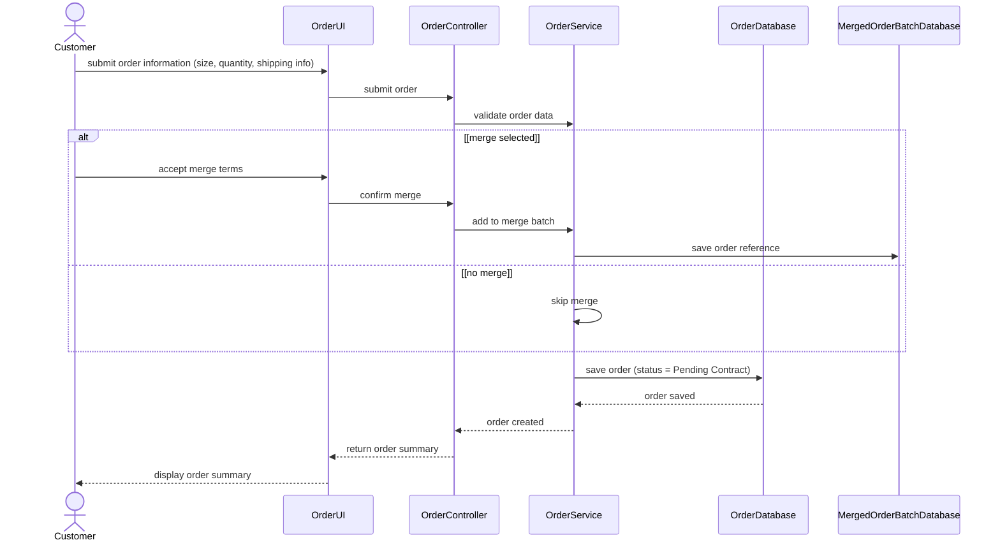
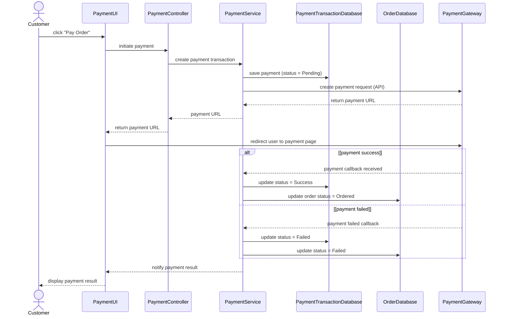

# Spec Document: Order & Payment

| Field | Value |
| --- | --- |
| Module ID | `MFG-06` |
| Module name | Order & Payment |
| Spec version | v1.0 |
| Author (team member) | Group B |
| Date | 2026-09-19 |
| Status | Draft |
| Approved by (Client role) | No approver assigned |
| DBIZ2 source | Historical IDs retained: Function List No. 47-52; `F-PAY-001` .. `F-PAY-006`; `UC-C05`, `UC-C12`; S16, S22-S25, S27, S34-S38. External DBIZ2 comparison is not required. |

---

## 1. Purpose and scope (mandatory)

This MVP Must module quotes checkout, creates an order and handles VNPay payment initiation, verified settlement, reconciliation, receipt and full refund state. Customer identity/prices come from server session and immutable snapshots.

**In scope:** checkout one orderable design; quote quantities/address/merge preference; idempotently create PendingContract order; initiate ORDER/SERVICE payment; validate server notification; reconcile and show receipt/refund state.

**Out of scope:** post-submission tracking/cancellation/fulfillment is MFG-07; contract generation/signing is MFG-09; SERVICE request creation is MFG-05.

## 2. Actors (mandatory)

| Actor | Role in this module | Where it comes from |
| --- | --- | --- |
| Customer | Quotes/submits own design and pays own resource | MFG-06 resolved contract; UC-C05/UC-C12 |
| VNPay | Hosts payment and sends signed server notification | MFG-06 payment integration contract |
| Company Admin | Reconciles/refunds authorized same-company transactions | MFG-06 role boundary |
| System | Locks, deduplicates, persists settlement and outbox | MFG-06 function contract |

## 3. User scenarios and acceptance criteria (mandatory)

### US-1 (Must): Finalize order

1. Valid owned Saved/Delivered design, quantities/address and current rules produce one 30-minute quote with complete integer-VND breakdown.
2. Submitting an unexpired quote atomically creates one PendingContract order with immutable product/design/address/price/merge snapshots; duplicate submit returns that order.
3. Changed product/design/rules/capacity or expired quote requires requote and explicit review.

### US-2 (Must): Make payment

1. ORDER payment is allowed only after signed contract moves the order to AwaitingPayment; SERVICE payment requires AwaitingPayment request.
2. A valid signed VNPay server notification with matching merchant/reference/amount/currency settles once and changes ORDER to Confirmed or SERVICE to Paid.
3. Browser return only reads/polls server state. Invalid/duplicate callbacks never double-confirm; failed attempt leaves resource payable.
4. Late success for cancelled/expired resource records funds and starts full refund without resurrecting the resource.

### Edge cases

- Invalid address/options/capacity blocks quote/order without write.
- One active Pending attempt exists per resource; repeated initiation reuses it.
- Provider outage returns 503/no false payment; reconciliation queries unresolved attempts.
- Refund failure remains visible and retryable.

## 4. Flows (mandatory)

### 4.1 Usage flow

```mermaid
flowchart LR
  Design[Eligible design] --> Checkout[S22 Checkout]
  Checkout --> Merge[S23 Merge preference]
  Merge --> Summary[S25 Quote review]
  Summary --> Order[PendingContract order]
  Order --> Contract[S34 Contract/sign]
  Contract --> Pay[S35 VNPay initiation]
  Pay --> Return[Receipt/poll]
  Return --> End[Confirmed or retry]
```

### 4.2 Sequence for the main flow

# UC-C05: Finalize order — SD-07: Create Order

# UC-C12: Make payment — SD-09: Make Order Payment

## 5. Functional requirements (mandatory)

### 5.1 Input / Output contract

| FR ID | DBIZ2 Subfunction ID | Requirement (system MUST ...) | Actor | Priority |
| --- | --- | --- | --- | --- |
| FR-001 | F-PAY-001 | Render checkout for the customer's eligible design and same-company Published product. | Customer | Must |
| FR-002 | F-PAY-002 | Recompute quote from validated quantities, address and merge choice with 30-minute expiry. | Customer | Must |
| FR-003 | F-PAY-003 | Atomically create one PendingContract order from a current quote with immutable snapshots and idempotency. | Customer | Must |
| FR-004 | F-PAY-004 | Initiate one payable ORDER or SERVICE payment attempt and return hosted-provider redirect details. | Customer | Must |
| FR-005 | F-PAY-005 | Verify and deduplicate provider notifications; settle once and support authorized reconciliation/full refund. | VNPay / Company Admin / System | Must |
| FR-006 | F-PAY-006 | Show the owner's payment receipt/state; browser return remains read-only. | Customer | Must |

### 5.1 Input / Output contract

| FR ID | Input field | Type | Required | Output field | Type | Notes / validation |
| --- | --- | --- | --- | --- | --- | --- |
| FR-001 | session, product/design UUID | Session / UUIDs | Yes | S22 checkout model | View model | Own Saved/Delivered design; Published same-company product |
| FR-002 | quantities, VN address, merge choice/version | Integers / address / values | Yes | quote, breakdown, expiry | Object | Capacity checked; server recomputes; 422 invalid; 409 stale |
| FR-003 | quote UUID/version, idempotency key, confirmation | UUID / integer / key / boolean | Yes | PendingContract order/snapshots | Object | Lock/revalidate/consume; duplicate returns original |
| FR-004 | ORDER order_id or SERVICE request_id, purpose/key | UUID / enum / key | Yes | payment/provider reference, redirect, expiry | Object | Payable state; one pending attempt; provider failure 503 |
| FR-005 | signed provider query or authorized reconcile/refund request | Query / IDs / version / key | Yes | acknowledged payment/refund state | Object | Verify signature, merchant, reference, amount, currency; full refund only |
| FR-006 | authenticated owner, payment/transaction ID | Session / UUID | Yes | receipt status/amount/purpose/next route | View model | Browser return cannot settle; ownership check; unknown 404 |

### 5.2 Business rules

| Rule ID | Rule | Why it exists |
| --- | --- | --- |
| BR-001 | `subtotal = sum(quantity × (unit price + option surcharge))`; eligible opted-in merge discount is `floor(subtotal × 5 / 100)`; default shipping 30000 VND; merge fee and tax default 0; `total = subtotal - discount + shipping`. | Define one server-authoritative quote formula. |
| BR-002 | Quote expires in 30 minutes; payment redirect expires in 15 minutes. | Bound quote and provider attempt validity. |
| BR-003 | The same authoritative amount appears on S23, S25, S34 and S35. | Prevent inconsistent customer-visible totals. |
| BR-004 | Order: PendingContract → AwaitingPayment only after signature → Confirmed only after verified full settlement. Failed payment does not change order state. | Enforce contract/payment gates. |
| BR-005 | Payment attempt: Pending → Succeeded/Failed/Expired; verified late success may promote Failed/Expired and never downgrade Succeeded. | Handle callback races and late notifications. |
| BR-006 | Refund: None → Pending → Succeeded/Failed; only full refund supported. | Define supported refund lifecycle. |
| BR-007 | Provider event/transaction IDs are permanently unique; idempotency keys are retained at least seven days. | Prevent replay and duplicate effects. |

## 6. Key entities (mandatory)

| Entity | Attributes (from Input/Output fields) | Relationships |
| --- | --- | --- |
| Quote | company/customer/product/design IDs+versions, quantities, address, merge/policy, price breakdown, expiry, version | Server-computed, owner-scoped, one-time consumed |
| Order | UUID, immutable product/design/address/price snapshots, status, contract/batch IDs, version | One order per consumed quote; no checkout batch creation |
| PaymentTransaction | resource purpose/id, amount, provider reference/transaction, state, expiry, version | Exactly one ORDER or SERVICE resource; settlement exactly once |
| Refund | payment_id, full amount, state, provider reference, version | Never resurrects cancelled/expired resource |

## 7. Screens involved

| Screen ID | Screen name | Priority | Screen Spec file |
| --- | --- | --- | --- |
| S22 | Create order/checkout | Must | `screens/S22-create_order_screen.md` |
| S23 | Merge option | Must | `screens/S23-merge_option_screen.md` |
| S24 | Merge terms | Must | `screens/S24-merge_terms_screen.md` |
| S25 | Order summary and quote review | Must | `screens/S25-order_summary_screen.md` |
| S34 | Contract handoff | Should | `screens/S34-contract_detail_screen_customer.md` |
| S35 | Order payment and receipt | Must | `screens/S35-order_payment_screen.md` |
| S16 | Service payment and receipt | Could | `screens/S16-design_service_payment_screen.md` |
| S27 | Customer refund state | Must | `screens/S27-customer_order_detail_screen.md` |
| S36/S37 | Admin payment list/detail | Must | `screens/S36-payment_transaction_list_screen.md` |
| S38 | Notifications | Should | `screens/S38-notification_panel_screen.md` |

## 8. Success criteria (mandatory)

| SC ID | Criterion | How it is measured |
| --- | --- | --- |
| SC-001 | Quote formula and amount remain consistent across review, contract and payment. | Compare rendered totals and stored snapshot amounts. |
| SC-002 | Duplicate order/payment/callback operations cannot create duplicate business effects. | Replay idempotent submissions and provider callbacks. |
| SC-003 | Browser return alone never marks payment successful; all six functions map one-to-one to FRs. | Verify return path is read-only and compare F-PAY IDs with FRs. |

## 9. Assumptions

- DBIZ 3 classroom demo by Group B; no approver; business/contact data are fictional samples.
- VNPay sandbox is used; merchant secrets are environment values and never documented.
- Order/payment is MVP Must; MFG-09 contract is Should but the documented order lifecycle retains its signing gate.

## 10. Open questions

| # | Question | Blocking? | Owner | Status |
| --- | --- | --- | --- | --- |
| 1 | Are any pricing, expiry, state, callback-authority, retry, reconciliation or refund decisions still undecided? | No | Group B | Resolved — no remaining open questions; sections 3–6 define the complete behavior. |

## 11. Traceability to DBIZ2

Historical IDs are retained; external DBIZ2 comparison is not required.

| Spec section | DBIZ2 source | Location |
| --- | --- | --- |
| Scope and actors | Function List MFG-06 | Rows 47–52; IDs appear in FR table |
| Finalize order | UC-C05; F-PAY-001..003 | S22-S25; SD-07; sections 3 and 5 |
| Make payment | UC-C12; F-PAY-004..006 | S16/S35-S37; SD-09; sections 3 and 5 |
| Contract handoff | MFG-09 signed event | S34; section 3 |

## Completion checklist

- [x] Scope, actors, scenarios, flows and edge cases are defined.
- [x] Pricing, state, idempotency, callback and refund contracts are explicit.
- [x] Function/entity/screen/ID traceability and MVP assumptions are complete.
- [x] No unresolved placeholders remain.
