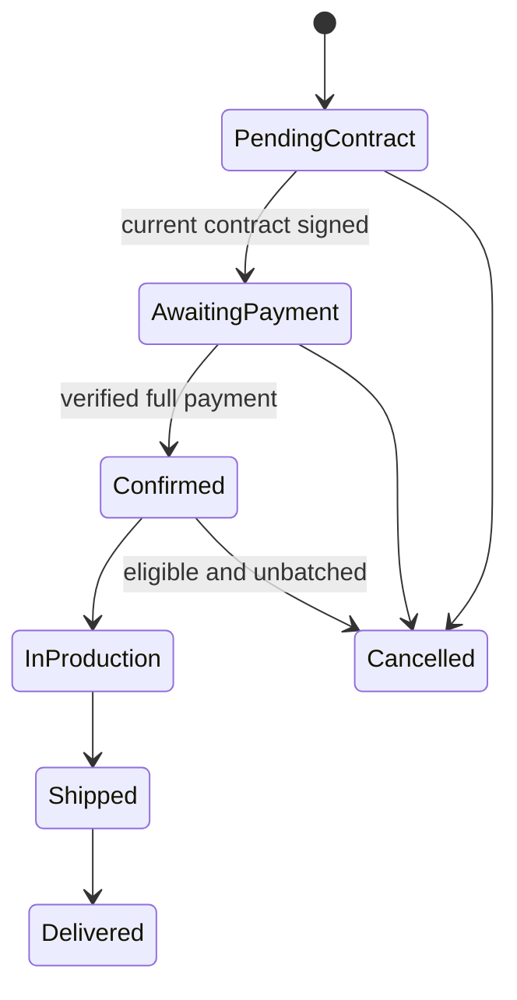

# MFG-07 — Order Tracking, Cancellation, and Fulfillment

**Canonical function identity:** `MFG-07/F-ORD-001` through `MFG-07/F-ORD-007`. MFG-08 independently reuses these local IDs; always qualify references by module. Complete-system scope applies. Shared contracts D01–D03, D06–D08, D11–D12 in [system-decisions.md](../docs/system-decisions.md) control. Human facts remain in [user-input-needed.md](../docs/user-input-needed.md).

## Actors and boundary

Customer reads own order history/details and may cancel their own order in allowed states. Company Admin lists same-company orders, may cancel with a reason, and advances production/shipping states. A Sales Consultant assigned to the customer may update fulfillment for orders in that company but cannot cancel. MFG-06 owns order creation, payment/refund settlement and immutable price/address snapshots; this module consumes verified payment and refund events. MFG-09 owns contract generation/signature. MFG-10 owns merge batches; batch membership constrains cancellation.

`Order` is UUID, company_id, customer_id, design_id/version, quote_id, policy_version, status, merge_opt_in, contract_id, batch_id nullable, immutable shipping address/quantity/price snapshots, tracking_number/carrier/shipped_at nullable, version, created_at, updated_at. States: PendingContract→AwaitingPayment→Confirmed→InProduction→Shipped→Delivered. PendingContract and AwaitingPayment may be cancelled; Confirmed may be cancelled only before production and while not batch-linked. A paid cancelled order remains Cancelled while MFG-06 processes a full refund. InProduction/Shipped/Delivered cancellation is prohibited. Batch-linked orders cannot cancel until an Admin dissolves their Planned batch. No inventory restock: made-to-order capacity is checked at quote/submit.

All object access is server-checked; customers require ownership and staff same-company scope. 401/403/404 follows D01. Mutations carry expected_version; stale writes return 409. Transactional outbox delivers notifications after commit.

## Function contracts and requirements

| FR / function | Inputs and output | Validation, effect, and failure |
|---|---|---|
| FR-001 / F-ORD-001 Order List View | Customer session, page/page_size, allowlisted status/date sort/filter; output order summary items,total,page,page_size. | Own orders only across customer's companies. Default newest first. Page >=1, page_size 1..100; invalid request 400. Empty results return empty page. |
| FR-002 / F-ORD-002 Order Detail View | order_id and session; output authorized order snapshot, status timeline, contract/payment/refund summaries, tracking and shipment details. | Never recalculate old prices from current catalog. Customer owner or same-company staff; inaccessible ID 404. Private contract/assets use expiring authorized links. |
| FR-003 / F-ORD-003 Cancel Exec Logic | order_id, reason_for_cancellation (trimmed 1..500), expected_version, Idempotency-Key; output `status=Cancelled` and refund workflow reference when payment succeeded. | Caller must be the owning Customer or same-company Company Admin; consultants cannot cancel. Lock order and validate transition. PendingContract/AwaitingPayment can cancel; Confirmed can cancel only before production and while unbatched. Batch-linked order must first be unlinked by dissolving its Planned batch. Production/shipped/delivered reject 409. For settled order, retain record and request full refund via MFG-06; never delete/restock. Duplicate key replays. If race with production/merge, one transition wins and loser receives 409. |
| FR-004 / F-ORD-004 Cancel Notify Logic | Internal cancellation event; output notification/outbox IDs. | Notify customer and same-company management after commit; refund status included when applicable. Deduplicate recipient/event; email failure cannot undo cancellation. |
| FR-005 / F-ORD-005 Admin Order Dashboard | Company Admin session, allowlisted status/date/customer filters, pagination; output same-company order list and counts. | No cross-company data; validate filters and pagination. Unknown filters 400. |
| FR-006 / F-ORD-006 Status Update Logic | order_id, target status, `carrier` and `tracking_number` when target is Shipped, expected_version, Idempotency-Key; output updated order/timeline. | Allow only Confirmed→InProduction→Shipped→Delivered; each step requires current predecessor and same-company Company Admin or consultant actively assigned to that customer in the company. Shipped requires carrier, tracking_number and server-recorded shipped_at. Paid verified payment must precede Confirmed. Batch start can atomically advance all eligible members through MFG-10. Invalid/stale transition 409, invalid fields 422. |
| FR-007 / F-ORD-007 Status Notify Logic | Internal committed status event; output durable notification/outbox IDs. | Notify order owner with new status, timestamp, safe tracking link; only after transaction commit. Event/recipient unique. Retry email per D03; inbox remains authoritative. |

### Flow and acceptance

Acceptance: customer sees only own orders and immutable amount/address snapshots; owning Customer or same-company Company Admin can cancel in an eligible state, with a full refund flow if paid, and notification after commit; a consultant or unrelated company cannot cancel; cancellation racing batch assignment or production yields one winner and one 409; attempts to skip states, cancel a production/shipped order, or cancel a batch-linked order are rejected; Company Admin or assigned same-company consultant can progress fulfillment only from the valid predecessor state; duplicate status command creates no duplicate timeline/notification; email outage preserves committed state and inbox notice; payment failure never fails the order.

Screens: S26 customer order history/detail, S27 order detail/refund status, S28 Company Admin order dashboard, S29 production management, S30 contract tab, S38 notifications. Traceability: MFG-07/F-ORD-001..007, FR-001..007; UC-C08 Track Order, UC-C07 Cancel Order, UC-S04 Update Status. Use the module prefix wherever cross-referencing because MFG-08 reuses F-ORD identifiers.
