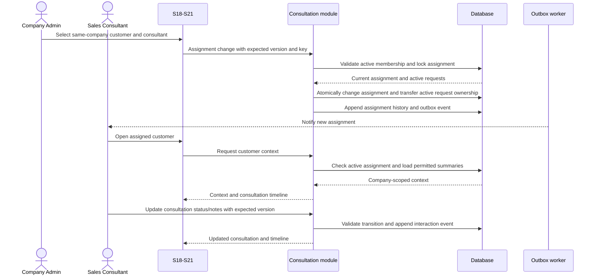

# Spec Document: Sales Consultant

| Field | Value |
| --- | --- |
| Module ID | `MFG-08` |
| Module name | Sales Consultant |
| Spec version | v1.1 |
| Author (team member) | Group B |
| Date | 2026-09-22 |
| Status | Draft |
| Approved by (Client role) | No approver identified |
| DBIZ2 source | Function List MFG-08, No. 60–67, `F-ORD-001`–`F-ORD-008`; UC-S01, UC-S02, UC-C19; screens S18–S21 and S38 |

---

## 1. Purpose and scope (mandatory)

Company Admins assign company customers to Sales Consultants. Consultants see assigned customer context and record consultation progress. Customers may see their own design request status and deliveries through MFG-05, but never internal CRM notes. Approved/assigned design requests remain MFG-05 records; when customer assignment changes, all active Assigned/InProgress requests transfer atomically with the assignment. Contract, order and payment state belongs to their owning modules.

MVP priority: **Could**. Complete-system target includes all eight functions. `F-ORD-001`–`F-ORD-007` are reused by MFG-07 for different functions; all references here mean `MFG-08/F-ORD-nnn`.

## 2. Actors (mandatory)

| Actor | Role in this module | Where it comes from |
| --- | --- | --- |
| Company Admin | Reviews same-company customer activity and assigns/reassigns consultants | MFG-08 resolved permissions; UC-C19 |
| Sales Consultant | Reads only assigned same-company customers and records consultation updates | MFG-08 resolved permissions; UC-S01/UC-S02 |
| Customer | Owns customer profile and may view own customer-facing design request status; cannot read CRM notes | MFG-05 boundary |
| System | Persists assignment/status events and sends notifications | MFG-08 function contract |

## 3. User scenarios and acceptance criteria (mandatory)

### US-1: Assign consultant (Could)

As a Company Admin, assign an active Sales Consultant in the same company to a customer. The assignment is unique per company/customer. Approved requests receive first assignment; reassignment transfers all active Assigned/InProgress requests in one transaction, retaining their state and committed due date.

1. **Given** a same-company active consultant and eligible customer, **when** the Admin assigns them, **then** one active assignment is committed and affected active design requests are transferred atomically.
2. **Given** the consultant is inactive or belongs to another company, **when** assignment is submitted, **then** it is rejected; no partial changes occur.
3. **Given** concurrent assignment or request changes, **when** versions conflict, **then** one valid transaction wins and stale writes return 409.
4. **Given** assignment commits, **when** notification is sent, **then** the consultant receives one authorized context link; email failure leaves the in-app notice.

### US-2: View assignment and customer context (Could)

Consultants view only active same-company assignments, relevant customer context, requests/orders and chronological interaction history. Company Admins may inspect company records. Internal notes are visible only to assigned consultants and same-company Admins.

1. **Given** a consultant has no active assignment, **when** customer context is requested, **then** access is denied without exposing another customer's data.
2. **Given** interaction history is requested, **when** returned, **then** it is paginated and chronological with source channel, kind, timestamp and related record IDs.

### US-3: Update consultation (Could)

An assigned consultant records notes and advances consultation status. A Company Admin may reopen a closed consultation to InProgress.

1. **Given** a valid current status, **when** an authorized update follows the allowed transition, **then** the new status, notes and timeline are persisted.
2. **Given** a closed consultation is reopened, **when** the requester is not a same-company Admin, **then** the transition is rejected.
3. **Given** a duplicate or stale update, **when** submitted, **then** it is idempotent or returns 409 without overwriting newer notes.

### Edge cases

- Notes are trimmed and limited to 1–5000 characters; invalid notes/status return 422.
- Inaccessible object IDs return 404; prohibited actions return 403.
- External conversations are recorded as summaries; this module does not provide real-time chat or an external inbox.

## 4. Flows (mandatory)

### 4.1 Usage flow

```mermaid
flowchart LR
  Admin[Company Admin] --> Review[Review same-company customers]
  Review --> Assign[Assign active same-company consultant]
  Assign --> Transfer[Atomically transfer affected active design requests]
  Transfer --> Notify[Persist assignment notification]
  Notify --> Context[Consultant opens authorized context]
  Context --> Interactions[Read permitted history]
  Interactions --> Update[Record interaction and advance consultation]
```

### 4.2 Sequence for the main flow

## 5. Functional requirements (mandatory)

| FR ID | DBIZ2 Subfunction ID | Requirement (system MUST ...) | Actor | Priority |
| --- | --- | --- | --- | --- |
| FR-001 | F-ORD-001 | List same-company customers without active assignment, with relevant company request/order summaries and pagination. | Company Admin | Could |
| FR-002 | F-ORD-002 | Show company-specific customer/contact data, request/order summaries and current assignment. | Company Admin | Could |
| FR-003 | F-ORD-003 | Assign/reassign an active same-company consultant with version checks, idempotency and atomic paired assignment of affected approved/assigned design requests; `committed_due_at` is the company's commitment, not the customer's requested deadline. | Company Admin | Could |
| FR-004 | F-ORD-004 | Notify the newly assigned consultant with authorized customer context after commit; reassignment also notifies affected staff and customer; deduplicate and retry delivery. | System | Could |
| FR-005 | F-ORD-005 | List only the consultant's active same-company assignments with pagination and allowlisted filters. | Sales Consultant / Company Admin | Could |
| FR-006 | F-ORD-006 | Return authorized customer context and chronological interaction history without exposing another company's records or CRM notes to customers. | Assigned Sales Consultant | Could |
| FR-007 | F-ORD-007 | Show consultation status, notes and linked record summaries to assigned consultant or same-company Admin. | Assigned Sales Consultant / Company Admin | Could |
| FR-008 | F-ORD-008 | Advance valid consultation status with trimmed 1–5000 character notes, version checks and idempotency; only Admin may reopen a closed consultation. | Assigned Sales Consultant / Company Admin | Could |

### 5.1 Input / Output contract

| FR ID | Input field | Type | Required | Output field | Type | Notes / validation |
| --- | --- | --- | --- | --- | --- | --- |
| FR-001 | page, page_size, filters | Integers / allowlisted values | Optional | unassigned company customers and activity summaries | Paginated object | Relevant company activity only; page_size 1–100; invalid filters 400; empty list valid |
| FR-002 | customer_id | UUID | Yes | company customer profile, history summaries, assignment | Object | Same-company relationship required |
| FR-003 | customer_id, consultant_user_id, expected versions, request IDs, committed_due_at, Idempotency-Key | UUIDs, versions, timestamps, key | Yes | assignment and affected request assignments/due dates | Object | Due date after now and is the company's promise; first assignment only for Approved request (Simple or accepted Complex fee); delivered history unchanged |
| FR-004 | committed assignment event | Internal event | Yes | durable notification/outbox ID | UUID | In-app inbox authoritative |
| FR-005 | page, page_size, filters | Integers / allowlisted values | Optional | consultant assignment summaries | Paginated object | Active assigned customers only; Admin may inspect company list |
| FR-006 | customer_id | UUID | Yes | company/customer context, product interest, customer-visible request/order summaries and interaction_history_logs | Object/chronological array | Same-company active assignment required; internal notes only through authorized consultation detail |
| FR-007 | consultation_id | UUID | Yes | status, notes, linked summaries, version | Object | Assigned consultant or same-company Admin |
| FR-008 | consultation_id, new_status, notes, expected_version, Idempotency-Key | UUID, enum, string, version, key | Yes | consultation and timeline | Object | Notes 1–5000 chars; valid transition required |

### 5.2 Business rules

| Rule ID | Rule | Why it exists |
| --- | --- | --- |
| BR-001 | One active assignment exists per company/customer; assignment history is retained. | Preserve accountable ownership. |
| BR-002 | First request assignment requires Approved status (Simple or accepted Complex fee); reassignment transfers all active Assigned/InProgress requests atomically while retaining their state and committed due date. | Keep CRM and design-service ownership consistent. |
| BR-003 | Notes are private to assigned consultant and same-company Admin; customer cannot read internal notes. | Protect internal CRM records. |
| BR-004 | Interaction logs are append-only; corrections reference prior events and never erase audit history. | Preserve interaction history. |
| BR-005 | Status transitions: New→Contacted/ClosedLost; Contacted→InProgress/ClosedLost; InProgress→ClosedLost/ClosedWon; Admin alone may reopen a closed consultation to InProgress. | Keep consultation lifecycle controlled. |

Interaction history uses source_channel InApp, Email, Phone or Chat and kind Note, StatusChange, Assignment or DesignDelivery. Staff manually record external conversation/chat summaries as notes with source channel and occurred_at; no real-time chat or external inbox integration is implied. Committed assignment, request and delivery events append immutable entries. A correction appends a new entry referencing the prior event; it never erases history and does not send an external message.

## 6. Key entities (mandatory)

| Entity | Attributes (from Input/Output fields) | Relationships |
| --- | --- | --- |
| CustomerAssignment | company_id, customer_id, consultant_user_id, assigned_by, assigned_at, version | Unique active company/customer assignment; assignment history retained. |
| Consultation | UUID, company_id, customer_id, consultant_id, notes, related_request_ids/order_ids, status, version, timestamps | Belongs to company/customer and assigned consultant; links relevant requests/orders. |
| Interaction history event | id, company_id, customer_id, consultant_id, source_channel, kind, occurred_at, summary, related_request_id?, related_order_id? | Chronological immutable customer/company interaction. |

## 7. Screens involved

| Screen ID | Screen name | Priority | Screen Spec file |
| --- | --- | --- | --- |
| S18 | Company assignment/customer list | Could | Module screen |
| S19 | Assignment editor | Could | Module screen |
| S20 | Consultant customers/context | Could | Module screen |
| S21 | Consultation detail | Could | Module screen |
| S38 | Notifications | Could | Shared notification screen |

## 8. Success criteria (mandatory)

| SC ID | Criterion | How it is measured |
| --- | --- | --- |
| SC-001 | Assignment and design-request ownership change atomically and remain same-company. | Verify reassignments, versions and rollback on conflicting request. |
| SC-002 | Consultants see only assigned customer records and authorized interaction history. | Verify assigned, unassigned, cross-company and customer access. |
| SC-003 | Consultation status and notes are auditable and duplicate/stale writes do not lose data. | Verify transition matrix, version conflict and append-only corrections. |

## 9. Assumptions

- Company membership and role are resolved server-side.
- Manual interaction summaries do not send messages or imply live chat integration.
- MVP priority is Could; the full module remains in the complete-system specification.

## 10. Open questions

| # | Question | Blocking? | Owner | Status |
| --- | --- | --- | --- | --- |
| 1 | Resolved decisions: Group B; course DBIZ 3; no approver identified; course/demo use only; MVP priority Could. | No | Group B | Resolved |
| 2 | No remaining open questions. | No | Group B | Resolved |

## 11. Traceability to DBIZ2

| Spec section | DBIZ2 source | Location |
| --- | --- | --- |
| 1–2 Scope and actors | MFG-08 Function List No. 60–67 | `F-ORD-001`–`F-ORD-008`; module-qualified namespace |
| 3 Scenarios | UC-S01, UC-S02, UC-C19 | Use-case names and resolved contract in this specification |
| 4 Flow | Assignment and consultation lifecycle | Current MFG-08 resolved requirements |
| 5–6 FRs and entities | `F-ORD-001`–`F-ORD-008` | Function List MFG-08; MFG-07 reuses local IDs |
| 7 Screens | S18–S21, S38 | Screen List and current module contract |

## Completion checklist

- [x] All eight MFG-08 functions have FR rows and contracts.
- [x] Assignment, request transfer, privacy, interaction history and status rules are included.
- [x] MFG-qualified function identity is used for cross-module references.
- [x] Resolved inputs are recorded and no unresolved placeholders remain.
- [x] Traceability identifies the source module and screen IDs.

Template source: DBIZ3 Product Design Package specification template.

DBIZ3, FTU.
