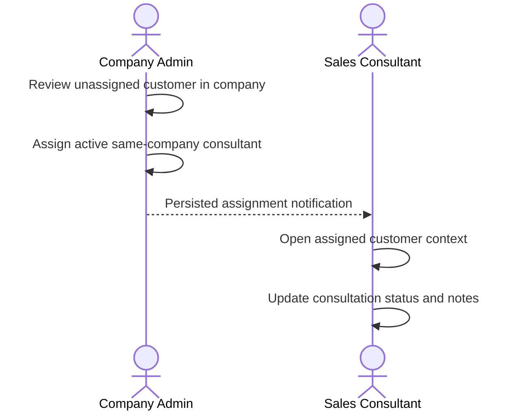

# MFG-08 — Consultant Assignment and CRM Consultation

**Canonical function identity:** `MFG-08/F-ORD-001` through `MFG-08/F-ORD-008`. MFG-07 independently reuses its first seven local IDs; always qualify references by module. Complete-system scope applies. Decisions D01–D05, D11–D12 in [system-decisions.md](../docs/system-decisions.md) govern; factual human inputs belong only in [user-input-needed.md](../docs/user-input-needed.md).

## Actors and module boundary

Company Admin reviews company customers/consultations and assigns an active same-company Sales Consultant. Consultants see only assigned customer context and update consultation progress. Customers can see their own design request status/deliveries through MFG-05 but never internal CRM notes. This module manages customer-to-consultant assignment and CRM records. Design requests remain separate MFG-05 entities; if assigning a consultant to a customer with a paid design request, the assignment and request assignment must be updated atomically or both remain unchanged. Contract/order/payment mutations belong to their modules.

`CustomerAssignment`: company_id, customer_id, consultant_user_id, assigned_by, assigned_at, version; unique active assignment per company/customer. `Consultation`: UUID id, company_id, customer_id, consultant_id, notes, related_request_ids/order_ids, status New|Contacted|InProgress|ClosedWon|ClosedLost, version, timestamps. Notes are private to assigned consultant and Company Admin. Assignment history is retained. Role/access checks occur server-side; inaccessible object identifiers return 404, prohibited actions 403.

## Function contracts and requirements

| FR / function | Inputs and output | Validation, effect, and failure |
|---|---|---|
| FR-001 / F-ORD-001 Unassigned Customer View | Admin session, page/page_size and allowlisted filters; output company-scoped customers without active assignment, with summary of own-company request/order activity. | Same-company Admin only. Include a customer when there is relevant company activity; no cross-company aggregation. Empty list is valid. Pagination 1..100; bad filters 400. |
| FR-002 / F-ORD-002 Customer Detail View | customer_id, Admin session; output company-specific profile/contact, request/order history summaries and current assignment. | Same-company customer relationship required; expose no internal notes from another company. 404 for inaccessible ID. Read-only. |
| FR-003 / F-ORD-003 Assign Sales Logic | customer_id, consultant_user_id, expected customer/assignment version, optional paired paid request IDs with expected request versions and `committed_due_at`, Idempotency-Key; output assignment and affected request assignments/due dates. | Admin must belong to company; consultant must be active Sales Consultant in same company. Transaction locks customer/current assignments and each request; one active consultant per company/customer. A request can first be assigned only when Paid and owned by this customer/company. Reassigning a customer must atomically transfer all their Assigned/InProgress requests to the new consultant, retaining current states and committed due dates; delivered historical ownership is unchanged. Assigned consultant must match the active customer assignment or customer and request must be atomically reassigned together. `committed_due_at` is required for each assigned request and must be after now; it is an explicit company commitment, not the customer's requested deadline. First assignment transitions Paid→Assigned; reassignment leaves Assigned/InProgress unchanged and notifies affected staff/customer. Duplicate request with same key is replayed; conflicting active assignment 409; inactive/cross-company consultant 422; stale request 409. |
| FR-004 / F-ORD-004 Assign Notify Logic | Internal assignment event; output durable notification/outbox event ID. | Notify newly assigned consultant with authorized customer context link after commit; do not include sensitive history in email. Deduplicate; in-app inbox authoritative, email retry per D03. |
| FR-005 / F-ORD-005 Assigned Customer View | Consultant session, pagination and allowlisted filters; output only that consultant's active same-company assignments and summaries. | Consultant assignment must be active; Admin may inspect company list. Unassigned/cross-company customers excluded. |
| FR-006 / F-ORD-006 Context View | customer_id, consultant session; output company/customer context, related product interest, customer-visible request/order summaries and relevant interactions. | Must have active assignment in same company. Filter all related records to that company and authorized customer. CRM internal notes are available only through authorized consultation detail, not exposed to customer. |
| FR-007 / F-ORD-007 Consultation Detail | consultation_id, assigned consultant or same-company Admin; output status, notes and linked record summaries. | Inaccessible IDs return 404. Optimistic version included for later edits. Read-only view. |
| FR-008 / F-ORD-008 Update Status Logic | consultation_id, new_status, trimmed notes (1..5000 chars), expected_version, Idempotency-Key; output updated consultation/timeline. | Allowed: New→Contacted/ClosedLost; Contacted→InProgress/ClosedLost; InProgress→ClosedLost/ClosedWon. Reopen closed to InProgress only by Company Admin. Consultant must be assigned and same-company. Duplicate/stale transition 409; invalid notes/status 422. Does not alter order or design request state. |

## Flow and acceptance

Acceptance: Admin assigns an active consultant and consultant receives one notice; cross-company/inactive membership is rejected; concurrent assignment attempts yield one assignment and one 409; paid design request assignment stays consistent with the customer assignment; consultant sees only assigned customer and company context; another consultant cannot read notes; valid status progression succeeds while reopening a closed consultation requires Admin; duplicate/stale updates do not overwrite newer notes; notifications remain visible in inbox if email fails.

Screens: S18 company assignment/customer list, S19 assignment editor, S20 consultant customers/context, S21 consultation detail, S38 notifications. Traceability: MFG-08/F-ORD-001..008 and FR-001..008; UC-C19, UC-S01, UC-S02. Prefix IDs with MFG-08 in all cross-module references due to duplicate local F-ORD identifiers in MFG-07.

## Interaction-history contract

MFG-08/F-ORD-006 returns interaction_history_logs as a paginated chronological array of `{id,company_id,customer_id,consultant_id,source_channel,kind,occurred_at,summary,related_request_id?,related_order_id?}`. source_channel is InApp, Email, Phone or Chat; kind is Note, StatusChange, Assignment or DesignDelivery. Staff manually record external conversation/chat summaries through F-ORD-007/008 notes (1..5000 characters) with source_channel and occurred_at; there is no implied real-time chat or external inbox integration. Committed request/assignment/delivery events append their own immutable timeline entries. Assigned consultants and company admins can view it; customers cannot read internal notes. No external messages are sent by recording a summary. Edits append a correction entry referencing the old event; they never erase the audit history.
