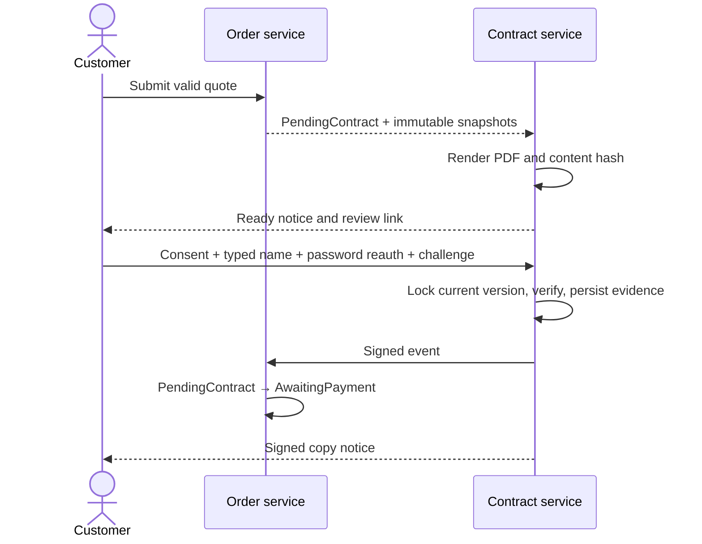

# MFG-09 — Contract Templates, Order Contracts, and Signing

**Contract:** Complete-system target. Decisions D01–D03, D06–D08, D11–D12 in [system-decisions.md](../docs/system-decisions.md) govern. Human facts belong only in [user-input-needed.md](../docs/user-input-needed.md).

## Actors and boundaries

Company Admin manages versioned contract templates and generates/regenerates an order contract before signing. Customer reviews and signs only their own current contract. This module generates server-side PDFs and records an application acknowledgement with audit evidence; it does not claim certified digital signature. MFG-06 owns order creation/snapshots; MFG-07 owns fulfillment/cancellation. This module atomically changes PendingContract to AwaitingPayment only after successful signing. MFG-06 owns payment. Contract states are Draft→Ready→Signed; Draft/Ready may become Superseded, and Draft/Ready/Signed may become Voided when an eligible order cancellation occurs. A Signed contract is immutable; voiding is auditable and retains the signed artifact/evidence.

`ContractTemplate`: UUID id, company_id, name, version, structured body, active flag, created/updated_at, version. Publish creates immutable version; only allowlisted placeholders from authoritative order/customer/address snapshots. `Contract`: UUID id, order_id, company_id, version, template_version, content_hash, PDF asset UUID, status Draft|Ready|Superseded|Signed|Voided, ready_at, signed_at/voided_at nullable, signature_evidence nullable, version. `SignatureEvidence`: signer_id from session, typed_name, consent_text_version, contract_hash, server_timestamp, server-observed IP/user_agent, challenge digest. Never accept client-reported signer identity/IP.

## Function contracts and requirements

| FR / function | Inputs and output | Validation, effect, and failure |
|---|---|---|
| FR-001 / F-CONTR-001 Template Select View | Admin session, order_id/order_type; output compatible active template list (id/version/name). | Same-company Admin; order must be PendingContract. No cross-company templates. Empty templates return actionable empty state, generation blocked until a valid template exists. |
| FR-002 / F-CONTR-002 Template Detail View | template_id/version; output rendered preview model with placeholder map. | Same-company Admin; resolve only allowlisted placeholders, escape text, never execute template code. Missing required source snapshot is validation failure. |
| FR-003 / F-CONTR-003 Fill Contract Logic | order_id, template_id/version, expected order version; output immutable draft data and content hash. | Lock order; derive customer, address, item, amounts, policy and company from stored snapshots. Same total as quote/payment screens per D06. Template must be active/current and same-company. Stale order/template 409; unavailable placeholder 422. |
| FR-004 / F-CONTR-004 Render PDF Logic | draft contract data, template version, Idempotency-Key; output contract_id/version, PDF asset UUID and authorized expiring download URL. | Server-side PDF generation; persist content hash and Ready state transactionally. PendingContract order only. Retry returns same result; same key/different payload 409. Failed render leaves no Ready contract and is retryable. Private asset access checked on download. |
| FR-005 / F-CONTR-005 Ready Notify Logic | Internal Ready contract event; output outbox notification ID. | Notify order owner with review route and authorized PDF link after commit. Inbox authoritative; email retries per D03 and cannot roll back contract. Deduplicate event/recipient. |
| FR-006 / F-CONTR-006 Contract List View and Template Management | Admin session, paginated filters for contract status/order/customer; output contract table/detail links. Template create/update/publish/archive inputs: name, structured content, expected_version; output template detail/version. | UC-C15 requires template CRUD/versioning within this existing function scope in addition to the contract list. Validate required fields and allowlisted placeholders; archive prevents new use but preserves past contracts. Publishing creates immutable template version. Admin same-company only. Duplicate/stale version 409; invalid fields 422. Existing Ready contract PDF/hash is never mutated by template edits. |
| FR-007 / F-CONTR-007 Contract Update Notify Logic | order_id, current contract_id/version, revised template/version, expected order version, Idempotency-Key; output superseded and new Ready contract references plus notification/outbox ID. | Before signature and while order PendingContract, regenerate from immutable order snapshot; require successful PDF storage before Ready, supersede old unsigned version and require customer review/signature again. Notify after commit. Signed version cannot be updated; when the order is cancelled in an eligible state D07 transitions contract to Voided and retains artifact/evidence. |
| FR-008 / F-CONTR-008 E-Sign Logic | Customer session, contract_id/version/hash, consent=true, typed_full_name, current_password reauthentication, one-time challenge, Idempotency-Key; output Signed contract metadata and evidence receipt. | Customer owns order; contract is current Ready version and order PendingContract. Reauth within 5 minutes; challenge bound to contract ID/version/hash, single use, expires in 10 minutes. Typed name must match account full name after trim/case-normalization; explicit consent required. Transaction locks contract/order; stale/superseded 409. Signing is auditable application acknowledgement, not qualified signature. Same key/payload returns signed version. |
| FR-009 / F-CONTR-009 Signed Notify Logic | Internal signing event; output outbox delivery IDs for both parties. | Generate signed copy after commit and notify customer plus same-company management with authorized download links. Deduplicate; email failure does not rollback. Only successful signature changes order PendingContract→AwaitingPayment. |

## Signing flow and acceptance

Acceptance: Admin can create/publish a template version and old contracts stay unchanged; PDF reflects exact order snapshot and same VND total shown on all screens; customer signs current version only with password reauthentication, explicit consent, typed name and valid one-time challenge; missing consent, mismatch, expired challenge, bad password or stale version leaves order/contract unsigned; concurrent sign/revision allows one winner only; duplicate signing is idempotent; signed contract cannot be edited; notification email outage leaves Ready/Signed state and in-app notice intact; unauthorized users cannot download PDF.

Screens: S30 contract list and templates tabs, S31 create contract template, S32 edit contract template, S33 Company Admin contract detail, S34 customer contract review/signature, S38 notifications. Traceability: F-CONTR-001..009 / FR-001..009; UC-C14, UC-C15, UC-C11. Cross-references use immutable contract/template version and content hash.
