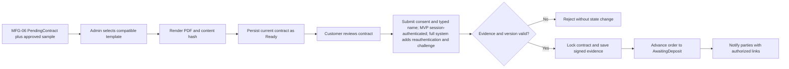

# Spec Document: Contract Management

| Field | Value |
| --- | --- |
| Module ID | `MFG-09` |
| Module name | Contract Management |
| Spec version | v2.0 |
| Author (team member) | Group B |
| Date | 2026-09-23 |
| Status | Draft |
| Approved by (Client role) | No approver identified |
| DBIZ2 source | Function List MFG-09, No. 68–76, `F-CONTR-001`–`F-CONTR-009`; UC-C10, UC-C09, UC-C11, UC-C14, UC-C15, UC-C13; screens S30–S34 and S38 |

---

## 1. Purpose and scope (mandatory)

Sales Admins manage versioned templates and generate or regenerate an order contract only after the Customer has approved the received physical sample. Customers review and sign only their own current contract. The contract binds the approved digital-design version, physical-sample evidence, commercial total, deposit percentage and remaining-balance formula. The system generates PDFs and records an auditable application acknowledgement; it does not claim a certified digital signature. Successful signing atomically advances the order from `PendingContract` to `AwaitingDeposit`. MFG-06 owns order creation and payment; MFG-07 owns fulfillment/cancellation.

MVP priority: **Should** for the complete module. The MVP includes one fixed-template contract snapshot and Customer acknowledgement after physical-sample approval, as a required MFG-06 dependency; full template administration, regeneration tooling and stronger signature workflows remain deferred. This acknowledgement is not a certified digital signature. The complete-system contract lifecycle is specified here.

## 2. Actors (mandatory)

| Actor | Role in this module | Where it comes from |
| --- | --- | --- |
| Sales Admin | Manages Dony templates/contracts and generates or updates unsigned contracts | MFG-09 contract |
| Customer | Reviews and signs own current Ready contract; receives signed copy | MFG-09 contract; UC-C09/UC-C11 |
| System | Renders PDF, validates evidence, transitions order after signing and sends notifications | MFG-09 function contract |
| MFG-06 / MFG-07 | Supplies immutable order snapshots and cancellation events | Module boundaries |

## 3. User scenarios and acceptance criteria (mandatory)

### US-1: Manage templates and generate contract (Should; MVP fixed-template slice)

Full system: Sales Admin selects a compatible active template for a Dony `PendingContract` order whose current physical sample is Approved, previews allowlisted placeholders, and generates a server-rendered PDF from immutable customer/order/address/design/sample/payment-policy snapshots. MVP: Sales Admin opens the approved-sample order on S33 and explicitly selects Generate; the system uses the single preconfigured fixed template without exposing a template picker or template CRUD. Generation is not automatic and requires the Sales Admin action.

1. **Given** no compatible template exists or the physical sample is not Approved, **when** generation is requested, **then** an actionable state appears and generation is blocked.
2. **Given** a template is published or edited, **when** a new version is created, **then** prior contract PDFs and hashes remain unchanged.
3. **Given** required snapshot data is unavailable or the order/template version is stale, **when** generation runs, **then** it fails without creating a Ready contract.

### US-2: Review and sign contract (Should; MVP uses reduced acknowledgement evidence)

Full system: Customer signs only the current Ready version for their own PendingContract order using explicit consent, matching typed name, current-password reauthentication, and a single-use challenge tied to contract ID/version/hash. MVP: the already-authenticated Customer gives consent and matching typed name; the session, contract version and content hash are recorded, with no password re-entry or one-time challenge.

1. **Given** all signature evidence is valid and still references the approved sample/design and current order total, **when** signing commits, **then** evidence is stored and the order advances to `AwaitingDeposit`.
2. **Given** in MVP consent is missing, the authenticated session is invalid, name mismatches, or contract version is stale—or in the full system reauthentication fails or the challenge expires/is reused—**when** signing is attempted, **then** no signature or order transition commits.
3. **Given** a contract is signed, **when** it is later cancelled through an eligible order cancellation, **then** it is auditably Voided and its signed artifact/evidence is retained.

### US-3: Update and notify contract (Should)

Before signing, Admin may regenerate from the immutable order snapshot. The prior unsigned version becomes Superseded, and the customer must review/sign the new Ready version.

1. **Given** a Ready contract is regenerated, **when** the new PDF is successfully stored, **then** only then is the prior unsigned version superseded and the customer notified.
2. **Given** a notification email fails, **when** delivery is retried, **then** contract state remains committed and the in-app notice remains available.

### Edge cases

- Same idempotency key and payload replays; changed payload with the same key returns 409.
- Private PDF access requires an authorized expiring link.
- Signed contracts cannot be edited; cancellation voiding is retained in the audit history.

## 4. Flows (mandatory)

### 4.1 Usage flow

### 4.2 Sequence for the main flow

The canonical contract-generation/signing message flow is [SD-08 in the architecture sequence catalogue](../docs/architecture/sequence.md#uc-c09-viewsign-contract--sd-08-view-and-sign-digital-contract). That flow is the full-system path; the MVP evidence reduction and fixed-template/manual-generation behavior above take precedence for MVP.

## 5. Functional requirements (mandatory)

| FR ID | DBIZ2 Subfunction ID | Requirement (system MUST ...) | Actor | Priority |
| --- | --- | --- | --- | --- |
| FR-001 | F-CONTR-001 | List compatible active templates only for Dony `PendingContract` orders with a current Approved physical sample. | Sales Admin | Should |
| FR-002 | F-CONTR-002 | Preview safe rendered placeholders from an authorized template version. | Sales Admin | Should |
| FR-003 | F-CONTR-003 | Fill immutable draft contract from authoritative stored order/customer/address/item/amount/policy snapshots, including approved design/sample references, separate design_fee_vnd, source_design_request_id, deposit_percent, deposit_due_vnd and the balance formula. | Sales Admin | Should |
| FR-004 | F-CONTR-004 | Render the separate snapshotted design-fee line and persist PDF/hash as Ready transactionally with idempotency and private asset access. | System | Should |
| FR-005 | F-CONTR-005 | Notify customer of Ready contract after commit using authorized review link. | System | Should |
| FR-006 | F-CONTR-006 | List contracts and create/update/publish/archive versioned templates with allowlisted placeholders including design_fee_vnd and source_design_request_id. | Sales Admin | Should |
| FR-007 | F-CONTR-007 | Regenerate unsigned `PendingContract` documents from the same approved sample and commercial snapshots, preserving fee/deposit terms without manual override, supersede the prior version after storage, and notify; a revised design/sample requires a new approval cycle rather than silent regeneration. | Sales Admin / System | Should |
| FR-008 | F-CONTR-008 | Record consent and matching name against the authenticated Customer session, contract version and hash. MVP uses this evidence; full system additionally enforces recent reauthentication and one-time challenge. | Customer | Should |
| FR-009 | F-CONTR-009 | Notify customer and Dony Sales Admins after successful signing; only then advance order `PendingContract→AwaitingDeposit`. | System | Should |

### 5.1 Input / Output contract

| FR ID | Input field | Type | Required | Output field | Type | Notes / validation |
| --- | --- | --- | --- | --- | --- | --- |
| FR-001 | order_id, order_type, approved_sample_id | UUID / enum / UUID | Yes | compatible template IDs, versions, names | Array | Sales Admin; PendingContract plus current Approved sample only |
| FR-002 | template_id, version | UUID / integer | Yes | preview model and placeholder map | Object | Allowlist and escape text; no template code execution |
| FR-003 | order_id, template_id/version, expected order version | UUIDs / integers | Yes | immutable draft and content_hash | Object/hash | Missing snapshot/fee value 422; stale data 409 |
| FR-004 | draft, template version, Idempotency-Key | Object/version/key | Yes | contract_id/version, PDF asset ID, expiring URL | Object | Retry same payload replays |
| FR-005 | Ready contract event | Internal event | Yes | outbox notification ID | UUID | After commit; deduplicated |
| FR-006 | filters; template name/content/expected_version | Values / structured body / integer | Optional by action | contract list or versioned template | Paginated object | Sales Admin; create/update/publish/archive; archive blocks new use and preserves past contracts; stale/duplicate 409; invalid fields 422 |
| FR-007 | order/contract/template versions, expected order version, Idempotency-Key | UUIDs/versions/key | Yes | superseded/new Ready references and notice ID | Object | Signed version and fee snapshot immutable |
| FR-008 | contract ID/version/hash, consent, typed name, key; post-MVP current password and one-time challenge | Values | MVP fields required; post-MVP fields conditional | Signed metadata and evidence receipt | Object | Typed name matches account full name after trim/case normalization; MVP requires active authenticated session; post-MVP reauth ≤5 min and challenge bound to ID/version/hash, expires in 10 min and is single-use |
| FR-009 | committed signing event | Internal event | Yes | delivery IDs and signed-copy links | UUIDs/authorized URLs | Notify both parties after commit |

### 5.2 Business rules

| Rule ID | Rule | Why it exists |
| --- | --- | --- |
| BR-001 | Contract states are Draft→Ready→Signed; Draft/Ready can become Superseded; Draft/Ready/Signed may become Voided on eligible cancellation. | Keep contract and order lifecycle aligned. |
| BR-002 | Published template versions and signed contracts are immutable. | Preserve the reviewed and signed artifact. |
| BR-003 | Placeholder values come only from authoritative order/customer/address/design/sample/payment-policy snapshots and allowlisted fields, including design_fee_vnd, source_design_request_id, approved_sample_id, deposit_percent and deposit_due_vnd; never current configuration or manual overrides. | Prevent untrusted template execution or commercial drift. |
| BR-004 | Successful signature evidence is application acknowledgement, not a certified digital signature. | State the signature capability accurately. |
| BR-005 | Only a current Ready contract for an owned `PendingContract` order with the same current Approved sample/design can be signed; successful signature alone advances the order to `AwaitingDeposit`. | Prevent signing stale terms or taking a deposit before sample approval. |

Contract amounts must match the quote/payment screens using the same VND snapshot. Show design_fee_vnd as a separate line outside merchandise subtotal, including 0 for MVP, free or repeat orders; use the MFG-06 allocation snapshot and never add another fee. The contract must also show `deposit_due_vnd = floor(contract_total_vnd × deposit_percent / 100)`, `balance_due_vnd = contract_total_vnd − accepted_deposit_vnd − accepted_order_credit_vnd`, and the snapshotted payment rule that the balance is due 7 calendar days after verified delivery (MFG-06 BR-014). `balance_due_at` is set only after delivery is verified and must not be fabricated during pre-delivery contract generation. Snapshot the percentage and payment-policy version. Missing required fee, sample or deposit data blocks generation with 422. S34 displays the same terms before signing. PDF render/storage must succeed before a contract becomes Ready. If cancellation is eligible, the contract becomes Voided with artifact and signature evidence retained.

## 6. Key entities (mandatory)

| Entity | Attributes (from Input/Output fields) | Relationships |
| --- | --- | --- |
| ContractTemplate | UUID, name, version, structured body including design-fee and buyer-organization placeholders, active, timestamps | Dony-owned template; published versions are immutable. |
| Contract | UUID, order_id, buyer_type, buyer_organization_snapshot?, approved_design_version, approved_sample_id, contract_total_vnd, deposit_percent, deposit_due_vnd, balance_due_vnd, balance_due_rule, payment_policy_version, version, template_version, content_hash, PDF asset UUID, status, ready/signed/voided timestamps, evidence | Belongs to an order and copies its immutable S22 Business Buyer/Reseller Shop snapshot when present; snapshots the seven-day-after-delivery rule, not an undetermined delivery timestamp; versioned; unsigned prior version may be superseded. |
| SignatureEvidence | signer_id from session, typed_name, consent_text_version, contract_hash, server_timestamp, observed IP/user_agent, optional post-MVP challenge digest | Bound to one contract version/hash; MVP evidence is active authenticated session, consent and matching name; never trusts client-reported identity/IP. |

## 7. Screens involved

| Screen ID | Screen name | Priority | Screen Spec file |
| --- | --- | --- | --- |
| S30 | Contract list and templates tabs | Should | Module screen |
| S31 | Create contract template | Should | Module screen |
| S32 | Edit contract template | Should | Module screen |
| S33 | Sales Admin contract detail | Should | Module screen |
| S34 | Customer contract review/signature | Should | Module screen |
| S38 | Notifications | Should | Shared notification screen |

## 8. Success criteria (mandatory)

| SC ID | Criterion | How it is measured |
| --- | --- | --- |
| SC-001 | Rendered contract total and terms match immutable order snapshots. | Compare PDF hash/content and VND totals with quote/payment screens. |
| SC-002 | Only the customer can acknowledge/sign the current Ready version with evidence required for the selected release scope. | MVP tests ownership, active session, consent, matching name and stale-version cases; full-system additionally tests reauthentication and challenge expiry/replay. |
| SC-003 | Signed documents remain immutable and notifications survive email outage. | Verify artifact retention, audit evidence, inbox and retry behavior. |

## 9. Assumptions

- Sales Admin and customer authorization are resolved server-side.
- PDF assets are private; URLs expire after authorization.
- Full MFG-09 priority is Should; its fixed-template and Customer-acceptance minimum is required by the README MVP implementation slice. No certified digital-signature claim is made.

## 10. Open questions

| # | Question | Blocking? | Owner | Status |
| --- | --- | --- | --- | --- |
| 1 | Resolved decisions: Group B; course DBIZ 3; no approver identified; course/demo use only; MVP priority Should. | No | Group B | Resolved |
| 2 | No remaining open questions. | No | Group B | Resolved |

## 11. Traceability to DBIZ2

| Spec section | DBIZ2 source | Location |
| --- | --- | --- |
| 1–2 Scope and actors | MFG-09 Function List No. 68–76 | `F-CONTR-001`–`F-CONTR-009` |
| 3 Scenarios | UC-C10, UC-C09, UC-C11, UC-C14, UC-C15, UC-C13 | Use-case labels; resolved workflows in this specification |
| 4 Signing flow | Physical sample Approved; PendingContract to AwaitingDeposit | MFG-06/MFG-09 module contract |
| 5–6 FRs and entities | `F-CONTR-001`–`F-CONTR-009` | Function List MFG-09 |
| 7 Screens | S30–S34, S38 | Screen List and module contract |

## Completion checklist

- [x] All nine MFG-09 functions have FR rows and contracts.
- [x] Template versioning, PDF integrity, signature evidence, order transition and notifications are specified.
- [x] Customer/company authorization and immutability rules are recorded.
- [x] Resolved inputs are recorded and no unresolved placeholders remain.
- [x] Traceability identifies function IDs, use cases and screens.

Template source: DBIZ3 Product Design Package specification template.

DBIZ3, FTU.
