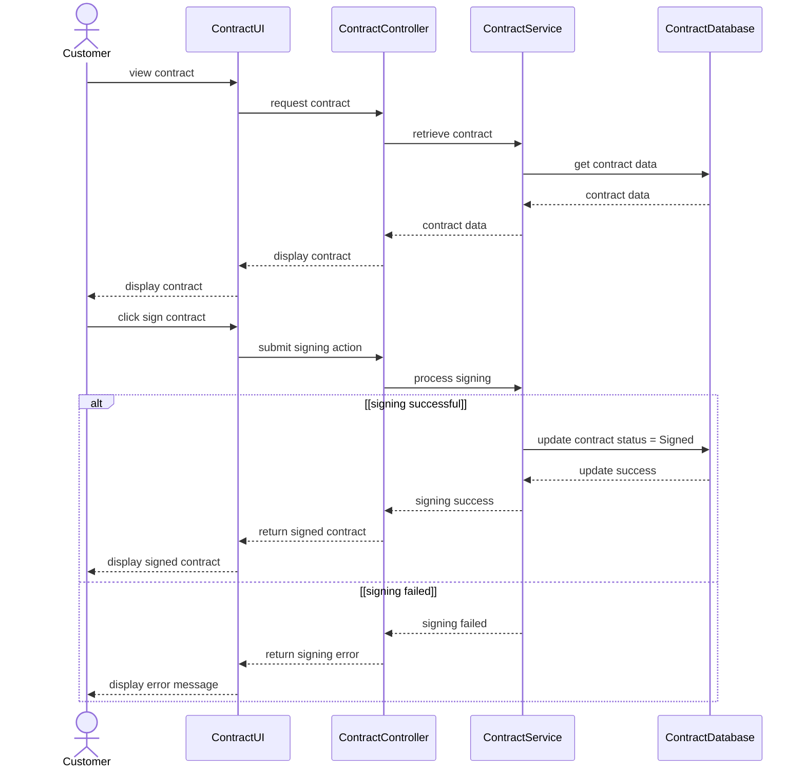

# Spec Document: Contract Management

| Field | Value |
| --- | --- |
| Module ID | `MFG-09` |
| Module name | Contract Management |
| Spec version | v0.1 |
| Author (team member) | [NEEDS CLARIFICATION: Specify the responsible team member; Group B is named only as the team on the Session 1 scope sheet.] |
| Date | 2026-09-16 |
| Status | Draft |
| Approved by (Client role) | [NEEDS CLARIFICATION: Client approver role and approval are not supplied.] |
| DBIZ2 source | Function List `MFG-09`, No. 68-76, `F-CONTR-001` .. `F-CONTR-009`; Use Cases: View contract; View/Sign contract; Sign contract; Generate contracts; Update contract templates; Manage company contracts; Use Case IDs: UC-C10, UC-C09, UC-C11, UC-C14, UC-C15, UC-C13; Screens: `S25`, `S26`, `S29`, `S30`, `S31`, `S32`, `S33`, `S34`, `S35`, `S38` |

---

## 1. Purpose and scope (mandatory)

Company administrators can prepare contracts using existing templates and notify customers when a contract is ready or updated. Customers can review and sign their contract and receive a signed copy.

Source: [docs/function-list.md](../docs/function-list.md), `MFG-09` (No. 68-76); Session 1 MVP PDF, page 1 section 3. [NEEDS CLARIFICATION: Original DBIZ2 Schematic 1.1/1.2 cells are unavailable; the PDF reproduces the project objective but is not Session 3 MVP Scope v3.]

**In scope**

- Generate Contract
- Update Contract
- Sign Contract

Session 1 marks digital contract generation and electronic signature as Should; template maintenance is not separately prioritized. All DBIZ2 subfunctions below are retained as documentation; this does not authorize release of deferred functions. [NEEDS CLARIFICATION: Supply MVP Scope v3 and Session 3 decisions to confirm current module scope.]

**Out of scope**

- Collecting order payment belongs to MFG-06.

**Depends on**

- MFG-06: order data for contract preparation and payment after signing (F-CONTR-003; usage flow).

## 2. Actors (mandatory)

| Actor | Role in this module | Where it comes from |
| --- | --- | --- |
| Company Admin | Primary — Generate Contract, Update Contract | Function List `Actor` column, `MFG-09`: F-CONTR-001, F-CONTR-002, F-CONTR-003, F-CONTR-004, F-CONTR-005, F-CONTR-006, F-CONTR-007 |
| Customer | Primary — Sign Contract | Function List `Actor` column, `MFG-09`: F-CONTR-008, F-CONTR-009 |

Primary identifies the actor performing the listed subfunctions; it does not replace conflicting Use Case or sequence labels. External participants appear in section 4 only when supplied by the source.

## 3. User scenarios and acceptance criteria (mandatory)

[NEEDS CLARIFICATION: P1/P2 scenario ordering is not agreed in the supplied materials; no scenario priority is inferred from Function List High/Medium/Low.]

### US-1 ([NEEDS CLARIFICATION: Scenario priority not agreed.]): View contract

**Journey.** As a `Company Admin`, I want to `view contract`, so that [NEEDS CLARIFICATION: The Use Case names the goal but does not state a separate scenario benefit.].

Source: `docs/architecture/use-case.md`, line 22, “View contract”; related FRs `FR-004` / `F-CONTR-004`. Actor association in the Use Case: [NEEDS CLARIFICATION: no direct actor association shown].

**Acceptance scenarios**

1. **Given** a customer has a contract to review, **When** the customer views the contract, **Then** the contract content is displayed.

### US-2 ([NEEDS CLARIFICATION: Scenario priority not agreed.]): View/Sign contract

**Journey.** As a `Company Admin/Customer`, I want to `view/sign contract`, so that [NEEDS CLARIFICATION: The Use Case names the goal but does not state a separate scenario benefit.].

Source: `docs/architecture/use-case.md`, line 23, “View/Sign contract”; related FRs `FR-004` / `F-CONTR-004`, `FR-008` / `F-CONTR-008`, `FR-009` / `F-CONTR-009`.

**Acceptance scenarios**

1. **Given** the customer has reached Sign contract after Review & Make Order, **When** the customer completes viewing and signing the contract, **Then** the supplied usage flow continues to Make payment.

### US-3 ([NEEDS CLARIFICATION: Scenario priority not agreed.]): Sign contract

**Journey.** As a `Customer`, I want to `sign contract`, so that [NEEDS CLARIFICATION: The Use Case names the goal but does not state a separate scenario benefit.].

Source: `docs/architecture/use-case.md`, line 24, “Sign contract”; related FRs `FR-008` / `F-CONTR-008`, `FR-009` / `F-CONTR-009`. Actor association in the Use Case: [NEEDS CLARIFICATION: no direct actor association shown].

**Acceptance scenarios**

1. **Given** the customer has reached Sign contract, **When** the customer successfully signs the contract, **Then** the supplied usage flow continues to Make payment.
2. **Given** the customer submits signing, **When** signing succeeds, **Then** the signed contract is displayed (SD-08).
3. **Given** the customer submits signing, **When** signing fails, **Then** an error message is displayed (SD-08).

### US-4 ([NEEDS CLARIFICATION: Scenario priority not agreed.]): Generate contracts

**Journey.** As a `Company Admin`, I want to `generate contracts`, so that [NEEDS CLARIFICATION: The Use Case names the goal but does not state a separate scenario benefit.].

Source: `docs/architecture/use-case.md`, line 30, “Generate contracts”; related FRs `FR-001` / `F-CONTR-001`, `FR-002` / `F-CONTR-002`, `FR-003` / `F-CONTR-003`, `FR-004` / `F-CONTR-004`, `FR-005` / `F-CONTR-005`. Actor association in the Use Case: [NEEDS CLARIFICATION: no direct actor association shown].

[NEEDS CLARIFICATION: No detailed Usage Flow or sequence for this use case is supplied; the criterion records the named goal and any explicitly cited Function List outcome. Confirm preconditions, action sequence and failure behavior before treating it as an agreed acceptance test.]

**Acceptance scenarios**

1. **Given** an order requires a contract, **When** the company administrator generates the contract, **Then** the populated contract is available as a PDF for signing and the customer receives a ready notification (F-CONTR-003/F-CONTR-004/F-CONTR-005).

### US-5 ([NEEDS CLARIFICATION: Scenario priority not agreed.]): Update contract templates

**Journey.** As a `Company Admin`, I want to `update contract templates`, so that [NEEDS CLARIFICATION: The Use Case names the goal but does not state a separate scenario benefit.].

Source: `docs/architecture/use-case.md`, line 31, “Update contract templates”; related FRs `FR-006` / `F-CONTR-006`, `FR-007` / `F-CONTR-007`. Actor association in the Use Case: [NEEDS CLARIFICATION: no direct actor association shown].

[NEEDS CLARIFICATION: No detailed Usage Flow or sequence for this use case is supplied; the criterion records the named goal and any explicitly cited Function List outcome. Confirm preconditions, action sequence and failure behavior before treating it as an agreed acceptance test.]

**Acceptance scenarios**

1. **Given** the company administrator is managing company contracts, **When** the administrator selects Update contract templates, **Then** [NEEDS CLARIFICATION: No Function List row implements contract-template editing; F-CONTR-007 specifies notification only. Supply the supported observable template-update result.].

### US-6 ([NEEDS CLARIFICATION: Scenario priority not agreed.]): Manage company contracts

**Journey.** As a `Company Admin`, I want to `manage company contracts`, so that [NEEDS CLARIFICATION: The Use Case names the goal but does not state a separate scenario benefit.].

Source: `docs/architecture/use-case.md`, line 32, “Manage company contracts”; related FRs `FR-001` / `F-CONTR-001`, `FR-002` / `F-CONTR-002`, `FR-003` / `F-CONTR-003`, `FR-004` / `F-CONTR-004`, `FR-005` / `F-CONTR-005`, `FR-006` / `F-CONTR-006`, `FR-007` / `F-CONTR-007`.

[NEEDS CLARIFICATION: No detailed Usage Flow or sequence for this use case is supplied; the criterion records the named goal and any explicitly cited Function List outcome. Confirm preconditions, action sequence and failure behavior before treating it as an agreed acceptance test.]

**Acceptance scenarios**

1. **Given** the company administrator is managing company contracts, **When** the administrator chooses a related contract action, **Then** Generate contracts or Update contract templates is entered.

### Edge cases

- [NEEDS CLARIFICATION: Document missing/invalid inputs and empty-data outcomes not already covered by the supplied screens or sequences.]
- [NEEDS CLARIFICATION: Document behavior when a required external service or data operation is unavailable; do not infer retries or fallback paths.]
- [NEEDS CLARIFICATION: Document repeated actions and simultaneous-user outcomes; no concurrency or duplicate-submission rule is supplied.]

## 4. Flows (mandatory)

### 4.1 Usage flow

Exact module-relevant excerpt from `docs/architecture/usage-flow.md`. Boundary nodes retain cross-module context; all included decisions keep both branches. Original node names, labels and connector types are unchanged. This is a subset of the supplied overall journey, not a replacement flow.

[NEEDS CLARIFICATION: The original DBIZ2 Usage Flow image is not supplied; verify this transcription against the original figure before approving the diagram checklist.]

### 4.2 Sequence for the main flow

**SD-08: View and Sign Digital Contract**

Copied unchanged from `docs/architecture/sequence.md`; participants and messages are source text. Cross-module participants remain to preserve the supplied interaction. [NEEDS CLARIFICATION: Confirm which supplied sequence is the agreed main flow; sequences for other listed use cases are not available.]

## 5. Functional requirements (mandatory)

One FR per original Function List subfunction, in source order. FR IDs are local to this module; cite `MFG-09/FR-nnn` with the unchanged Subfunction ID. Original function names and High/Medium/Low values are preserved in each requirement note. MoSCoW values are used only for capabilities explicitly prioritized on page 2 of the Session 1 PDF; [NEEDS CLARIFICATION: Confirm per-subfunction priority mapping and the current Session 3 release scope.]

| FR ID | DBIZ2 Subfunction ID | Requirement (system MUST ...) | Actor | Priority |
| --- | --- | --- | --- | --- |
| FR-001 | F-CONTR-001 | The system MUST display a list of available contract templates suitable for the order type. DBIZ2 function: Generate Contract; subfunction: Template Select View; category: Screen; original priority: High. | Company Admin | Should |
| FR-002 | F-CONTR-002 | The system MUST preview the detailed content of the selected contract template. DBIZ2 function: Generate Contract; subfunction: Template Detail View; category: Screen; original priority: High. | Company Admin | Should |
| FR-003 | F-CONTR-003 | The system MUST automatically populate terms and pricing information into the contract template. DBIZ2 function: Generate Contract; subfunction: Fill Contract Logic; category: Process; original priority: High. | Company Admin | Should |
| FR-004 | F-CONTR-004 | The system MUST create a contract record and export it to a PDF file for signing. DBIZ2 function: Generate Contract; subfunction: Render PDF Logic; category: Process; original priority: High. | Company Admin | Should |
| FR-005 | F-CONTR-005 | The system MUST notify the customer that the contract is ready for review and signing. DBIZ2 function: Generate Contract; subfunction: Ready Notify Logic; category: Process; original priority: High. | Company Admin | Should |
| FR-006 | F-CONTR-006 | The system MUST display a list of existing contracts with filtering and sorting functions. DBIZ2 function: Update Contract; subfunction: Contract List View; category: Screen; original priority: Medium. | Company Admin | [NEEDS CLARIFICATION: No agreed Must/Should/Could priority for this subfunction; preserve the original DBIZ2 priority in the source note.] |
| FR-007 | F-CONTR-007 | The system MUST notify the customer that the contract is updated DBIZ2 function: Update Contract; subfunction: Contract Update Noitfy Logic; category: Process; original priority: High. | Company Admin | [NEEDS CLARIFICATION: No agreed Must/Should/Could priority for this subfunction; preserve the original DBIZ2 priority in the source note.] |
| FR-008 | F-CONTR-008 | The system MUST capture the user's electronic signature and update contract status to "Signed". DBIZ2 function: Sign Contract; subfunction: E-Sign Logic; category: Process; original priority: High. | Customer | Should |
| FR-009 | F-CONTR-009 | The system MUST send a notification and copy of the signed contract to both related parties. DBIZ2 function: Sign Contract; subfunction: Signed Notify Logic; category: Process; original priority: High. | Customer | Should |

### 5.1 Input / Output contract

Literal Function List field names, types and required flags are preserved. Input and output rows are separate to avoid inventing field-to-field pairings. The template Required column applies to inputs; output required flags appear in Notes / validation. `—` means that side of this row is not applicable, not that a source field was omitted. Object contents, validation ranges and identifier formats are not inferred. [NEEDS CLARIFICATION: Supply nested Object/JSON/Array schemas and field validation where absent; apparent source type errors remain unchanged until clarified.]

| FR ID | Input field | Type | Required | Output field | Type | Notes / validation |
| --- | --- | --- | --- | --- | --- | --- |
| FR-001 | `order_type` | String | Yes | — | — | Function List No. 68, F-CONTR-001, Input column. |
| FR-001 | — | — | — | `list_of_contract_templates` | Array<Object> | Output required: Yes. Function List No. 68, F-CONTR-001, Output column. |
| FR-002 | `template_id` | String | Yes | — | — | Function List No. 69, F-CONTR-002, Input column. |
| FR-002 | — | — | — | `preview_ui` | [NEEDS CLARIFICATION: F-CONTR-002 output preview_ui: UI representation type.] | Output required: Yes. Function List No. 69, F-CONTR-002, Output column. |
| FR-003 | `order_data` | Object | Yes | — | — | Function List No. 70, F-CONTR-003, Input column. |
| FR-003 | `customer_data` | Object | Yes | — | — | Function List No. 70, F-CONTR-003, Input column. |
| FR-003 | `template_id` | String | Yes | — | — | Function List No. 70, F-CONTR-003, Input column. |
| FR-003 | — | — | — | `draft_contract_data_object` | Object | Output required: Yes. Function List No. 70, F-CONTR-003, Output column. |
| FR-004 | `contract_data` | Object | Yes | — | — | Function List No. 71, F-CONTR-004, Input column. |
| FR-004 | — | — | — | `pdf_file_url` | URL | Output required: Yes. Function List No. 71, F-CONTR-004, Output column. |
| FR-004 | — | — | — | `contract_id` | String | Output required: Yes. Function List No. 71, F-CONTR-004, Output column. |
| FR-005 | `contract_id` | String | Yes | — | — | Function List No. 72, F-CONTR-005, Input column. |
| FR-005 | `customer_email` | String | Yes | — | — | Function List No. 72, F-CONTR-005, Input column. |
| FR-005 | — | — | — | `notification_with_contract_link` | [NEEDS CLARIFICATION: F-CONTR-005 output notification_with_contract_link: data type.] | Output required: Yes. Function List No. 72, F-CONTR-005, Output column. |
| FR-006 | `filter_params` | [NEEDS CLARIFICATION: F-CONTR-006 input filter_params: data type.] | No | — | — | Function List No. 73, F-CONTR-006, Input column. |
| FR-006 | — | — | — | `contract_list_table` | [NEEDS CLARIFICATION: F-CONTR-006 output contract_list_table: UI representation type.] | Output required: Yes. Function List No. 73, F-CONTR-006, Output column. |
| FR-007 | `contract_id` | String | Yes | — | — | Function List No. 74, F-CONTR-007, Input column. |
| FR-007 | `customer_email` | String | Yes | — | — | Function List No. 74, F-CONTR-007, Input column. |
| FR-007 | — | — | — | `notification_with_contract_link` | [NEEDS CLARIFICATION: F-CONTR-007 output notification_with_contract_link: data type.] | Output required: Yes. Function List No. 74, F-CONTR-007, Output column. |
| FR-008 | `digital_signature_token` | String | Yes | — | — | Function List No. 75, F-CONTR-008, Input column. |
| FR-008 | `ip_address` | String | Yes | — | — | Function List No. 75, F-CONTR-008, Input column. |
| FR-008 | — | — | — | `status:_signed` | String | Output required: Yes. Function List No. 75, F-CONTR-008, Output column. |
| FR-008 | — | — | — | `timestamp_logged` | DateTime | Output required: Yes. Function List No. 75, F-CONTR-008, Output column. |
| FR-009 | `signed_contract_document` | File | Yes | — | — | Function List No. 76, F-CONTR-009, Input column. |
| FR-009 | — | — | — | `emails_with_pdf_attachment` | [NEEDS CLARIFICATION: F-CONTR-009 output emails_with_pdf_attachment: data type.] | Output required: Yes. Function List No. 76, F-CONTR-009, Output column. |

### 5.2 Business rules

| Rule ID | Rule | Why it exists |
| --- | --- | --- |
| BR-001 | A signed contract and its copy are sent to both related parties. | F-CONTR-009 explicitly identifies both related parties as recipients. Business rationale beyond the stated source is not separately documented. |
| BR-002 | Electronic signing updates the contract status to Signed. | F-CONTR-008; no additional signature-validity rule is documented. Business rationale beyond the stated source is not separately documented. |

## 6. Key entities (mandatory)

| Entity | Attributes (from Input/Output fields) | Relationships |
| --- | --- | --- |
| Contract template | `order_type`, `list_of_contract_templates`, `template_id` | [NEEDS CLARIFICATION: Contract template: relationship cardinalities and nested field ownership are not specified in the Input/Output contract.] |
| Contract | `order_data`, `customer_data`, `draft_contract_data_object`, `contract_data`, `pdf_file_url`, `contract_id`, `digital_signature_token`, `ip_address`, `status:_signed`, `timestamp_logged`, `signed_contract_document` | [NEEDS CLARIFICATION: Contract: relationship cardinalities and nested field ownership are not specified in the Input/Output contract.] |

Names above group the literal section 5.1 fields for discussion. They do not introduce tables, extra attributes, foreign keys or relationship cardinalities.

## 7. Screens involved

| Screen ID | Screen name | Priority | Screen Spec file |
| --- | --- | --- | --- |
| S25 | Order Summary Screen — Shared screen / navigation boundary | [NEEDS CLARIFICATION: S25: Screen List provides no agreed Must/Should priority.] | `screens/S25-order_summary_screen.md` ([open](../screens/S25-order_summary_screen.md)) |
| S26 | Customer Order List Screen — Shared screen / navigation boundary | [NEEDS CLARIFICATION: S26: Screen List provides no agreed Must/Should priority.] | `screens/S26-customer_order_list_screen.md` ([open](../screens/S26-customer_order_list_screen.md)) |
| S29 | Order Detail Screen (Admin) — Shared screen / navigation boundary | [NEEDS CLARIFICATION: S29: Screen List provides no agreed Must/Should priority.] | [NEEDS CLARIFICATION: S29: no Screen Spec file supplied; do not invent a screen-spec filename.] |
| S30 | Contract Template List Screen — Direct module screen | [NEEDS CLARIFICATION: S30: Screen List provides no agreed Must/Should priority.] | [NEEDS CLARIFICATION: S30: no Screen Spec file supplied; do not invent a screen-spec filename.] |
| S31 | Contract Template Create Screen — Direct module screen | [NEEDS CLARIFICATION: S31: Screen List provides no agreed Must/Should priority.] | [NEEDS CLARIFICATION: S31: no Screen Spec file supplied; do not invent a screen-spec filename.] |
| S32 | Contract Template Edit Screen — Direct module screen | [NEEDS CLARIFICATION: S32: Screen List provides no agreed Must/Should priority.] | [NEEDS CLARIFICATION: S32: no Screen Spec file supplied; do not invent a screen-spec filename.] |
| S33 | Contract Detail Screen (Company Admin) — Direct module screen | [NEEDS CLARIFICATION: S33: Screen List provides no agreed Must/Should priority.] | [NEEDS CLARIFICATION: S33: no Screen Spec file supplied; do not invent a screen-spec filename.] |
| S34 | Contract Detail Screen (Customer) — Direct module screen | [NEEDS CLARIFICATION: S34: Screen List provides no agreed Must/Should priority.] | `screens/S34-contract_detail_screen_customer.md` ([open](../screens/S34-contract_detail_screen_customer.md)) |
| S35 | Order Payment Screen — Shared screen / navigation boundary | [NEEDS CLARIFICATION: S35: Screen List provides no agreed Must/Should priority.] | `screens/S35-order_payment_screen.md` ([open](../screens/S35-order_payment_screen.md)) |
| S38 | Notification Panel Screen — Shared screen / navigation boundary | [NEEDS CLARIFICATION: S38: Screen List provides no agreed Must/Should priority.] | [NEEDS CLARIFICATION: S38: no Screen Spec file supplied; do not invent a screen-spec filename.] |

Existing descriptive filenames are retained. Business navigation and notification-panel touchpoints are listed as shared boundaries; this module does not acquire their owning requirements. Screen Specs contain pre-existing “module spec unavailable” notes: these are resolved as file-existence issues by this delivery, not as behavioral approvals.

## 8. Success criteria (mandatory)

| SC ID | Criterion | How it is measured |
| --- | --- | --- |
| SC-001 | [NEEDS CLARIFICATION: No agreed measurable user-outcome success criterion is present in the supplied Session 1 scope sheet or DBIZ2 extracts; provide the Session 3 criterion for this module.] | [NEEDS CLARIFICATION: Confirm the user task, observable completion outcome, agreed target and evaluation method; none is supplied.] |

The source states feature priorities and project goals, not agreed outcome thresholds. No timing, conversion, cost-saving or technical-performance target is introduced.

## 9. Assumptions

- Session 1 page 2 states an emailed/paper contract is an acceptable stopgap at launch. [NEEDS CLARIFICATION: Confirm whether this documented Session 1 assumption remains valid in Session 3.]

## 10. Open questions

| # | Question | Blocking? | Owner | Status |
| --- | --- | --- | --- | --- |
| 1 | [NEEDS CLARIFICATION: Specify the responsible team member; Group B is named only as the team on the Session 1 scope sheet.] | Unassessed; see final question | Unassigned; see final question | Open |
| 2 | [NEEDS CLARIFICATION: Client approver role and approval are not supplied.] | Unassessed; see final question | Unassigned; see final question | Open |
| 3 | Use Case IDs: UC-C10, UC-C09, UC-C11, UC-C14, UC-C15, UC-C13 | Unassessed; see final question | Unassigned; see final question | Open |
| 4 | [NEEDS CLARIFICATION: Original DBIZ2 Schematic 1.1/1.2 cells are unavailable; the PDF reproduces the project objective but is not Session 3 MVP Scope v3.] | Unassessed; see final question | Unassigned; see final question | Open |
| 5 | [NEEDS CLARIFICATION: Supply MVP Scope v3 and Session 3 decisions to confirm current module scope.] | Unassessed; see final question | Unassigned; see final question | Open |
| 6 | [NEEDS CLARIFICATION: P1/P2 scenario ordering is not agreed in the supplied materials; no scenario priority is inferred from Function List High/Medium/Low.] | Unassessed; see final question | Unassigned; see final question | Open |
| 7 | [NEEDS CLARIFICATION: Scenario priority not agreed.] | Unassessed; see final question | Unassigned; see final question | Open |
| 8 | [NEEDS CLARIFICATION: The Use Case names the goal but does not state a separate scenario benefit.] | Unassessed; see final question | Unassigned; see final question | Open |
| 9 | [NEEDS CLARIFICATION: no direct actor association shown] | Unassessed; see final question | Unassigned; see final question | Open |
| 10 | [NEEDS CLARIFICATION: No detailed Usage Flow or sequence for this use case is supplied; the criterion records the named goal and any explicitly cited Function List outcome. Confirm preconditions, action sequence and failure behavior before treating it as an agreed acceptance test.] | Unassessed; see final question | Unassigned; see final question | Open |
| 11 | [NEEDS CLARIFICATION: No Function List row implements contract-template editing; F-CONTR-007 specifies notification only. Supply the supported observable template-update result.] | Unassessed; see final question | Unassigned; see final question | Open |
| 12 | [NEEDS CLARIFICATION: Document missing/invalid inputs and empty-data outcomes not already covered by the supplied screens or sequences.] | Unassessed; see final question | Unassigned; see final question | Open |
| 13 | [NEEDS CLARIFICATION: Document behavior when a required external service or data operation is unavailable; do not infer retries or fallback paths.] | Unassessed; see final question | Unassigned; see final question | Open |
| 14 | [NEEDS CLARIFICATION: Document repeated actions and simultaneous-user outcomes; no concurrency or duplicate-submission rule is supplied.] | Unassessed; see final question | Unassigned; see final question | Open |
| 15 | [NEEDS CLARIFICATION: The original DBIZ2 Usage Flow image is not supplied; verify this transcription against the original figure before approving the diagram checklist.] | Unassessed; see final question | Unassigned; see final question | Open |
| 16 | [NEEDS CLARIFICATION: Confirm which supplied sequence is the agreed main flow; sequences for other listed use cases are not available.] | Unassessed; see final question | Unassigned; see final question | Open |
| 17 | [NEEDS CLARIFICATION: Confirm per-subfunction priority mapping and the current Session 3 release scope.] | Unassessed; see final question | Unassigned; see final question | Open |
| 18 | [NEEDS CLARIFICATION: No agreed Must/Should/Could priority for this subfunction; preserve the original DBIZ2 priority in the source note.] | Unassessed; see final question | Unassigned; see final question | Open |
| 19 | [NEEDS CLARIFICATION: Supply nested Object/JSON/Array schemas and field validation where absent; apparent source type errors remain unchanged until clarified.] | Unassessed; see final question | Unassigned; see final question | Open |
| 20 | [NEEDS CLARIFICATION: F-CONTR-002 output preview_ui: UI representation type.] | Unassessed; see final question | Unassigned; see final question | Open |
| 21 | [NEEDS CLARIFICATION: F-CONTR-005 output notification_with_contract_link: data type.] | Unassessed; see final question | Unassigned; see final question | Open |
| 22 | [NEEDS CLARIFICATION: F-CONTR-006 input filter_params: data type.] | Unassessed; see final question | Unassigned; see final question | Open |
| 23 | [NEEDS CLARIFICATION: F-CONTR-006 output contract_list_table: UI representation type.] | Unassessed; see final question | Unassigned; see final question | Open |
| 24 | [NEEDS CLARIFICATION: F-CONTR-007 output notification_with_contract_link: data type.] | Unassessed; see final question | Unassigned; see final question | Open |
| 25 | [NEEDS CLARIFICATION: F-CONTR-009 output emails_with_pdf_attachment: data type.] | Unassessed; see final question | Unassigned; see final question | Open |
| 26 | [NEEDS CLARIFICATION: Contract template: relationship cardinalities and nested field ownership are not specified in the Input/Output contract.] | Unassessed; see final question | Unassigned; see final question | Open |
| 27 | [NEEDS CLARIFICATION: Contract: relationship cardinalities and nested field ownership are not specified in the Input/Output contract.] | Unassessed; see final question | Unassigned; see final question | Open |
| 28 | [NEEDS CLARIFICATION: S25: Screen List provides no agreed Must/Should priority.] | Unassessed; see final question | Unassigned; see final question | Open |
| 29 | [NEEDS CLARIFICATION: S26: Screen List provides no agreed Must/Should priority.] | Unassessed; see final question | Unassigned; see final question | Open |
| 30 | [NEEDS CLARIFICATION: S29: Screen List provides no agreed Must/Should priority.] | Unassessed; see final question | Unassigned; see final question | Open |
| 31 | [NEEDS CLARIFICATION: S29: no Screen Spec file supplied; do not invent a screen-spec filename.] | Unassessed; see final question | Unassigned; see final question | Open |
| 32 | [NEEDS CLARIFICATION: S30: Screen List provides no agreed Must/Should priority.] | Unassessed; see final question | Unassigned; see final question | Open |
| 33 | [NEEDS CLARIFICATION: S30: no Screen Spec file supplied; do not invent a screen-spec filename.] | Unassessed; see final question | Unassigned; see final question | Open |
| 34 | [NEEDS CLARIFICATION: S31: Screen List provides no agreed Must/Should priority.] | Unassessed; see final question | Unassigned; see final question | Open |
| 35 | [NEEDS CLARIFICATION: S31: no Screen Spec file supplied; do not invent a screen-spec filename.] | Unassessed; see final question | Unassigned; see final question | Open |
| 36 | [NEEDS CLARIFICATION: S32: Screen List provides no agreed Must/Should priority.] | Unassessed; see final question | Unassigned; see final question | Open |
| 37 | [NEEDS CLARIFICATION: S32: no Screen Spec file supplied; do not invent a screen-spec filename.] | Unassessed; see final question | Unassigned; see final question | Open |
| 38 | [NEEDS CLARIFICATION: S33: Screen List provides no agreed Must/Should priority.] | Unassessed; see final question | Unassigned; see final question | Open |
| 39 | [NEEDS CLARIFICATION: S33: no Screen Spec file supplied; do not invent a screen-spec filename.] | Unassessed; see final question | Unassigned; see final question | Open |
| 40 | [NEEDS CLARIFICATION: S34: Screen List provides no agreed Must/Should priority.] | Unassessed; see final question | Unassigned; see final question | Open |
| 41 | [NEEDS CLARIFICATION: S35: Screen List provides no agreed Must/Should priority.] | Unassessed; see final question | Unassigned; see final question | Open |
| 42 | [NEEDS CLARIFICATION: S38: Screen List provides no agreed Must/Should priority.] | Unassessed; see final question | Unassigned; see final question | Open |
| 43 | [NEEDS CLARIFICATION: S38: no Screen Spec file supplied; do not invent a screen-spec filename.] | Unassessed; see final question | Unassigned; see final question | Open |
| 44 | [NEEDS CLARIFICATION: No agreed measurable user-outcome success criterion is present in the supplied Session 1 scope sheet or DBIZ2 extracts; provide the Session 3 criterion for this module.] | Unassessed; see final question | Unassigned; see final question | Open |
| 45 | [NEEDS CLARIFICATION: Confirm the user task, observable completion outcome, agreed target and evaluation method; none is supplied.] | Unassessed; see final question | Unassigned; see final question | Open |
| 46 | [NEEDS CLARIFICATION: Confirm whether this documented Session 1 assumption remains valid in Session 3.] | Unassessed; see final question | Unassigned; see final question | Open |
| 47 | [NEEDS CLARIFICATION: F-CONTR-006 requires a contract list but the Screen List identifies a template list S30, not an unambiguous contract list. Supply the existing screen mapping.] | Unassessed; see final question | Unassigned; see final question | Open |
| 48 | [NEEDS CLARIFICATION: Use Cases and S31/S32 include contract-template creation/editing, but no distinct Function List subfunction implements template creation/editing; confirm the existing mapping without adding FRs.] | Unassessed; see final question | Unassigned; see final question | Open |
| 49 | [NEEDS CLARIFICATION: F-CONTR-007 only notifies about an update; where is contract/template update persistence specified?] | Unassessed; see final question | Unassigned; see final question | Open |
| 50 | [NEEDS CLARIFICATION: F-CONTR-008 inputs do not identify the contract; confirm the signing context and how S34 creates digital_signature_token.] | Unassessed; see final question | Unassigned; see final question | Open |
| 51 | [NEEDS CLARIFICATION: S25, [NEEDS CLARIFICATION: Must / Should / Could not given in Screen List]: Must / Should / Could not given in Screen List] Source: `screens/S25-order_summary_screen.md`, line 16. | Unassessed; see final question | Unassigned; see final question | Open |
| 52 | [NEEDS CLARIFICATION: S25, **The user leaves this screen when:** [NEEDS CLARIFICATION: all exit paths are not specifi: all exit paths are not specified; documented interactions appear in section 5.] Source: `screens/S25-order_summary_screen.md`, line 25. | Unassessed; see final question | Unassigned; see final question | Open |
| 53 | [NEEDS CLARIFICATION: S25, Product name: schema] Source: `screens/S25-order_summary_screen.md`, line 51. | Unassessed; see final question | Unassigned; see final question | Open |
| 54 | [NEEDS CLARIFICATION: S25, Email Address: schema] Source: `screens/S25-order_summary_screen.md`, line 54. | Unassessed; see final question | Unassigned; see final question | Open |
| 55 | [NEEDS CLARIFICATION: S25, Full Name: schema] Source: `screens/S25-order_summary_screen.md`, line 55. | Unassessed; see final question | Unassigned; see final question | Open |
| 56 | [NEEDS CLARIFICATION: S25, City: schema] Source: `screens/S25-order_summary_screen.md`, line 57. | Unassessed; see final question | Unassigned; see final question | Open |
| 57 | [NEEDS CLARIFICATION: S25, Zip Code: schema] Source: `screens/S25-order_summary_screen.md`, line 58. | Unassessed; see final question | Unassigned; see final question | Open |
| 58 | [NEEDS CLARIFICATION: S25, [NEEDS CLARIFICATION: missing cart or shipping information]: missing cart or shipping information] Source: `screens/S25-order_summary_screen.md`, line 92. | Unassessed; see final question | Unassigned; see final question | Open |
| 59 | [NEEDS CLARIFICATION: S25, [NEEDS CLARIFICATION: order creation loading treatment]: order creation loading treatment] Source: `screens/S25-order_summary_screen.md`, line 93. | Unassessed; see final question | Unassigned; see final question | Open |
| 60 | [NEEDS CLARIFICATION: S25, [NEEDS CLARIFICATION: order creation error treatment]: order creation error treatment] Source: `screens/S25-order_summary_screen.md`, line 94. | Unassessed; see final question | Unassigned; see final question | Open |
| 61 | [NEEDS CLARIFICATION: S25, About Dony navigation: destination not in Screen List] Source: `screens/S25-order_summary_screen.md`, line 103. | Unassessed; see final question | Unassigned; see final question | Open |
| 62 | [NEEDS CLARIFICATION: S25, Contact Us navigation: destination not in Screen List] Source: `screens/S25-order_summary_screen.md`, line 106. | Unassessed; see final question | Unassigned; see final question | Open |
| 63 | [NEEDS CLARIFICATION: S25, Zalo contact button: contact destination] Source: `screens/S25-order_summary_screen.md`, line 111. | Unassessed; see final question | Unassigned; see final question | Open |
| 64 | [NEEDS CLARIFICATION: S25, Telephone contact button: dial behavior] Source: `screens/S25-order_summary_screen.md`, line 112. | Unassessed; see final question | Unassigned; see final question | Open |
| 65 | [NEEDS CLARIFICATION: S25, Footer Facebook icon: external or in-system destination] Source: `screens/S25-order_summary_screen.md`, line 113. | Unassessed; see final question | Unassigned; see final question | Open |
| 66 | [NEEDS CLARIFICATION: S25, Footer X icon: external or in-system destination] Source: `screens/S25-order_summary_screen.md`, line 114. | Unassessed; see final question | Unassigned; see final question | Open |
| 67 | [NEEDS CLARIFICATION: S25, Footer LinkedIn icon: external or in-system destination] Source: `screens/S25-order_summary_screen.md`, line 115. | Unassessed; see final question | Unassigned; see final question | Open |
| 68 | [NEEDS CLARIFICATION: S25, Footer YouTube icon: external or in-system destination] Source: `screens/S25-order_summary_screen.md`, line 116. | Unassessed; see final question | Unassigned; see final question | Open |
| 69 | [NEEDS CLARIFICATION: S25, Footer TikTok icon: external or in-system destination] Source: `screens/S25-order_summary_screen.md`, line 117. | Unassessed; see final question | Unassigned; see final question | Open |
| 70 | [NEEDS CLARIFICATION: S25, Company profile link: external or in-system destination] Source: `screens/S25-order_summary_screen.md`, line 118. | Unassessed; see final question | Unassigned; see final question | Open |
| 71 | [NEEDS CLARIFICATION: S25, Quality policy link: external or in-system destination] Source: `screens/S25-order_summary_screen.md`, line 119. | Unassessed; see final question | Unassigned; see final question | Open |
| 72 | [NEEDS CLARIFICATION: S25, Warranty policy link: external or in-system destination] Source: `screens/S25-order_summary_screen.md`, line 120. | Unassessed; see final question | Unassigned; see final question | Open |
| 73 | [NEEDS CLARIFICATION: S25, Delivery and return policy link: external or in-system destination] Source: `screens/S25-order_summary_screen.md`, line 121. | Unassessed; see final question | Unassigned; see final question | Open |
| 74 | [NEEDS CLARIFICATION: S25, Second warranty policy link: external or in-system destination] Source: `screens/S25-order_summary_screen.md`, line 122. | Unassessed; see final question | Unassigned; see final question | Open |
| 75 | [NEEDS CLARIFICATION: S25, Shipping policy link: external or in-system destination] Source: `screens/S25-order_summary_screen.md`, line 123. | Unassessed; see final question | Unassigned; see final question | Open |
| 76 | [NEEDS CLARIFICATION: S25, Payment methods link: external or in-system destination] Source: `screens/S25-order_summary_screen.md`, line 124. | Unassessed; see final question | Unassigned; see final question | Open |
| 77 | [NEEDS CLARIFICATION: S25, Business areas link: external or in-system destination] Source: `screens/S25-order_summary_screen.md`, line 125. | Unassessed; see final question | Unassigned; see final question | Open |
| 78 | [NEEDS CLARIFICATION: S25, FAQ link: external or in-system destination] Source: `screens/S25-order_summary_screen.md`, line 126. | Unassessed; see final question | Unassigned; see final question | Open |
| 79 | [NEEDS CLARIFICATION: S25, - Smallest supported width: [NEEDS CLARIFICATION: not specified in sources.]: not specified in sources.] Source: `screens/S25-order_summary_screen.md`, line 143. | Unassessed; see final question | Unassigned; see final question | Open |
| 80 | [NEEDS CLARIFICATION: S25, - What collapses or stacks on a narrow screen: [NEEDS CLARIFICATION: no narrow-screen mock: no narrow-screen mockup or rule provided.] Source: `screens/S25-order_summary_screen.md`, line 145. | Unassessed; see final question | Unassigned; see final question | Open |
| 81 | [NEEDS CLARIFICATION: S25, - Text that must remain readable (contrast, minimum size): [NEEDS CLARIFICATION: no numeri: no numeric accessibility criteria provided.] Source: `screens/S25-order_summary_screen.md`, line 147. | Unassessed; see final question | Unassigned; see final question | Open |
| 82 | [NEEDS CLARIFICATION: S25, [NEEDS CLARIFICATION: Screen List does not provide Must / Should / Could priority.]: Screen List does not provide Must / Should / Could priority.] Source: `screens/S25-order_summary_screen.md`, line 153. | Unassessed; see final question | Unassigned; see final question | Open |
| 83 | [NEEDS CLARIFICATION: S25, [NEEDS CLARIFICATION: smallest supported width, narrow layout, and accessibility minimums are not specified.]: smallest supported width, narrow layout, and accessibility minimums are not specified.] Source: `screens/S25-order_summary_screen.md`, line 155. | Unassessed; see final question | Unassigned; see final question | Open |
| 84 | [NEEDS CLARIFICATION: S25, [NEEDS CLARIFICATION: Function List says calculated_total_cost and tax_amount appear in Order Summary View, but neither is visible here.]: Function List says calculated_total_cost and tax_amount appear in Order Summary View, but neither is visible here.] Source: `screens/S25-order_summary_screen.md`, line 156. | Unassessed; see final question | Unassigned; see final question | Open |
| 85 | [NEEDS CLARIFICATION: S25, [NEEDS CLARIFICATION: Where is billing_info collected for F-PAY-003?]: Where is billing_info collected for F-PAY-003?] Source: `screens/S25-order_summary_screen.md`, line 157. | Unassessed; see final question | Unassigned; see final question | Open |
| 86 | [NEEDS CLARIFICATION: S25, [NEEDS CLARIFICATION: mockup file uses a descriptive suffix; template assumes img/<SCREEN-ID>.png.]: mockup file uses a descriptive suffix; template assumes img/<SCREEN-ID>.png.] Source: `screens/S25-order_summary_screen.md`, line 158. | Unassessed; see final question | Unassigned; see final question | Open |
| 87 | [NEEDS CLARIFICATION: S25, - [ ] The mockup is a separate cropped image file, named with the Screen ID. [NEEDS CLARIF: actual image filenames include descriptive suffixes.] Source: `screens/S25-order_summary_screen.md`, line 164. | Unassessed; see final question | Unassigned; see final question | Open |
| 88 | [NEEDS CLARIFICATION: S26, [NEEDS CLARIFICATION: Must / Should / Could not given in Screen List]: Must / Should / Could not given in Screen List] Source: `screens/S26-customer_order_list_screen.md`, line 16. | Unassessed; see final question | Unassigned; see final question | Open |
| 89 | [NEEDS CLARIFICATION: S26, **The user leaves this screen when:** [NEEDS CLARIFICATION: all exit paths are not specifi: all exit paths are not specified; documented interactions appear in section 5.] Source: `screens/S26-customer_order_list_screen.md`, line 25. | Unassessed; see final question | Unassigned; see final question | Open |
| 90 | [NEEDS CLARIFICATION: S26, Order 1 ID: schema] Source: `screens/S26-customer_order_list_screen.md`, line 53. | Unassessed; see final question | Unassigned; see final question | Open |
| 91 | [NEEDS CLARIFICATION: S26, Order 1 payment status: schema] Source: `screens/S26-customer_order_list_screen.md`, line 54. | Unassessed; see final question | Unassigned; see final question | Open |
| 92 | [NEEDS CLARIFICATION: S26, Order 1 total: schema] Source: `screens/S26-customer_order_list_screen.md`, line 55. | Unassessed; see final question | Unassigned; see final question | Open |
| 93 | [NEEDS CLARIFICATION: S26, Order 1 contract status: schema] Source: `screens/S26-customer_order_list_screen.md`, line 56. | Unassessed; see final question | Unassigned; see final question | Open |
| 94 | [NEEDS CLARIFICATION: S26, Order 1 estimated arrival: schema] Source: `screens/S26-customer_order_list_screen.md`, line 57. | Unassessed; see final question | Unassigned; see final question | Open |
| 95 | [NEEDS CLARIFICATION: S26, Order 2 ID: schema] Source: `screens/S26-customer_order_list_screen.md`, line 62. | Unassessed; see final question | Unassigned; see final question | Open |
| 96 | [NEEDS CLARIFICATION: S26, Order 2 payment status: schema] Source: `screens/S26-customer_order_list_screen.md`, line 63. | Unassessed; see final question | Unassigned; see final question | Open |
| 97 | [NEEDS CLARIFICATION: S26, Order 2 total: schema] Source: `screens/S26-customer_order_list_screen.md`, line 64. | Unassessed; see final question | Unassigned; see final question | Open |
| 98 | [NEEDS CLARIFICATION: S26, Order 2 contract status: schema] Source: `screens/S26-customer_order_list_screen.md`, line 65. | Unassessed; see final question | Unassigned; see final question | Open |
| 99 | [NEEDS CLARIFICATION: S26, Order 2 estimated arrival: schema] Source: `screens/S26-customer_order_list_screen.md`, line 66. | Unassessed; see final question | Unassigned; see final question | Open |
| 100 | [NEEDS CLARIFICATION: S26, Order 3 ID: schema] Source: `screens/S26-customer_order_list_screen.md`, line 71. | Unassessed; see final question | Unassigned; see final question | Open |
| 101 | [NEEDS CLARIFICATION: S26, Order 3 payment status: schema] Source: `screens/S26-customer_order_list_screen.md`, line 72. | Unassessed; see final question | Unassigned; see final question | Open |
| 102 | [NEEDS CLARIFICATION: S26, Order 3 total: schema] Source: `screens/S26-customer_order_list_screen.md`, line 73. | Unassessed; see final question | Unassigned; see final question | Open |
| 103 | [NEEDS CLARIFICATION: S26, Order 3 contract status: schema] Source: `screens/S26-customer_order_list_screen.md`, line 74. | Unassessed; see final question | Unassigned; see final question | Open |
| 104 | [NEEDS CLARIFICATION: S26, Order 3 estimated arrival: schema] Source: `screens/S26-customer_order_list_screen.md`, line 75. | Unassessed; see final question | Unassigned; see final question | Open |
| 105 | [NEEDS CLARIFICATION: S26, [NEEDS CLARIFICATION: no orders message]: no orders message] Source: `screens/S26-customer_order_list_screen.md`, line 111. | Unassessed; see final question | Unassigned; see final question | Open |
| 106 | [NEEDS CLARIFICATION: S26, [NEEDS CLARIFICATION: list loading treatment]: list loading treatment] Source: `screens/S26-customer_order_list_screen.md`, line 112. | Unassessed; see final question | Unassigned; see final question | Open |
| 107 | [NEEDS CLARIFICATION: S26, [NEEDS CLARIFICATION: list error treatment]: list error treatment] Source: `screens/S26-customer_order_list_screen.md`, line 113. | Unassessed; see final question | Unassigned; see final question | Open |
| 108 | [NEEDS CLARIFICATION: S26, About Dony navigation: destination not in Screen List] Source: `screens/S26-customer_order_list_screen.md`, line 122. | Unassessed; see final question | Unassigned; see final question | Open |
| 109 | [NEEDS CLARIFICATION: S26, Contact Us navigation: destination not in Screen List] Source: `screens/S26-customer_order_list_screen.md`, line 125. | Unassessed; see final question | Unassigned; see final question | Open |
| 110 | [NEEDS CLARIFICATION: S26, Zalo contact button: contact destination] Source: `screens/S26-customer_order_list_screen.md`, line 143. | Unassessed; see final question | Unassigned; see final question | Open |
| 111 | [NEEDS CLARIFICATION: S26, Telephone contact button: dial behavior] Source: `screens/S26-customer_order_list_screen.md`, line 144. | Unassessed; see final question | Unassigned; see final question | Open |
| 112 | [NEEDS CLARIFICATION: S26, Footer Facebook icon: external or in-system destination] Source: `screens/S26-customer_order_list_screen.md`, line 145. | Unassessed; see final question | Unassigned; see final question | Open |
| 113 | [NEEDS CLARIFICATION: S26, Footer X icon: external or in-system destination] Source: `screens/S26-customer_order_list_screen.md`, line 146. | Unassessed; see final question | Unassigned; see final question | Open |
| 114 | [NEEDS CLARIFICATION: S26, Footer LinkedIn icon: external or in-system destination] Source: `screens/S26-customer_order_list_screen.md`, line 147. | Unassessed; see final question | Unassigned; see final question | Open |
| 115 | [NEEDS CLARIFICATION: S26, Footer YouTube icon: external or in-system destination] Source: `screens/S26-customer_order_list_screen.md`, line 148. | Unassessed; see final question | Unassigned; see final question | Open |
| 116 | [NEEDS CLARIFICATION: S26, Footer TikTok icon: external or in-system destination] Source: `screens/S26-customer_order_list_screen.md`, line 149. | Unassessed; see final question | Unassigned; see final question | Open |
| 117 | [NEEDS CLARIFICATION: S26, Company profile link: external or in-system destination] Source: `screens/S26-customer_order_list_screen.md`, line 150. | Unassessed; see final question | Unassigned; see final question | Open |
| 118 | [NEEDS CLARIFICATION: S26, Quality policy link: external or in-system destination] Source: `screens/S26-customer_order_list_screen.md`, line 151. | Unassessed; see final question | Unassigned; see final question | Open |
| 119 | [NEEDS CLARIFICATION: S26, Warranty policy link: external or in-system destination] Source: `screens/S26-customer_order_list_screen.md`, line 152. | Unassessed; see final question | Unassigned; see final question | Open |
| 120 | [NEEDS CLARIFICATION: S26, Delivery and return policy link: external or in-system destination] Source: `screens/S26-customer_order_list_screen.md`, line 153. | Unassessed; see final question | Unassigned; see final question | Open |
| 121 | [NEEDS CLARIFICATION: S26, Second warranty policy link: external or in-system destination] Source: `screens/S26-customer_order_list_screen.md`, line 154. | Unassessed; see final question | Unassigned; see final question | Open |
| 122 | [NEEDS CLARIFICATION: S26, Shipping policy link: external or in-system destination] Source: `screens/S26-customer_order_list_screen.md`, line 155. | Unassessed; see final question | Unassigned; see final question | Open |
| 123 | [NEEDS CLARIFICATION: S26, Payment methods link: external or in-system destination] Source: `screens/S26-customer_order_list_screen.md`, line 156. | Unassessed; see final question | Unassigned; see final question | Open |
| 124 | [NEEDS CLARIFICATION: S26, Business areas link: external or in-system destination] Source: `screens/S26-customer_order_list_screen.md`, line 157. | Unassessed; see final question | Unassigned; see final question | Open |
| 125 | [NEEDS CLARIFICATION: S26, FAQ link: external or in-system destination] Source: `screens/S26-customer_order_list_screen.md`, line 158. | Unassessed; see final question | Unassigned; see final question | Open |
| 126 | [NEEDS CLARIFICATION: S26, - Smallest supported width: [NEEDS CLARIFICATION: not specified in sources.]: not specified in sources.] Source: `screens/S26-customer_order_list_screen.md`, line 174. | Unassessed; see final question | Unassigned; see final question | Open |
| 127 | [NEEDS CLARIFICATION: S26, - What collapses or stacks on a narrow screen: [NEEDS CLARIFICATION: no narrow-screen mock: no narrow-screen mockup or rule provided.] Source: `screens/S26-customer_order_list_screen.md`, line 176. | Unassessed; see final question | Unassigned; see final question | Open |
| 128 | [NEEDS CLARIFICATION: S26, - Text that must remain readable (contrast, minimum size): [NEEDS CLARIFICATION: no numeri: no numeric accessibility criteria provided.] Source: `screens/S26-customer_order_list_screen.md`, line 178. | Unassessed; see final question | Unassigned; see final question | Open |
| 129 | [NEEDS CLARIFICATION: S26, [NEEDS CLARIFICATION: Screen List does not provide Must / Should / Could priority.]: Screen List does not provide Must / Should / Could priority.] Source: `screens/S26-customer_order_list_screen.md`, line 184. | Unassessed; see final question | Unassigned; see final question | Open |
| 130 | [NEEDS CLARIFICATION: S26, [NEEDS CLARIFICATION: smallest supported width, narrow layout, and accessibility minimums are not specified.]: smallest supported width, narrow layout, and accessibility minimums are not specified.] Source: `screens/S26-customer_order_list_screen.md`, line 186. | Unassessed; see final question | Unassigned; see final question | Open |
| 131 | [NEEDS CLARIFICATION: S26, [NEEDS CLARIFICATION: Are Pay Now and Sign Now actions enabled for every status shown?]: Are Pay Now and Sign Now actions enabled for every status shown?] Source: `screens/S26-customer_order_list_screen.md`, line 187. | Unassessed; see final question | Unassigned; see final question | Open |
| 132 | [NEEDS CLARIFICATION: S26, [NEEDS CLARIFICATION: mockup file uses a descriptive suffix; template assumes img/<SCREEN-ID>.png.]: mockup file uses a descriptive suffix; template assumes img/<SCREEN-ID>.png.] Source: `screens/S26-customer_order_list_screen.md`, line 188. | Unassessed; see final question | Unassigned; see final question | Open |
| 133 | [NEEDS CLARIFICATION: S26, - [ ] The mockup is a separate cropped image file, named with the Screen ID. [NEEDS CLARIF: actual image filenames include descriptive suffixes.] Source: `screens/S26-customer_order_list_screen.md`, line 194. | Unassessed; see final question | Unassigned; see final question | Open |
| 134 | [NEEDS CLARIFICATION: S34, [NEEDS CLARIFICATION: Must / Should / Could not given in Screen List]: Must / Should / Could not given in Screen List] Source: `screens/S34-contract_detail_screen_customer.md`, line 16. | Unassessed; see final question | Unassigned; see final question | Open |
| 135 | [NEEDS CLARIFICATION: S34, **The user leaves this screen when:** [NEEDS CLARIFICATION: all exit paths are not specifi: all exit paths are not specified; documented interactions appear in section 5.] Source: `screens/S34-contract_detail_screen_customer.md`, line 25. | Unassessed; see final question | Unassigned; see final question | Open |
| 136 | [NEEDS CLARIFICATION: S34, Contract agreement checkbox: mandatory status] Source: `screens/S34-contract_detail_screen_customer.md`, line 51. | Unassessed; see final question | Unassigned; see final question | Open |
| 137 | [NEEDS CLARIFICATION: S34, Contract agreement checkbox: validation rule not specified] Source: `screens/S34-contract_detail_screen_customer.md`, line 51. | Unassessed; see final question | Unassigned; see final question | Open |
| 138 | [NEEDS CLARIFICATION: S34, [NEEDS CLARIFICATION: no contract file behavior]: no contract file behavior] Source: `screens/S34-contract_detail_screen_customer.md`, line 85. | Unassessed; see final question | Unassigned; see final question | Open |
| 139 | [NEEDS CLARIFICATION: S34, [NEEDS CLARIFICATION: contract loading or signing treatment]: contract loading or signing treatment] Source: `screens/S34-contract_detail_screen_customer.md`, line 86. | Unassessed; see final question | Unassigned; see final question | Open |
| 140 | [NEEDS CLARIFICATION: S34, [NEEDS CLARIFICATION: signing failure display]: signing failure display] Source: `screens/S34-contract_detail_screen_customer.md`, line 87. | Unassessed; see final question | Unassigned; see final question | Open |
| 141 | [NEEDS CLARIFICATION: S34, F-CONTR-008 status Signed and F-CONTR-009 sends signed copy; on-screen confirmation [NEEDS CLARIFICATION].: Unspecified requirement; inspect the cited source row.] Source: `screens/S34-contract_detail_screen_customer.md`, line 88. | Unassessed; see final question | Unassigned; see final question | Open |
| 142 | [NEEDS CLARIFICATION: S34, About Dony navigation: destination not in Screen List] Source: `screens/S34-contract_detail_screen_customer.md`, line 96. | Unassessed; see final question | Unassigned; see final question | Open |
| 143 | [NEEDS CLARIFICATION: S34, Contact Us navigation: destination not in Screen List] Source: `screens/S34-contract_detail_screen_customer.md`, line 99. | Unassessed; see final question | Unassigned; see final question | Open |
| 144 | [NEEDS CLARIFICATION: S34, Back link: entry context] Source: `screens/S34-contract_detail_screen_customer.md`, line 102. | Unassessed; see final question | Unassigned; see final question | Open |
| 145 | [NEEDS CLARIFICATION: S34, Contract agreement checkbox: Unspecified requirement; inspect the cited source row.] Source: `screens/S34-contract_detail_screen_customer.md`, line 103. | Unassessed; see final question | Unassigned; see final question | Open |
| 146 | [NEEDS CLARIFICATION: S34, Contract Policy link: policy destination] Source: `screens/S34-contract_detail_screen_customer.md`, line 104. | Unassessed; see final question | Unassigned; see final question | Open |
| 147 | [NEEDS CLARIFICATION: S34, Continue to Payment button: Unspecified requirement; inspect the cited source row.] Source: `screens/S34-contract_detail_screen_customer.md`, line 105. | Unassessed; see final question | Unassigned; see final question | Open |
| 148 | [NEEDS CLARIFICATION: S34, Zalo contact button: contact destination] Source: `screens/S34-contract_detail_screen_customer.md`, line 106. | Unassessed; see final question | Unassigned; see final question | Open |
| 149 | [NEEDS CLARIFICATION: S34, Telephone contact button: dial behavior] Source: `screens/S34-contract_detail_screen_customer.md`, line 107. | Unassessed; see final question | Unassigned; see final question | Open |
| 150 | [NEEDS CLARIFICATION: S34, Footer Facebook icon: external or in-system destination] Source: `screens/S34-contract_detail_screen_customer.md`, line 108. | Unassessed; see final question | Unassigned; see final question | Open |
| 151 | [NEEDS CLARIFICATION: S34, Footer X icon: external or in-system destination] Source: `screens/S34-contract_detail_screen_customer.md`, line 109. | Unassessed; see final question | Unassigned; see final question | Open |
| 152 | [NEEDS CLARIFICATION: S34, Footer LinkedIn icon: external or in-system destination] Source: `screens/S34-contract_detail_screen_customer.md`, line 110. | Unassessed; see final question | Unassigned; see final question | Open |
| 153 | [NEEDS CLARIFICATION: S34, Footer YouTube icon: external or in-system destination] Source: `screens/S34-contract_detail_screen_customer.md`, line 111. | Unassessed; see final question | Unassigned; see final question | Open |
| 154 | [NEEDS CLARIFICATION: S34, Footer TikTok icon: external or in-system destination] Source: `screens/S34-contract_detail_screen_customer.md`, line 112. | Unassessed; see final question | Unassigned; see final question | Open |
| 155 | [NEEDS CLARIFICATION: S34, Company profile link: external or in-system destination] Source: `screens/S34-contract_detail_screen_customer.md`, line 113. | Unassessed; see final question | Unassigned; see final question | Open |
| 156 | [NEEDS CLARIFICATION: S34, Quality policy link: external or in-system destination] Source: `screens/S34-contract_detail_screen_customer.md`, line 114. | Unassessed; see final question | Unassigned; see final question | Open |
| 157 | [NEEDS CLARIFICATION: S34, Warranty policy link: external or in-system destination] Source: `screens/S34-contract_detail_screen_customer.md`, line 115. | Unassessed; see final question | Unassigned; see final question | Open |
| 158 | [NEEDS CLARIFICATION: S34, Delivery and return policy link: external or in-system destination] Source: `screens/S34-contract_detail_screen_customer.md`, line 116. | Unassessed; see final question | Unassigned; see final question | Open |
| 159 | [NEEDS CLARIFICATION: S34, Second warranty policy link: external or in-system destination] Source: `screens/S34-contract_detail_screen_customer.md`, line 117. | Unassessed; see final question | Unassigned; see final question | Open |
| 160 | [NEEDS CLARIFICATION: S34, Shipping policy link: external or in-system destination] Source: `screens/S34-contract_detail_screen_customer.md`, line 118. | Unassessed; see final question | Unassigned; see final question | Open |
| 161 | [NEEDS CLARIFICATION: S34, Payment methods link: external or in-system destination] Source: `screens/S34-contract_detail_screen_customer.md`, line 119. | Unassessed; see final question | Unassigned; see final question | Open |
| 162 | [NEEDS CLARIFICATION: S34, Business areas link: external or in-system destination] Source: `screens/S34-contract_detail_screen_customer.md`, line 120. | Unassessed; see final question | Unassigned; see final question | Open |
| 163 | [NEEDS CLARIFICATION: S34, FAQ link: external or in-system destination] Source: `screens/S34-contract_detail_screen_customer.md`, line 121. | Unassessed; see final question | Unassigned; see final question | Open |
| 164 | [NEEDS CLARIFICATION: S34, - Smallest supported width: [NEEDS CLARIFICATION: not specified in sources.]: not specified in sources.] Source: `screens/S34-contract_detail_screen_customer.md`, line 139. | Unassessed; see final question | Unassigned; see final question | Open |
| 165 | [NEEDS CLARIFICATION: S34, - What collapses or stacks on a narrow screen: [NEEDS CLARIFICATION: no narrow-screen mock: no narrow-screen mockup or rule provided.] Source: `screens/S34-contract_detail_screen_customer.md`, line 141. | Unassessed; see final question | Unassigned; see final question | Open |
| 166 | [NEEDS CLARIFICATION: S34, - Text that must remain readable (contrast, minimum size): [NEEDS CLARIFICATION: no numeri: no numeric accessibility criteria provided.] Source: `screens/S34-contract_detail_screen_customer.md`, line 143. | Unassessed; see final question | Unassigned; see final question | Open |
| 167 | [NEEDS CLARIFICATION: S34, [NEEDS CLARIFICATION: Screen List does not provide Must / Should / Could priority.]: Screen List does not provide Must / Should / Could priority.] Source: `screens/S34-contract_detail_screen_customer.md`, line 149. | Unassessed; see final question | Unassigned; see final question | Open |
| 168 | [NEEDS CLARIFICATION: S34, [NEEDS CLARIFICATION: smallest supported width, narrow layout, and accessibility minimums are not specified.]: smallest supported width, narrow layout, and accessibility minimums are not specified.] Source: `screens/S34-contract_detail_screen_customer.md`, line 151. | Unassessed; see final question | Unassigned; see final question | Open |
| 169 | [NEEDS CLARIFICATION: S34, [NEEDS CLARIFICATION: Where and how is the digital signature captured? A checkbox alone may not map to digital_signature_token.]: Where and how is the digital signature captured? A checkbox alone may not map to digital_signature_token.] Source: `screens/S34-contract_detail_screen_customer.md`, line 152. | Unassessed; see final question | Unassigned; see final question | Open |
| 170 | [NEEDS CLARIFICATION: S34, [NEEDS CLARIFICATION: How does Back choose between S25 and S26?]: How does Back choose between S25 and S26?] Source: `screens/S34-contract_detail_screen_customer.md`, line 153. | Unassessed; see final question | Unassigned; see final question | Open |
| 171 | [NEEDS CLARIFICATION: S34, [NEEDS CLARIFICATION: mockup file uses a descriptive suffix; template assumes img/<SCREEN-ID>.png.]: mockup file uses a descriptive suffix; template assumes img/<SCREEN-ID>.png.] Source: `screens/S34-contract_detail_screen_customer.md`, line 154. | Unassessed; see final question | Unassigned; see final question | Open |
| 172 | [NEEDS CLARIFICATION: S34, - [ ] The mockup is a separate cropped image file, named with the Screen ID. [NEEDS CLARIF: actual image filenames include descriptive suffixes.] Source: `screens/S34-contract_detail_screen_customer.md`, line 160. | Unassessed; see final question | Unassigned; see final question | Open |
| 173 | [NEEDS CLARIFICATION: S35, [NEEDS CLARIFICATION: Must / Should / Could not given in Screen List]: Must / Should / Could not given in Screen List] Source: `screens/S35-order_payment_screen.md`, line 16. | Unassessed; see final question | Unassigned; see final question | Open |
| 174 | [NEEDS CLARIFICATION: S35, **The user leaves this screen when:** [NEEDS CLARIFICATION: all exit paths are not specifi: all exit paths are not specified; documented interactions appear in section 5.] Source: `screens/S35-order_payment_screen.md`, line 25. | Unassessed; see final question | Unassigned; see final question | Open |
| 175 | [NEEDS CLARIFICATION: S35, Product name and color: schema] Source: `screens/S35-order_payment_screen.md`, line 52. | Unassessed; see final question | Unassigned; see final question | Open |
| 176 | [NEEDS CLARIFICATION: S35, Order number: schema] Source: `screens/S35-order_payment_screen.md`, line 55. | Unassessed; see final question | Unassigned; see final question | Open |
| 177 | [NEEDS CLARIFICATION: S35, Promo code input: promo code absent from F-PAY-004] Source: `screens/S35-order_payment_screen.md`, line 58. | Unassessed; see final question | Unassigned; see final question | Open |
| 178 | [NEEDS CLARIFICATION: S35, Promo code input: promo validation] Source: `screens/S35-order_payment_screen.md`, line 58. | Unassessed; see final question | Unassigned; see final question | Open |
| 179 | [NEEDS CLARIFICATION: S35, Merge fees: fee data source] Source: `screens/S35-order_payment_screen.md`, line 61. | Unassessed; see final question | Unassigned; see final question | Open |
| 180 | [NEEDS CLARIFICATION: S35, Merge savings: savings data source] Source: `screens/S35-order_payment_screen.md`, line 62. | Unassessed; see final question | Unassigned; see final question | Open |
| 181 | [NEEDS CLARIFICATION: S35, Terms and Privacy checkbox: mandatory status] Source: `screens/S35-order_payment_screen.md`, line 64. | Unassessed; see final question | Unassigned; see final question | Open |
| 182 | [NEEDS CLARIFICATION: S35, Terms and Privacy checkbox: validation rule not specified] Source: `screens/S35-order_payment_screen.md`, line 64. | Unassessed; see final question | Unassigned; see final question | Open |
| 183 | [NEEDS CLARIFICATION: S35, Merge Policy checkbox: conditional requirement] Source: `screens/S35-order_payment_screen.md`, line 67. | Unassessed; see final question | Unassigned; see final question | Open |
| 184 | [NEEDS CLARIFICATION: S35, Merge Policy checkbox: validation rule not specified] Source: `screens/S35-order_payment_screen.md`, line 67. | Unassessed; see final question | Unassigned; see final question | Open |
| 185 | [NEEDS CLARIFICATION: S35, Marketing email checkbox: validation rule not specified] Source: `screens/S35-order_payment_screen.md`, line 69. | Unassessed; see final question | Unassigned; see final question | Open |
| 186 | [NEEDS CLARIFICATION: S35, [NEEDS CLARIFICATION: no order data]: no order data] Source: `screens/S35-order_payment_screen.md`, line 102. | Unassessed; see final question | Unassigned; see final question | Open |
| 187 | [NEEDS CLARIFICATION: S35, [NEEDS CLARIFICATION: payment redirect/processing display]: payment redirect/processing display] Source: `screens/S35-order_payment_screen.md`, line 103. | Unassessed; see final question | Unassigned; see final question | Open |
| 188 | [NEEDS CLARIFICATION: S35, F-PAY-006 supports success/fail result; placement or screen [NEEDS CLARIFICATION].: Unspecified requirement; inspect the cited source row.] Source: `screens/S35-order_payment_screen.md`, line 104. | Unassessed; see final question | Unassigned; see final question | Open |
| 189 | [NEEDS CLARIFICATION: S35, F-PAY-006 supports receipt/transaction result; destination [NEEDS CLARIFICATION].: Unspecified requirement; inspect the cited source row.] Source: `screens/S35-order_payment_screen.md`, line 105. | Unassessed; see final question | Unassigned; see final question | Open |
| 190 | [NEEDS CLARIFICATION: S35, About Dony navigation: destination not in Screen List] Source: `screens/S35-order_payment_screen.md`, line 113. | Unassessed; see final question | Unassigned; see final question | Open |
| 191 | [NEEDS CLARIFICATION: S35, Contact Us navigation: destination not in Screen List] Source: `screens/S35-order_payment_screen.md`, line 116. | Unassessed; see final question | Unassigned; see final question | Open |
| 192 | [NEEDS CLARIFICATION: S35, Promo code input: Unspecified requirement; inspect the cited source row.] Source: `screens/S35-order_payment_screen.md`, line 120. | Unassessed; see final question | Unassigned; see final question | Open |
| 193 | [NEEDS CLARIFICATION: S35, Generate code button: code generation or coupon application behavior] Source: `screens/S35-order_payment_screen.md`, line 121. | Unassessed; see final question | Unassigned; see final question | Open |
| 194 | [NEEDS CLARIFICATION: S35, Terms and Condition link: destination] Source: `screens/S35-order_payment_screen.md`, line 123. | Unassessed; see final question | Unassigned; see final question | Open |
| 195 | [NEEDS CLARIFICATION: S35, Privacy Policy link: destination] Source: `screens/S35-order_payment_screen.md`, line 124. | Unassessed; see final question | Unassigned; see final question | Open |
| 196 | [NEEDS CLARIFICATION: S35, Make payment button: Unspecified requirement; inspect the cited source row.] Source: `screens/S35-order_payment_screen.md`, line 128. | Unassessed; see final question | Unassigned; see final question | Open |
| 197 | [NEEDS CLARIFICATION: S35, Zalo contact button: contact destination] Source: `screens/S35-order_payment_screen.md`, line 129. | Unassessed; see final question | Unassigned; see final question | Open |
| 198 | [NEEDS CLARIFICATION: S35, Telephone contact button: dial behavior] Source: `screens/S35-order_payment_screen.md`, line 130. | Unassessed; see final question | Unassigned; see final question | Open |
| 199 | [NEEDS CLARIFICATION: S35, Footer Facebook icon: external or in-system destination] Source: `screens/S35-order_payment_screen.md`, line 131. | Unassessed; see final question | Unassigned; see final question | Open |
| 200 | [NEEDS CLARIFICATION: S35, Footer X icon: external or in-system destination] Source: `screens/S35-order_payment_screen.md`, line 132. | Unassessed; see final question | Unassigned; see final question | Open |
| 201 | [NEEDS CLARIFICATION: S35, Footer LinkedIn icon: external or in-system destination] Source: `screens/S35-order_payment_screen.md`, line 133. | Unassessed; see final question | Unassigned; see final question | Open |
| 202 | [NEEDS CLARIFICATION: S35, Footer YouTube icon: external or in-system destination] Source: `screens/S35-order_payment_screen.md`, line 134. | Unassessed; see final question | Unassigned; see final question | Open |
| 203 | [NEEDS CLARIFICATION: S35, Footer TikTok icon: external or in-system destination] Source: `screens/S35-order_payment_screen.md`, line 135. | Unassessed; see final question | Unassigned; see final question | Open |
| 204 | [NEEDS CLARIFICATION: S35, Company profile link: external or in-system destination] Source: `screens/S35-order_payment_screen.md`, line 136. | Unassessed; see final question | Unassigned; see final question | Open |
| 205 | [NEEDS CLARIFICATION: S35, Quality policy link: external or in-system destination] Source: `screens/S35-order_payment_screen.md`, line 137. | Unassessed; see final question | Unassigned; see final question | Open |
| 206 | [NEEDS CLARIFICATION: S35, Warranty policy link: external or in-system destination] Source: `screens/S35-order_payment_screen.md`, line 138. | Unassessed; see final question | Unassigned; see final question | Open |
| 207 | [NEEDS CLARIFICATION: S35, Delivery and return policy link: external or in-system destination] Source: `screens/S35-order_payment_screen.md`, line 139. | Unassessed; see final question | Unassigned; see final question | Open |
| 208 | [NEEDS CLARIFICATION: S35, Second warranty policy link: external or in-system destination] Source: `screens/S35-order_payment_screen.md`, line 140. | Unassessed; see final question | Unassigned; see final question | Open |
| 209 | [NEEDS CLARIFICATION: S35, Shipping policy link: external or in-system destination] Source: `screens/S35-order_payment_screen.md`, line 141. | Unassessed; see final question | Unassigned; see final question | Open |
| 210 | [NEEDS CLARIFICATION: S35, Payment methods link: external or in-system destination] Source: `screens/S35-order_payment_screen.md`, line 142. | Unassessed; see final question | Unassigned; see final question | Open |
| 211 | [NEEDS CLARIFICATION: S35, Business areas link: external or in-system destination] Source: `screens/S35-order_payment_screen.md`, line 143. | Unassessed; see final question | Unassigned; see final question | Open |
| 212 | [NEEDS CLARIFICATION: S35, FAQ link: external or in-system destination] Source: `screens/S35-order_payment_screen.md`, line 144. | Unassessed; see final question | Unassigned; see final question | Open |
| 213 | [NEEDS CLARIFICATION: S35, - Smallest supported width: [NEEDS CLARIFICATION: not specified in sources.]: not specified in sources.] Source: `screens/S35-order_payment_screen.md`, line 163. | Unassessed; see final question | Unassigned; see final question | Open |
| 214 | [NEEDS CLARIFICATION: S35, - What collapses or stacks on a narrow screen: [NEEDS CLARIFICATION: no narrow-screen mock: no narrow-screen mockup or rule provided.] Source: `screens/S35-order_payment_screen.md`, line 165. | Unassessed; see final question | Unassigned; see final question | Open |
| 215 | [NEEDS CLARIFICATION: S35, - Text that must remain readable (contrast, minimum size): [NEEDS CLARIFICATION: no numeri: no numeric accessibility criteria provided.] Source: `screens/S35-order_payment_screen.md`, line 167. | Unassessed; see final question | Unassigned; see final question | Open |
| 216 | [NEEDS CLARIFICATION: S35, [NEEDS CLARIFICATION: Screen List does not provide Must / Should / Could priority.]: Screen List does not provide Must / Should / Could priority.] Source: `screens/S35-order_payment_screen.md`, line 173. | Unassessed; see final question | Unassigned; see final question | Open |
| 217 | [NEEDS CLARIFICATION: S35, [NEEDS CLARIFICATION: smallest supported width, narrow layout, and accessibility minimums are not specified.]: smallest supported width, narrow layout, and accessibility minimums are not specified.] Source: `screens/S35-order_payment_screen.md`, line 175. | Unassessed; see final question | Unassigned; see final question | Open |
| 218 | [NEEDS CLARIFICATION: S35, [NEEDS CLARIFICATION: Where does VNPay return the customer?]: Where does VNPay return the customer?] Source: `screens/S35-order_payment_screen.md`, line 176. | Unassessed; see final question | Unassigned; see final question | Open |
| 219 | [NEEDS CLARIFICATION: S35, [NEEDS CLARIFICATION: Are the terms checkbox and promo code action required for payment?]: Are the terms checkbox and promo code action required for payment?] Source: `screens/S35-order_payment_screen.md`, line 177. | Unassessed; see final question | Unassigned; see final question | Open |
| 220 | [NEEDS CLARIFICATION: S35, [NEEDS CLARIFICATION: mockup file uses a descriptive suffix; template assumes img/<SCREEN-ID>.png.]: mockup file uses a descriptive suffix; template assumes img/<SCREEN-ID>.png.] Source: `screens/S35-order_payment_screen.md`, line 178. | Unassessed; see final question | Unassigned; see final question | Open |
| 221 | [NEEDS CLARIFICATION: S35, - [ ] The mockup is a separate cropped image file, named with the Screen ID. [NEEDS CLARIF: actual image filenames include descriptive suffixes.] Source: `screens/S35-order_payment_screen.md`, line 184. | Unassessed; see final question | Unassigned; see final question | Open |
| 222 | [NEEDS CLARIFICATION: No Session 3 Clarify meeting notes are supplied; carry over all unresolved decisions once provided.] | Unassessed; see final question | Unassigned; see final question | Open |
| 223 | [NEEDS CLARIFICATION: Original spreadsheet cells and figure numbers are unavailable; the traceability below uses exact supplied Markdown lines and the PDF page/section instead.] | Unassessed; see final question | Unassigned; see final question | Open |
| 224 | [NEEDS CLARIFICATION: Mermaid rendering has not been verified with a Mermaid renderer; source copying and node/edge checks alone do not establish rendering correctness.] | Unassessed; see final question | Unassigned; see final question | Open |
| 225 | [NEEDS CLARIFICATION: Open-question owners and blocking impacts have not been assigned.] | Unassessed; see final question | Unassigned; see final question | Open |

## 11. Traceability to DBIZ2

| Spec section | DBIZ2 source | Location |
| --- | --- | --- |
| 1. Purpose / scope | Function List module heading and all module rows; objective reproduced in Session 1 scope | `docs/function-list.md`, lines 78-87; `MVP_Score-WeaveLink.docx.pdf`, page 1 section 3 and page 2 section 4 |
| 2. Actors | Function List Actor column | `docs/function-list.md`, lines 79-87 |
| 4.1 Usage flow | Supplied customer usage flow | `docs/architecture/usage-flow.md`, original node IDs: ReviewOrder, SignContract, OrderPayment |
| 8. Success criteria / 9. Assumptions | Available scope document | `MVP_Score-WeaveLink.docx.pdf`, page 1 sections 1-3 and page 2 section 4; no measurable acceptance target or Session 3 document supplied |
| 3. US-1 | Use Case “View contract” (UC-C10) | `docs/architecture/use-case.md`, line 22 |
| 3. US-2 | Use Case “View/Sign contract” (UC-C09) | `docs/architecture/use-case.md`, line 23 |
| 3. US-3 | Use Case “Sign contract” (UC-C11) | `docs/architecture/use-case.md`, line 24 |
| 3. US-4 | Use Case “Generate contracts” (UC-C14) | `docs/architecture/use-case.md`, line 30 |
| 3. US-5 | Use Case “Update contract templates” (UC-C15) | `docs/architecture/use-case.md`, line 31 |
| 3. US-6 | Use Case “Manage company contracts” (UC-C13) | `docs/architecture/use-case.md`, line 32 |
| 4.2 Sequence | SD-08: View and Sign Digital Contract | `docs/architecture/sequence.md`, line 228 |
| 5 / 5.1 / 6: FR-001 | `MFG-09` / `F-CONTR-001` / Generate Contract; US-4: Generate contracts; US-6: Manage company contracts | `docs/function-list.md`, line 79, No. 68; Screens: S30; sequence: this behavior is not separately shown in a supplied sequence; Usage Flow: this behavior is not separately shown in the supplied usage flow. Diagrams support only the steps actually shown; the full contract remains sourced to the Function List. |
| 5 / 5.1 / 6: FR-002 | `MFG-09` / `F-CONTR-002` / Generate Contract; US-4: Generate contracts; US-6: Manage company contracts | `docs/function-list.md`, line 80, No. 69; Screens: S30; sequence: this behavior is not separately shown in a supplied sequence; Usage Flow: this behavior is not separately shown in the supplied usage flow. Diagrams support only the steps actually shown; the full contract remains sourced to the Function List. |
| 5 / 5.1 / 6: FR-003 | `MFG-09` / `F-CONTR-003` / Generate Contract; US-4: Generate contracts; US-6: Manage company contracts | `docs/function-list.md`, line 81, No. 70; Screens: S33; sequence: this behavior is not separately shown in a supplied sequence; Usage Flow: this behavior is not separately shown in the supplied usage flow. Diagrams support only the steps actually shown; the full contract remains sourced to the Function List. |
| 5 / 5.1 / 6: FR-004 | `MFG-09` / `F-CONTR-004` / Generate Contract; US-1: View contract; US-2: View/Sign contract; US-4: Generate contracts; US-6: Manage company contracts | `docs/function-list.md`, line 82, No. 71; Screens: S33, S34; sequence: this behavior is not separately shown in a supplied sequence; Usage Flow: this behavior is not separately shown in the supplied usage flow. Diagrams support only the steps actually shown; the full contract remains sourced to the Function List. |
| 5 / 5.1 / 6: FR-005 | `MFG-09` / `F-CONTR-005` / Generate Contract; US-4: Generate contracts; US-6: Manage company contracts | `docs/function-list.md`, line 83, No. 72; Screens: S33; sequence: this behavior is not separately shown in a supplied sequence; Usage Flow: this behavior is not separately shown in the supplied usage flow. Diagrams support only the steps actually shown; the full contract remains sourced to the Function List. |
| 5 / 5.1 / 6: FR-006 | `MFG-09` / `F-CONTR-006` / Update Contract; US-5: Update contract templates; US-6: Manage company contracts | `docs/function-list.md`, line 84, No. 73; Screens: not mapped in supplied Screen List; sequence: this behavior is not separately shown in a supplied sequence; Usage Flow: this behavior is not separately shown in the supplied usage flow. Diagrams support only the steps actually shown; the full contract remains sourced to the Function List. |
| 5 / 5.1 / 6: FR-007 | `MFG-09` / `F-CONTR-007` / Update Contract; US-5: Update contract templates; US-6: Manage company contracts | `docs/function-list.md`, line 85, No. 74; Screens: S33; sequence: this behavior is not separately shown in a supplied sequence; Usage Flow: this behavior is not separately shown in the supplied usage flow. Diagrams support only the steps actually shown; the full contract remains sourced to the Function List. |
| 5 / 5.1 / 6: FR-008 | `MFG-09` / `F-CONTR-008` / Sign Contract; US-2: View/Sign contract; US-3: Sign contract | `docs/function-list.md`, line 86, No. 75; Screens: S34; sequence: SD-08; Usage Flow: SignContract. Diagrams support only the steps actually shown; the full contract remains sourced to the Function List. |
| 5 / 5.1 / 6: FR-009 | `MFG-09` / `F-CONTR-009` / Sign Contract; US-2: View/Sign contract; US-3: Sign contract | `docs/function-list.md`, line 87, No. 76; Screens: S34; sequence: this behavior is not separately shown in a supplied sequence; Usage Flow: this behavior is not separately shown in the supplied usage flow. Diagrams support only the steps actually shown; the full contract remains sourced to the Function List. |
| 5.2 BR-001 | Explicit source rule | F-CONTR-009 explicitly identifies both related parties as recipients. |
| 5.2 BR-002 | Explicit source rule | F-CONTR-008; no additional signature-validity rule is documented. |
| 7. S25 | Order Summary Screen | `docs/screen-list.md`, line 27; `screens/S25-order_summary_screen.md`, sections 1, 3-7 and 9 |
| 7. S26 | Customer Order List Screen | `docs/screen-list.md`, line 28; `screens/S26-customer_order_list_screen.md`, sections 1, 3-7 and 9 |
| 7. S29 | Order Detail Screen (Admin) | `docs/screen-list.md`, line 31; Screen Spec not supplied |
| 7. S30 | Contract Template List Screen | `docs/screen-list.md`, line 32; Screen Spec not supplied |
| 7. S31 | Contract Template Create Screen | `docs/screen-list.md`, line 33; Screen Spec not supplied |
| 7. S32 | Contract Template Edit Screen | `docs/screen-list.md`, line 34; Screen Spec not supplied |
| 7. S33 | Contract Detail Screen (Company Admin) | `docs/screen-list.md`, line 35; Screen Spec not supplied |
| 7. S34 | Contract Detail Screen (Customer) | `docs/screen-list.md`, line 36; `screens/S34-contract_detail_screen_customer.md`, sections 1, 3-7 and 9 |
| 7. S35 | Order Payment Screen | `docs/screen-list.md`, line 37; `screens/S35-order_payment_screen.md`, sections 1, 3-7 and 9 |
| 7. S38 | Notification Panel Screen | `docs/screen-list.md`, line 40; Screen Spec not supplied |

---

## Completion checklist

Tick every box before you call this spec done.

- [x] Every subfunction of this module in the DBIZ2 Function List appears as an FR row.
- [ ] Every Input and Output field has a type and a required flag.
- [ ] Every Mermaid block renders without an error.
- [ ] Every node and arrow in the Mermaid flow exists in the original DBIZ2 diagram, and nothing
     was invented. (Check this against the picture, line by line.)
- [x] At least one business rule is written that is not visible in any diagram.
- [ ] Every screen this module touches is listed with an existing Screen Spec file.
- [ ] Success criteria contain no technology words.
- [ ] Open questions carry the unresolved items from the Session 3 Clarify meeting.
- [ ] The traceability table points to real cells and figures, not "see the report".

Unchecked items remain unverified or blocked by the clarification items above. The success-criteria box remains open because the agreed criteria themselves are missing.

---

Template source: adapted from GitHub Spec Kit `templates/spec-template.md`

(github.com/github/spec-kit, accessed 09/2026), mapped onto the DBIZ2 Product Design Package.

DBIZ3, VJCBI College - FTU.
