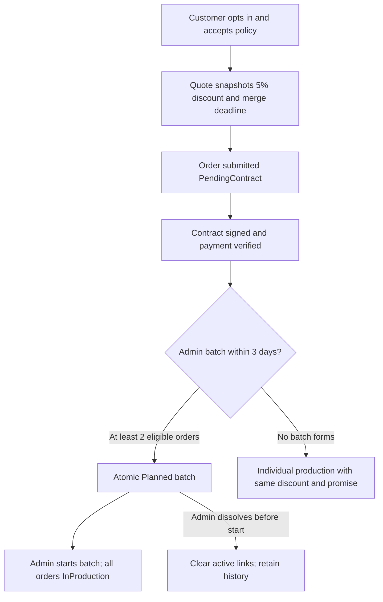

# MFG-10 — Merge Preference and Production Batches

**Contract:** Complete-system target. Decisions D01–D03, D06–D07, D09, D11–D12 in [system-decisions.md](../docs/system-decisions.md) govern. Human facts remain only in [user-input-needed.md](../docs/user-input-needed.md).

## Actors and boundary

Customer may opt in/out of merge production and explicitly accept the versioned merge policy during quote/checkout. This preference affects fixed pricing/deadline promises only; checkout never creates or reserves a batch. Company Admin uses the new S42 Merge Console to inspect candidates, estimate a batch, confirm it, start production or dissolve a Planned batch. MFG-06 owns quotes, order creation and immutable order/price snapshots; MFG-07 owns post-creation order status; this module manages batch membership and events. MFG-06 also owns payment/refund.

`MergePreference`: quote_id, customer opt-in, policy_version, accepted_at; submitting that quote copies the accepted preference/version to the immutable order snapshot. `ProductionBatch`: UUID id, company_id, product/material/color/print_method key, state Planned|InProduction|Completed|Dissolved, created_by, immutable membership snapshot, estimate snapshot, timestamps/version. Each order has at most one active batch. Candidates must be same company/product/material/color/print method, Confirmed, paid, current Signed contract, opt-in, unbatched, uncancelled and confirmed within the latest 3 calendar days. At least 2 orders; total quantity <=10000. Distinct customer artwork remains distinct inside the batch.

The fixed 5% subtotal discount and maximum 3 extra calendar days are honored whenever customer opts in, even if no batch forms. Standard production is due 7 days after confirmation; merge production is due 10 days after confirmation. These are production-completion commitments, not carrier-delivery promises. If no batch exists at the three-day eligibility cutoff, start the order as individual production at the promised price/due date. Discount is always floor(subtotal*5/100), even when a fallback to individual production occurs. No checkout batch assignment. Customer merge preference alone is not batch membership.

## Function contracts and requirements

| FR / function | Inputs and output | Validation, effect, and failure |
|---|---|---|
| FR-001 / F-MER-001 Merge Option View | Route product/design and session; output comparison view model with standard vs merge price/deadline and eligibility summary. | Show merge only for a saved eligible design/product. Price uses server quote. Terms clearly state 5% subtotal discount, max 3 extra days, admin batching later, and individual fallback retains terms. No batch created. |
| FR-002 / F-MER-002 Merge Terms View | policy_version; output versioned readable policy text. | Read-only; policy version recorded on customer acceptance and order snapshot. |
| FR-003 / F-MER-003 Save Preference Logic | quote_id, merge_opt_in boolean, policy_version, expected quote version; output saved preference and a newly issued immutable quote with refreshed breakdown. | Authenticated customer owns current quote. Validate product/design eligibility and policy version; server computes fixed discount. A preference change supersedes the prior quote and issues a new quote_id with a 30-minute validity window; never mutate a quote in place. Customer reviews the new breakdown before submission. Submitted order snapshot cannot be edited. Same total shown in S23/S25/S34/S35. Stale quote 409; invalid option 422. |
| FR-004 / F-MER-004 Merge Console View | Company Admin, candidate filters, pagination; output grouped eligible candidates and reasons for excluded candidates. | S42 console; only same-company data, allowlisted filters. Recompute eligibility server-side when requested; candidates are read-only until confirmed. |
| FR-005 / F-MER-005 Estimate Logic | selected order UUIDs; output exact estimate: gross_setup_saving_vnd, customer_discount_vnd, estimated_net_saving_vnd, setup_minutes_saved, total_quantity and production_due_at summary. | Demo planning model: setup cost 100000 VND; gross saving=(count−1)*100000; discount=sum(order merge discount); net=gross−discount; minutes=(count−1)*30. Negative net shown, requires explicit Admin acknowledgement at confirm. Setup minutes never shorten the promised production due date. Revalidate candidate list; invalid candidate 409. |
| FR-006 / F-MER-006 Batch Exec Logic | `action` enum create, start, complete or dissolve; create requires order_ids (>=2), estimate version, acknowledge_negative_net boolean if applicable and expected order versions; start/complete/dissolve require batch_id and expected batch version. All mutations require Idempotency-Key. Output batch id/state, immutable membership snapshot, and affected order links/statuses. | Create: in one transaction lock/revalidate all orders: same eligible key, paid/current Signed/Confirmed, opted in, within 3-day window, no cancel or batch, total quantity <=10000. Start: Planned only; atomically advance every linked order Confirmed→InProduction. Complete: InProduction only; record batch completion, leaving per-order shipment/delivery transitions to MFG-07. Dissolve: Planned only; mark Dissolved and clear active order.batch_id while retaining immutable membership history. Cross-company/mixed dimensions/duplicate IDs reject 422; stale eligibility/state 409; rollback all changes on failure. |
| FR-007 / F-MER-007 Merge Notify Logic | Internal committed batch event with batch_id/member IDs; output outbox IDs for each customer and production planning. | Resolve recipients from persisted membership, never caller-supplied customer IDs. Notify after commit. Duplicate event/recipient suppressed; email failure does not undo batch. |

### Batch transitions and operations

Only Company Admin in the batch's company may call F-MER-006 start/complete/dissolve. Planned→InProduction atomically advances all member orders Confirmed→InProduction; reject if any member is no longer eligible. Planned→Dissolved clears active order.batch_id while retaining immutable membership/audit history. No membership changes once InProduction. InProduction→Completed marks batch completion only; shipment/delivery remain per-order MFG-07 transitions. Cancellation becomes possible after dissolution subject to MFG-07 rules. At 3 calendar days after confirmation, a trusted scheduled job locks each still-unbatched opted-in order, records individual fallback, atomically advances Confirmed→InProduction, and emits the normal status notification without changing price or production_due_at. A concurrent batch/cancellation/fallback has one winner through row locks and expected state. Concurrent confirm/dissolve/start/complete is serialized by expected_version and row locks.

### Acceptance scenarios

Opt-in quote always shows exact 5% discount and merge deadline on every screen; submission creates an order with preference but no batch; admin confirmation with two eligible orders creates one batch; a third-party concurrent cancellation/production change causes atomic rejection with no partial membership; single order, mixed product/material, >10000 quantity or >3-day candidate rejects; no batch by deadline releases individual production without removing discount; negative estimate is visible and blocks confirmation until acknowledged; duplicate confirmation idempotently returns same batch; simultaneous start/dissolve has one winner; dissolution preserves audit history and clears active order links; notifications are persisted once even if SMTP fails.

Screens: S23 quote/merge choice, S24 merge policy, S25 checkout summary, S29 production management, S42 Merge Console, S38 notifications. Traceability: F-MER-001..007 / FR-001..007; UC-C06, UC-C17, UC-C18, UC-C16. D09 is authoritative where legacy descriptions imply automatic merge or checkout batch creation.
