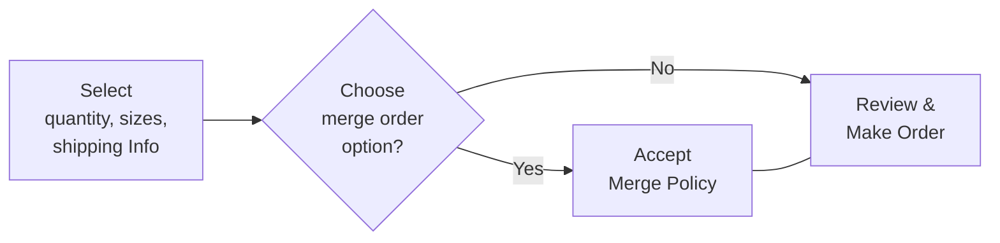
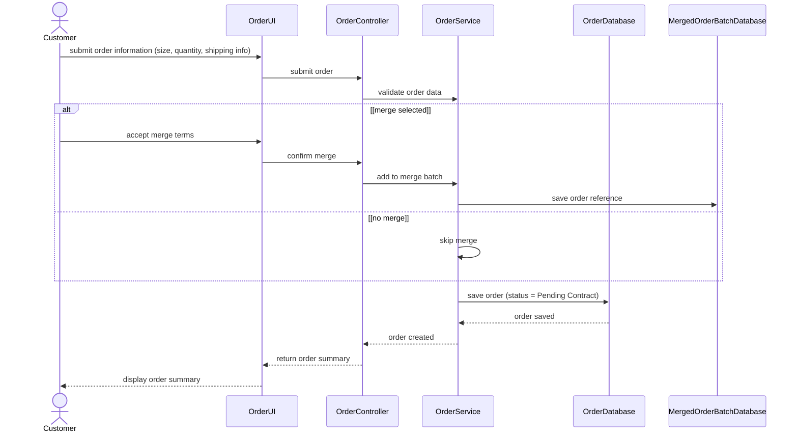

# Spec Document: Order Optimization (Merge)

| Field | Value |
| --- | --- |
| Module ID | `MFG-10` |
| Module name | Order Optimization (Merge) |
| Spec version | v0.1 |
| Author (team member) | [NEEDS CLARIFICATION: Specify the responsible team member; Group B is named only as the team on the Session 1 scope sheet.] |
| Date | 2026-09-16 |
| Status | Draft |
| Approved by (Client role) | [NEEDS CLARIFICATION: Client approver role and approval are not supplied.] |
| DBIZ2 source | Function List `MFG-10`, No. 77-83, `F-MER-001` .. `F-MER-007`; Use Cases: Choose merge option; View merge-eligible orders; Confirm merge batch; Optimize order; [NEEDS CLARIFICATION: Use Case IDs are not visible in the supplied table.]; Screens: `S22`, `S23`, `S24`, `S25`, `S29`, `S38` |

---

## 1. Purpose and scope (mandatory)

Customers can choose whether their order may be merged with other orders for production. Company administrators can review eligible orders, estimate savings, and confirm a production batch.

Source: [docs/function-list.md](../docs/function-list.md), `MFG-10` (No. 77-83); Session 1 MVP PDF, page 1 section 3. [NEEDS CLARIFICATION: Original DBIZ2 Schematic 1.1/1.2 cells are unavailable; the PDF reproduces the project objective but is not Session 3 MVP Scope v3.]

**In scope**

- Select Merge
- View Eligible
- Confirm Merge

Session 1 marks order optimization/merge as Could. All DBIZ2 subfunctions below are retained as documentation; this does not authorize release of deferred functions. [NEEDS CLARIFICATION: Supply MVP Scope v3 and Session 3 decisions to confirm current module scope.]

**Out of scope**

- Ordinary order creation and payment belong to MFG-06.

**Depends on**

- MFG-06: order IDs and merge preferences are part of the order journey (F-MER-003; SD-07).

## 2. Actors (mandatory)

| Actor | Role in this module | Where it comes from |
| --- | --- | --- |
| Customer | Primary — Select Merge | Function List `Actor` column, `MFG-10`: F-MER-001, F-MER-002, F-MER-003 |
| Company Admin | Primary — View Eligible, Confirm Merge | Function List `Actor` column, `MFG-10`: F-MER-004, F-MER-005, F-MER-006, F-MER-007 |

Primary identifies the actor performing the listed subfunctions; it does not replace conflicting Use Case or sequence labels. External participants appear in section 4 only when supplied by the source.

## 3. User scenarios and acceptance criteria (mandatory)

[NEEDS CLARIFICATION: P1/P2 scenario ordering is not agreed in the supplied materials; no scenario priority is inferred from Function List High/Medium/Low.]

### US-1 ([NEEDS CLARIFICATION: Scenario priority not agreed.]): Choose merge option

**Journey.** As a `Customer`, I want to `choose merge option`, so that [NEEDS CLARIFICATION: The Use Case names the goal but does not state a separate scenario benefit.].

Source: `docs/architecture/use-case.md`, line 19, “Choose merge option”; related FRs `FR-001` / `F-MER-001`, `FR-002` / `F-MER-002`, `FR-003` / `F-MER-003`. Actor association in the Use Case: [NEEDS CLARIFICATION: no direct actor association shown].

**Acceptance scenarios**

1. **Given** the customer has entered quantity, sizes and shipping information, **When** the customer chooses Yes at Choose merge order option?, **Then** the flow reaches Accept Merge Policy, connected to Review & Make Order.
2. **Given** the customer reaches Choose merge order option?, **When** the customer chooses No, **Then** the supplied flow proceeds directly to Review & Make Order.

### US-2 ([NEEDS CLARIFICATION: Scenario priority not agreed.]): View merge-eligible orders

**Journey.** As a `Company Admin`, I want to `view merge-eligible orders`, so that [NEEDS CLARIFICATION: The Use Case names the goal but does not state a separate scenario benefit.].

Source: `docs/architecture/use-case.md`, line 33, “View merge-eligible orders”; related FRs `FR-004` / `F-MER-004`, `FR-005` / `F-MER-005`. Actor association in the Use Case: [NEEDS CLARIFICATION: no direct actor association shown].

[NEEDS CLARIFICATION: No detailed Usage Flow or sequence for this use case is supplied; the criterion records the named goal and any explicitly cited Function List outcome. Confirm preconditions, action sequence and failure behavior before treating it as an agreed acceptance test.]

**Acceptance scenarios**

1. **Given** merge-eligible orders are available, **When** the company administrator views merge-eligible orders, **Then** those orders are displayed.

### US-3 ([NEEDS CLARIFICATION: Scenario priority not agreed.]): Confirm merge batch

**Journey.** As a `Company Admin`, I want to `confirm merge batch`, so that [NEEDS CLARIFICATION: The Use Case names the goal but does not state a separate scenario benefit.].

Source: `docs/architecture/use-case.md`, line 34, “Confirm merge batch”; related FRs `FR-006` / `F-MER-006`, `FR-007` / `F-MER-007`. Actor association in the Use Case: [NEEDS CLARIFICATION: no direct actor association shown].

[NEEDS CLARIFICATION: No detailed Usage Flow or sequence for this use case is supplied; the criterion records the named goal and any explicitly cited Function List outcome. Confirm preconditions, action sequence and failure behavior before treating it as an agreed acceptance test.]

**Acceptance scenarios**

1. **Given** the company administrator has selected orders for a merge batch, **When** the administrator confirms the merge batch, **Then** one new batch is created with the selected orders linked and customers and production planning are notified (F-MER-006/F-MER-007).

### US-4 ([NEEDS CLARIFICATION: Scenario priority not agreed.]): Optimize order

**Journey.** As a `Company Admin`, I want to `optimize order`, so that [NEEDS CLARIFICATION: The Use Case names the goal but does not state a separate scenario benefit.].

Source: `docs/architecture/use-case.md`, line 35, “Optimize order”; related FRs `FR-004` / `F-MER-004`, `FR-005` / `F-MER-005`, `FR-006` / `F-MER-006`, `FR-007` / `F-MER-007`.

[NEEDS CLARIFICATION: No detailed Usage Flow or sequence for this use case is supplied; the criterion records the named goal and any explicitly cited Function List outcome. Confirm preconditions, action sequence and failure behavior before treating it as an agreed acceptance test.]

**Acceptance scenarios**

1. **Given** the company administrator is optimizing orders, **When** the administrator chooses a related merge action, **Then** View merge-eligible orders or Confirm merge batch is entered.

### Edge cases

- [NEEDS CLARIFICATION: Document missing/invalid inputs and empty-data outcomes not already covered by the supplied screens or sequences.]
- [NEEDS CLARIFICATION: Document behavior when a required external service or data operation is unavailable; do not infer retries or fallback paths.]
- [NEEDS CLARIFICATION: Document repeated actions and simultaneous-user outcomes; no concurrency or duplicate-submission rule is supplied.]

## 4. Flows (mandatory)

### 4.1 Usage flow

Exact module-relevant excerpt from `docs/architecture/usage-flow.md`. Boundary nodes retain cross-module context; all included decisions keep both branches. Original node names, labels and connector types are unchanged. This is a subset of the supplied overall journey, not a replacement flow.

[NEEDS CLARIFICATION: The original DBIZ2 Usage Flow image is not supplied; verify this transcription against the original figure before approving the diagram checklist.]

### 4.2 Sequence for the main flow

**SD-07: Create Order**

Copied unchanged from `docs/architecture/sequence.md`; participants and messages are source text. Cross-module participants remain to preserve the supplied interaction. [NEEDS CLARIFICATION: Confirm which supplied sequence is the agreed main flow; sequences for other listed use cases are not available.]

## 5. Functional requirements (mandatory)

One FR per original Function List subfunction, in source order. FR IDs are local to this module; cite `MFG-10/FR-nnn` with the unchanged Subfunction ID. Original function names and High/Medium/Low values are preserved in each requirement note. MoSCoW values are used only for capabilities explicitly prioritized on page 2 of the Session 1 PDF; [NEEDS CLARIFICATION: Confirm per-subfunction priority mapping and the current Session 3 release scope.]

| FR ID | DBIZ2 Subfunction ID | Requirement (system MUST ...) | Actor | Priority |
| --- | --- | --- | --- | --- |
| FR-001 | F-MER-001 | The system MUST display a dialog suggesting order merging to save on manufacturing costs, comparing with standard order. DBIZ2 function: Select Merge; subfunction: Merge Option View; category: Screen; original priority: Medium. | Customer | Could |
| FR-002 | F-MER-002 | The system MUST display detailed terms and conditions regarding the order merging policy. DBIZ2 function: Select Merge; subfunction: Merge Terms View; category: Screen; original priority: Low. | Customer | Could |
| FR-003 | F-MER-003 | The system MUST save the choice to accept or decline merging into the order record. DBIZ2 function: Select Merge; subfunction: Save Preference Logic; category: Process; original priority: Medium. | Customer | Could |
| FR-004 | F-MER-004 | The system MUST display a list of orders eligible for merging into a production batch. DBIZ2 function: View Eligible; subfunction: Merge Console View; category: Screen; original priority: High. | Company Admin | Could |
| FR-005 | F-MER-005 | The system MUST calculate and display estimated cost savings and production time reduction. DBIZ2 function: View Eligible; subfunction: Estimate Logic; category: Process; original priority: High. | Company Admin | Could |
| FR-006 | F-MER-006 | The system MUST execute the merging of selected orders into a single production batch. DBIZ2 function: Confirm Merge; subfunction: Batch Exec Logic; category: Process; original priority: High. | Company Admin | Could |
| FR-007 | F-MER-007 | The system MUST notify customers and production planning about the successfully merged orders. DBIZ2 function: Confirm Merge; subfunction: Merge Notify Logic; category: Process; original priority: Medium. | Company Admin | Could |

### 5.1 Input / Output contract

Literal Function List field names, types and required flags are preserved. Input and output rows are separate to avoid inventing field-to-field pairings. The template Required column applies to inputs; output required flags appear in Notes / validation. `—` means that side of this row is not applicable, not that a source field was omitted. Object contents, validation ranges and identifier formats are not inferred. [NEEDS CLARIFICATION: Supply nested Object/JSON/Array schemas and field validation where absent; apparent source type errors remain unchanged until clarified.]

| FR ID | Input field | Type | Required | Output field | Type | Notes / validation |
| --- | --- | --- | --- | --- | --- | --- |
| FR-001 | [NEEDS CLARIFICATION: F-MER-001 input: no field specified.] | — | [NEEDS CLARIFICATION: F-MER-001: input required flag unavailable.] | — | — | Function List No. 77, F-MER-001, Input column |
| FR-001 | — | — | — | `standard_vs_merge_order_ui` | [NEEDS CLARIFICATION: F-MER-001 output standard_vs_merge_order_ui: UI representation type.] | Output required: Yes. Function List No. 77, F-MER-001, Output column. |
| FR-002 | [NEEDS CLARIFICATION: F-MER-002 input: no field specified.] | — | [NEEDS CLARIFICATION: F-MER-002: input required flag unavailable.] | — | — | Function List No. 78, F-MER-002, Input column |
| FR-002 | — | — | — | `static_text_terms_ui` | [NEEDS CLARIFICATION: F-MER-002 output static_text_terms_ui: UI representation type.] | Output required: Yes. Function List No. 78, F-MER-002, Output column. |
| FR-003 | `order_id` | String | Yes | — | — | Function List No. 79, F-MER-003, Input column. |
| FR-003 | `merge_preference` | Boolean | Yes | — | — | Function List No. 79, F-MER-003, Input column. |
| FR-003 | — | — | — | `preference_saved_in_db` | [NEEDS CLARIFICATION: F-MER-003 output preference_saved_in_db: data type.] | Output required: Yes. Function List No. 79, F-MER-003, Output column. |
| FR-004 | `production_criteria` | Object | Yes | — | — | Function List No. 80, F-MER-004, Input column. |
| FR-004 | — | — | — | `list_of_merge_candidates` | Array<Object> | Output required: Yes. Function List No. 80, F-MER-004, Output column. |
| FR-005 | `selected_orders_list` | Array<Object> | Yes | — | — | Function List No. 81, F-MER-005, Input column. |
| FR-005 | — | — | — | `estimated_savings` | Decimal | Output required: Yes. Function List No. 81, F-MER-005, Output column. |
| FR-006 | `list_of_order_ids_to_merge` | Array<Object> | Yes | — | — | Function List No. 82, F-MER-006, Input column. |
| FR-006 | — | — | — | `new_batch_id_created` | String | Output required: Yes. Function List No. 82, F-MER-006, Output column. |
| FR-006 | — | — | — | `orders_linked` | Array<Object> | Output required: Yes. Function List No. 82, F-MER-006, Output column. |
| FR-007 | `batch_id` | String | Yes | — | — | Function List No. 83, F-MER-007, Input column. |
| FR-007 | `customer_ids` | [NEEDS CLARIFICATION: F-MER-007 input customer_ids: data type.] | Yes | — | — | Function List No. 83, F-MER-007, Input column. |
| FR-007 | — | — | — | `batch_confirmation_emails` | [NEEDS CLARIFICATION: F-MER-007 output batch_confirmation_emails: data type.] | Output required: Yes. Function List No. 83, F-MER-007, Output column. |

### 5.2 Business rules

| Rule ID | Rule | Why it exists |
| --- | --- | --- |
| BR-001 | A customer may accept or decline merging, and the choice is saved with the order. | F-MER-003 consumes order_id and Boolean merge_preference. Business rationale beyond the stated source is not separately documented. |
| BR-002 | Successful merging triggers notification to customers and production planning. | F-MER-007 explicitly identifies notification recipients. Business rationale beyond the stated source is not separately documented. |

## 6. Key entities (mandatory)

| Entity | Attributes (from Input/Output fields) | Relationships |
| --- | --- | --- |
| Order merge preference | `order_id`, `merge_preference`, `preference_saved_in_db` | [NEEDS CLARIFICATION: Order merge preference: relationship cardinalities and nested field ownership are not specified in the Input/Output contract.] |
| Production batch | `production_criteria`, `list_of_merge_candidates`, `selected_orders_list`, `estimated_savings`, `list_of_order_ids_to_merge`, `new_batch_id_created`, `orders_linked`, `batch_id`, `customer_ids` | [NEEDS CLARIFICATION: Production batch: relationship cardinalities and nested field ownership are not specified in the Input/Output contract.] |

Names above group the literal section 5.1 fields for discussion. They do not introduce tables, extra attributes, foreign keys or relationship cardinalities.

## 7. Screens involved

| Screen ID | Screen name | Priority | Screen Spec file |
| --- | --- | --- | --- |
| S22 | Create Order Screen — Shared screen / navigation boundary | [NEEDS CLARIFICATION: S22: Screen List provides no agreed Must/Should priority.] | `screens/S22-create_order_screen.md` ([open](../screens/S22-create_order_screen.md)) |
| S23 | Merge Option Screen — Direct module screen | [NEEDS CLARIFICATION: S23: Screen List provides no agreed Must/Should priority.] | `screens/S23-merge_option_screen.md` ([open](../screens/S23-merge_option_screen.md)) |
| S24 | Merge Terms Screen — Direct module screen | [NEEDS CLARIFICATION: S24: Screen List provides no agreed Must/Should priority.] | [NEEDS CLARIFICATION: S24: no Screen Spec file supplied; do not invent a screen-spec filename.] |
| S25 | Order Summary Screen — Shared screen / navigation boundary | [NEEDS CLARIFICATION: S25: Screen List provides no agreed Must/Should priority.] | `screens/S25-order_summary_screen.md` ([open](../screens/S25-order_summary_screen.md)) |
| S29 | Order Detail Screen (Admin) — Direct module screen | [NEEDS CLARIFICATION: S29: Screen List provides no agreed Must/Should priority.] | [NEEDS CLARIFICATION: S29: no Screen Spec file supplied; do not invent a screen-spec filename.] |
| S38 | Notification Panel Screen — Shared screen / navigation boundary | [NEEDS CLARIFICATION: S38: Screen List provides no agreed Must/Should priority.] | [NEEDS CLARIFICATION: S38: no Screen Spec file supplied; do not invent a screen-spec filename.] |

Existing descriptive filenames are retained. Business navigation and notification-panel touchpoints are listed as shared boundaries; this module does not acquire their owning requirements. Screen Specs contain pre-existing “module spec unavailable” notes: these are resolved as file-existence issues by this delivery, not as behavioral approvals.

## 8. Success criteria (mandatory)

| SC ID | Criterion | How it is measured |
| --- | --- | --- |
| SC-001 | [NEEDS CLARIFICATION: No agreed measurable user-outcome success criterion is present in the supplied Session 1 scope sheet or DBIZ2 extracts; provide the Session 3 criterion for this module.] | [NEEDS CLARIFICATION: Confirm the user task, observable completion outcome, agreed target and evaluation method; none is supplied.] |

The source states feature priorities and project goals, not agreed outcome thresholds. No timing, conversion, cost-saving or technical-performance target is introduced.

## 9. Assumptions

- No separate module assumption is explicitly documented in the supplied sources. No assumption has been added to fill missing requirements.

## 10. Open questions

| # | Question | Blocking? | Owner | Status |
| --- | --- | --- | --- | --- |
| 1 | [NEEDS CLARIFICATION: Specify the responsible team member; Group B is named only as the team on the Session 1 scope sheet.] | Unassessed; see final question | Unassigned; see final question | Open |
| 2 | [NEEDS CLARIFICATION: Client approver role and approval are not supplied.] | Unassessed; see final question | Unassigned; see final question | Open |
| 3 | [NEEDS CLARIFICATION: Use Case IDs are not visible in the supplied table.] | Unassessed; see final question | Unassigned; see final question | Open |
| 4 | [NEEDS CLARIFICATION: Original DBIZ2 Schematic 1.1/1.2 cells are unavailable; the PDF reproduces the project objective but is not Session 3 MVP Scope v3.] | Unassessed; see final question | Unassigned; see final question | Open |
| 5 | [NEEDS CLARIFICATION: Supply MVP Scope v3 and Session 3 decisions to confirm current module scope.] | Unassessed; see final question | Unassigned; see final question | Open |
| 6 | [NEEDS CLARIFICATION: P1/P2 scenario ordering is not agreed in the supplied materials; no scenario priority is inferred from Function List High/Medium/Low.] | Unassessed; see final question | Unassigned; see final question | Open |
| 7 | [NEEDS CLARIFICATION: Scenario priority not agreed.] | Unassessed; see final question | Unassigned; see final question | Open |
| 8 | [NEEDS CLARIFICATION: The Use Case names the goal but does not state a separate scenario benefit.] | Unassessed; see final question | Unassigned; see final question | Open |
| 9 | [NEEDS CLARIFICATION: no direct actor association shown] | Unassessed; see final question | Unassigned; see final question | Open |
| 10 | [NEEDS CLARIFICATION: No detailed Usage Flow or sequence for this use case is supplied; the criterion records the named goal and any explicitly cited Function List outcome. Confirm preconditions, action sequence and failure behavior before treating it as an agreed acceptance test.] | Unassessed; see final question | Unassigned; see final question | Open |
| 11 | [NEEDS CLARIFICATION: Document missing/invalid inputs and empty-data outcomes not already covered by the supplied screens or sequences.] | Unassessed; see final question | Unassigned; see final question | Open |
| 12 | [NEEDS CLARIFICATION: Document behavior when a required external service or data operation is unavailable; do not infer retries or fallback paths.] | Unassessed; see final question | Unassigned; see final question | Open |
| 13 | [NEEDS CLARIFICATION: Document repeated actions and simultaneous-user outcomes; no concurrency or duplicate-submission rule is supplied.] | Unassessed; see final question | Unassigned; see final question | Open |
| 14 | [NEEDS CLARIFICATION: The original DBIZ2 Usage Flow image is not supplied; verify this transcription against the original figure before approving the diagram checklist.] | Unassessed; see final question | Unassigned; see final question | Open |
| 15 | [NEEDS CLARIFICATION: Confirm which supplied sequence is the agreed main flow; sequences for other listed use cases are not available.] | Unassessed; see final question | Unassigned; see final question | Open |
| 16 | [NEEDS CLARIFICATION: Confirm per-subfunction priority mapping and the current Session 3 release scope.] | Unassessed; see final question | Unassigned; see final question | Open |
| 17 | [NEEDS CLARIFICATION: Supply nested Object/JSON/Array schemas and field validation where absent; apparent source type errors remain unchanged until clarified.] | Unassessed; see final question | Unassigned; see final question | Open |
| 18 | [NEEDS CLARIFICATION: F-MER-001 input: no field specified.] | Unassessed; see final question | Unassigned; see final question | Open |
| 19 | [NEEDS CLARIFICATION: F-MER-001: input required flag unavailable.] | Unassessed; see final question | Unassigned; see final question | Open |
| 20 | [NEEDS CLARIFICATION: F-MER-001 output standard_vs_merge_order_ui: UI representation type.] | Unassessed; see final question | Unassigned; see final question | Open |
| 21 | [NEEDS CLARIFICATION: F-MER-002 input: no field specified.] | Unassessed; see final question | Unassigned; see final question | Open |
| 22 | [NEEDS CLARIFICATION: F-MER-002: input required flag unavailable.] | Unassessed; see final question | Unassigned; see final question | Open |
| 23 | [NEEDS CLARIFICATION: F-MER-002 output static_text_terms_ui: UI representation type.] | Unassessed; see final question | Unassigned; see final question | Open |
| 24 | [NEEDS CLARIFICATION: F-MER-003 output preference_saved_in_db: data type.] | Unassessed; see final question | Unassigned; see final question | Open |
| 25 | [NEEDS CLARIFICATION: F-MER-007 input customer_ids: data type.] | Unassessed; see final question | Unassigned; see final question | Open |
| 26 | [NEEDS CLARIFICATION: F-MER-007 output batch_confirmation_emails: data type.] | Unassessed; see final question | Unassigned; see final question | Open |
| 27 | [NEEDS CLARIFICATION: Order merge preference: relationship cardinalities and nested field ownership are not specified in the Input/Output contract.] | Unassessed; see final question | Unassigned; see final question | Open |
| 28 | [NEEDS CLARIFICATION: Production batch: relationship cardinalities and nested field ownership are not specified in the Input/Output contract.] | Unassessed; see final question | Unassigned; see final question | Open |
| 29 | [NEEDS CLARIFICATION: S22: Screen List provides no agreed Must/Should priority.] | Unassessed; see final question | Unassigned; see final question | Open |
| 30 | [NEEDS CLARIFICATION: S23: Screen List provides no agreed Must/Should priority.] | Unassessed; see final question | Unassigned; see final question | Open |
| 31 | [NEEDS CLARIFICATION: S24: Screen List provides no agreed Must/Should priority.] | Unassessed; see final question | Unassigned; see final question | Open |
| 32 | [NEEDS CLARIFICATION: S24: no Screen Spec file supplied; do not invent a screen-spec filename.] | Unassessed; see final question | Unassigned; see final question | Open |
| 33 | [NEEDS CLARIFICATION: S25: Screen List provides no agreed Must/Should priority.] | Unassessed; see final question | Unassigned; see final question | Open |
| 34 | [NEEDS CLARIFICATION: S29: Screen List provides no agreed Must/Should priority.] | Unassessed; see final question | Unassigned; see final question | Open |
| 35 | [NEEDS CLARIFICATION: S29: no Screen Spec file supplied; do not invent a screen-spec filename.] | Unassessed; see final question | Unassigned; see final question | Open |
| 36 | [NEEDS CLARIFICATION: S38: Screen List provides no agreed Must/Should priority.] | Unassessed; see final question | Unassigned; see final question | Open |
| 37 | [NEEDS CLARIFICATION: S38: no Screen Spec file supplied; do not invent a screen-spec filename.] | Unassessed; see final question | Unassigned; see final question | Open |
| 38 | [NEEDS CLARIFICATION: No agreed measurable user-outcome success criterion is present in the supplied Session 1 scope sheet or DBIZ2 extracts; provide the Session 3 criterion for this module.] | Unassessed; see final question | Unassigned; see final question | Open |
| 39 | [NEEDS CLARIFICATION: Confirm the user task, observable completion outcome, agreed target and evaluation method; none is supplied.] | Unassessed; see final question | Unassigned; see final question | Open |
| 40 | [NEEDS CLARIFICATION: What are the documented merge eligibility criteria, capacity constraints and savings calculation?] | Unassessed; see final question | Unassigned; see final question | Open |
| 41 | [NEEDS CLARIFICATION: S29 is the only listed administrator order screen mentioning merging, but no dedicated merge-console/estimate screen is supplied; confirm mappings.] | Unassessed; see final question | Unassigned; see final question | Open |
| 42 | [NEEDS CLARIFICATION: SD-07 saves an order reference to a merge batch before saving the order; confirm how this relates to later administrator batch confirmation F-MER-006.] | Unassessed; see final question | Unassigned; see final question | Open |
| 43 | [NEEDS CLARIFICATION: F-MER-005 describes production-time reduction but only estimated_savings appears in its output; confirm the missing time-related output.] | Unassessed; see final question | Unassigned; see final question | Open |
| 44 | [NEEDS CLARIFICATION: AcceptMerge --- ReviewOrder is an undirected connector in the supplied Mermaid. Confirm intended direction from the original DBIZ2 figure.] | Unassessed; see final question | Unassigned; see final question | Open |
| 45 | [NEEDS CLARIFICATION: S22, [NEEDS CLARIFICATION: Must / Should / Could not given in Screen List]: Must / Should / Could not given in Screen List] Source: `screens/S22-create_order_screen.md`, line 16. | Unassessed; see final question | Unassigned; see final question | Open |
| 46 | [NEEDS CLARIFICATION: S22, **The user leaves this screen when:** [NEEDS CLARIFICATION: all exit paths are not specifi: all exit paths are not specified; documented interactions appear in section 5.] Source: `screens/S22-create_order_screen.md`, line 25. | Unassessed; see final question | Unassigned; see final question | Open |
| 47 | [NEEDS CLARIFICATION: S22, Product name: schema] Source: `screens/S22-create_order_screen.md`, line 51. | Unassessed; see final question | Unassigned; see final question | Open |
| 48 | [NEEDS CLARIFICATION: S22, Size S quantity input: Unspecified requirement; inspect the cited source row.] Source: `screens/S22-create_order_screen.md`, line 58. | Unassessed; see final question | Unassigned; see final question | Open |
| 49 | [NEEDS CLARIFICATION: S22, Size S quantity input: quantity rules] Source: `screens/S22-create_order_screen.md`, line 58. | Unassessed; see final question | Unassigned; see final question | Open |
| 50 | [NEEDS CLARIFICATION: S22, Size M quantity input: Unspecified requirement; inspect the cited source row.] Source: `screens/S22-create_order_screen.md`, line 62. | Unassessed; see final question | Unassigned; see final question | Open |
| 51 | [NEEDS CLARIFICATION: S22, Size M quantity input: quantity rules] Source: `screens/S22-create_order_screen.md`, line 62. | Unassessed; see final question | Unassigned; see final question | Open |
| 52 | [NEEDS CLARIFICATION: S22, Size L quantity input: Unspecified requirement; inspect the cited source row.] Source: `screens/S22-create_order_screen.md`, line 66. | Unassessed; see final question | Unassigned; see final question | Open |
| 53 | [NEEDS CLARIFICATION: S22, Size L quantity input: quantity rules] Source: `screens/S22-create_order_screen.md`, line 66. | Unassessed; see final question | Unassigned; see final question | Open |
| 54 | [NEEDS CLARIFICATION: S22, Size XL quantity input: Unspecified requirement; inspect the cited source row.] Source: `screens/S22-create_order_screen.md`, line 70. | Unassessed; see final question | Unassigned; see final question | Open |
| 55 | [NEEDS CLARIFICATION: S22, Size XL quantity input: quantity rules] Source: `screens/S22-create_order_screen.md`, line 70. | Unassessed; see final question | Unassigned; see final question | Open |
| 56 | [NEEDS CLARIFICATION: S22, Size 2XL quantity input: Unspecified requirement; inspect the cited source row.] Source: `screens/S22-create_order_screen.md`, line 74. | Unassessed; see final question | Unassigned; see final question | Open |
| 57 | [NEEDS CLARIFICATION: S22, Size 2XL quantity input: quantity rules] Source: `screens/S22-create_order_screen.md`, line 74. | Unassessed; see final question | Unassigned; see final question | Open |
| 58 | [NEEDS CLARIFICATION: S22, Size 3XL quantity input: Unspecified requirement; inspect the cited source row.] Source: `screens/S22-create_order_screen.md`, line 78. | Unassessed; see final question | Unassigned; see final question | Open |
| 59 | [NEEDS CLARIFICATION: S22, Size 3XL quantity input: quantity rules] Source: `screens/S22-create_order_screen.md`, line 78. | Unassessed; see final question | Unassigned; see final question | Open |
| 60 | [NEEDS CLARIFICATION: S22, Size 4XL quantity input: Unspecified requirement; inspect the cited source row.] Source: `screens/S22-create_order_screen.md`, line 82. | Unassessed; see final question | Unassigned; see final question | Open |
| 61 | [NEEDS CLARIFICATION: S22, Size 4XL quantity input: quantity rules] Source: `screens/S22-create_order_screen.md`, line 82. | Unassessed; see final question | Unassigned; see final question | Open |
| 62 | [NEEDS CLARIFICATION: S22, Total items: Unspecified requirement; inspect the cited source row.] Source: `screens/S22-create_order_screen.md`, line 84. | Unassessed; see final question | Unassigned; see final question | Open |
| 63 | [NEEDS CLARIFICATION: S22, Email Address input: schema] Source: `screens/S22-create_order_screen.md`, line 86. | Unassessed; see final question | Unassigned; see final question | Open |
| 64 | [NEEDS CLARIFICATION: S22, Email Address input: Unspecified requirement; inspect the cited source row.] Source: `screens/S22-create_order_screen.md`, line 86. | Unassessed; see final question | Unassigned; see final question | Open |
| 65 | [NEEDS CLARIFICATION: S22, Email Address input: validation rule not specified] Source: `screens/S22-create_order_screen.md`, line 86. | Unassessed; see final question | Unassigned; see final question | Open |
| 66 | [NEEDS CLARIFICATION: S22, Full Name input: schema] Source: `screens/S22-create_order_screen.md`, line 87. | Unassessed; see final question | Unassigned; see final question | Open |
| 67 | [NEEDS CLARIFICATION: S22, Full Name input: Unspecified requirement; inspect the cited source row.] Source: `screens/S22-create_order_screen.md`, line 87. | Unassessed; see final question | Unassigned; see final question | Open |
| 68 | [NEEDS CLARIFICATION: S22, Full Name input: validation rule not specified] Source: `screens/S22-create_order_screen.md`, line 87. | Unassessed; see final question | Unassigned; see final question | Open |
| 69 | [NEEDS CLARIFICATION: S22, Address input: schema] Source: `screens/S22-create_order_screen.md`, line 88. | Unassessed; see final question | Unassigned; see final question | Open |
| 70 | [NEEDS CLARIFICATION: S22, Address input: Unspecified requirement; inspect the cited source row.] Source: `screens/S22-create_order_screen.md`, line 88. | Unassessed; see final question | Unassigned; see final question | Open |
| 71 | [NEEDS CLARIFICATION: S22, Address input: validation rule not specified] Source: `screens/S22-create_order_screen.md`, line 88. | Unassessed; see final question | Unassigned; see final question | Open |
| 72 | [NEEDS CLARIFICATION: S22, City input: schema] Source: `screens/S22-create_order_screen.md`, line 89. | Unassessed; see final question | Unassigned; see final question | Open |
| 73 | [NEEDS CLARIFICATION: S22, City input: Unspecified requirement; inspect the cited source row.] Source: `screens/S22-create_order_screen.md`, line 89. | Unassessed; see final question | Unassigned; see final question | Open |
| 74 | [NEEDS CLARIFICATION: S22, City input: validation rule not specified] Source: `screens/S22-create_order_screen.md`, line 89. | Unassessed; see final question | Unassigned; see final question | Open |
| 75 | [NEEDS CLARIFICATION: S22, Zip Code input: schema] Source: `screens/S22-create_order_screen.md`, line 90. | Unassessed; see final question | Unassigned; see final question | Open |
| 76 | [NEEDS CLARIFICATION: S22, Zip Code input: Unspecified requirement; inspect the cited source row.] Source: `screens/S22-create_order_screen.md`, line 90. | Unassessed; see final question | Unassigned; see final question | Open |
| 77 | [NEEDS CLARIFICATION: S22, Zip Code input: validation rule not specified] Source: `screens/S22-create_order_screen.md`, line 90. | Unassessed; see final question | Unassigned; see final question | Open |
| 78 | [NEEDS CLARIFICATION: S22, [NEEDS CLARIFICATION: no selected design or no shipping data]: no selected design or no shipping data] Source: `screens/S22-create_order_screen.md`, line 124. | Unassessed; see final question | Unassigned; see final question | Open |
| 79 | [NEEDS CLARIFICATION: S22, [NEEDS CLARIFICATION: address/save loading treatment]: address/save loading treatment] Source: `screens/S22-create_order_screen.md`, line 125. | Unassessed; see final question | Unassigned; see final question | Open |
| 80 | [NEEDS CLARIFICATION: S22, [NEEDS CLARIFICATION: address/quantity error treatment]: address/quantity error treatment] Source: `screens/S22-create_order_screen.md`, line 126. | Unassessed; see final question | Unassigned; see final question | Open |
| 81 | [NEEDS CLARIFICATION: S22, [NEEDS CLARIFICATION: address saved confirmation]: address saved confirmation] Source: `screens/S22-create_order_screen.md`, line 127. | Unassessed; see final question | Unassigned; see final question | Open |
| 82 | [NEEDS CLARIFICATION: S22, About Dony navigation: destination not in Screen List] Source: `screens/S22-create_order_screen.md`, line 135. | Unassessed; see final question | Unassigned; see final question | Open |
| 83 | [NEEDS CLARIFICATION: S22, Contact Us navigation: destination not in Screen List] Source: `screens/S22-create_order_screen.md`, line 138. | Unassessed; see final question | Unassigned; see final question | Open |
| 84 | [NEEDS CLARIFICATION: S22, Size S decrement: limits] Source: `screens/S22-create_order_screen.md`, line 142. | Unassessed; see final question | Unassigned; see final question | Open |
| 85 | [NEEDS CLARIFICATION: S22, Size M decrement: limits] Source: `screens/S22-create_order_screen.md`, line 143. | Unassessed; see final question | Unassigned; see final question | Open |
| 86 | [NEEDS CLARIFICATION: S22, Size L decrement: limits] Source: `screens/S22-create_order_screen.md`, line 144. | Unassessed; see final question | Unassigned; see final question | Open |
| 87 | [NEEDS CLARIFICATION: S22, Size XL decrement: limits] Source: `screens/S22-create_order_screen.md`, line 145. | Unassessed; see final question | Unassigned; see final question | Open |
| 88 | [NEEDS CLARIFICATION: S22, Size 2XL decrement: limits] Source: `screens/S22-create_order_screen.md`, line 146. | Unassessed; see final question | Unassigned; see final question | Open |
| 89 | [NEEDS CLARIFICATION: S22, Size 3XL decrement: limits] Source: `screens/S22-create_order_screen.md`, line 147. | Unassessed; see final question | Unassigned; see final question | Open |
| 90 | [NEEDS CLARIFICATION: S22, Size 4XL decrement: limits] Source: `screens/S22-create_order_screen.md`, line 148. | Unassessed; see final question | Unassigned; see final question | Open |
| 91 | [NEEDS CLARIFICATION: S22, Size S quantity input: validation] Source: `screens/S22-create_order_screen.md`, line 149. | Unassessed; see final question | Unassigned; see final question | Open |
| 92 | [NEEDS CLARIFICATION: S22, Size M quantity input: validation] Source: `screens/S22-create_order_screen.md`, line 150. | Unassessed; see final question | Unassigned; see final question | Open |
| 93 | [NEEDS CLARIFICATION: S22, Size L quantity input: validation] Source: `screens/S22-create_order_screen.md`, line 151. | Unassessed; see final question | Unassigned; see final question | Open |
| 94 | [NEEDS CLARIFICATION: S22, Size XL quantity input: validation] Source: `screens/S22-create_order_screen.md`, line 152. | Unassessed; see final question | Unassigned; see final question | Open |
| 95 | [NEEDS CLARIFICATION: S22, Size 2XL quantity input: validation] Source: `screens/S22-create_order_screen.md`, line 153. | Unassessed; see final question | Unassigned; see final question | Open |
| 96 | [NEEDS CLARIFICATION: S22, Size 3XL quantity input: validation] Source: `screens/S22-create_order_screen.md`, line 154. | Unassessed; see final question | Unassigned; see final question | Open |
| 97 | [NEEDS CLARIFICATION: S22, Size 4XL quantity input: validation] Source: `screens/S22-create_order_screen.md`, line 155. | Unassessed; see final question | Unassigned; see final question | Open |
| 98 | [NEEDS CLARIFICATION: S22, Save address button: Unspecified requirement; inspect the cited source row.] Source: `screens/S22-create_order_screen.md`, line 168. | Unassessed; see final question | Unassigned; see final question | Open |
| 99 | [NEEDS CLARIFICATION: S22, Move to editor button: Unspecified requirement; inspect the cited source row.] Source: `screens/S22-create_order_screen.md`, line 169. | Unassessed; see final question | Unassigned; see final question | Open |
| 100 | [NEEDS CLARIFICATION: S22, Zalo contact button: contact destination] Source: `screens/S22-create_order_screen.md`, line 170. | Unassessed; see final question | Unassigned; see final question | Open |
| 101 | [NEEDS CLARIFICATION: S22, Telephone contact button: dial behavior] Source: `screens/S22-create_order_screen.md`, line 171. | Unassessed; see final question | Unassigned; see final question | Open |
| 102 | [NEEDS CLARIFICATION: S22, Footer Facebook icon: external or in-system destination] Source: `screens/S22-create_order_screen.md`, line 172. | Unassessed; see final question | Unassigned; see final question | Open |
| 103 | [NEEDS CLARIFICATION: S22, Footer X icon: external or in-system destination] Source: `screens/S22-create_order_screen.md`, line 173. | Unassessed; see final question | Unassigned; see final question | Open |
| 104 | [NEEDS CLARIFICATION: S22, Footer LinkedIn icon: external or in-system destination] Source: `screens/S22-create_order_screen.md`, line 174. | Unassessed; see final question | Unassigned; see final question | Open |
| 105 | [NEEDS CLARIFICATION: S22, Footer YouTube icon: external or in-system destination] Source: `screens/S22-create_order_screen.md`, line 175. | Unassessed; see final question | Unassigned; see final question | Open |
| 106 | [NEEDS CLARIFICATION: S22, Footer TikTok icon: external or in-system destination] Source: `screens/S22-create_order_screen.md`, line 176. | Unassessed; see final question | Unassigned; see final question | Open |
| 107 | [NEEDS CLARIFICATION: S22, Company profile link: external or in-system destination] Source: `screens/S22-create_order_screen.md`, line 177. | Unassessed; see final question | Unassigned; see final question | Open |
| 108 | [NEEDS CLARIFICATION: S22, Quality policy link: external or in-system destination] Source: `screens/S22-create_order_screen.md`, line 178. | Unassessed; see final question | Unassigned; see final question | Open |
| 109 | [NEEDS CLARIFICATION: S22, Warranty policy link: external or in-system destination] Source: `screens/S22-create_order_screen.md`, line 179. | Unassessed; see final question | Unassigned; see final question | Open |
| 110 | [NEEDS CLARIFICATION: S22, Delivery and return policy link: external or in-system destination] Source: `screens/S22-create_order_screen.md`, line 180. | Unassessed; see final question | Unassigned; see final question | Open |
| 111 | [NEEDS CLARIFICATION: S22, Second warranty policy link: external or in-system destination] Source: `screens/S22-create_order_screen.md`, line 181. | Unassessed; see final question | Unassigned; see final question | Open |
| 112 | [NEEDS CLARIFICATION: S22, Shipping policy link: external or in-system destination] Source: `screens/S22-create_order_screen.md`, line 182. | Unassessed; see final question | Unassigned; see final question | Open |
| 113 | [NEEDS CLARIFICATION: S22, Payment methods link: external or in-system destination] Source: `screens/S22-create_order_screen.md`, line 183. | Unassessed; see final question | Unassigned; see final question | Open |
| 114 | [NEEDS CLARIFICATION: S22, Business areas link: external or in-system destination] Source: `screens/S22-create_order_screen.md`, line 184. | Unassessed; see final question | Unassigned; see final question | Open |
| 115 | [NEEDS CLARIFICATION: S22, FAQ link: external or in-system destination] Source: `screens/S22-create_order_screen.md`, line 185. | Unassessed; see final question | Unassigned; see final question | Open |
| 116 | [NEEDS CLARIFICATION: S22, - Smallest supported width: [NEEDS CLARIFICATION: not specified in sources.]: not specified in sources.] Source: `screens/S22-create_order_screen.md`, line 202. | Unassessed; see final question | Unassigned; see final question | Open |
| 117 | [NEEDS CLARIFICATION: S22, - What collapses or stacks on a narrow screen: [NEEDS CLARIFICATION: no narrow-screen mock: no narrow-screen mockup or rule provided.] Source: `screens/S22-create_order_screen.md`, line 204. | Unassessed; see final question | Unassigned; see final question | Open |
| 118 | [NEEDS CLARIFICATION: S22, - Text that must remain readable (contrast, minimum size): [NEEDS CLARIFICATION: no numeri: no numeric accessibility criteria provided.] Source: `screens/S22-create_order_screen.md`, line 206. | Unassessed; see final question | Unassigned; see final question | Open |
| 119 | [NEEDS CLARIFICATION: S22, [NEEDS CLARIFICATION: Screen List does not provide Must / Should / Could priority.]: Screen List does not provide Must / Should / Could priority.] Source: `screens/S22-create_order_screen.md`, line 212. | Unassessed; see final question | Unassigned; see final question | Open |
| 120 | [NEEDS CLARIFICATION: S22, [NEEDS CLARIFICATION: smallest supported width, narrow layout, and accessibility minimums are not specified.]: smallest supported width, narrow layout, and accessibility minimums are not specified.] Source: `screens/S22-create_order_screen.md`, line 214. | Unassessed; see final question | Unassigned; see final question | Open |
| 121 | [NEEDS CLARIFICATION: S22, [NEEDS CLARIFICATION: What does Move to editor do? The usage flow indicates merge choice next.]: What does Move to editor do? The usage flow indicates merge choice next.] Source: `screens/S22-create_order_screen.md`, line 215. | Unassessed; see final question | Unassigned; see final question | Open |
| 122 | [NEEDS CLARIFICATION: S22, [NEEDS CLARIFICATION: What are quantity and shipping field rules?]: What are quantity and shipping field rules?] Source: `screens/S22-create_order_screen.md`, line 216. | Unassessed; see final question | Unassigned; see final question | Open |
| 123 | [NEEDS CLARIFICATION: S22, [NEEDS CLARIFICATION: mockup file uses a descriptive suffix; template assumes img/<SCREEN-ID>.png.]: mockup file uses a descriptive suffix; template assumes img/<SCREEN-ID>.png.] Source: `screens/S22-create_order_screen.md`, line 217. | Unassessed; see final question | Unassigned; see final question | Open |
| 124 | [NEEDS CLARIFICATION: S22, - [ ] The mockup is a separate cropped image file, named with the Screen ID. [NEEDS CLARIF: actual image filenames include descriptive suffixes.] Source: `screens/S22-create_order_screen.md`, line 223. | Unassessed; see final question | Unassigned; see final question | Open |
| 125 | [NEEDS CLARIFICATION: S23, [NEEDS CLARIFICATION: Must / Should / Could not given in Screen List]: Must / Should / Could not given in Screen List] Source: `screens/S23-merge_option_screen.md`, line 16. | Unassessed; see final question | Unassigned; see final question | Open |
| 126 | [NEEDS CLARIFICATION: S23, **The user leaves this screen when:** [NEEDS CLARIFICATION: all exit paths are not specifi: all exit paths are not specified; documented interactions appear in section 5.] Source: `screens/S23-merge_option_screen.md`, line 25. | Unassessed; see final question | Unassigned; see final question | Open |
| 127 | [NEEDS CLARIFICATION: S23, Merge price: pricing source] Source: `screens/S23-merge_option_screen.md`, line 63. | Unassessed; see final question | Unassigned; see final question | Open |
| 128 | [NEEDS CLARIFICATION: S23, [NEEDS CLARIFICATION: preference save loading treatment]: preference save loading treatment] Source: `screens/S23-merge_option_screen.md`, line 101. | Unassessed; see final question | Unassigned; see final question | Open |
| 129 | [NEEDS CLARIFICATION: S23, [NEEDS CLARIFICATION: preference save error treatment]: preference save error treatment] Source: `screens/S23-merge_option_screen.md`, line 102. | Unassessed; see final question | Unassigned; see final question | Open |
| 130 | [NEEDS CLARIFICATION: S23, About Dony navigation: destination not in Screen List] Source: `screens/S23-merge_option_screen.md`, line 111. | Unassessed; see final question | Unassigned; see final question | Open |
| 131 | [NEEDS CLARIFICATION: S23, Contact Us navigation: destination not in Screen List] Source: `screens/S23-merge_option_screen.md`, line 114. | Unassessed; see final question | Unassigned; see final question | Open |
| 132 | [NEEDS CLARIFICATION: S23, Zalo contact button: contact destination] Source: `screens/S23-merge_option_screen.md`, line 122. | Unassessed; see final question | Unassigned; see final question | Open |
| 133 | [NEEDS CLARIFICATION: S23, Telephone contact button: dial behavior] Source: `screens/S23-merge_option_screen.md`, line 123. | Unassessed; see final question | Unassigned; see final question | Open |
| 134 | [NEEDS CLARIFICATION: S23, Footer Facebook icon: external or in-system destination] Source: `screens/S23-merge_option_screen.md`, line 124. | Unassessed; see final question | Unassigned; see final question | Open |
| 135 | [NEEDS CLARIFICATION: S23, Footer X icon: external or in-system destination] Source: `screens/S23-merge_option_screen.md`, line 125. | Unassessed; see final question | Unassigned; see final question | Open |
| 136 | [NEEDS CLARIFICATION: S23, Footer LinkedIn icon: external or in-system destination] Source: `screens/S23-merge_option_screen.md`, line 126. | Unassessed; see final question | Unassigned; see final question | Open |
| 137 | [NEEDS CLARIFICATION: S23, Footer YouTube icon: external or in-system destination] Source: `screens/S23-merge_option_screen.md`, line 127. | Unassessed; see final question | Unassigned; see final question | Open |
| 138 | [NEEDS CLARIFICATION: S23, Footer TikTok icon: external or in-system destination] Source: `screens/S23-merge_option_screen.md`, line 128. | Unassessed; see final question | Unassigned; see final question | Open |
| 139 | [NEEDS CLARIFICATION: S23, Company profile link: external or in-system destination] Source: `screens/S23-merge_option_screen.md`, line 129. | Unassessed; see final question | Unassigned; see final question | Open |
| 140 | [NEEDS CLARIFICATION: S23, Quality policy link: external or in-system destination] Source: `screens/S23-merge_option_screen.md`, line 130. | Unassessed; see final question | Unassigned; see final question | Open |
| 141 | [NEEDS CLARIFICATION: S23, Warranty policy link: external or in-system destination] Source: `screens/S23-merge_option_screen.md`, line 131. | Unassessed; see final question | Unassigned; see final question | Open |
| 142 | [NEEDS CLARIFICATION: S23, Delivery and return policy link: external or in-system destination] Source: `screens/S23-merge_option_screen.md`, line 132. | Unassessed; see final question | Unassigned; see final question | Open |
| 143 | [NEEDS CLARIFICATION: S23, Second warranty policy link: external or in-system destination] Source: `screens/S23-merge_option_screen.md`, line 133. | Unassessed; see final question | Unassigned; see final question | Open |
| 144 | [NEEDS CLARIFICATION: S23, Shipping policy link: external or in-system destination] Source: `screens/S23-merge_option_screen.md`, line 134. | Unassessed; see final question | Unassigned; see final question | Open |
| 145 | [NEEDS CLARIFICATION: S23, Payment methods link: external or in-system destination] Source: `screens/S23-merge_option_screen.md`, line 135. | Unassessed; see final question | Unassigned; see final question | Open |
| 146 | [NEEDS CLARIFICATION: S23, Business areas link: external or in-system destination] Source: `screens/S23-merge_option_screen.md`, line 136. | Unassessed; see final question | Unassigned; see final question | Open |
| 147 | [NEEDS CLARIFICATION: S23, FAQ link: external or in-system destination] Source: `screens/S23-merge_option_screen.md`, line 137. | Unassessed; see final question | Unassigned; see final question | Open |
| 148 | [NEEDS CLARIFICATION: S23, - Smallest supported width: [NEEDS CLARIFICATION: not specified in sources.]: not specified in sources.] Source: `screens/S23-merge_option_screen.md`, line 155. | Unassessed; see final question | Unassigned; see final question | Open |
| 149 | [NEEDS CLARIFICATION: S23, - What collapses or stacks on a narrow screen: [NEEDS CLARIFICATION: no narrow-screen mock: no narrow-screen mockup or rule provided.] Source: `screens/S23-merge_option_screen.md`, line 157. | Unassessed; see final question | Unassigned; see final question | Open |
| 150 | [NEEDS CLARIFICATION: S23, - Text that must remain readable (contrast, minimum size): [NEEDS CLARIFICATION: no numeri: no numeric accessibility criteria provided.] Source: `screens/S23-merge_option_screen.md`, line 159. | Unassessed; see final question | Unassigned; see final question | Open |
| 151 | [NEEDS CLARIFICATION: S23, [NEEDS CLARIFICATION: Screen List does not provide Must / Should / Could priority.]: Screen List does not provide Must / Should / Could priority.] Source: `screens/S23-merge_option_screen.md`, line 165. | Unassessed; see final question | Unassigned; see final question | Open |
| 152 | [NEEDS CLARIFICATION: S23, [NEEDS CLARIFICATION: smallest supported width, narrow layout, and accessibility minimums are not specified.]: smallest supported width, narrow layout, and accessibility minimums are not specified.] Source: `screens/S23-merge_option_screen.md`, line 167. | Unassessed; see final question | Unassigned; see final question | Open |
| 153 | [NEEDS CLARIFICATION: S23, [NEEDS CLARIFICATION: Are displayed prices and lead times illustrative or calculated for the active order?]: Are displayed prices and lead times illustrative or calculated for the active order?] Source: `screens/S23-merge_option_screen.md`, line 168. | Unassessed; see final question | Unassigned; see final question | Open |
| 154 | [NEEDS CLARIFICATION: S23, [NEEDS CLARIFICATION: How should the merge price be reconciled? $2,199 minus $300 is $1,899, while the mockup shows $1,869.]: How should the merge price be reconciled? $2,199 minus $300 is $1,899, while the mockup shows $1,869.] Source: `screens/S23-merge_option_screen.md`, line 169. | Unassessed; see final question | Unassigned; see final question | Open |
| 155 | [NEEDS CLARIFICATION: S23, [NEEDS CLARIFICATION: mockup file uses a descriptive suffix; template assumes img/<SCREEN-ID>.png.]: mockup file uses a descriptive suffix; template assumes img/<SCREEN-ID>.png.] Source: `screens/S23-merge_option_screen.md`, line 170. | Unassessed; see final question | Unassigned; see final question | Open |
| 156 | [NEEDS CLARIFICATION: S23, - [ ] The mockup is a separate cropped image file, named with the Screen ID. [NEEDS CLARIF: actual image filenames include descriptive suffixes.] Source: `screens/S23-merge_option_screen.md`, line 176. | Unassessed; see final question | Unassigned; see final question | Open |
| 157 | [NEEDS CLARIFICATION: S25, [NEEDS CLARIFICATION: Must / Should / Could not given in Screen List]: Must / Should / Could not given in Screen List] Source: `screens/S25-order_summary_screen.md`, line 16. | Unassessed; see final question | Unassigned; see final question | Open |
| 158 | [NEEDS CLARIFICATION: S25, **The user leaves this screen when:** [NEEDS CLARIFICATION: all exit paths are not specifi: all exit paths are not specified; documented interactions appear in section 5.] Source: `screens/S25-order_summary_screen.md`, line 25. | Unassessed; see final question | Unassigned; see final question | Open |
| 159 | [NEEDS CLARIFICATION: S25, Product name: schema] Source: `screens/S25-order_summary_screen.md`, line 51. | Unassessed; see final question | Unassigned; see final question | Open |
| 160 | [NEEDS CLARIFICATION: S25, Email Address: schema] Source: `screens/S25-order_summary_screen.md`, line 54. | Unassessed; see final question | Unassigned; see final question | Open |
| 161 | [NEEDS CLARIFICATION: S25, Full Name: schema] Source: `screens/S25-order_summary_screen.md`, line 55. | Unassessed; see final question | Unassigned; see final question | Open |
| 162 | [NEEDS CLARIFICATION: S25, City: schema] Source: `screens/S25-order_summary_screen.md`, line 57. | Unassessed; see final question | Unassigned; see final question | Open |
| 163 | [NEEDS CLARIFICATION: S25, Zip Code: schema] Source: `screens/S25-order_summary_screen.md`, line 58. | Unassessed; see final question | Unassigned; see final question | Open |
| 164 | [NEEDS CLARIFICATION: S25, [NEEDS CLARIFICATION: missing cart or shipping information]: missing cart or shipping information] Source: `screens/S25-order_summary_screen.md`, line 92. | Unassessed; see final question | Unassigned; see final question | Open |
| 165 | [NEEDS CLARIFICATION: S25, [NEEDS CLARIFICATION: order creation loading treatment]: order creation loading treatment] Source: `screens/S25-order_summary_screen.md`, line 93. | Unassessed; see final question | Unassigned; see final question | Open |
| 166 | [NEEDS CLARIFICATION: S25, [NEEDS CLARIFICATION: order creation error treatment]: order creation error treatment] Source: `screens/S25-order_summary_screen.md`, line 94. | Unassessed; see final question | Unassigned; see final question | Open |
| 167 | [NEEDS CLARIFICATION: S25, About Dony navigation: destination not in Screen List] Source: `screens/S25-order_summary_screen.md`, line 103. | Unassessed; see final question | Unassigned; see final question | Open |
| 168 | [NEEDS CLARIFICATION: S25, Contact Us navigation: destination not in Screen List] Source: `screens/S25-order_summary_screen.md`, line 106. | Unassessed; see final question | Unassigned; see final question | Open |
| 169 | [NEEDS CLARIFICATION: S25, Zalo contact button: contact destination] Source: `screens/S25-order_summary_screen.md`, line 111. | Unassessed; see final question | Unassigned; see final question | Open |
| 170 | [NEEDS CLARIFICATION: S25, Telephone contact button: dial behavior] Source: `screens/S25-order_summary_screen.md`, line 112. | Unassessed; see final question | Unassigned; see final question | Open |
| 171 | [NEEDS CLARIFICATION: S25, Footer Facebook icon: external or in-system destination] Source: `screens/S25-order_summary_screen.md`, line 113. | Unassessed; see final question | Unassigned; see final question | Open |
| 172 | [NEEDS CLARIFICATION: S25, Footer X icon: external or in-system destination] Source: `screens/S25-order_summary_screen.md`, line 114. | Unassessed; see final question | Unassigned; see final question | Open |
| 173 | [NEEDS CLARIFICATION: S25, Footer LinkedIn icon: external or in-system destination] Source: `screens/S25-order_summary_screen.md`, line 115. | Unassessed; see final question | Unassigned; see final question | Open |
| 174 | [NEEDS CLARIFICATION: S25, Footer YouTube icon: external or in-system destination] Source: `screens/S25-order_summary_screen.md`, line 116. | Unassessed; see final question | Unassigned; see final question | Open |
| 175 | [NEEDS CLARIFICATION: S25, Footer TikTok icon: external or in-system destination] Source: `screens/S25-order_summary_screen.md`, line 117. | Unassessed; see final question | Unassigned; see final question | Open |
| 176 | [NEEDS CLARIFICATION: S25, Company profile link: external or in-system destination] Source: `screens/S25-order_summary_screen.md`, line 118. | Unassessed; see final question | Unassigned; see final question | Open |
| 177 | [NEEDS CLARIFICATION: S25, Quality policy link: external or in-system destination] Source: `screens/S25-order_summary_screen.md`, line 119. | Unassessed; see final question | Unassigned; see final question | Open |
| 178 | [NEEDS CLARIFICATION: S25, Warranty policy link: external or in-system destination] Source: `screens/S25-order_summary_screen.md`, line 120. | Unassessed; see final question | Unassigned; see final question | Open |
| 179 | [NEEDS CLARIFICATION: S25, Delivery and return policy link: external or in-system destination] Source: `screens/S25-order_summary_screen.md`, line 121. | Unassessed; see final question | Unassigned; see final question | Open |
| 180 | [NEEDS CLARIFICATION: S25, Second warranty policy link: external or in-system destination] Source: `screens/S25-order_summary_screen.md`, line 122. | Unassessed; see final question | Unassigned; see final question | Open |
| 181 | [NEEDS CLARIFICATION: S25, Shipping policy link: external or in-system destination] Source: `screens/S25-order_summary_screen.md`, line 123. | Unassessed; see final question | Unassigned; see final question | Open |
| 182 | [NEEDS CLARIFICATION: S25, Payment methods link: external or in-system destination] Source: `screens/S25-order_summary_screen.md`, line 124. | Unassessed; see final question | Unassigned; see final question | Open |
| 183 | [NEEDS CLARIFICATION: S25, Business areas link: external or in-system destination] Source: `screens/S25-order_summary_screen.md`, line 125. | Unassessed; see final question | Unassigned; see final question | Open |
| 184 | [NEEDS CLARIFICATION: S25, FAQ link: external or in-system destination] Source: `screens/S25-order_summary_screen.md`, line 126. | Unassessed; see final question | Unassigned; see final question | Open |
| 185 | [NEEDS CLARIFICATION: S25, - Smallest supported width: [NEEDS CLARIFICATION: not specified in sources.]: not specified in sources.] Source: `screens/S25-order_summary_screen.md`, line 143. | Unassessed; see final question | Unassigned; see final question | Open |
| 186 | [NEEDS CLARIFICATION: S25, - What collapses or stacks on a narrow screen: [NEEDS CLARIFICATION: no narrow-screen mock: no narrow-screen mockup or rule provided.] Source: `screens/S25-order_summary_screen.md`, line 145. | Unassessed; see final question | Unassigned; see final question | Open |
| 187 | [NEEDS CLARIFICATION: S25, - Text that must remain readable (contrast, minimum size): [NEEDS CLARIFICATION: no numeri: no numeric accessibility criteria provided.] Source: `screens/S25-order_summary_screen.md`, line 147. | Unassessed; see final question | Unassigned; see final question | Open |
| 188 | [NEEDS CLARIFICATION: S25, [NEEDS CLARIFICATION: Screen List does not provide Must / Should / Could priority.]: Screen List does not provide Must / Should / Could priority.] Source: `screens/S25-order_summary_screen.md`, line 153. | Unassessed; see final question | Unassigned; see final question | Open |
| 189 | [NEEDS CLARIFICATION: S25, [NEEDS CLARIFICATION: smallest supported width, narrow layout, and accessibility minimums are not specified.]: smallest supported width, narrow layout, and accessibility minimums are not specified.] Source: `screens/S25-order_summary_screen.md`, line 155. | Unassessed; see final question | Unassigned; see final question | Open |
| 190 | [NEEDS CLARIFICATION: S25, [NEEDS CLARIFICATION: Function List says calculated_total_cost and tax_amount appear in Order Summary View, but neither is visible here.]: Function List says calculated_total_cost and tax_amount appear in Order Summary View, but neither is visible here.] Source: `screens/S25-order_summary_screen.md`, line 156. | Unassessed; see final question | Unassigned; see final question | Open |
| 191 | [NEEDS CLARIFICATION: S25, [NEEDS CLARIFICATION: Where is billing_info collected for F-PAY-003?]: Where is billing_info collected for F-PAY-003?] Source: `screens/S25-order_summary_screen.md`, line 157. | Unassessed; see final question | Unassigned; see final question | Open |
| 192 | [NEEDS CLARIFICATION: S25, [NEEDS CLARIFICATION: mockup file uses a descriptive suffix; template assumes img/<SCREEN-ID>.png.]: mockup file uses a descriptive suffix; template assumes img/<SCREEN-ID>.png.] Source: `screens/S25-order_summary_screen.md`, line 158. | Unassessed; see final question | Unassigned; see final question | Open |
| 193 | [NEEDS CLARIFICATION: S25, - [ ] The mockup is a separate cropped image file, named with the Screen ID. [NEEDS CLARIF: actual image filenames include descriptive suffixes.] Source: `screens/S25-order_summary_screen.md`, line 164. | Unassessed; see final question | Unassigned; see final question | Open |
| 194 | [NEEDS CLARIFICATION: No Session 3 Clarify meeting notes are supplied; carry over all unresolved decisions once provided.] | Unassessed; see final question | Unassigned; see final question | Open |
| 195 | [NEEDS CLARIFICATION: Original spreadsheet cells and figure numbers are unavailable; the traceability below uses exact supplied Markdown lines and the PDF page/section instead.] | Unassessed; see final question | Unassigned; see final question | Open |
| 196 | [NEEDS CLARIFICATION: Mermaid rendering has not been verified with a Mermaid renderer; source copying and node/edge checks alone do not establish rendering correctness.] | Unassessed; see final question | Unassigned; see final question | Open |
| 197 | [NEEDS CLARIFICATION: Open-question owners and blocking impacts have not been assigned.] | Unassessed; see final question | Unassigned; see final question | Open |

## 11. Traceability to DBIZ2

| Spec section | DBIZ2 source | Location |
| --- | --- | --- |
| 1. Purpose / scope | Function List module heading and all module rows; objective reproduced in Session 1 scope | `docs/function-list.md`, lines 88-95; `MVP_Score-WeaveLink.docx.pdf`, page 1 section 3 and page 2 section 4 |
| 2. Actors | Function List Actor column | `docs/function-list.md`, lines 89-95 |
| 4.1 Usage flow | Supplied customer usage flow | `docs/architecture/usage-flow.md`, original node IDs: SelectOrder, MergeOrder, AcceptMerge, ReviewOrder |
| 8. Success criteria / 9. Assumptions | Available scope document | `MVP_Score-WeaveLink.docx.pdf`, page 1 sections 1-3 and page 2 section 4; no measurable acceptance target or Session 3 document supplied |
| 3. US-1 | Use Case “Choose merge option” (original ID unavailable) | `docs/architecture/use-case.md`, line 19 |
| 3. US-2 | Use Case “View merge-eligible orders” (original ID unavailable) | `docs/architecture/use-case.md`, line 33 |
| 3. US-3 | Use Case “Confirm merge batch” (original ID unavailable) | `docs/architecture/use-case.md`, line 34 |
| 3. US-4 | Use Case “Optimize order” (original ID unavailable) | `docs/architecture/use-case.md`, line 35 |
| 4.2 Sequence | SD-07: Create Order | `docs/architecture/sequence.md`, line 199 |
| 5 / 5.1 / 6: FR-001 | `MFG-10` / `F-MER-001` / Select Merge; US-1: Choose merge option | `docs/function-list.md`, line 89, No. 77; Screens: S23; sequence: SD-07; Usage Flow: MergeOrder. Diagrams support only the steps actually shown; the full contract remains sourced to the Function List. |
| 5 / 5.1 / 6: FR-002 | `MFG-10` / `F-MER-002` / Select Merge; US-1: Choose merge option | `docs/function-list.md`, line 90, No. 78; Screens: S23, S24; sequence: SD-07; Usage Flow: AcceptMerge. Diagrams support only the steps actually shown; the full contract remains sourced to the Function List. |
| 5 / 5.1 / 6: FR-003 | `MFG-10` / `F-MER-003` / Select Merge; US-1: Choose merge option | `docs/function-list.md`, line 91, No. 79; Screens: S23; sequence: SD-07; Usage Flow: MergeOrder / AcceptMerge. Diagrams support only the steps actually shown; the full contract remains sourced to the Function List. |
| 5 / 5.1 / 6: FR-004 | `MFG-10` / `F-MER-004` / View Eligible; US-2: View merge-eligible orders; US-4: Optimize order | `docs/function-list.md`, line 92, No. 80; Screens: S29; sequence: this behavior is not separately shown in a supplied sequence; Usage Flow: this behavior is not separately shown in the supplied usage flow. Diagrams support only the steps actually shown; the full contract remains sourced to the Function List. |
| 5 / 5.1 / 6: FR-005 | `MFG-10` / `F-MER-005` / View Eligible; US-2: View merge-eligible orders; US-4: Optimize order | `docs/function-list.md`, line 93, No. 81; Screens: S29; sequence: this behavior is not separately shown in a supplied sequence; Usage Flow: this behavior is not separately shown in the supplied usage flow. Diagrams support only the steps actually shown; the full contract remains sourced to the Function List. |
| 5 / 5.1 / 6: FR-006 | `MFG-10` / `F-MER-006` / Confirm Merge; US-3: Confirm merge batch; US-4: Optimize order | `docs/function-list.md`, line 94, No. 82; Screens: S29; sequence: this behavior is not separately shown in a supplied sequence; Usage Flow: this behavior is not separately shown in the supplied usage flow. Diagrams support only the steps actually shown; the full contract remains sourced to the Function List. |
| 5 / 5.1 / 6: FR-007 | `MFG-10` / `F-MER-007` / Confirm Merge; US-3: Confirm merge batch; US-4: Optimize order | `docs/function-list.md`, line 95, No. 83; Screens: S29; sequence: this behavior is not separately shown in a supplied sequence; Usage Flow: this behavior is not separately shown in the supplied usage flow. Diagrams support only the steps actually shown; the full contract remains sourced to the Function List. |
| 5.2 BR-001 | Explicit source rule | F-MER-003 consumes order_id and Boolean merge_preference. |
| 5.2 BR-002 | Explicit source rule | F-MER-007 explicitly identifies notification recipients. |
| 7. S22 | Create Order Screen | `docs/screen-list.md`, line 24; `screens/S22-create_order_screen.md`, sections 1, 3-7 and 9 |
| 7. S23 | Merge Option Screen | `docs/screen-list.md`, line 25; `screens/S23-merge_option_screen.md`, sections 1, 3-7 and 9 |
| 7. S24 | Merge Terms Screen | `docs/screen-list.md`, line 26; Screen Spec not supplied |
| 7. S25 | Order Summary Screen | `docs/screen-list.md`, line 27; `screens/S25-order_summary_screen.md`, sections 1, 3-7 and 9 |
| 7. S29 | Order Detail Screen (Admin) | `docs/screen-list.md`, line 31; Screen Spec not supplied |
| 7. S38 | Notification Panel Screen | `docs/screen-list.md`, line 40; Screen Spec not supplied |

---

## Completion checklist

Tick every box before you call this spec done.

- [x] Every subfunction of this module in the DBIZ2 Function List appears as an FR row.
- [ ] Every Input and Output field has a type and a required flag.
- [ ] Every Mermaid block renders without an error.
- [ ] Every node and arrow in the Mermaid flow exists in the original DBIZ2 diagram, and nothing
     was invented. (Check this against the picture, line by line.)
- [x] At least one business rule is written that is not visible in any diagram.
- [ ] Every screen this module touches is listed with an existing Screen Spec file.
- [ ] Success criteria contain no technology words.
- [ ] Open questions carry the unresolved items from the Session 3 Clarify meeting.
- [ ] The traceability table points to real cells and figures, not "see the report".

Unchecked items remain unverified or blocked by the clarification items above. The success-criteria box remains open because the agreed criteria themselves are missing.

---

Template source: adapted from GitHub Spec Kit `templates/spec-template.md`

(github.com/github/spec-kit, accessed 09/2026), mapped onto the DBIZ2 Product Design Package.

DBIZ3, VJCBI College - FTU.
