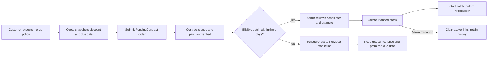
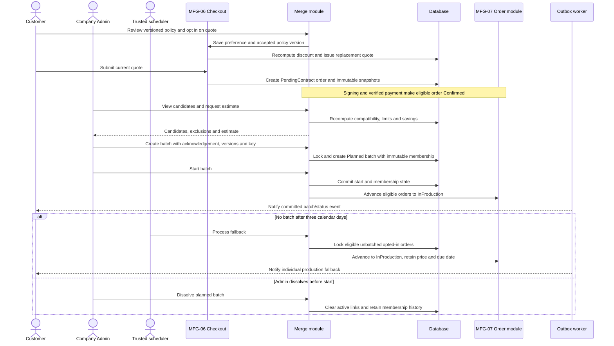

# Spec Document: Order Optimization (Merge)

| Field | Value |
| --- | --- |
| Module ID | `MFG-10` |
| Module name | Order Optimization (Merge) |
| Spec version | v1.0 |
| Author (team member) | Group B |
| Date | 2026-09-19 |
| Status | Draft |
| Approved by (Client role) | No approver identified |
| DBIZ2 source | Function List MFG-10, No. 77–83, `F-MER-001`–`F-MER-007`; UC-C06, UC-C17, UC-C18, UC-C16; screens S23–S25, S29, S38, S42 |

---

## 1. Purpose and scope (mandatory)

Customers may opt into merge production and accept a versioned policy. Company Admins inspect eligible orders, estimate a batch and create, start, complete or dissolve it. The module manages production batches and events; MFG-06 owns quotes, order creation, payment/refund and immutable snapshots, and MFG-07 owns order fulfillment states.

MVP priority: **Could**. Opt-in pricing/deadline terms apply even if no batch forms. The 5% subtotal discount and maximum three extra calendar days are promised; standard production is due seven days after confirmation and merge production ten days after confirmation. These are production-completion commitments, not carrier delivery promises. No batch is created at checkout.

## 2. Actors (mandatory)

| Actor | Role in this module | Where it comes from |
| --- | --- | --- |
| Customer | Views merge option/terms and opts in or out on a quote | MFG-10 resolved contract; UC-C06 |
| Company Admin | Reviews candidates, estimates, confirms, starts/completes or dissolves batches | MFG-10 resolved contract; UC-C17/UC-C18 |
| System / scheduler | Enforces three-day fallback and emits durable batch/status events | MFG-10 module contract |
| MFG-06 / MFG-07 | Owns quote/order/payment and order fulfillment state | Module boundaries |

## 3. User scenarios and acceptance criteria (mandatory)

### US-1: Choose merge option (Could)

Customer sees standard and merge price/deadline, accepts the current policy version and saves the preference. A preference change supersedes the prior quote and issues a fresh immutable quote for 30 minutes.

1. **Given** the customer opts in, **when** the quote is issued, **then** the exact 5% subtotal discount and ten-day production commitment appear consistently on S23/S25/S34/S35.
2. **Given** the quote is submitted, **when** the order is created, **then** preference and policy version are snapshotted and no batch is assigned.
3. **Given** the customer changes preference, **when** it is saved, **then** a new quote ID and refreshed breakdown are issued; the prior quote is not mutated.

### US-2: View eligible orders and estimate (Could)

Company Admin sees same-company candidates and exclusion reasons. The estimate shows gross setup savings, customer discount, estimated net savings, saved setup minutes, total quantity and production due date.

1. **Given** candidates differ by company/product/material/color/print method, are not paid/currently signed/Confirmed, opted in, are batched/cancelled, or are outside the three-day window, **when** eligibility is recomputed, **then** they are excluded.
2. **Given** estimate net savings are negative, **when** Admin confirms, **then** explicit acknowledgement is required.

### US-3: Confirm and operate batch (Could)

At least two eligible orders can be atomically placed in a Planned batch. Admin starts or dissolves a Planned batch, or completes an InProduction batch.

1. **Given** a Planned batch starts, **when** all members remain eligible, **then** all member orders advance atomically to InProduction.
2. **Given** a Planned batch dissolves, **when** the operation commits, **then** active order links clear while immutable membership history remains.
3. **Given** no batch forms by three calendar days after confirmation, **when** fallback runs, **then** individual production starts at the same discounted price and promised due date.
4. **Given** concurrent cancellation, batch, fallback or state changes, **when** mutations contend, **then** one wins and no partial batch membership is committed.

### Edge cases

- Minimum batch is two orders; aggregate quantity cannot exceed 10,000.
- Negative net savings are displayed and require Admin acknowledgement.
- Production completion does not mark individual orders shipped or delivered.

## 4. Flows (mandatory)

### 4.1 Usage flow

### 4.2 Sequence for the main flow

## 5. Functional requirements (mandatory)

| FR ID | DBIZ2 Subfunction ID | Requirement (system MUST ...) | Actor | Priority |
| --- | --- | --- | --- | --- |
| FR-001 | F-MER-001 | Show standard versus merge price/deadline and eligibility summary for saved eligible designs; do not create a batch. | Customer | Could |
| FR-002 | F-MER-002 | Display versioned merge policy text and record accepted policy version. | Customer | Could |
| FR-003 | F-MER-003 | Save preference on owned quote, compute fixed discount server-side and issue a new immutable 30-minute quote. | Customer | Could |
| FR-004 | F-MER-004 | Show same-company eligible candidates and exclusion reasons using server-recomputed eligibility. | Company Admin | Could |
| FR-005 | F-MER-005 | Compute exact savings/quantity/due-date estimate using demo planning assumptions and require acknowledgement of negative net. | Company Admin | Could |
| FR-006 | F-MER-006 | Atomically create/start/complete/dissolve batches with idempotency, version validation and immutable membership history. | Company Admin | Could |
| FR-007 | F-MER-007 | Notify each customer and production planning after committed batch events, deduplicating recipients. | System | Could |

### 5.1 Input / Output contract

| FR ID | Input field | Type | Required | Output field | Type | Notes / validation |
| --- | --- | --- | --- | --- | --- | --- |
| FR-001 | product/design and session | IDs/session | Yes | comparison view model | Object | Merge option only for eligible saved design |
| FR-002 | policy_version | Version | Yes | readable policy | Text/object | Read-only versioned terms |
| FR-003 | quote_id, merge_opt_in, policy_version, expected quote version | UUID, boolean, version | Yes | new quote and breakdown | Object | Stale 409; invalid option 422 |
| FR-004 | company session, filters, pagination | Session/allowlisted values | Optional | candidate groups and exclusion reasons | Paginated object | Same-company data only |
| FR-005 | selected order IDs | UUID array | Yes | gross_setup_saving_vnd, customer_discount_vnd, estimated_net_saving_vnd, setup_minutes_saved, total_quantity, production_due_at | Estimate object | Gross=(count−1)×100,000 VND; minutes=(count−1)×30; negative net requires Admin acknowledgement |
| FR-006 | action; order IDs or batch ID; expected versions; acknowledgement; Idempotency-Key | Enum, IDs, versions, boolean, key | Yes | batch state, membership snapshot, affected orders | Object | Create ≥2; total quantity ≤10,000 |
| FR-007 | committed batch event and member IDs | Internal event | Yes | customer/planning outbox IDs | UUID array | Recipients resolved from persisted membership |

### 5.2 Business rules

| Rule ID | Rule | Why it exists |
| --- | --- | --- |
| BR-001 | Merge discount is floor(subtotal × 5/100); maximum extra production time is three days. Standard due is seven days after confirmation; merge due is ten days. | Honor fixed customer promises whether or not batching succeeds. |
| BR-002 | Eligibility requires same company/product/material/color/print method, paid, current Signed contract, Confirmed, opted-in, uncancelled, unbatched, and confirmed within the latest three calendar days. | Batch compatible work only. |
| BR-003 | At least two orders and total quantity ≤10,000; each order has at most one active batch. | Bound batch operation. |
| BR-004 | Estimate gross saving=(count−1)×100,000 VND; discount is sum of member discounts; net=gross−discount; setup minutes saved=(count−1)×30. | Make demo estimate reproducible. |
| BR-005 | At three calendar days after confirmation, a trusted scheduled job locks each still-unbatched opted-in order, records individual fallback, atomically advances Confirmed→InProduction and emits the normal status notification without changing price or production_due_at. | Preserve commitments when no batch forms. |
| BR-006 | Planned→InProduction atomically advances all members; Planned→Dissolved clears active links; InProduction→Completed does not change shipment/delivery state. | Keep batch and order lifecycles consistent. |

Mixed companies or compatibility dimensions and duplicate order IDs are rejected with 422; stale candidate, order, batch or state versions return 409. A retry with the same idempotency key and payload returns the prior result; the same key with a different payload returns 409. Only a Company Admin of the batch company can start, complete or dissolve it.

## 6. Key entities (mandatory)

| Entity | Attributes (from Input/Output fields) | Relationships |
| --- | --- | --- |
| MergePreference | quote_id, merge_opt_in, policy_version, accepted_at | Quote preference/version is copied into immutable order snapshot at submission. |
| ProductionBatch | UUID, company_id, compatibility key, state Planned/InProduction/Completed/Dissolved, creator, immutable membership and estimate snapshots, timestamps/version | Contains at least two orders; active membership unique per order. |
| Order merge snapshot | preference, policy version, discount, production due date, batch_id? | MFG-06 owns order snapshot; MFG-07 owns fulfillment progression. |

Distinct customer artwork remains distinct inside a shared production batch.

## 7. Screens involved

| Screen ID | Screen name | Priority | Screen Spec file |
| --- | --- | --- | --- |
| S23 | Quote and merge choice | Could | Module boundary |
| S24 | Merge policy | Could | Module screen |
| S25 | Checkout summary | Could | Module boundary |
| S29 | Production management | Could | Shared operations screen |
| S38 | Notifications | Could | Shared notification screen |
| S42 | Merge Console | Could | Module screen |

## 8. Success criteria (mandatory)

| SC ID | Criterion | How it is measured |
| --- | --- | --- |
| SC-001 | Every opt-in quote and order preserves the fixed discount and deadline through batch or individual fallback. | Compare quote/order snapshots and resulting production due date. |
| SC-002 | Batch membership and order transitions are all-or-nothing and meet eligibility limits. | Verify candidate matrix, limits, concurrent mutations and idempotent replay. |
| SC-003 | A Planned batch can be dissolved without losing immutable membership history. | Inspect batch audit record and cleared order links. |

## 9. Assumptions

- Demo estimates use 100,000 VND setup cost and 30 minutes saved per additional order.
- Setup minutes do not shorten the promised production due date.
- MVP priority is Could; policy-v1 fixed values are not editable by system configuration.

## 10. Open questions

| # | Question | Blocking? | Owner | Status |
| --- | --- | --- | --- | --- |
| 1 | Resolved decisions: Group B; course DBIZ 3; no approver identified; course/demo use only; MVP priority Could. | No | Group B | Resolved |
| 2 | No remaining open questions. | No | Group B | Resolved |

## 11. Traceability to DBIZ2

| Spec section | DBIZ2 source | Location |
| --- | --- | --- |
| 1–2 Scope and actors | MFG-10 Function List No. 77–83 | `F-MER-001`–`F-MER-007` |
| 3 Scenarios | UC-C06, UC-C17, UC-C18, UC-C16 | Use-case labels and resolved flow |
| 4 Flow | Preference, quote, batch and fallback lifecycle | Current MFG-10 resolved contract |
| 5–6 FRs and entities | `F-MER-001`–`F-MER-007` | Function List MFG-10 |
| 7 Screens | S23–S25, S29, S38, S42 | Screen List and module contract |

## Completion checklist

- [x] All seven MFG-10 functions have FR rows and contracts.
- [x] Discount, production commitments, eligibility, estimate and fallback logic are explicit.
- [x] Batch transitions, membership, idempotency and concurrency rules are recorded.
- [x] Resolved inputs are recorded and no unresolved placeholders remain.
- [x] Traceability identifies use cases, functions and screens.

Template source: DBIZ3 Product Design Package specification template.

DBIZ3, FTU.
