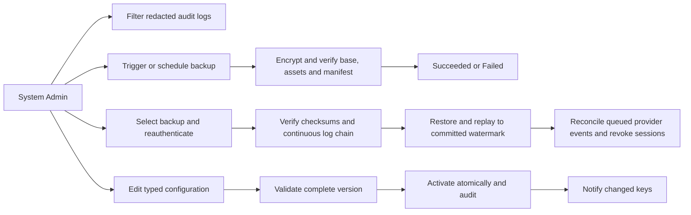
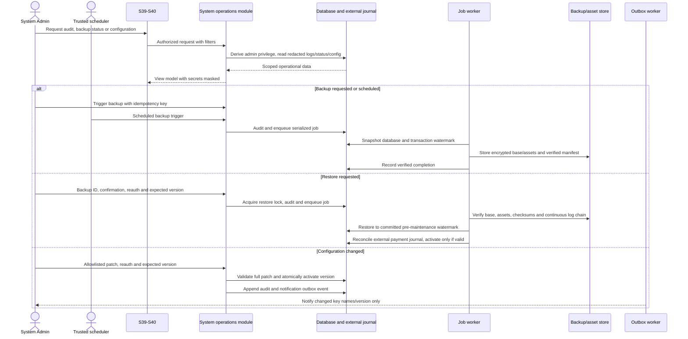

# Spec Document: System Operations

| Field | Value |
| --- | --- |
| Module ID | `MFG-12` |
| Module name | System Operations |
| Spec version | v1.1 |
| Author (team member) | Group B |
| Date | 2026-09-22 |
| Status | Draft |
| Approved by (Client role) | No approver identified |
| DBIZ2 source | Function List MFG-12, No. 87–94, `F-SYS-001`–`F-SYS-008`; UC-S09, UC-S10, UC-S11; screens S39–S40 |

---

## 1. Purpose and scope (mandatory)

System Admins inspect redacted audit events, create/inspect backups, perform controlled restoration and change typed system configuration. System Admin access does not grant customer-design/order mutation or Dony financial export. Restore and configuration changes require recent reauthentication.

MVP priority: **Won't**; these functions remain specified for the complete system and are excluded from MVP release. S40 is the audit log viewer; S39 provides backup, restore and configuration controls.

Audit events are append-only and retained 365 days. Severity is INFO for committed success, WARN for denied/invalid actions and ERROR for dependency/job failures; DEBUG is not persisted. Nightly encrypted base snapshot runs at 02:00 Asia/Ho_Chi_Minh, with seven daily and four weekly bases retained. A continuous verified transaction-log archive permits restore through the pre-maintenance committed watermark. Payment event/restore journal remains outside the restored snapshot to avoid duplicate fulfillment/refunds.

Configuration stores secret references, never secret values. Allowlisted settings are Dony public contacts, optional production-notification email, SMTP reference, VNPay environment/merchant secret references, design_service_fee_vnd (suggested Complex assessment fee, default 200000 VND, integer 1..9999999999), shipping_vnd and backup schedule/retention. Merge policy values (discount up to 840,000 VND per order based on a 2,800,000 VND setup-cost assumption; rolling seven-day order window; 7/10 calendar-day production targets after deposit) are versioned business policy, not ordinary configuration; changes require a reviewed policy version and updated specs. System recommendations do not start batches: Sales Admin is the final approver and explicit batch starter; scheduler only refreshes suggestions and starts individual fallback after the seven-day window expires.

## 2. Actors (mandatory)

| Actor | Role in this module | Where it comes from |
| --- | --- | --- |
| System Admin | Searches redacted logs, triggers backup/restore and edits allowlisted configuration | MFG-12 resolved permissions; UC-S09/UC-S10/UC-S11 |
| Trusted scheduler | Runs nightly backups and scheduled operations | MFG-12 operations contract |
| System | Executes asynchronous jobs, maintains audit journal and sends notices | MFG-12 function contract |

## 3. User scenarios and acceptance criteria (mandatory)

### US-1: Monitor system logs (Won't for MVP)

System Admin searches S40 by severity, action, outcome, actor, company, target and UTC date with pagination. Results redact passwords, tokens and card details.

1. **Given** no events match valid filters, **when** searched, **then** an empty page with pagination metadata is returned.
2. **Given** malformed date range or invalid paging, **when** submitted, **then** 422 or 400 is returned as appropriate.
3. **Given** authentication activity is logged, **when** queried, **then** actor/action/outcome/severity are visible and secrets are absent.

### US-2: Backup and restore data (Won't for MVP)

Admin triggers or inspects encrypted base backups and initiates a controlled restore after exact backup ID confirmation and recent reauthentication.

1. **Given** a backup is requested twice with the same key/payload, **when** jobs are queued, **then** one backup ID is returned; changed payload with that key is 409.
2. **Given** base/asset/checksum/schema or transaction-log segment is missing, corrupt or discontinuous, **when** restore is attempted, **then** it is rejected before activation.
3. **Given** two restores contend for the single restore lock, **when** requests begin, **then** one proceeds and the other returns 409.
4. **Given** restore succeeds through the pre-maintenance watermark, **when** recovery completes, **then** committed orders/payment attempts through that watermark survive, queued provider events reconcile idempotently and sessions are revoked.
5. **Given** restore fails after maintenance begins, **when** rollback runs, **then** the pre-restore backup is used and maintenance remains enabled until integrity is confirmed.
6. **Given** provider replay returns a transaction for an order/payment resource created after the restore point and absent from the restored database, **when** reconciliation runs, **then** it creates no ghost order/payment, records an ERROR event, alerts System Admin and directs manual refund through VNPay dashboard.

### US-3: Configure system (Won't for MVP)

Admin edits only allowlisted typed settings. The whole proposed configuration is validated before atomic activation.

1. **Given** a patch includes an unknown key, invalid range, raw secret or attempted edit of fixed merge policy, **when** submitted, **then** it returns 422 and prior version remains active.
2. **Given** two valid changes race at one expected version, **when** submitted, **then** one activates and one returns 409; only committed keys are notified.
3. **Given** email fails after config commit, **when** retries exhaust, **then** active configuration remains and delivery is marked retryable.

### Edge cases

- Jobs use explicit Queued/Running/Succeeded/Failed states and expose error codes, not secrets.
- Payment callbacks during maintenance are durably queued and reconciled idempotently.
- Failed validation never partially activates configuration or restore state.

## 4. Flows (mandatory)

### 4.1 Usage flow

### 4.2 Sequence for the main flow

## 5. Functional requirements (mandatory)

| FR ID | DBIZ2 Subfunction ID | Requirement (system MUST ...) | Actor | Priority |
| --- | --- | --- | --- | --- |
| FR-001 | F-SYS-001 | Display paginated redacted audit events with allowlisted filters and default last-30-day UTC range; API timestamps use UTC ISO 8601 and the UI displays Asia/Ho_Chi_Minh. | System Admin | Won't (MVP) |
| FR-002 | F-SYS-002 | Search redacted audit events by text, allowlisted fields, severity, date and pagination. | System Admin | Won't (MVP) |
| FR-003 | F-SYS-003 | Show backup schedule/retention, base/log watermarks, recent jobs, operation lock and available controls. | System Admin | Won't (MVP) |
| FR-004 | F-SYS-004 | Queue verified encrypted snapshot and return backup job state/manifest reference. | System Admin / scheduler | Won't (MVP) |
| FR-005 | F-SYS-005 | Restore selected verified base plus continuous transaction logs through pre-maintenance watermark under one restore lock. | System Admin | Won't (MVP) |
| FR-006 | F-SYS-006 | Show typed allowlisted settings, masked write-only secret references, active version and validation guidance; fixed policy-v1 merge values are read-only; design_service_fee_vnd is the suggested Complex assessment fee, not a submission charge. | System Admin | Won't (MVP) |
| FR-007 | F-SYS-007 | Validate entire typed config patch, atomically activate new version and audit; reject fixed policy edits; design_service_fee_vnd changes affect future assessments only, never existing proposals or accepted fees. | System Admin | Won't (MVP) |
| FR-008 | F-SYS-008 | Notify active admins of committed configuration key names/version/time, excluding secret values. | System | Won't (MVP) |

### 5.1 Input / Output contract

| FR ID | Input field | Type | Required | Output field | Type | Notes / validation |
| --- | --- | --- | --- | --- | --- | --- |
| FR-001 | severity, action/outcome/actor/company/target filters, UTC date, page/page_size | Enums/IDs/date/integers | Optional | redacted audit rows and pagination | Paginated object | page_size 1–100; malformed range 422 |
| FR-002 | search text ≤100 chars, allowlisted field, severity/date/pagination | Text/enums/filters | Optional | filtered redacted results | Paginated object | System Admin only |
| FR-003 | session-derived Admin privilege | Session | Yes | schedule, retention, watermarks, recent jobs, lock/control state | View model | No client privilege flag |
| FR-004 | manual trigger or trusted scheduler, Idempotency-Key | Enum/internal trigger/key | Yes | backup_id, manifest reference, status | Job object | Verify database/assets/checksums/schema/log watermark before success |
| FR-005 | backup UUID, exact ID confirmation, reauthentication, expected system version, key | UUID/text/session/version/key | Yes | restore job ID/status | Job object | Single lock; replay logs; rollback and maintenance rules apply |
| FR-006 | session-derived Admin privilege | Session | Yes | typed values, masked references, active version | View model | Fixed policy values read-only |
| FR-007 | allowlisted typed patch, expected version, reauthentication | Object/version/session | Yes | activated version/status | Object | Invalid 422; stale 409; prior config preserved |
| FR-008 | server-generated committed change log | Internal event | Yes | in-app/email outbox IDs | UUIDs | Active admin recipients; no secret values |

### 5.2 Business rules

| Rule ID | Rule | Why it exists |
| --- | --- | --- |
| BR-001 | Audit events are append-only, retained 365 days and exclude passwords, tokens and full card data. Severity derives from outcome; DEBUG is not persisted. | Protect sensitive data and retain operations evidence. |
| BR-002 | Nightly encrypted base runs at 02:00 Asia/Ho_Chi_Minh; retain seven daily and four weekly bases with database/assets, manifest, checksums and schema version. | Provide verified recovery points. |
| BR-003 | Continuous transaction-log archive must verify sequence/checksums and restore to committed pre-maintenance watermark; missing/gapped/corrupt chain prevents activation. | Prevent incomplete restoration. |
| BR-004 | Keep payment event/restore journal outside restored snapshot; reconcile queued provider events idempotently. | Prevent duplicate fulfillment/refunds. |
| BR-005 | Config patch is allowlisted, fully validated, and atomically activated; secrets are references only. | Prevent partial, unsafe configuration changes. |
| BR-006 | MFG-10 merge policy and rolling-window values are read-only configuration and may change only through a reviewed policy version; estimates label setup cost/time as assumptions. | Preserve customer commitments and avoid presenting assumptions as measured factory results. |

Configuration notices list changed key names, actor, version and time only; secret values are excluded. In-app inbox is authoritative and email delivery is retried; notification failure never rolls back configuration. Restore success revokes sessions. During maintenance, provider callbacks are durably queued and reconciled idempotently after recovery.

## 6. Key entities (mandatory)

| Entity | Attributes (from Input/Output fields) | Relationships |
| --- | --- | --- |
| AuditEvent | id, actor_id, buyer_organization_id?, target_type/id?, action, outcome, severity, request_id, timestamp, redacted_details | Append-only event; retained 365 days. Optional buyer organization is context only, not a tenant scope. |
| Backup | id, created_at, creator_id?, state, manifest, checksum, schema_version, asset_count, transaction_log_start/end, error_code? | Base snapshot plus assets and continuous log archive. |
| SystemConfig | version, typed_values, activated_at, actor_id | New version atomically replaces active version; prior remains auditable. |
| Restore journal | committed watermark, payment/provider events, restore operation state | Stored outside restored snapshot and reconciled idempotently. |

## 7. Screens involved

| Screen ID | Screen name | Priority | Screen Spec file |
| --- | --- | --- | --- |
| S39 | System Configuration / backup and restore controls | Won't (MVP) | Module screen |
| S40 | System Log Viewer | Won't (MVP) | Module screen |

## 8. Success criteria (mandatory)

| SC ID | Criterion | How it is measured |
| --- | --- | --- |
| SC-001 | Audit results remain useful while secrets and sensitive payment data are redacted. | Query representative events and confirm fields and retention. |
| SC-002 | Backup and restore verify all assets and log continuity before activation and preserve committed events. | Test missing/corrupt/gapped segments, successful replay, rollback and concurrent restore. |
| SC-003 | Invalid/stale config never activates; valid config activates atomically and notification excludes secret values. | Verify patches, version conflicts, audit diff and outbox. |

## 9. Assumptions

- System Admin identity and recent reauthentication are available from the shared identity service.
- Scheduler, private asset storage and durable job queue are available in complete-system deployment.
- MVP priority is Won't; a single admin login is sufficient at MVP launch.

## 10. Open questions

| # | Question | Blocking? | Owner | Status |
| --- | --- | --- | --- | --- |
| 1 | Resolved decisions: Group B; course DBIZ 3; no approver identified; course/demo use only; MVP priority Won't. | No | Group B | Resolved |
| 2 | No remaining open questions. | No | Group B | Resolved |

## 11. Traceability to DBIZ2

| Spec section | DBIZ2 source | Location |
| --- | --- | --- |
| 1–2 Scope and actors | MFG-12 Function List No. 87–94 | `F-SYS-001`–`F-SYS-008` |
| 3 Scenarios | UC-S09, UC-S10, UC-S11 | Use-case labels and resolved operations |
| 4 Flows | Logs, backup, restore, configuration | Current MFG-12 contract |
| 5–6 FRs and entities | `F-SYS-001`–`F-SYS-008` | Function List MFG-12 |
| 7 Screens | S39–S40 | Screen List and module contract |

## Completion checklist

- [x] All eight MFG-12 functions have FR rows and typed contracts.
- [x] Audit, backup, restore, payment reconciliation and config security rules are recorded.
- [x] MVP exclusion is reflected without removing complete-system requirements.
- [x] Resolved inputs are recorded and no unresolved placeholders remain.
- [x] Traceability identifies use cases, functions and screens.

Template source: DBIZ3 Product Design Package specification template.

DBIZ3, FTU.
